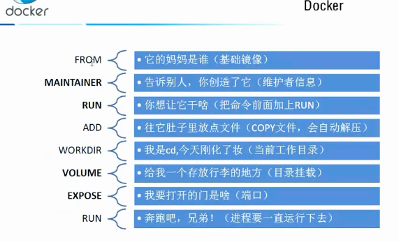

Centos7  官方网址

https://docs.docker.com/engine/install/centos/

知识点链接

https://www.jianshu.com/p/47c4a06a84a4

https://www.runoob.com/docker/docker-tutorial.html

### 有的话先卸载

```shell
yum remove docker \
                  docker-client \
                  docker-client-latest \
                  docker-common \
                  docker-latest \
                  docker-latest-logrotate \
                  docker-logrotate \
                  docker-engine
```

### 安装软件包

```shell
yum install -y yum-utils
```

### 添加镜像源

```shell
yum-config-manager \
    --add-repo \
    https://download.docker.com/linux/centos/docker-ce.repo           #默认是外国官网的
    
#更换为阿里云的
yum-config-manager \
    --add-repo \
https://mirrors.aliyun.com/docker-ce/linux/centos/docker-ce.repo


```

小插曲

安装错误的源

>
>
>https://mirrors.ustc.edu.cn/docker-ce/linux/centos/docker-ce/repodata/repomd.xml: [Errno 14] HTTPS Error 404 - Not Found
>
>解决办法：
>
>cd  /etc/yum.repos.d
>
>ls
>
>CentOS-Base.repo       CentOS-fasttrack.repo  CentOS-Vault.repo
>CentOS-CR.repo         CentOS-Media.repo      docker-ce.repo
>CentOS-Debuginfo.repo  CentOS-Sources.repo    mirrors.ustc.edu.cn_docker-ce_linux_centos_docker-ce.repo
>
>国内无法连接docker默认的境外地址，删除docker相关的repo文件即可
>
>rm  -rf docker-ce.repo  
>
>rm  -rf  mirrors.ustc.edu.cn_docker-ce_linux_centos_docker-ce.repo
>
>如果想安装docker-ce可以使用国内yum源 
>
>yum-config-manager --add-repo http://mirrors.aliyun.com/docker-ce/linux/centos/docker-ce.repo


### 安装最新版的docker引擎 ce是社区版本


##### 更新yum

```shell
yum makecache fast
```

##### 安装docker 默认最新的

```shell
yum install docker-ce docker-ce-cli containerd.io
```

```shell
#更换版本的
yum install docker-ce-<VERSION_STRING> docker-ce-cli-<VERSION_STRING> containerd.io 
```

选择y一路安装


##### 启动docker

```shell
systemctl start docker
```

##### 查看版本

```shell
docker version
```


```linux
docker pull [镜像名称:版本] 拉取镜像
docker images  镜像列表
docker rmi [镜像名称:版本] 删除镜像
docker history [镜像名称] 镜像操作记录
docker tag [镜像名称:版本][新镜像名称:新版本]
docker inspect [镜像名称:版本] 查看镜像详细
docker search [关键字] 搜索镜像
docker login 镜像登陆
复制代码
```

#### 容器常用命令

```linux
docker ps -a 容器列表(所有容器)
docker ps  查看所有(运行的)容器
docker exec -ti <id> bash  以 bash 命令进入容器内
docker run -ti --name [容器名称][镜像名称:版本] bash 启动容器并进入
docker logs 查看容器日志
docker top <container_id> 查看容器最近的一个进程
docker run -ti --name [容器名称] -p 8080:80 [镜像名称:版本] bash  端口映射
docker rm <container_id> 删除容器
docker stop <container_id> 停止容器
docker start <container_id> 开启容器
docker restart <container_id> 重启容器
docker inspect <container_id> 查看容器详情
docker commit [容器名称] my_image:v1.0  容器提交为新的镜像	
```


作者：ikoala
链接：https://juejin.cn/post/6844904035053486087
来源：掘金
著作权归作者所有。商业转载请联系作者获得授权，非商业转载请注明出处。

##### 运行hello world

```shell
docker run hello-world
```

发现不存在就是拉取 pull


##### 查看下载的镜像

```shell
docker images
[root@iZwz99z6ggy4qg0wakux9nZ /]# docker images
REPOSITORY          TAG                 IMAGE ID            CREATED             SIZE
hello-world         latest              bf756fb1ae65        6 months ago        13.3kB

```


##### 卸载docker

```shell
yum remove docker-ce docker-ce-cli containerd.io #卸载依赖
```

```shell
rm -rf /var/lib/docker  #删除资源 docker的默认工作路径
```

阿里云镜像加速

##### 登录阿里云，找容器服务


##### 找到镜像加速位置


##### 寻找centos配置使用

```shell
1.sudo mkdir -p /etc/docker

2. sudo tee /etc/docker/daemon.json <<-'EOF'
{
  "registry-mirrors": ["https://tx6sz1tl.mirror.aliyuncs.com"]
}
EOF

3.sudo systemctl daemon-reload 

4.sudo systemctl restart docker #重启
```

```shell
截图如下
[root@iZwz99z6ggy4qg0wakux9nZ /]# docker images
REPOSITORY          TAG                 IMAGE ID            CREATED             SIZE
hello-world         latest              bf756fb1ae65        6 months ago        13.3kB
[root@iZwz99z6ggy4qg0wakux9nZ /]# sudo mkdir -p /etc/docker
[root@iZwz99z6ggy4qg0wakux9nZ /]# sudo tee /etc/docker/daemon.json <<-'EOF'
> {
>   "registry-mirrors": ["https://tx6sz1tl.mirror.aliyuncs.com"]
> }
> EOF
{
  "registry-mirrors": ["https://tx6sz1tl.mirror.aliyuncs.com"]
}
[root@iZwz99z6ggy4qg0wakux9nZ /]# sudo systemctl daemon-reload
[root@iZwz99z6ggy4qg0wakux9nZ /]# sudo systemctl restart docker

```

### 回顾helloworld流程


开始run ->在本机寻找判断是否有镜像

### 底层原理 


### Docker的常用命令

##### 帮助命令

```shell
docker version  #版本

docker info    #基本信息

docker --help  #帮助文档
```

帮助文档的地址[https://docs.docker.com/reference/]

#### 镜像的命令

```shell
docker images #查看所有的镜像 https://docs.docker.com/engine/reference/commandline/images/

docker images --help
[root@iZwz99z6ggy4qg0wakux9nZ /]# docker images --help

Usage:	docker images [OPTIONS] [REPOSITORY[:TAG]]

List images

Options:
  -a, --all             Show all images (default hides intermediate images)
      --digests         Show digests
  -f, --filter filter   Filter output based on conditions provided
      --format string   Pretty-print images using a Go template
      --no-trunc        Don't truncate output
  -q, --quiet           Only show numeric IDs  # 只显示id

```

#####  docker search 搜索镜像

```shell
docker search mysql

[root@iZwz99z6ggy4qg0wakux9nZ /]# docker search mysql
NAME                              DESCRIPTION                                     STARS               OFFICIAL            AUTOMATED
mysql                             MySQL is a widely used, open-source relation…   9735                [OK]                
mariadb                           MariaDB is a community-developed fork of MyS…   3552                [OK]                
mysql/mysql-server                Optimized MySQL Server Docker images. Create…   713                                     [OK]
percona                           Percona Server is a fork of the MySQL relati…   496                 [OK]                
centos/mysql-57-centos7           MySQL 5.7 SQL database server                   77                                      
mysql/mysql-cluster               Experimental MySQL Cluster Docker images. Cr…   73                  
```

##### 通过收藏来过滤

```shell
docker search  --filter =STARS=3000  #收藏数不少于3000的
```

##### 下载镜像 默认最新             镜像名[:tag]

```shell
docker pull mysql     

指定版本
docker pull mysql:5.7  仓库中要有
#mysql:
```

下载镜像的原理是分层下载可以重复利用，占用空间小


##### 删除镜像   docker rmi     使用docker images          查看根据 IMAGE ID来删除

```shell
docker rmi -f  d05c76dbbfcf

 
docker rmi -f $(docker images -aq) #递归删除  删除所有的镜像
```


#### 容器命令

有镜像才有容器，下载一个centos镜像来学习

```shell
docker pull centos
```

##### 新建容器的启动

```shell
docker run [可选参数] image
--name="Name" #命名的方式来区分容器
-d
-it			# 交互模式运行
-p          #  指定容器端口
-p          #  ip:主机端口:容器端口
-P			#  随机指定端口
```

##### 启动并进入容器

```shell
[root@iZwz99z6ggy4qg0wakux9nZ ~]# docker run -it centos /bin/bash
[root@5d5357892508 /]# 
```

 exit退出来  （容器停止退出 ） ctrl+p+q(容器退出来不停止)

```shell
[root@5d5357892508 /]# exit
exit
[root@iZwz99z6ggy4qg0wakux9nZ ~]# 
```

##### 查看容器

```shell
docker ps       # 列出当前正在运行的容器

docker ps  -a   # 当前运行的+历史运行的

显示最后被创建的 n 个容器
docker ps -n 3
docker ps -n ?  # 最近创建的容器
```

##### 删除容器

```shell
docker rm 	容器id					#容器id  前强制删除正在运行的 -f

docker rm -f $(docker ps -aq)   #删除所有的容器

```

##### 启动和停止容器的操作

```shell
docker start  容器id    #启动

docker restart 容器id	 #重启容器

docker stop 容器id	#停止当前容器

docker kill 容器id   #强制停止当前容器
```

### 常用的其他命令

##### 后台启动命令

```shell
docker run -d centos
# 问题docker ps 发现centos停止了
# 常见的坑，docker容器使用后台运行，就必须要有一个进程，docker发现没有应用就会自动停止
# 例如 nginx 容器启动后，发现自己 没有提供服务，就会立刻停止，就是没有程序了

```

##### 查看日志命令

```shell
docker logs  -tf 

docker logs -tf --tails  10 #显示最近10条日志
```

##### 查看容器中的进程信息

```shell
docker top  容器id
```

##### 查看镜像的元数据

```shell
docker  inspect 容器id
```

##### 进入当前正在运行的镜像

```shell
#通常容器是是使用后台  需要进入容器，修改一些配置
方式一
docker exec -it 容器id   /bin/bash  #进入容器开启一个新的终端

方式二

docker attach 容器id        #进入正在执行的终端，执行代码的终端，不会启动新进程

```

##### 将容器内文件拷贝到主机上

```shell
docker cp  容器id:容器内的路径 目的主机的路径

#执行效果
[root@ad54c64d03ab home]# touch test.java
[root@ad54c64d03ab home]# ls
test.java
[root@ad54c64d03ab home]# cd /
[root@ad54c64d03ab /]# exit
exit
[root@iZwz99z6ggy4qg0wakux9nZ ~]# docker cp ad54c64d03ab:/home/test.java /home
[root@iZwz99z6ggy4qg0wakux9nZ ~]# cd /
[root@iZwz99z6ggy4qg0wakux9nZ /]# cd home
[root@iZwz99z6ggy4qg0wakux9nZ home]# ls
test.java
```

### Dockerfile、Docker镜像和Docker容器的关系

Dockerfile 是软件的原材料，Docker 镜像是软件的交付品，而 Docker 容器则可以认为是软件的运行态。从应用软件的角度来看，Dockerfile、Docker 镜像与 Docker 容器分别代表软件的三个不同阶段，Dockerfile 面向开发，Docker 镜像成为交付标准，Docker 容器则涉及部署与运维，三者缺一不可，合力充当 Docker 体系的基石。

简单来讲，Dockerfile构建出Docker镜像，通过Docker镜像运行Docker容器。

一个pull 一个run

### 练习一

#### 安装nginx

先搜索

1. > docker search nginx 建议去官网上看

2. > docker pull  nginx

3. > docker run -d --name nginx01 -p 3344:80 nginx  运行nginx取名字为nginx01 设置端口在主机的3344可以访问

4. > 发送curl  localhost:3344

   

#### 安装Tomcat

```shell
docker run -it --rm tomcat:9.0          --rm #用完及时删除容器

拉取镜像
docker pull tomcat:9.0

//启动提示找不到Tomcat
docker run -d -p 3355:8080 --name tomcat01 tomcat

#进入容器发现webapps中没有东西，阿里云镜像是被删减过，保证最小的可运行环境
docker exec -it tomcat01 /bin/bash #进入容器的环境内

#发现webapps.dist中有东西，进入之后拷贝
cp -r  webapps.dist/* webapps

# 然后访问就可以出现tomcat的首页了

```


#### 镜像原理之UnionFS(联合文件系统)

##### 要理解unionFS，我们首先要认识bootfs和rootfs。

1. boot file system （bootfs）：包含操作系统boot loader 和 kernel。用户不会修改这个文件系统。一旦启动完成后，整个Linux内核加载进内存，之后bootfs会被卸载掉，从而释放出内存。同样内核版本的不同的 Linux 发行版，其bootfs都是一致的。

2. root file system （rootfs）：包含典型的目录结构，包括 /dev, /proc, /bin, /etc, /lib, /usr, and /tmp

centos与ubuntu底层都是linux内核

##### docker的镜像rootfs，和layer（层）的设计

任何程序运行时都会有依赖，无论是开发语言层的依赖库，还是各种系统lib、操作系统等，不同的系统上这些库可能是不一样的，或者有缺失的。为了让容器运行时一致，docker将依赖的操作系统、各种lib依赖整合打包在一起（即镜像），然后容器启动时，作为它的根目录（根文件系统rootfs），使得容器进程的各种依赖调用都在这个根目录里，这样就做到了环境的一致性。

不过，这时你可能已经发现了另一个问题：难道每开发一个应用，都要重复制作一次rootfs吗（那每次pull/push一个系统岂不疯掉）？

比如，我现在用Debian操作系统的ISO做了一个rootfs，然后又在里面安装了Golang环境，用来部署我的应用A。那么，我的另一个同事在发布他的Golang应用B时，希望能够直接使用我安装过Golang环境的rootfs，而不是重复这个流程，那么本文的主角UnionFS就派上用场了。

**Docker镜像的设计中，引入了层（layer）的概念，也就是说，用户制作镜像的每一步操作，都会生成一个层，也就是一个增量rootfs（一个目录），**这样应用A和应用B所在的容器共同引用相同的Debian操作系统层、Golang环境层（作为只读层），而各自有各自应用程序层，和可写层。启动容器的时候通过UnionFS把相关的层挂载到一个目录，作为容器的根文件系统。

需要注意的是，rootfs只是一个操作系统所包含的文件、配置和目录，并不包括操作系统内核。这就意味着，如果你的应用程序需要配置内核参数、加载额外的内核模块，以及跟内核进行直接的交互，你就需要注意了：**这些操作和依赖的对象，都是宿主机操作系统的内核，它对于该机器上的所有容器来说是一个“全局变量”，牵一发而动全身。**

**总结**：UnionFS是一个分层且高效的文件系统，可以实现文件的共享，在容器中启动一个centos镜像只需要几秒，在虚拟机中启动需要分钟级别的，因为联合文件系统使用的宿主机的内核，无需再次安装引导程序，所以在镜像里面的centos系统，只存放命令和一些文件的（rootfs），只有几百M。而在虚拟机中的含有引导加载程序，大小为几G,启动的时候需要再次引导加载，所以慢，空间大。

#### 深入理解镜像分层概念

图一


图二

在我们操作镜像的时候，在一个容器中运行一个镜像，这个镜像除了配置好环境，然后将我们的项目打包上传到镜像，镜像检测到只有一个项目文件的变动了，环境没变，那么镜像就只更新那个项目

同样的还有一个镜像也需要里面的环境。这时候unionfs文件联合系统就起到作用了，它会将这个镜像里面的内容实现共享。这样极大的节省了空间。


在我们拉取镜像的时候，docker会检测有没有相同的，有的话就不用下载，镜像里面的内容也是分层的。然后我们使用命令操作镜像的时候，此时的镜像就会加一层，例如：我们在tomcat中新增一个项目，那么镜像就会生成一个layer(层)，然后这个镜像在原有tomcat的基础上就会被打包成一个新的镜像。


#### commit自己的镜像

```shell
docker commit #提交镜像成为一个新的副本
```

```
docker commit [OPTIONS] CONTAINER [REPOSITORY[:TAG]]
```

OPTIONS说明：

- **-a :**提交的镜像作者；

  

- **-c :**使用Dockerfile指令来创建镜像；

  

- **-m :**提交时的说明文字；

  

- **-p :**在commit时，将容器暂停。

  ### 实例

  将容器a404c6c174a2 保存为新的镜像,并添加提交人信息和说明信息。

  ```shell
  runoob@runoob:~$ docker commit -a "runoob.com" -m "my apache" a404c6c174a2  mymysql:v1 
  sha256:37af1236adef1544e8886be23010b66577647a40bc02c0885a6600b33ee28057
  runoob@runoob:~$ docker images mymysql:v1
  REPOSITORY          TAG                 IMAGE ID            CREATED             SIZE
  mymysql             v1                  37af1236adef        15 seconds ago      329 MB
  ```

将pull下来的基础镜像，修改，加工，打包形成一个新的镜像。

### 容器数据卷  目录的挂载   容器中的数据挂载到本地linux中

参考：https://zhuanlan.zhihu.com/p/98950504

https://blog.csdn.net/deel_feel/article/details/82902836

在Docker中，要想实现数据的持久化（所谓Docker的数据持久化即***数据不随着Container的结束而结束***），需要将数据从宿主机挂载到容器中。简单说来，卷就是将宿主机中的某个目录，mount到容器中，这样，在容器中此目录下的修改，即便容器关闭，数据也会保留下来，供宿主机和其他容器访问。

1. 在运行容器的时候，在Docker中创建一个数据卷

```shell
docker run -dti -v /data centos
＃在docker中会有/data目录，这个目录不归属于层级文件系统
ls /data -d
/data
```

2. 将宿主机的一个目录，挂在到容器里，这种方式，数据可以保存在宿主机中

```shell
#例如将宿主机的/var/data挂载到容器中的/data
docker run -tdi -v /var/data:/data centos
```

3. 挂载单个文件到容器中

```shell
##例如将宿主机的dbback.tar.gz挂载到容器中
docker run -tdi ~/dbback.tar.gz:/dbback.tar.gz centos
```

挂载之后呢可以通过inspect来查看容器挂载的信息，在宿主机修改数据与容器中的同步， 相当于双向绑定的效果。


##### 数据卷容器

数据卷容器的作用是，其中挂载的数据卷，可以被使用它的容器，共同使用。也就是多个容器之间可以同时使用这个数据卷，容器对他的写入内容，在其他容器也能看到。

创建一个数据卷容器

先创建一个名为data_s的数据卷容器，创建两个容器web1、web2，这两个容器使用data_s中的数据，通过 --volumes-from来实现，然后将名为宿主机名为data的目录挂载到的数据卷容器data_s的data目录下

```shell
#创建一个包含数据卷的容器供其他容器使用，这个容器并不需要一直开启
docker run -tdi -v /data --name data_s centos
#创建两个容器，使用这个数据卷容器
docker run -ti --volumes-from data_s  --name web1 centos
docker run -ti --volumes-from data_s  --name web2 centos
#此时这两个容器，都可以共同读写/data目录了
#如果需要将数据同步到宿主机的目录中，则创建数据卷容器的时候，选择挂载宿主机的目录，如：
docker run -tdi -v /data:/data --name data_s centos

```

### 匿名挂载与具名挂载


>  docker   inspect   容器ID

> 创建数据卷

```shell
docker volume create my-vol
```

> 数据卷列表

```shell
docker volume ls
```

> 查看数据卷具体信息

```shell
docker volume inspect my-vol
```

> 删除数据卷

```shell
docker volume rm my-vol
```

> 清除无主的数据卷

```shell
docker volume prune
```

> 启动一个容器并挂载一个数据卷到容器的/webapp目录（两种方式：）

```shell
docker run -d -P --name nginx -v my-vol:/webapp nginx

docker run -d -P --name nginx --mount source=my-vol,target=/webapp nginx
```

## 实例Mysql

```shell
[root@yanglele ~]# docker run -d -p 3306:3306 -v /home/mysql/conf:/etc/mysql/conf  -v /home/mysql/data:/var/lib/mysql -e MYSQL_ROOT_PASSWORD=123456  -d  mysql:5.7
```

挂载时候的文件本地与容器互通


### Dockerfile

#### 什么是 Dockerfile？（<a href="https://www.runoob.com/docker/docker-dockerfile.html">详情参照</a>）

Dockerfile 是一个用来构建镜像的文本文件，文本内容包含了一条条构建镜像所需的指令和说明。

#### 使用 Dockerfile 定制镜像

**1、下面以定制一个 nginx 镜像（构建好的镜像内会有一个 /usr/share/nginx/html/index.html 文件）**

在一个空目录下，新建一个名为 Dockerfile 文件，并在文件内添加以下内容：

```shell
FROM nginx
RUN echo '这是一个本地构建的nginx镜像' > /usr/share/nginx/html/index.html
```



### 定制一个centos

-- --

> 阉割版本的centos是没有vim ifcomfig命令的，现在使用一个dockerfile来定制一个含有这些命令的镜像

####  插播vim的使用

- `i` → *Insert* 模式，按 `ESC` 回到 *Normal* 模式.
- `x` → 删当前光标所在的一个字符。
- `:wq` → 存盘 + 退出 (`:w` 存盘, `:q` 退出)   （陈皓注：:w 后可以跟文件名）
- `dd` → 删除当前行，并把删除的行存到剪贴板里
- `p` → 粘贴剪贴板

**推荐**:

- `hjkl` (强例推荐使用其移动光标，但不必需) →你也可以使用光标键 (←↓↑→). 注: `j` 就像下箭头。
- `:help <command>` → 显示相关命令的帮助。你也可以就输入 `:help` 而不跟命令。（陈皓注：退出帮助需要输入:q）

编写配置文件 vim  Dockerfile

```shell
FROM centos
MAINTAINER yanglele 
ENV MYPATH /usr/local
WORKDIR $MYPATH

RUN yum -y install vim
RUN yum -y install net-tools

EXPOSE 80

CMD echo $MYPATH
CMD echo "---end---"
CMD /bin/bash

```

创建镜像

```shell
docker build -f Dockerfile -t mycentos:0.1 .
```


在本地上找到centos 831691599b88，然后在它的基础上增加一些东西,基于unionfs联合文件系统


####  测试结果 成功 


至此已经完成了一个镜像的创建与运行

#### CMD与 ENTRYPOINT

>CMD                   #指定这个容器启动要运行的命令，只有最后一个会生效，可被替代
>
>ENTRYPOINT    # 指定这个容器启动的时候要运行的命令，可以追加命令

测试CMD，构建一个包含CMD的dockerfile镜像文件  名字为dockerfile-cmd-test

```shell
FROM centos
CMD ["ls","-a"] # run的时候执行这个命令
```

文件写好之后，构建镜像，

```shell
docker build -f  dockerfile-cmd-test -t cmdtest .
```

构建好镜像之后，由于没有加入版本号，运行的时候使用id来运行,查看所有镜像的id

```shell
docker images
```

查找之后使用

```shell
docker run ID号
```

区别呢在这个,在这里我们想追加一个参数   ls -a -l 发现会出错,原因是把之前的CMD中 的内容替换了

```shell
docker run ID号 -l
```


```shell
docker run ID号 ls -a -l
```


##### 由此可见 ENTRYPOINT

使用ENTRYPOINT时，我们就可以直接在后面追加 -- docker run ID号  -l

### 实战Nginx镜像

```shell
#基础镜像
FROM centos

#将nginx包放入/usr/local/src并自动解压
ADD nginx-1.15.8.tar.gz /usr/local/src

#安装依赖包
RUN yum install -y gcc gcc-c++ glibc make autoconf openssl openssl-devel 
RUN yum install -y libxslt-devel -y gd gd-devel GeoIP GeoIP-devel pcre pcre-devel

#创建用户
RUN useradd -M -s /sbin/nologin nginx

#改变当前目录到nginx安装目录
WORKDIR /usr/local/src/nginx-1.15.8

#编译nginx
RUN ./configure --user=nginx --group=nginx --prefix=/usr/local/nginx --with-file-aio --with-http_ssl_module --with-http_realip_module --with-http_addition_module --with-http_xslt_module --with-http_image_filter_module --with-http_geoip_module --with-http_sub_module --with-http_dav_module --with-http_flv_module --with-http_mp4_module --with-http_gunzip_module --with-http_gzip_static_module --with-http_auth_request_module --with-http_random_index_module --with-http_secure_link_module --with-http_degradation_module --with-http_stub_status_module && make && make install

#EXPOSE 指令是声明运行时容器提供服务端口，这只是一个声明，在运行时并不会因为这个声明应用就会开启这个端口的服务。
#在 Dockerfile 中写入这样的声明有两个好处，一个是帮助镜像使用者理解这个镜像服务的守护端口，以方便配置映射；
#另一个用处则是在运行时使用随机端口映射时，也就是 docker run -P 时，会自动随机映射 EXPOSE 的端口。
EXPOSE 80

#添加环境变量
ENV PATH /usr/local/nginx/sbin:$PATH

#entrypoint的作用是，把整个container变成了一个可执行的文件，这样不能够通过替换CMD的方法来改变创建container的方式。
#但是可以通过参数传递的方法影响到container内部,每个Dockerfile只能够包含一个entrypoint
#当定义了entrypoint以后，CMD只能够作为参数进行传递
ENTRYPOINT ["nginx"]

#相当于在容器执行：nginx -g "daemon off;"
CMD ["-g","daemon off;"]

#挂载卷，默认会映射到外部的：/var/lib/docker/volumes/xxxxxx/_data
VOLUME ["/data"]
```

## dockerfile专题

Dockerfile是一个包含用于组合映像的命令的文本文档。可以使用在命令行中调用任何命令。 Docker通过读取`Dockerfile`中的指令自动生成映像。

`docker build`命令用于从Dockerfile构建映像。可以在`docker build`命令中使用`-f`标志指向文件系统中任何位置的Dockerfile。

例：

```
docker build -f /path/to/a/Dockerfile
```

## Dockerfile的基本结构

Dockerfile 一般分为四部分：基础镜像信息、维护者信息、镜像操作指令和容器启动时执行指令，’#’ 为 Dockerfile 中的注释。

## Dockerfile文件说明

Docker以从上到下的顺序运行Dockerfile的指令。为了指定基本映像，第一条指令必须是*FROM*。一个声明以`＃`字符开头则被视为注释。可以在Docker文件中使用`RUN`，`CMD`，`FROM`，`EXPOSE`，`ENV`等指令。

**在这里列出了一些常用的指令。**

**FROM：指定基础镜像，必须为第一个命令**

```shell
格式：
　　FROM <image>
　　FROM <image>:<tag>
　　FROM <image>@<digest>示例：　　FROM mysql:5.6注：　　tag或digest是可选的，如果不使用这两个值时，会使用latest版本的基础镜像
```

**MAINTAINER: 维护者信息**

```shell
格式：
    MAINTAINER <name>
示例：
    MAINTAINER Jasper Xu
    MAINTAINER sorex@163.com
    MAINTAINER Jasper Xu <sorex@163.com>
```

**RUN：构建镜像时执行的命令**

```
RUN用于在镜像容器中执行命令，其有以下两种命令执行方式：
shell执行
格式：
    RUN <command>
exec执行
格式：
    RUN ["executable", "param1", "param2"]
示例：
    RUN ["executable", "param1", "param2"]
    RUN apk update
    RUN ["/etc/execfile", "arg1", "arg1"]
注：　　RUN指令创建的中间镜像会被缓存，并会在下次构建中使用。如果不想使用这些缓存镜像，可以在构建时指定--no-cache参数，如：docker build --no-cache
```

**ADD：将本地文件添加到容器中，tar类型文件会自动解压(网络压缩资源不会被解压)，可以访问网络资源，类似wget**

```
格式：
    ADD <src>... <dest>
    ADD ["<src>",... "<dest>"] 用于支持包含空格的路径
示例：
    ADD hom* /mydir/          # 添加所有以"hom"开头的文件
    ADD hom?.txt /mydir/      # ? 替代一个单字符,例如："home.txt"
    ADD test relativeDir/     # 添加 "test" 到 `WORKDIR`/relativeDir/
    ADD test /absoluteDir/    # 添加 "test" 到 /absoluteDir/
```

**COPY：功能类似ADD，但是是不会自动解压文件，也不能访问网络资源**

**CMD：构建容器后调用，也就是在容器启动时才进行调用。**

```
格式：
    CMD ["executable","param1","param2"] (执行可执行文件，优先)
    CMD ["param1","param2"] (设置了ENTRYPOINT，则直接调用ENTRYPOINT添加参数)
    CMD command param1 param2 (执行shell内部命令)
示例：
    CMD echo "This is a test." | wc -
    CMD ["/usr/bin/wc","--help"]注： 　　CMD不同于RUN，CMD用于指定在容器启动时所要执行的命令，而RUN用于指定镜像构建时所要执行的命令。
```

**ENTRYPOINT：配置容器，使其可执行化。配合CMD可省去"application"，只使用参数。**

```
格式：
    ENTRYPOINT ["executable", "param1", "param2"] (可执行文件, 优先)
    ENTRYPOINT command param1 param2 (shell内部命令)
示例：
    FROM ubuntu
    ENTRYPOINT ["top", "-b"]
    CMD ["-c"]注：　　　ENTRYPOINT与CMD非常类似，不同的是通过docker run执行的命令不会覆盖ENTRYPOINT，而docker run命令中指定的任何参数，都会被当做参数再次传递给ENTRYPOINT。Dockerfile中只允许有一个ENTRYPOINT命令，多指定时会覆盖前面的设置，而只执行最后的ENTRYPOINT指令。
```

**LABEL：用于为镜像添加元数据**

```
格式：
    LABEL <key>=<value> <key>=<value> <key>=<value> ...
示例：
　　LABEL version="1.0" description="这是一个Web服务器" by="IT笔录"
注：
　　使用LABEL指定元数据时，一条LABEL指定可以指定一或多条元数据，指定多条元数据时不同元数据之间通过空格分隔。推荐将所有的元数据通过一条LABEL指令指定，以免生成过多的中间镜像。
```

**ENV：设置环境变量**

```
格式：
    ENV <key> <value>  #<key>之后的所有内容均会被视为其<value>的组成部分，因此，一次只能设置一个变量
    ENV <key>=<value> ...  #可以设置多个变量，每个变量为一个"<key>=<value>"的键值对，如果<key>中包含空格，可以使用\来进行转义，也可以通过""来进行标示；另外，反斜线也可以用于续行
示例：
    ENV myName John Doe
    ENV myDog Rex The Dog
    ENV myCat=fluffy
```

**EXPOSE：指定于外界交互的端口**

```
格式：
    EXPOSE <port> [<port>...]
示例：
    EXPOSE 80 443
    EXPOSE 8080    EXPOSE 11211/tcp 11211/udp注：　　EXPOSE并不会让容器的端口访问到主机。要使其可访问，需要在docker run运行容器时通过-p来发布这些端口，或通过-P参数来发布EXPOSE导出的所有端口
```

**VOLUME：用于指定持久化目录**

```
格式：
    VOLUME ["/path/to/dir"]
示例：
    VOLUME ["/data"]
    VOLUME ["/var/www", "/var/log/apache2", "/etc/apache2"注：　　一个卷可以存在于一个或多个容器的指定目录，该目录可以绕过联合文件系统，并具有以下功能：
1 卷可以容器间共享和重用
2 容器并不一定要和其它容器共享卷
3 修改卷后会立即生效
4 对卷的修改不会对镜像产生影响
5 卷会一直存在，直到没有任何容器在使用它
```

**WORKDIR：工作目录，类似于cd命令**

```
格式：
    WORKDIR /path/to/workdir
示例：
    WORKDIR /a  (这时工作目录为/a)
    WORKDIR b  (这时工作目录为/a/b)
    WORKDIR c  (这时工作目录为/a/b/c)注：　　通过WORKDIR设置工作目录后，Dockerfile中其后的命令RUN、CMD、ENTRYPOINT、ADD、COPY等命令都会在该目录下执行。在使用docker run运行容器时，可以通过-w参数覆盖构建时所设置的工作目录。
```

**USER:****指定运行容器时的用户名或 UID，后续的 RUN 也会使用指定用户。使用USER指定用户时，可以使用用户名、UID或GID，或是两者的组合。当服务不需要管理员权限时，可以通过该命令指定运行用户。并且可以在之前创建所需要的用户**

 格式:
　　USER user
　　USER user:group
　　USER uid
　　USER uid:gid
　　USER user:gid
　　USER uid:group

 示例：
　　USER www

 注：

　　使用USER指定用户后，Dockerfile中其后的命令RUN、CMD、ENTRYPOINT都将使用该用户。镜像构建完成后，通过`docker run`运行容器时，可以通过-u参数来覆盖所指定的用户。

**ARG：用于指定传递给构建运行时的变量**

```
格式：
    ARG <name>[=<default value>]
示例：
    ARG site
    ARG build_user=www
```

**ONBUILD：用于设置镜像触发器**

```
格式：　　ONBUILD [INSTRUCTION]
示例：
　　ONBUILD ADD . /app/src
　　ONBUILD RUN /usr/local/bin/python-build --dir /app/src
注：　　当所构建的镜像被用做其它镜像的基础镜像，该镜像中的触发器将会被钥触发
```

 

**以下是一个小例子：**

```shell
# This my first nginx Dockerfile
# Version 1.0

# Base images 基础镜像
FROM centos

#MAINTAINER 维护者信息
MAINTAINER tianfeiyu 

#ENV 设置环境变量
ENV PATH /usr/local/nginx/sbin:$PATH

#ADD  文件放在当前目录下，拷过去会自动解压
ADD nginx-1.15.8.tar.gz /usr/local/  
ADD epel-release-latest-7.noarch.rpm /usr/local/  

#RUN 执行以下命令 
RUN rpm -ivh /usr/local/epel-release-latest-7.noarch.rpm
RUN yum install -y wget lftp gcc gcc-c++ make openssl-devel pcre-devel pcre && yum clean all
RUN useradd -s /sbin/nologin -M www

#WORKDIR 相当于cd
WORKDIR /usr/local/nginx-1.8.0 

RUN ./configure --prefix=/usr/local/nginx --user=www --group=www --with-http_ssl_module --with-pcre && make && make install

RUN echo "daemon off;" >> /etc/nginx.conf

#EXPOSE 映射端口
EXPOSE 80

#CMD 运行以下命令
CMD ["nginx"]
```

#   mysql  Dockerfile

```SHELL
#mysql  根据脚本生成镜像 镜像是一层一层的


```

### 使用ssh远程开发Centos 使用Node  配置环境

### 2、取最新版的 node 镜像

这里我们拉取官方的最新版本的镜像：

```
$ docker pull node:latest
```

[](https://www.runoob.com/wp-content/uploads/2019/11/docker-node3.png)

### 3、查看本地镜像

使用以下命令来查看是否已安装了 node

```
$ docker images
```

[](https://www.runoob.com/wp-content/uploads/2019/11/docker-node4.png)

在上图中可以看到我们已经安装了最新版本（latest）的 node 镜像。

### 4、运行容器

安装完成后，我们可以使用以下命令来运行 node 容器：

```
$ docker run -itd --name node-test node
```

参数说明：

- **--name node-test**：容器名称。

[](https://www.runoob.com/wp-content/uploads/2019/11/docker-node5.png)

### 5、安装成功

最后进入查看容器运行的 node 版本:

```
$ docker exec -it node-test /bin/bash
root@6c5d265c68a6:/# node -v
```

[](https://www.runoob.com/wp-content/uploads/2019/11/docker-node6.png)


