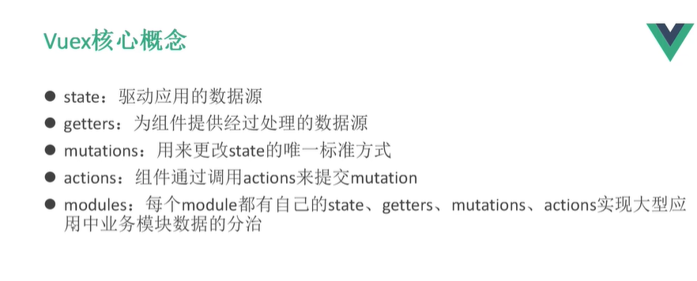

## React

1.npm install create-react-app -g

2.create-react-app react-demo  (react-demo项目名)

3.cd react-demo 

4.npm install

5.npm start     //运行


模块化，从代码的角度来讲，把一些重复的代码模块化，可重复使用便于项目维护与开发

组件：从页面的角度来分析，可复用的UI元素。例如轮播图的使用

组件的好处：很方便使用

实现组件化：React中，组件都是以js的方式表现

### 初始HelloWorld

DIFF算法 计算里面数据的变化，最大程度的减少消耗

虚拟DOM节点

在js中书写html节点，jsx语法

不是一个完整的MVVM结构，但可以使用其他插件


安装一个项目

##### 创建组件，自定义组件必须是大写字母开头


多个样式用 ( )

```jsx
return (
<div>这样美观</div>
)
```

用组件


index.html


### jsx语法糖

1.必须被一个大的标签包裹

2.标签必须封闭

3.class是className   for要歇写成htmlFor

​	我们可以在以上代码中嵌套多个 HTML 标签，需要使用一个 div 元素包裹它，实例中的 p 元素添加了自定义属性 **data-myattribute**，添加自定义属性需要使用 **data-** 前缀。

4.调用方法，可以传参使用if语句

5.数组的展示，map生成一个新数组


展示

```html
<ul>
{arr}
</ul>
```

6.{}表达式，三元运算符

7.{{}}绑定样式样式

### React的数据传递

更数据有关的就是

data props context 数据传递的三兄弟

```
React 把组件看成是一个状态机（State Machines）。通过与用户的交互，实现不同状态，然后渲染 UI，让用户界面和数据保持一致。

React 里，只需更新组件的 state，然后根据新的 state 重新渲染用户界面（不要操作 DOM）。

以下实例创建一个名称扩展为 React.Component 的 ES6 类，在 render() 方法中使用 this.state 来修改当前的时间。

添加一个类构造函数来初始化状态 this.state，类组件应始终使用 props 调用基础构造函数。
```


```js
 constructor(props) {
    super(props);
    this.state = {date: new Date()};
  }
```

使用{}绑定方法

## 为什么使用prop-types react中

使用prop-types检测props数据类型

在多人开发时，当被人使用自己定义的组件时，有可能出现类型传错的情况，而在自己的组件上加上prop-types，他可以对父组件传来的props进行检查，加入父组件中想传递的是字符串类型‘3’，而传递了一个数字类型3，如果没有类型检查系统不会给与提示，但是有了类型检查以后，再控制台会给你一个类型传递错误的提示。这样在工作中可以快速找到错误。

```
//安装
npm install prop-types --save
//引入
import PropTypes from 'prop-types';
```


## 生命周期

某一时刻组件自动调用的函数


优化性能


放在子组件优化，比对


ul库

安装 npm install  antd --save

在css样式中导入

基础模板

```jsx
import React, { Component } from 'react'

export default class News extends Component {

    constructor(props) {
        super(props)
       this.state={
            
       }
    }
    render() {
        return (
            <div>

       		</div>
        )
    }
}

```

## 数据前后传递

#### 数组遍历，对象呈现不一样 ,注解方式也不一样

```jsx
  constructor(props){
        super(props) //构造器中一定要有super()
        this.state={
            //定义数据
            title:"我是标题",
            user:{
                username:'张三',
                age:20
              
            }
        }
    }
```

```jsx
   render() {
   				//注解
        return (
                {/*打印对象会出错* 注解/}
            <div>
                {title}_____{user.username}_____
       		</div>
        )
    }
```

###   this.setState({},callback())

```jsx
       this.setState({

           title:"改变后的值"

      },()=>{

            console.log("aaaaaaaa")

        }    )
```

箭头函数


## 路由，子代路由，路由的封装

#### 普通路由

引入组件

导入路由模块

设置路径

设置组件出现的位置

```jsx
import React from 'react';
import logo from '../logo.svg'

import Home from '../components/next/Home'
import News from '../components/next/News'

import User from '../components/user/User'
import Shop from '../components/user/Shop'
import Content from '../components/next/Content'

import { BrowserRouter as Router, Route, Link } from "react-router-dom";

function App() {
  //标签必须大写
  return (
    <div className="App">
      <Router>
      <div style={{'display':'block',"width":"100%",'textAlign':'center'}}>     
            <Link to="/home">首页</Link>   ---
            <Link to="/news">新闻页面</Link>---
            <Link to="/user">用户</Link> ---     
            <Link to="/shop">商品</Link>
        </div>
        <hr/>
      <div>
        <Route path="/home" component={Home} />
        <Route path="/news" component={News} />
        <Route path="/user" component={User} />
        <Route path="/shop" component={Shop} />
        <Route path="/content/:id" component={Content} />
      </div>
    </Router>
    </div>
  );
}

export default App;

```

#### 子代路由

```jsx
import React, { Component } from 'react'
import './User.css'
import { Button } from 'antd';

import Main from './Main'
import Info from './Info'

import { BrowserRouter as Router, Route, Link } from "react-router-dom";

export default class User extends Component {
    constructor(props){
        super(props)

    }
    render() {
        return (
            <div>
                
            <div className='left'>
                <Link to='/user/'>个人中心</Link><br/>
                <Link to='/user/info'>个人信息</Link>
            </div>
            <div className='right'>
            <Route exact path="/user/" component={Main} /> {/*默认加载页面，严格匹配 exact*/}
            <Route path="/user/info" component={Info} />
            </div>
                
            </div>
        )
    }
}

```

#### 路由的封装

未完待续...

## 动态路由传值

使用路由

```jsx
import { BrowserRouter as Router, Route, Link } from "react-router-dom";
```

```jsx
import React, { Component } from 'react'
import { BrowserRouter as Router, Route, Link } from "react-router-dom";


export default class News extends Component {

    constructor(props) {
        super(props)
       this.state={
            contentlist:[
                {
                    id:1,
                    title:"详情一"
                },
                
                {
                    id:2,
                    title:"详情二"
                },
                {
                    id:3,
                    title:"详情三"
                }
            ]
       }
    }
    render() {
            {/* 动态路由使用es6模板语法*/}
        return (
            <div>
                <h1>点击新闻详情</h1>
           	{
              this.state.contentlist.map((value,key)=>{
             return (
                      //动态路由使用es6模板语法
           <li key={key}><Link to={`/content/${value.id}`}>{value.title}</Link></li>
                    )
                })
           		 }
        </div>
        )
    }
}

```

在根组件上显示路由

```jsx
<Route path="/content/:id" component={Content} />
```


 ## 父子组件传值

### 父传子

引入子组件

First.jsx

```jsx
import First_1 from './First_1'
```

```jsx
    render() {
        //es6语法使用const
        const data=this.state.date
        return (
            <div>
                <h1>我是first组件{data}</h1>
                <First_1  data={data} method={this.delete.bind(this)}></First_1>
            </div>
        )
    }
```

First_1.jsx

```jsx
    render() {
		const {data}=this.props
          return (
              	<div>
				 我是first的子组件{data}
       			</div>
          )
}
```

**为了避免传过来的类型不匹配，并且可以报错我们使用 import PropTypes from 'prop-types';**

```jsx
//安装
npm install prop-types --save
//引入
import PropTypes from 'prop-types';
```

验证data和数据中  <First_1  data={data}></First_1> 匹配

```jsx
  static propTypes={
        data:PropTypes.string
      }
  render() {
		const {data}=this.props
          return (
              	<div>
				 我是first的子组件{data}
       			</div>
          )
}
```

### 子传父

对于子传父，通过事件来触发

在父组件中的子组件传递一个方法

```jsx
      <Hot child_parent={this.child_parent}></Hot>
```

负责在父组件中接受子组件的值，传给父组件

```jsx
  child_parent=(a)=>{
        this.setState({
            title:a
        })
    }
```

子组件：

```jsx
   constructor(props){
        super(props)
        this.state={
            title:"我是子组件中的值"
        }
    }

    change=()=>{
        //与父组件传给子组件的属性一致
        this.props.child_parent(
            this.state.title
        )
    }
	//通过点击事件来触发子向父传值的方法
    render(){
        return (
            <div>
                热门商品
                <button onClick={this.change}>点击传值</button>
            </div>
        )
}
```


## [Ul页面的使用](https://ant.design/docs/react/use-with-create-react-app-cn)

​		官方文档

## 数组的遍历

```jsx
     listitem:[
            {
                title:"选项一",
                checked:false
            },
            {
                title:"选项二",
                checked:false
            },
            {
                title:"选项三",
                checked:false
            }
        ]
```
```jsx
    render() {
      const array= this.state.listitem.map((value,index)=>{
       return (
             <li key={index}>{value.title}</li>  //循环每一个里面的内容,特别注意不能循环对象
             )
          })
           
        return (
            <div>
                获取服务器数据
                <ol>
                    {array}
                </ol>
            </div>
        )
    }
```


## 事件的使用三种方式


## style样式使用{{}}

```jsx
  <h4 style={{"color":"red"}}>绑定样式{value}</h4>
```

### class-className

首先引入外部的css样式

```jsx
import './User.css'
```

```jsx
<div className='left'></div>
```

### lable for htmlFor

```jsx
 <label htmlFor='input'>我是input表单</label>
  <input  id='input' type="text" value={value} onChange={this.handleChange} /> 
```


## 单选框，复选框 ，select下拉列表

```jsx
import React, { Component } from 'react'

export default class Checkbox extends Component {
    constructor(props){
        super(props);
        this.state={
            citys:["上海","北京","天津"],
            city:'上海',//默认的城市变为上海
            sex:'男',
            check:[
                {
                    "title":"选项一",
                    "checked":false
                },
                {
                    "title":"选项二",
                    "checked":false
                },
                {
                    "title":"选项三",
                    "checked":false
                }
            ],
        }
    }
    //select列表
    handleCity=(e)=>{
        this.setState({
             city:e.target.value
        })
    }
    //单选框
    handlesex=(e)=>{
        this.setState({
            sex:e.target.value
       })
    }
    //多选框
    handlecheck=(index)=>{
        const hobby= this.state.check;
        hobby[index].checked=!hobby[index].checked
        this.setState({
            check: hobby
        })
        console.log(this.state.check)
    }
    render() {
        return (
            <div>
                <hr/>
                表单下拉框
                <select value={this.state.city} onChange={this.handleCity}>
                {
                    this.state.citys.map((value,index)=>{
                    return (
                        <option key={index} >
                                {value}
                        </option>
                    )
                })
                }   
                </select>
                {this.state.city}

                <hr/>
                单选框
                radio
                {/* == 与 === 是不同的,一个是判断值是否相等,一个是判断值及类型是否完全相等。*/}
                <input type="radio" value='男' checked={this.state.sex==="男"} onChange={this.handlesex}/>男
                <input type="radio" value='女' checked={this.state.sex==="女"} onChange={this.handlesex}/>女 
                <br/>
                选择的性别是：{this.state.sex}
                <hr/>
                checkbox多选
                {
                    this.state.check.map((value,index)=>{
                        return (
                            <div key={index}>
                               {value.title} <input type="checkbox" checked={value.checked} onChange={this.handlecheck.bind(this,index)}/>
                           </div>
                        )
                    })
                }
                {/* {this.state.check}  对象不能出现在html中*/}
              
            </div>
        )
    }
}

```


## 请求数据axios

安装依赖 

```shell
npm install axios --save
```

在需要的页面导入

```jsx
import axios from 'axios'
```

```jsx
        const url="http://a.itying.com/api/productlist";
            axios.get(url).then((request)=>{//箭头函数特别注意
                            // this.state.listitem=request
                            this.setState({
                                listitem: request.data.result,
                                })
                            console.log(this.state.listitem)
            })
```

## 当state和props改变时，会重新加载render()函数 

虚拟DOM就是一个js对象

state状态改变，旧的虚拟DOM与新的虚拟DOM进行比较，提升了性能


## Redux使用


状态改变时触发的事件handleState，触发时候给值

​      .定义仓库，index.js 笔记本 reducer.js

​       组件使用者 通过事件告诉action，

​       然后action告诉store仓库要找什么

​       store根据reducer给与的东西和action传递的东西匹配

​       匹配成功，返回一个新的store

index.js

```js
import { createStore } from 'redux'

import reducer from './reducer'

const store=createStore(reducer)

export default store;

//创建一个仓库
```

reducer.js

```js
const  defaultState={
        name:'我是仓库中的数值',
        value:''
}

//交个仓库的笔记本, redux可以接受state但不能修改state
export default (state = defaultState,action)=>{
    if(action.type==='input_change'){
    //拷贝一个新的state
    const newstate=JSON.parse(JSON.stringify(state))
    newstate.value=action.value;
    return newstate;
    //传给state
    }
    return state;
}
```

组件

```jsx
import React, { Component } from 'react'
import store from '../../store/index'

export default class Main extends Component {
    constructor(props){
        super(props)
       this.state={
          store:store.getState(),
          value:'value的值'

      }
        //状态改变时触发
      store.subscribe(this.handleState)

    }
    //输入框改变时是触发方法，告诉action,action告诉store
    handleChange=(e)=>{
            const action={
                type:'input_change',
                value:e.target.value
            }
            store.dispatch(action)
    }
    //状态改变时触发的方法
    handleState=()=>{
        console.log(this.state.store)
        this.setState({
            value:store.getState().value
        })
    }
    render() {
        return (
            <div>
                {this.state.name}
                个人中心
                <input  id='input' type="text" value={this.state.value} onChange={this.handleChange} /> 
                {this.state.value}+{this.state.store.in}
            </div>
        )
    }
}

```


## 无状态组件---> 只有一个render()的方法


```js
import React, { Component } from 'react'

export default class Home extends Component {
    render() {
        return (
            <div>
                首页
                
            </div>
        )
    }
}

```

修改为

```js
import React, { Component } from 'react'

//需要父类传值时使用 props
const Home =(props) => {
        return (
            <div>
                首页
                
            </div>
        )
}
export default Home;
```

## react-redux

方便react与redux的集合，第三方库文件 react-redux

index.js  Provider是核心api，在他里面的每一个子组件都可以访问store的数据

```js
import React from 'react';
import ReactDOM from 'react-dom';
import TodoList from './TodoList'
import { Provider } from 'react-redux'
import store from './store/index'
import List from './store/List'

 const App = (
    //提供器连接store内部组件都可以获取到
    <Provider store={store}> 
        <TodoList/>
        <List/>
    </Provider>
)

ReactDOM.render(App, document.getElementById('root'));

```

TodoList.jsx

```js
import React from 'react';
import { connect } from 'react-redux'
import { handleClick } from './store/ActionCreate'
import { GET_AXIOS } from '../src/store/ActionType'
import axios from 'axios'

//无状态组件
const TodoList=(props)=>{
    //精简代码  进一步改为无状态组件
    const {inputValue,handleClick,addinputvalue,list,delinputvalue,getaxiosmessage,axiosinfo}=props;//this.props
    return (
      <div className="App">
       <input type='text' value={inputValue} onChange={handleClick}/>  {/*this.props.handleClick*/}
        <button onClick={addinputvalue}>提交</button>
          {
           list.map((value,index)=>{
           return <li key={index} onClick={delinputvalue.bind(this,index)}>{value}</li>
            })

          }
          <button onClick={getaxiosmessage}>获取数据</button>
             {
             axiosinfo.map((value,index)=>{
                   return (<li key={index}>{value.title}</li>)
                })
            }
      </div>
    )
        }
        
//相当于监听state变化的函数
const mapStateToProps=(state)=>{
    return {
      inputValue:state.inputValue,
      list: state.list,
      axiosinfo: state.axiosinfo
    }
}

//发送的action，统一在一起
const mapDispatchToProps=(dispatch)=>{
  return {
    handleClick(e){
      const action=handleClick(e.target.value)
      dispatch(action)
    },
    addinputvalue(){
      const action={
        type:"add_input_value",
      }
      dispatch(action)
    },
    delinputvalue(index){
      const action={
        type:"del_input_value",
        index
      }
      dispatch(action)
    },
    getaxiosmessage(){
      const url="http://a.itying.com/api/productlist";
          axios.get(url).then((request)=>{//箭头函数特别注意
            const data=request.data.result;
              const  action={
                type:GET_AXIOS,
                axiosinfo: data
              }
              dispatch(action) 
          })
           
       }

  }
}
//用于视图组件与store连接 mapStateToProps，mapDispatchToProps 可以是对象也可以是函数
//返回的数据放在this.props中,方法也是this.props.方法名的操作
export default connect(mapStateToProps,mapDispatchToProps)(TodoList);
//(TodoList)只是ui组件
//connect(mapStateToProps,mapDispatchToProps)(TodoList) 容器组件。数据逻辑加上ui视图

```

store/index.js,仓库要难道reducer才能寻找相对应的数据

```js
import { createStore } from 'redux'
import reducer from './reducer'

const store=createStore(reducer);

export default store;
```

reducer.jd

```js
import { CHANGE_INPUT_VALUE ,GET_AXIOS} from './ActionType'
const defaultState={
        inputValue: ' ',
        list:[],
        axiosinfo:[]
}

export default (state=defaultState,action)=>{
   if(action.type===CHANGE_INPUT_VALUE){
    console.log("我是封装好的")
       const newState=JSON.parse(JSON.stringify(state))
       newState.inputValue=action.value
       return newState
   }//add_input_value
   if(action.type==='add_input_value'){
    const newState=JSON.parse(JSON.stringify(state))
    newState.list.push(newState.inputValue)
    newState.inputValue=' '
    return newState
}
if(action.type==='del_input_value'){
    const newState=JSON.parse(JSON.stringify(state))
    newState.list.splice(action.index,1)
    return newState
}
if(action.type===GET_AXIOS){
    const newState=JSON.parse(JSON.stringify(state))
    newState.axiosinfo=action.axiosinfo
    console.log(newState.axiosinfo)
    return newState
}
    return state;
    /*
     switch (action.type) {
    case 'ADD':
      return {cnt: state.cnt + 1};
    case 'REDUCE': 
      return {cnt: state.cnt - 1};
    default: 
      return state;
  }

    */
}

```

这里也可以对actiontype的封装,封装的目的在于一旦匹配出错，可以查出来哪里出错而不是没有提示

ActionType.js

```js
export const CHANGE_INPUT_VALUE='change_input_value';
export const GET_AXIOS='get_axios';
```

ActionCreate.js

```js
import { CHANGE_INPUT_VALUE,GET_AXIOS } from './ActionType'

export const handleClick = (value)=>({
    type:CHANGE_INPUT_VALUE,
    value
})

export const getaxiosmessagea = (axiosinfo)=>({
    type:GET_AXIOS,
    axiosinfo
})
```

### 原理

			在index.js配置一个provider的核心接口，引入store，
			让每个在里面的组件都可以都可以访问到store
			在要访问的组件中，引入一个connect连接函数，里面是两个参数
			export default connect(mapStateToProps,mapDispatchToProps)(TodoList);
	
			this.props.属性   this.props.方法
	
			mapDispatchToProps  组件发送定义方法，通过发送action来改变store中的值
			mapStateToProps是监测store中的值发生变化时触发，然后赋值给变量
			输出到组件

## 安装vuex




### 为什么

问题一，传参的方法对于多层嵌套的组件将会非常繁琐，并且对于兄弟组件间的状态传递无能为力。

问题二，我们经常会采用父子组件直接引用或者通过事件来变更和同步状态的多份拷贝。以上的这些模式非常脆弱，通常会导致无法维护的代码。

### 场景


涉及非父子组件之间跨组件共享数据
组件基于数据创建，多个组件使用这个数据，各组件之间的联系不可预料
同一个数据在不同页面控制某个属性，且多个页面都能修改这个数据
好吧，实在编不下去了，总结来总结去就是多个组件共享数据或者是跨组件传递数据，这些场景下使用vuex，但是一个子组件只在这个父组件之中使用，这是强耦合的，那么就应该放在页面的data里面。

在 store 中分别有 （各自有单独的文件）

​				state 管理数据  a b
​				getter 组合型的数据，state中数值变化可以调用,使用computed属性 a+b
​				mutations 适合同步数据的，改变state中的数据
​				actions 里面可以写异步的函数，经过处理的数据传给mutations,从而改变state中的值

vuex组件呢
获取store中的state
			在组件内vuex提供了多个方法

```js
			import{
			  mapState,
			  mapGetters,
			  mapMutations,
			  mapActions
			} from 'vuex'
```


```js
		  computed: {
		     ...mapState(['count']),  输入到template  {{count}}
		     ...mapState(['list']),
		     //重命名的方式
		     ...mapState({
		       counter:(state)=>state.count
		     }),
		      //使用getter便于对数据进行处理，可以重复使用 npm i babel-perset-stage-1 --save
		      ...mapGetters(['fullName'])
		      }
```
  			mapActions mapMutations
  				在方法中定义

 ```js
	  methods:{
			      ...mapActions(['updateCountAsync']),
			       ...mapActions(['getmessage'])
			       }
 ```


```html
		    调用的时候就是
		    this.updateCountAsync(
			    {
			    	有参数的传入参数
			    }
		    )
```

在vuex中getter的就是一个函数和compouted计算属相比较像，state的值改变它就会重新加载

## redux-saga插件的使用

在我认为呢，Redux与vuex做比较 

Redux-saga就相当于vuex的action,里面可以进行异步调用，

Redux的action与vuex的mutations 同步调用赋值 适合简单的调用

### 如何使用 redux-saga 

安装

```shell
npm install redux-saga --save
```

index.js是store的仓库文件

```js
import { createStore,applyMiddleware  } from 'redux'
import reducer from './reducer'
import createSagaMiddleware from 'redux-saga' 
import mySaga from './saga'

const sagaMiddleware = createSagaMiddleware()

const store=createStore(
    reducer,
    applyMiddleware(sagaMiddleware)
    );

sagaMiddleware.run(mySaga)

export default store;
```

将所有的异步请求全部放在一个saga.js中

saga.js 注意使用的语法，gengrator语法

```js
import { put, takeLatest } from 'redux-saga/effects'
import { AXIOS } from './ActionType'
import {getaxiosmessagea } from './ActionCreate'
import axios from 'axios'


function* getaxiosinfo(){
  try{
    const url="http://a.itying.com/api/productlist";
    const res= yield axios.get(url)
    const action=getaxiosmessagea(res.data)
    yield  put(action)
  }catch(e){
    console.log("出错了")
  }

}

function* mySaga() {
    yield takeLatest(AXIOS, getaxiosinfo);
  }
  
  export default mySaga;
```


其中一个组件

List.jsx

```jsx
import React, { Component } from 'react'
import { connect } from 'react-redux'
import { axiosmessagea } from './ActionCreate'
import store from './index';

class List extends Component {
  
    render() {
        return (
            <div>
                <button onClick={this.props.getaxiosmessage}>获取数据44</button>
                {
                    this.props.axiosinfo.map((value,index)=>{
                        return (<li key={index}>{value.title}</li>)
                     })
                }
            </div>
        )
    }
}

const mapStateToProps=(state)=>{
    return {
      axiosinfo: state.axiosinfo
    }
}

  const mapDispatchToProps=()=>{
        return {
          getaxiosmessage(){
              //发送一个action 这个action现在是saga与reducer都可以接收
                const action=axiosmessagea()
                console.log(action)
                store.dispatch(action)
             }
        }
      }

export default connect(mapStateToProps,mapDispatchToProps)(List);

```

action为了更加方便管理

拆分为 ActionType ActionCreated

 ActionType .js

```js
export const CHANGE_INPUT_VALUE='change_input_value';
export const GET_AXIOS='get_axios';
export const AXIOS='axios';
//这样封装便于出错排查
```

ActionCreated.js

```js
import { CHANGE_INPUT_VALUE,GET_AXIOS ,AXIOS} from './ActionType'

export const handleClick = (value)=>({
    type:CHANGE_INPUT_VALUE,
    value
})

export const axiosmessagea = ()=>({ 
    //这里的action reducer不接受，传给saga,saga根据传来的type来判断执行那个方法，然后异步的方法
    //调用其他action，传给store,store根据reducer来改变哪个的值，（reducer接受type和参数，复制一份state，根据type来给新的state赋值，返回给store，由store修改）
    type:AXIOS,
})
export const getaxiosmessagea = (data)=>({
    type:GET_AXIOS,
    data
})
```


## Vue

### vue过滤器格式化日期

```js
 {{timeDate|format()}}

    data(){
      timeDate:new Date()
    }

filters:{
      f1(value){
        console.log(value)
      },
      format(val){   
        var padDate=function(va){
            va=va<10?'0'+va:va;
            return va
        }
         var value=new Date(val);
            var year=value.getFullYear();
            var month=padDate(value.getMonth()+1);
            var day=padDate(value.getDate());
            var hour=padDate(value.getHours());
            var minutes=padDate(value.getMinutes());
            var seconds=padDate(value.getSeconds());
            return year+'-'+month+'-'+day+' '+hour+':'+minutes+':'+seconds;
      }
    }
```


 