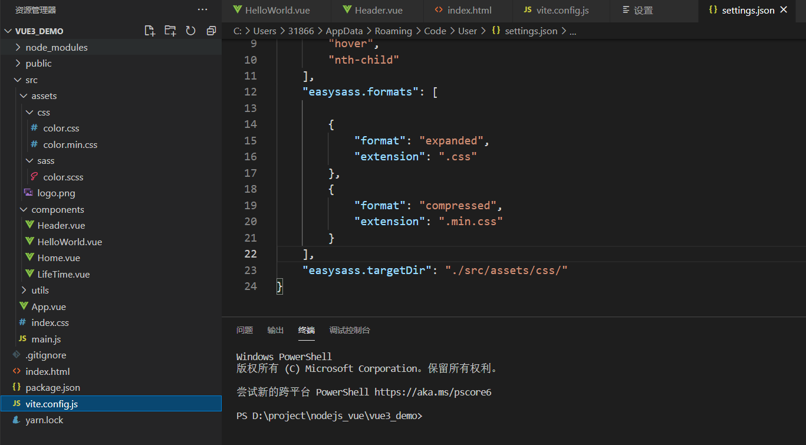

# VUE3.X

1. 安装脚手架

```bash
 yarn create vite-app <project-name>
$ cd <project-name>
$ yarn
$ yarn dev
```

创建项目（根据自己的npm,yarn ）

http://localhost:8080/book//client/ClientServlet?op=wxys&page.start=0

2. 第二种创建方式

> yarn create @vitejs/app

然后按照提示操作即可！

你还可以通过附加的命令行选项直接指定项目名称和你想要使用的模板。例如，要构建一个 Vite + Vue 项目，运行:

```sh
# npm 6.x
npm init @vitejs/app my-vue-app --template vue

# npm 7+, 需要额外的双横线：
npm init @vitejs/app my-vue-app -- --template vue

# yarn
yarn create @vitejs/app my-vue-app --template vue
```

## vite与webpack的区别

[Vite 和Webpack 的核心差异_前端劝退师-CSDN博客](https://blog.csdn.net/weixin_40906515/article/details/114313102?utm_medium=distribute.pc_relevant.none-task-blog-baidujs_title-0&spm=1001.2101.3001.4242)


### 在Vue3.0使用vite创建项目的时候

##### 了解vite的默认文件，使用vite构建vue3.x项目，默认的配置文件  vite.config.js

```shell
npm install sass -D 
```

这个是sass 的库，这里为啥不需要安装sass--loader 或者 style-loader 或者 node-sass 呢？ 这个在设计的时候，vue3 的缔造者 在设计vue 的时候已经考虑过这件事情，vite 这个构建工具里面集成了scss, less ,stylus 等

```shell
yarn add sass -D
```

1. 在vscode中安装两个插件 easy sass和 sass 插件，安装之后重启vscode

2. 配置setting.json，左下角的设置，然后看见**扩展**，找到sass，下面有个setting.json的配置文件

3. 默认编译的时候，color.scss与生成的 .min.css和.css是在同一个目录下，然后我们指定生成的路径

   > "easysass.targetDir": "./src/assets/css/"

   生成的文件结构如图所示

   

vite.config.js

```js
const path = require('path')
export default function () {
    return {
        // 代理，最重要，其他的都可以有默认配置
        proxy: {
            // '/api': {
            //     target: 'http://localhost:9011',
            //     changeOrigin: true,
            // }
        },
        // 入口
        entry: 'index.html',
        // 出口
        outDir: './../public/html',
        // 打包后的跟路径
        base: '/',
        // 输出的静态资源的文件夹名称
        assetsDir: 'assets',
        // 是否开启ssr服务断渲染
        ssr: false,
        // 重命名路径  path.resolve(__dirname, './src')
        alias: {
            '/@/': path.resolve(__dirname, './src')
        },
        // 端口
        port: 3002,
        // 是否自动开启浏览器
        open: false,
        // 开启控制台输出日志
        silent: false,
        // 那个包不需要打包
         optimizeDeps: {
            // exclude: ['element-plus']
        },
        // css预设的配置,配置scss
        cssPreprocessOptions: {
            scss: {
                additionalData: '@import "assets/sass/color.scss";', // 添加公共样式
            },
        }
    }
}

```

