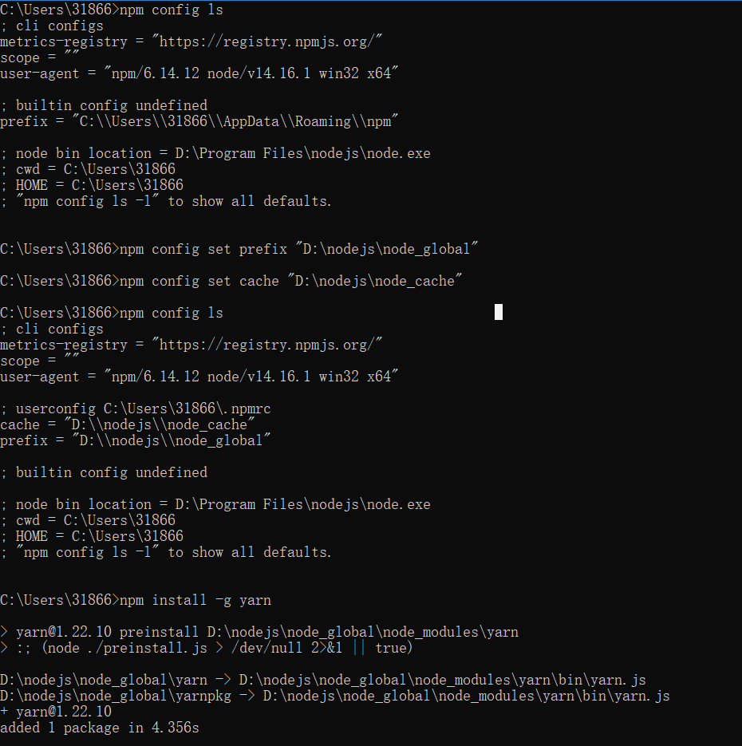
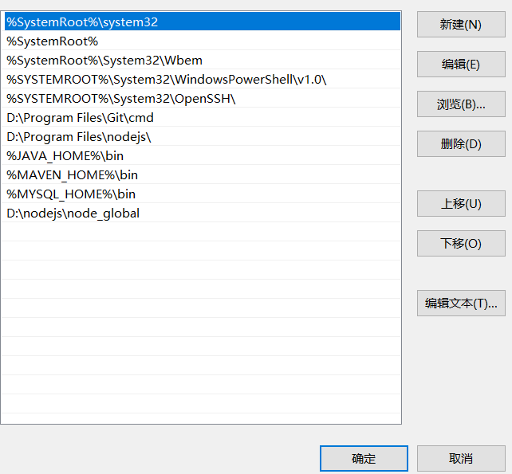

### 配置全局文件的路径




配置yarn的 全局安装包

在CMD命令行中执行
1.改变 yarn 全局安装位置

```shell
$ yarn config  set global-folder "你的磁盘路径"
2.然后你会在你的用户目录找到 .yarnrc 的文件，打开它，找到 global-folder ，改为 --global-folder
```

```shell
$  yarn config  set global-folder "D:\Software\yarn\global"1#这里是我的路径
```

2. 改变 yarn 缓存位置

> #yarn config set cache-folder "你的磁盘路径"
> #这里是我的路径
> #在我们使用 全局安装 包的时候，会在 “D:\Software\yarn\global” 下 生成 node_modules\.bin 目录
> $  yarn config set cache-folder "D:\Software\yarn\cache"
> 我们需要将 D:\Software\yarn\global\node_modules.bin 整个目录 添加到系统环境变量中去，否则通过yarn 添加的全局包 在cmd 中是找不到的。

检查当前yarn 的 bin的 位置

> $  yarn global bin
>
> 
>
> 检查当前 yarn 的 全局安装位置
>
> 
>
> $ yarn global dir


> 创建项目：`yarn init`

> 安装依赖包：`yarn` == `yarn install`

> 添加依赖包：`yarn add`
>
> 查看全局安装列表：` yarn global list`
>
> npm查看方式：`npm list -g --depth 0`

#### Yarn命令列表

| 命令                     | 操作                                   | 参数                                                         | 标签                                                         |
| ------------------------ | -------------------------------------- | ------------------------------------------------------------ | ------------------------------------------------------------ |
| yarn add                 | 添加依赖包                             | 包名                                                         | --dev/-D                                                     |
| yarn bin                 | 显示yarn安装目录                       | 无                                                           | 无                                                           |
| yarn cache               | 显示缓存                               | 列出缓存包：`ls`，打出缓存目录路径：`dir`，清除缓存：`clean` | 无                                                           |
| yarn check               | 检查包                                 |                                                              |                                                              |
| yarn clean               | 清理不需要的依赖文件                   |                                                              |                                                              |
| yarn config              | 配置                                   | 设置：`set <key> <value>`， 删除：`delete`， 列出：`list`    | [-g \| --global]                                             |
| yarn generate-lock-entry | 生成锁定文件                           | 无                                                           | 无                                                           |
| yarn global              | 全局安装依赖包                         | yarn global <add/bin/ls/remove/upgrade> [--prefix]           | --prefix 包路径前缀                                          |
| yarn info                | 显示依赖包的信息                       | 包名                                                         | --json：json格式显示结果                                     |
| yarn init                | 互动式创建/更新package.json文件        | 无                                                           | --yes/-y：以默认值生成package.json文件                       |
| yarn install             | 安装所有依赖包                         |                                                              | --flat：只安装一个版本；--force：强制重新下载安装；--har：输出安装时网络性能日志；--no-lockfile：不生成yarn.lock文件；--production：生产模式安装（不安装devDependencies中的依赖） |
| yarn licenses            | 列出已安装依赖包的证书                 | ls：证书列表；generate-disclaimer：生成免责声明              |                                                              |
| yarn link                | 开发时链接依赖包，以便在其他项目中使用 | 包名                                                         |                                                              |
| yarn login               | 保存你的用户名、邮箱                   |                                                              |                                                              |
| yarn logout              | 删除你的用户名、邮箱                   |                                                              |                                                              |
| yarn list                | 列出已安装依赖包                       |                                                              | --depth=0：列表深度，从0开始                                 |
| yarn outdated            | 检查过时的依赖包                       | 包名                                                         |                                                              |
| yarn owner               | 管理拥有者                             | ls/add/remove                                                |                                                              |
| yarn pack                | 给包的依赖打包                         | --filename                                                   |                                                              |
| yarn publish             | 将包发布到npm                          |                                                              | --tag：版本标签；--access：公开（public）还是限制的（restricted） |
| yarn remove              | 卸载包，更新package.json和yarn.lock    | 包名                                                         |                                                              |
| yarn run                 | 运行package.json中预定义的脚本         |                                                              |                                                              |
| yarn self-update         | yarn自身更新--未实现                   |                                                              |                                                              |
| yarn tag                 | 显示包的标签                           | add/rm/ls                                                    |                                                              |
| yarn team                | 管理团队                               | create/destroy/add/rm/ls                                     |                                                              |
| yarn test                | 测试 = yarn run test                   |                                                              |                                                              |
| yarn unlink              | 取消链接依赖包                         |                                                              |                                                              |
| yarn upgrade             | 升级依赖包                             |                                                              |                                                              |
| yarn version             | 管理当前项目的版本号                   | --new-version ：直接记录版本号；--no-git-tag-version：不生成git标签 |                                                              |
| yarn why                 | 分析为什么需要安装依赖包               | 包名/包目录/包目录中的文件名                                 |                                                              |


### question

VS Code中报错：无法加载文件 D:\nodejs\node_global\webpack.ps1，因为在此系统上禁止运行脚本...
今天在开发中使用到了 yarn，之前全局安装了yarn，并且在 cmd 中也可以正常使用，但是在VS Code中报出了错误。如下信息：

无法加载文件 D:\nodejs\node_global\webpack.ps1，因为在此系统上禁止运行脚本，
有关详细信息，请参阅 https:/go.microsoft.com/fwlink/?LinkID=135170

解决方案：
首先以管理员的身份运行 VS Code .
在终端执行` get-ExecutionPolicy`,打印显示出 `Restricted`,表示禁止状态.
接下来在终端执行 `set-ExecutionPolicy RemoteSigned.`
在此输入 `get-ExecutionPolicy`查看，显示 `RemoteSigned`.
之后再使用yarn install 时，就不会再出现如上所述的问题了，出现其他同样类似情况也是同样的解决方案。
