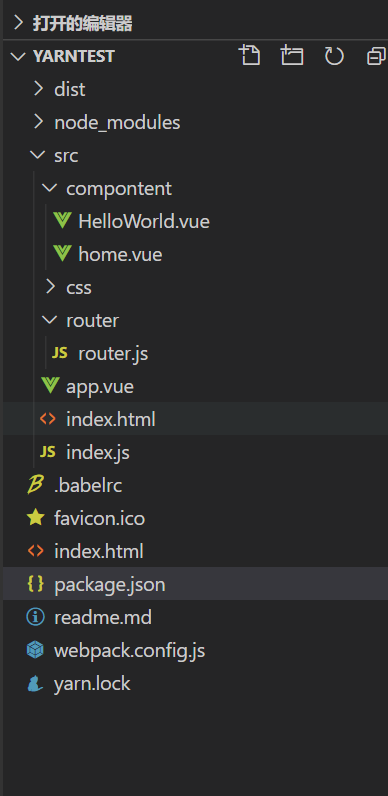
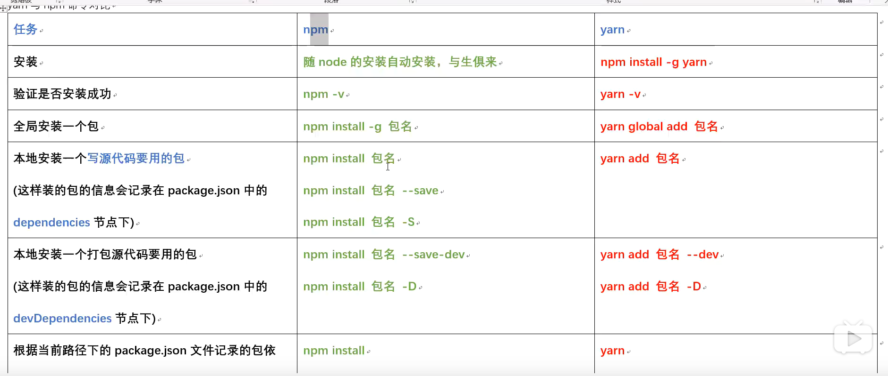
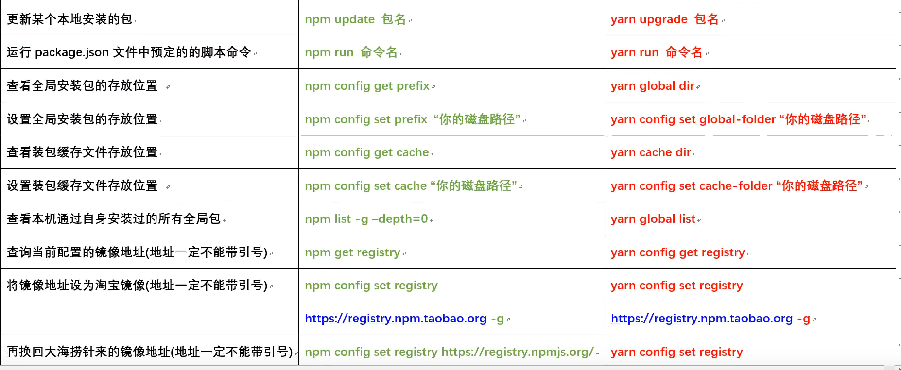

1.新建一个文件

2.npm init   对项目进行初始化，包的管理

3.新建src  dist  文件夹

```js
src -
   -index.html
	-index.js  整个项目的入口文件
```

4. npm install 报名  -D 安装局部依赖

5. 使用Es6语法, import $ from 'jquery'

   安装webpack工具

   ```js
   npm i webpack webpack-cli -D 
   ```

   在 package.json中引入一个脚本,包括打包运行

   ```js
    "scripts": {
       "dev": "webpack --mode development",
       "build": "webpack --mode production"
     },
   ```

   指定一个webpack.config.js文件，这个文件含有输入输出

   ```js
   const path=require('path')
   const MiniCssPlugin = require("mini-css-extract-plugin");
   const HtmlWebpackPlugin =require("html-webpack-plugin")
   module.exports={
       mode:'development',
       //单个入口文件
       entry:'./src/index.js',
       output:{
           path:path.resolve(__dirname,'dist'),
           filename:'main.js'
       },
       //配置多个入口文件，一个出口文件
       // entry:['./src/index.js','./src/idnex2.js'],
       // output:{
       //     path:path.resolve(__dirname,'build'),
       //     filename:'main.js'
       // },
   
   //配置多个入口与出口文件
       // entry:{
       //     entryOne:'./src/index.js',
       //     entryTwo:'./src/index2.js'
       // },
       // output:{
       //     path:path.resolve(__dirname,'build'),
       //     filename:'[name].js'
       // }
       devServer:{
           contentBase:'./dist',//设置服务器要访问路径
           host:'localhost',//服务器的IP地址
           port:8555,//服务器的端口号
           open:true ,//自动打开页面
           progress:true
       },
       module:{
           rules:[
               //引入css
               {
                   test:/\.css$/,
                   use:[ 'style-loader', 'css-loader']//引入的顺序至关重要,不可改变
               },
               //使用es6语法(1)
               {
                   test:/\.js$/,
                   exclude:/node_module/,//排除node_module的内容，影响性能
                   use:'babel-loader'
               },
               {
                   test:/\.css$/,
                   use:[MiniCssPlugin.loader,'css-loader']
               }
         /**
            第二种方式不需要创建 .babelrc文件，直接配置options选项    
         {
         test:/\.js$/,
         exclude:/node_modules/,
         use:{
             loader:'babel-loader',
             options:{
               presets:['@babel/preset-env']
             }
         }
       }
                */
           ]
       },
       //单独分离css 打包后的文件在css下
       plugins:[
           new MiniCssPlugin({
             filename:'./css/[name].css'
           }),
           new HtmlWebpackPlugin({
               template:'./src/index.html',//指定模板
               filename:'index.html' //打包后也是index.html
           })
           
         ]
   
   }
   ```

   默认的打包入口是index.js，打包是在dist文件下

   6.设置webpack的服务器，实时自动打包

   ```
   npm i webpack-dev-server -D
   ```

   ```js
    "scripts": {
   	"start": "webpack-dev-server --mode 			development",
   }
   ```

   

   7. 安装一个在html显示的插件

      ```
      npm i html-webpack-plugin -D
      ```

   

6. 在webpack.config.js中引入插件 

   第一种方式

   ```js
   const HtmlPlugin=require('html-webpack-plugin')
   const htmlplugin=new HtmlPlugin({
       template:'./src/index.html';
       filename:'index.html'
   })
   module.exports={
       mode:'development',
       devServer:{
           contenBase:'./dist',//设置服务器要访问路径
           host:'localhost',//服务器的IP地址
           port:8555,//服务器的端口号
           open:true ,//自动打开页面
           progress:true
       },
     plugins:[htmlplugin]    
   }
   ```

   第二种方式

   ```js
   plugins:[        
     new HtmlWebpackPlugin({
         template:'./src/index.html',//指定模板
         filename:'index.html' //打包后也是index.html
           })]
   ```

   这样就不需要在html中引入了，直接在index.html中引入入口的js文件。

   

7. ES6转ES5新建一个 .babelrc

   ```js
   {
       "presets":["@babel/preset-env"]
   }
   ```

   ```js
         {
              test:/\.js$/,
                   exclude:/node_module/,//排除node_module的内容，影响性能
                   use:'babel-loader'
               },      
   第二种方式不需要创建 .babelrc文件，直接配置options选项    
         {
         test:/\.js$/,
         exclude:/node_modules/,
         use:{
             loader:'babel-loader',
             options:{
               presets:['@babel/preset-env']
             }
         }
   ```


# 在webpack中使用vue 自主搭建

```json
{
  "name": "yarntest",
  "version": "1.0.0",
  "main": "index.js",
  "license": "MIT",
  "dependencies": {
    "@babel/core": "^7.10.2",
    "@babel/preset-env": "^7.10.2",
    "babel-loader": "^8.1.0",
    "mini-css-extract-plugin": "^0.9.0",
    "vue": "^2.6.11",
    "vue-hot-reload-api": "^2.3.4",
    "vue-loader": "15.7.0",
    "vue-router": "^3.3.4",
    "vue-style-loader": "^4.1.2",
    "vue-template-compiler": "^2.6.11",
    "webpack": "^4.43.0",
    "webpack-dev-server": "^3.11.0"
  },
  "scripts": {
    "start": "webpack-dev-server --mode development",
    "dev": "webpack --mode development",
    "build": "webpack --mode production"
  },
  "devDependencies": {
    "css-loader": "^3.6.0",
    "html-webpack-plugin": "^4.3.0",
    "jquery": "^3.5.1",
    "less": "^3.11.3",
    "less-loader": "^6.1.1",
    "style-loader": "^1.2.1",
    "webpack-cli": "^3.3.11"
  }
}
```

package.json文件在这里，只需执行 

```
npm install 或者 yarn 就会安装依赖
```

然后创建如下图的目录结构



#### index.js

```js
console.log("我在用yarn回来了")
console.log("我修改了入口的配置")
//require('../src/css/color.css')//没有引入ES6-》ES5的转换器，所以用require,引入就可以使用import
import './css/index.less'
//jquery可以使用了
import $ from 'jquery'
$("#bbb").css('border','1px solid')
import Vue from 'vue'
import App from '../src/app.vue'
import router from "./router/router.js"    // import router 的router 一定要小写， 不要写成Router, 否则报 can't match的报错
new Vue({
  el: '#app', //相当于.$mount("#app")挂载
  router,  // 注入到根实例中
  render: h => h(App)
})
//与上图等价render负责渲染页面
// new Vue({
//     router,
//     render: (h) => h(App) //实质是一个箭头函数 return app
// }).$mount("#app")//将实例的app.vue组件挂载到id为app的html页面中
```

#### vue的路由router.js，写的文件不唯一为了方便管理写在单独的文件里

```js
import Vue from "vue";
import VueRouter from "vue-router";
import  HelloWorld from '../compontent/HelloWorld.vue'
 import  home from '../compontent/home.vue'
 import App from '../app.vue'
Vue.use(VueRouter);

const routes = [
    {
        path:"/hello",
        component: HelloWorld
    },
    {
        path:"/home",
        component:home
    }
]
var router =  new VueRouter({
    routes
})
export default router
```

#### index.html

```html
<div id="app">
路由之间的跳转，会被组件挂载覆盖
<router-view></router-view> 加上vue-router可以根据路径选择相对应的组件。
    http://localhost:8080/#/home 显示home组件
</div>
```

#### webpack.config.js

```js
const path=require('path')
 const MiniCssPlugin = require("mini-css-extract-plugin");
const HtmlWebpackPlugin =require("html-webpack-plugin")
const VueLoaderPlugin = require('vue-loader/lib/plugin');
module.exports={
    //单个入口文件
    
    entry:'./src/index.js',
    output:{
        path:path.resolve(__dirname,'dist'),
        filename:'main.js'
    },
    //配置多个入口文件，一个出口文件
    // entry:['./src/index.js','./src/idnex2.js'],
    // output:{
    //     path:path.resolve(__dirname,'build'),
    //     filename:'main.js'
    // },

//配置多个入口与出口文件
    // entry:{
    //     entryOne:'./src/index.js',
    //     entryTwo:'./src/index2.js'
    // },
    // output:{
    //     path:path.resolve(__dirname,'build'),
    //     filename:'[name].js'
    // }
    devServer:{
        contentBase:path.join(__dirname, 'dist'),//设置服务器要访问路径
        host:'localhost',//服务器的IP地址
        port:8080,//服务器的端口号
        open:true ,//自动打开页面
    },
    module:{
        //解析规则
        rules:[
            //引入vue
            {
                test: /\.vue$/,
                loader: 'vue-loader' // 处理以.vue结尾的文件
            },
            //引入css
            {
                test:/\.css$/,
                use:[ 'style-loader', 'css-loader']//引入的顺序至关重要,不可改变
            },
            //使用es6语法(1)
            {
                test:/\.js$/,
                exclude:/node_module/,//排除node_module的内容，影响性能
                use:'babel-loader'
            },
            {
                test:/\.css$/,
                use:[MiniCssPlugin.loader, 'style-loader','css-loader']
            },
             //使用less语法解析
            {
                test:/\.less$/,
                use:['style-loader', 'css-loader','less-loader']
            }
      /**
         第二种方式不需要创建 .babelrc文件，直接配置options选项    
      {
      test:/\.js$/,
      exclude:/node_modules/,
      use:{
          loader:'babel-loader',
          options:{
            presets:['@babel/preset-env']
          }
      }
    }
             */
        ]
    },
    //单独分离css 打包后的文件在css下
    stats: {
        children: false
      },
    plugins:[
        new VueLoaderPlugin(),
        new MiniCssPlugin({
          filename:'./css/[name].css'
        }),
        new HtmlWebpackPlugin({
            template:'./src/index.html',//指定模板
            filename:'index.html' //打包后也是index.html
        })
        
      ]

}
```


## webpack4.x 打包工具

1.首先搭建好环境

```shell
npm init -y 初始化一个项目

npm install webpack webpack-cli --save-dev
```

2.

npm i  安装node_moudles
文件夹

    dist
    src 
    	css
    	js
    	image
    	main.js
    	index.html
    webpack.config.js
    package.json

npm init -y  出现package.jsoon

在4.x中webpack的默认路径出来，入口出口都设置好了

src下的index,js

打包到dist下的main.js

## 1.使用import $ from 'jquery'解析不了

解决：
使用webpack处理  
webpack .\src\main.js  .\dist\bundle.js  指定出口入口
	指定处理的文件
不想手动指定入口与出口文件就创建
webpack.config.js
指定入口出口.将出口入口暴露
1.使用webpack打包

1.首先发现没有指定入口与出口
2.寻找webpack.config.js文件
3.找到配置后解析执行，找到配置对象
4.拿到对象后，进行打包

## 2.安装 webpack-dev-server实现自动打包编译

npm i webpack-dev-server -D

node nodemon
webpack webpack-dev-server
实时加载
配置package.json
script
dev:'webpack-dev-server'

注意要先安装
npm -i webpack -D

## 3.没有出现效果，在html中引入的js路径不对

在webpack-dev-server打包的没有在本地磁盘上，托管到项目的内存中
和dist src 同级

## 4.修改端口，指定首页 --hot 及时更新，没有编译打包，更新少量的代码

配置hot的两种方式
4.1 在    package.json中配置

```json
 "scripts": {
    "test": "echo \"Error: no test specified\" && exit 1",
    "dev": "webpack-dev-server  --open --port 3000  --contentBase src --hot"
  },
```

```js
    --open  打开浏览器
    --port 3000 指定端口号
    --contentBase src 开始默认路径
     --hot  热更新
     
	4.2.三步走 

     1.引入webpack模块
     var webpack=require('webpack')
     2. devServer:{
    		contentBase:'./src',  //设置服务器访问的基本目录
    		host:'localhost', //服务器的ip地址
    		  port:8080,  //端口
    			open:true, //自动打开页面
    			hot: true
    			},
    3.在插件中配置
    	plugins:[
 			 new webpack.HotModuleReplacementPlugin()
			]
```

## 5.将页面放入到内存中

npm i html-webpack-plugin -D 这样早页面中就不用引入js

    <script src="./bundle.js"></script>

在webpack.config.js配置插件
插件自动创建一个合适的script 并且引用

## 6.使用import 导入 css

安装loader

## 7.在css样式中引入url地址 不管是图片还是字体库

npm i url-loader file-loader -D

还是在loader中配置规则，如第六点

## 8.  有.babelrc,语法转化

1.安装下载相关的包
2.添加一个.babelrc配置文件

```js
{
    "presets":["@babel/preset-env"]
}
```

3.在webpack.config.js中配置相应的规则，注意排除 
node_modules下的文件，否则很耗内存

```js
 {
      test:/\.js$/,
      exclude:/node_modules/,
      use:'babel-loader'
    }
```


## 命令对比

npm 

yarn 





移除 npm uninstall 包名  yarn remove 包名


### 几步走，就那么点东西

1.初始化 npm init -y

2.入口文件出口文件

3.打包入口文件的js

4.既然是打包，面对不用的文件语法，默认只识别js.所以安装插件来loader来识别

5.编译完后，要想修改webpack退出watch来监听，但是这样文件多的话修改的也多

6.所以引入了webpack-dev-server的插件来成为一个服务器，打包好的文件放入内存之中，快速访问，拥有自己的端口号，相当于webpack+服务器 它拥有自己的热部署来更新修改的内容

7.将最终编译形成的出口文件，可以被html页面应用，我用使用html-webpack-plugin插件，也可以优化html文件大小，这个的作用是定义初始访问的页面，无需在html中引入js文件

8.为了识别高级es6语法，使用.babelrc来转化低级的可以识别，但是要排除node_modules中的，否则很耗内存

9.为了优化最终形参的项目我们可以对css进行压缩处理，主要处理就是这些了