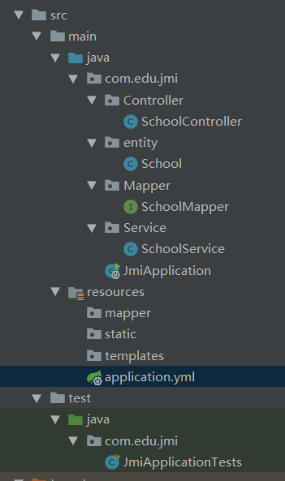

# Mybatis_plus  [https://mp.baomidou.com](https://mp.baomidou.com/)

- **无侵入**：只做增强不做改变，引入它不会对现有工程产生影响，如丝般顺滑

- **损耗小**：启动即会自动注入基本 CURD，性能基本无损耗，直接面向对象操作

- **强大的 CRUD 操作**：内置通用 Mapper、通用 Service，仅仅通过少量配置即可实现单表大部分 CRUD 操作，更有强大的条件构造器，满足各类使用需求

- **支持 Lambda 形式调用**：通过 Lambda 表达式，方便的编写各类查询条件，无需再担心字段写错

- **支持主键自动生成**：支持多达 4 种主键策略（内含分布式唯一 ID 生成器 - Sequence），可自由配置，完美解决主键问题

- **支持 ActiveRecord 模式**：支持 ActiveRecord 形式调用，实体类只需继承 Model 类即可进行强大的 CRUD 操作

- **支持自定义全局通用操作**：支持全局通用方法注入（ Write once, use anywhere ）

- **内置代码生成器**：采用代码或者 Maven 插件可快速生成 Mapper 、 Model 、 Service 、 Controller 层代码，支持模板引擎，更有超多自定义配置等您来使用

- **内置分页插件**：基于 MyBatis 物理分页，开发者无需关心具体操作，配置好插件之后，写分页等同于普通 List 查询

- **分页插件支持多种数据库**：支持 MySQL、MariaDB、Oracle、DB2、H2、HSQL、SQLite、Postgre、SQLServer2005、SQLServer 等多种数据库

- **内置性能分析插件**：可输出 Sql 语句以及其执行时间，建议开发测试时启用该功能，能快速揪出慢查询

- **内置全局拦截插件**：提供全表 delete 、 update 操作智能分析阻断，也可自定义拦截规则，预防误操作

  

在springboot中使用Mybatis_plus

## 基本配置

### application.yml

```yml
server:
  port: 8080

spring:
  datasource:
    username: root
    password: 123456
    url: jdbc:mysql://localhost:3306/springmvc?useUnicode=true&characterEncoding=utf-8&useSSL=true&serverTimezone=UTC
    driver-class-name: com.mysql.cj.jdbc.Driver


mybatis-plus:
  #一定不能错，要不然Mapper扫描不到，在主类配置MapperScan
  mapper-locations: classpath:mapper/*.xml
  type-aliases-package: com.edu.jmi.entity
```




### pom.xml

```xml
<?xml version="1.0" encoding="UTF-8"?>
<project xmlns="http://maven.apache.org/POM/4.0.0" xmlns:xsi="http://www.w3.org/2001/XMLSchema-instance"
         xsi:schemaLocation="http://maven.apache.org/POM/4.0.0 https://maven.apache.org/xsd/maven-4.0.0.xsd">
    <modelVersion>4.0.0</modelVersion>
    <parent>
        <groupId>org.springframework.boot</groupId>
        <artifactId>spring-boot-starter-parent</artifactId>
        <version>2.1.7.RELEASE</version>
        <relativePath/> <!-- lookup parent from repository -->
    </parent>
    <groupId>com.edu</groupId>
    <artifactId>jmi</artifactId>
    <version>0.0.1-SNAPSHOT</version>
    <name>jmi</name>
    <description>Demo project for Spring Boot</description>

    <properties>
        <java.version>1.8</java.version>
    </properties>

    <dependencies>
        <dependency>
            <groupId>mysql</groupId>
            <artifactId>mysql-connector-java</artifactId>
        </dependency>
        <dependency>
            <groupId>org.springframework.boot</groupId>
            <artifactId>spring-boot-starter-web</artifactId>
        </dependency>
        <dependency>
            <groupId>org.springframework.boot</groupId>
            <artifactId>spring-boot-starter-test</artifactId>
            <scope>test</scope>
        </dependency>
        <dependency>
            <groupId>org.projectlombok</groupId>
            <artifactId>lombok</artifactId>
        </dependency>

        <dependency>
            <groupId>org.springframework.boot</groupId>
            <artifactId>spring-boot-devtools</artifactId>
            <scope>runtime</scope>
            <optional>true</optional>
        </dependency>

        <!--MybatisPlus依赖-->
        <dependency>
            <groupId>com.baomidou</groupId>
            <artifactId>mybatis-plus-boot-starter</artifactId>
            <version>3.0.1</version>
        </dependency>

    </dependencies>

    <build>
        <plugins>
            <plugin>
                <groupId>org.springframework.boot</groupId>
                <artifactId>spring-boot-maven-plugin</artifactId>
            </plugin>
        </plugins>
    </build>
</project>
```

### entity

```java
@Data                 //实现get set tostring 方法
@TableName("school") //默认的表名是实体类的类名，不一样时候要设置
public class School {
                    //设置自增主键，如果表里的主键与实体类的主键不一致一定要设置，一样可以不设置
    @TableId(value = "id",type = IdType.AUTO)
    private int id;
    //@TableField(value="")表中字段不一致时
    //@TableField(exist = false) 默认是true,改为false,不会出现在插入的字段
    private String province;
    private String code;
    private String major;
    private String schoolcode;
    private String schoolname;
    private int year;
}
```


### Mapper

mapper.xml不需要配置

```java
public interface SchoolMapper extends  BaseMapper<School> {
       /**  
       多种查询方式 list  map map里面放入的是表中的字段名称 
       * 查询和删除都可以使用list ，map来选择相应的条件进行封装来操作 deleteByMap    
       */
}
```

### Test测试类

```java
@RunWith(SpringRunner.class)
@SpringBootTest
@MapperScan("com.edu.jmi.Mapper")
public class JmiApplicationTests {

    @Autowired
    private SchoolMapper schoolMapper;

    @Test
    public void select() {
        QueryWrapper<School> queryWrapper = new QueryWrapper<>();
        queryWrapper.eq("schoolname","江苏海事职业技术学院");
        System.out.println(schoolMapper.selectOne(queryWrapper));
    }
    //查询多个对象
    @Test
    public void select1() {
        QueryWrapper<School> queryWrapper = new QueryWrapper<>();
        queryWrapper.
                eq("schoolname","江苏海事职业技术学院")
                .or()
                .like("schoolname","南")
        ;
        System.out.println(schoolMapper.selectObjs(queryWrapper));
    }

}
```


##### selectPage() 加入EntityWrapper条件构造器2.3b版本 QueryWrapper 3.*版本


##### select的or语句的应用


##### Condition 构造器的使用


#### CURD的一些操作看看参数与返回值

### 特别注意哪里用column表中的字段，哪里用实体类

## 更新 update

```java
    @Test
    public void update(){
//        UpdaterMapper<School> updaterMapper=new UpdaterMapper<School>();
        School school=new School();
        school.setSchoolname("海院");
        schoolMapper.update(school, new QueryWrapper<School>().eq("schoolname","江苏海事职业技术学院"));
    }
```


### mybatis_plus的代码生成器

```java
import com.baomidou.mybatisplus.annotation.DbType;
import com.baomidou.mybatisplus.core.exceptions.MybatisPlusException;
import com.baomidou.mybatisplus.core.toolkit.StringUtils;
import com.baomidou.mybatisplus.generator.AutoGenerator;
import com.baomidou.mybatisplus.generator.config.DataSourceConfig;
import com.baomidou.mybatisplus.generator.config.GlobalConfig;
import com.baomidou.mybatisplus.generator.config.PackageConfig;
import com.baomidou.mybatisplus.generator.config.StrategyConfig;
import com.baomidou.mybatisplus.generator.config.rules.NamingStrategy;

import java.util.Scanner;

/**
 * @author Czy--feeling
 * @create 2019-03-25 5:30 PM
 **/
public class aaa {

    public static final String OUT_PUT_DIR = "E:\\IDEAProject\\Mybatis_plus3\\src\\main\\java";

    public static final String AUTHOR = "feeling";

    public static final String URL = "jdbc:mysql://localhost:3306/springmvc?serverTimezone=UTC";

    public static final String DRIVER_NAME = "com.mysql.cj.jdbc.Driver";

    public static final String USERNAME = "root";

    public static final String PASSWORD = "123456";

    public static final String MODULENAME = "";

    public static final String PARENT = "com.example.demo";

    public static final String CONTROLLER = "controller";

    public static void main(String[] args) {
        AutoGenerator mpg = new AutoGenerator();

        // 全局配置
        GlobalConfig gc = new GlobalConfig();
        gc.setOutputDir(OUT_PUT_DIR);
        gc.setFileOverride(true);
        gc.setActiveRecord(true);// 开启 activeRecord 模式
        gc.setEnableCache(false);// XML 二级缓存
        gc.setBaseResultMap(true);// XML ResultMap
        gc.setBaseColumnList(false);// XML columList
        gc.setAuthor(AUTHOR);
        mpg.setGlobalConfig(gc);

        // 数据源配置
        DataSourceConfig dsc = new DataSourceConfig();
        dsc.setDbType(DbType.MYSQL);
        dsc.setUrl(URL);
        dsc.setDriverName(DRIVER_NAME);
        dsc.setUsername(USERNAME);
        dsc.setPassword(PASSWORD);
        mpg.setDataSource(dsc);

        // 包配置
        PackageConfig pc = new PackageConfig();
        pc.setModuleName(MODULENAME);
        pc.setParent(PARENT);// 自定义包路径
        pc.setController(CONTROLLER);// 这里是控制器包名，默认 web
        mpg.setPackageInfo(pc);

        //策略配置
        StrategyConfig strategy = new StrategyConfig();
        strategy.setNaming(NamingStrategy.underline_to_camel);// 表名生成策略
        strategy.setEntityLombokModel(true);
        strategy.setRestControllerStyle(true);
        strategy.setInclude(scanner("表名"));
        strategy.setControllerMappingHyphenStyle(true);
        strategy.setTablePrefix(pc.getModuleName() + "_");
        strategy.setEntityColumnConstant(true);
        mpg.setStrategy(strategy);
        mpg.execute();// 执行生成
    }

    private static String scanner(String tip) {
        Scanner scanner = new Scanner(System.in);
        System.out.println(("请输入" + tip + "："));
        if (scanner.hasNext()) {
            String ipt = scanner.next();
            if (StringUtils.isNotEmpty(ipt)) return ipt;
        }
        throw new MybatisPlusException("请输入正确的" + tip + "！");
    }
}
```


然后生成文件

测试类

```java
import com.example.demo.entity.School;
import com.example.demo.service.ISchoolService;
import org.junit.Test;
import org.junit.runner.RunWith;
import org.mybatis.spring.annotation.MapperScan;
import org.springframework.beans.factory.annotation.Autowired;
import org.springframework.boot.test.context.SpringBootTest;
import org.springframework.test.context.junit4.SpringRunner;

@RunWith(SpringRunner.class)
@SpringBootTest
@MapperScan("com.example.demo.mapper")
public class DemoApplicationTests {

    @Autowired
    private ISchoolService iSchoolService;

    @Test
    public void contextLoads() {
        School sc=iSchoolService.getById(452);
        System.out.println(sc.toString());

    }

}

```


这里生成的service层也可以进行简单的crud，不需要写方法

```java
public interface ISchoolService extends IService<School> {

}
```

继承了IService

```java
//
// Source code recreated from a .class file by IntelliJ IDEA
// (powered by Fernflower decompiler)
//

package com.baomidou.mybatisplus.extension.service;

import com.baomidou.mybatisplus.core.conditions.Wrapper;
import com.baomidou.mybatisplus.core.metadata.IPage;
import java.io.Serializable;
import java.util.Collection;
import java.util.List;
import java.util.Map;

public interface IService<T> {
    boolean save(T var1);

    boolean saveBatch(Collection<T> var1);

    boolean saveBatch(Collection<T> var1, int var2);

    boolean saveOrUpdateBatch(Collection<T> var1);

    boolean saveOrUpdateBatch(Collection<T> var1, int var2);

    boolean removeById(Serializable var1);

    boolean removeByMap(Map<String, Object> var1);

    boolean remove(Wrapper<T> var1);

    boolean removeByIds(Collection<? extends Serializable> var1);

    boolean updateById(T var1);

    boolean update(T var1, Wrapper<T> var2);

    boolean updateBatchById(Collection<T> var1);

    boolean updateBatchById(Collection<T> var1, int var2);

    boolean saveOrUpdate(T var1);

    T getById(Serializable var1);

    Collection<T> listByIds(Collection<? extends Serializable> var1);

    Collection<T> listByMap(Map<String, Object> var1);

    T getOne(Wrapper<T> var1);

    Map<String, Object> getMap(Wrapper<T> var1);

    Object getObj(Wrapper<T> var1);

    int count(Wrapper<T> var1);

    List<T> list(Wrapper<T> var1);

    IPage<T> page(IPage<T> var1, Wrapper<T> var2);

    List<Map<String, Object>> listMaps(Wrapper<T> var1);

    List<Object> listObjs(Wrapper<T> var1);

    IPage<Map<String, Object>> pageMaps(IPage<T> var1, Wrapper<T> var2);
}

```


```java
@Service
public class SchoolServiceImpl extends ServiceImpl<SchoolMapper, School> implements ISchoolService {

}
```


# 前言：

mybatis在持久层框架中还是比较火的，一般项目都是基于ssm。虽然mybatis可以直接在xml中通过SQL语句操作数据库，很是灵活。但正其操作都要通过SQL语句进行，就必须写大量的xml文件，很是麻烦。mybatis-plus就很好的解决了这个问题。

# 一、mybatis-plus简介：

Mybatis-Plus（简称MP）是一个 Mybatis 的增强工具，在 Mybatis 的基础上只做增强不做改变，为简化开发、提高效率而生。这是官方给的定义，关于mybatis-plus的更多介绍及特性，可以参考[mybatis-plus官网](http://mp.baomidou.com/#/)。那么它是怎么增强的呢？其实就是它已经封装好了一些crud方法，我们不需要再写xml了，直接调用这些方法就行，就类似于JPA。

# 二、spring整合mybatis-plus:

正如官方所说，mybatis-plus在mybatis的基础上只做增强不做改变，因此其与spring的整合亦非常简单。只需把mybatis的依赖换成mybatis-plus的依赖，再把sqlSessionFactory换成mybatis-plus的即可。接下来看具体操作：
 **1、pom.xml:**
 核心依赖如下：

```xml
        <!-- spring -->
        <dependency>
            <groupId>org.springframework</groupId>
            <artifactId>spring-context</artifactId>
            <version>4.3.14.RELEASE</version>
        </dependency>
        <dependency>
            <groupId>org.springframework</groupId>
            <artifactId>spring-orm</artifactId>
            <version>4.3.14.RELEASE</version>
        </dependency>
        <dependency>
            <groupId>org.springframework</groupId>
            <artifactId>spring-test</artifactId>
            <version>4.3.14.RELEASE</version>
            <scope>test</scope>
        </dependency>
        <!-- mp 依赖 -->
        <dependency>
            <groupId>com.baomidou</groupId>
            <artifactId>mybatis-plus</artifactId>
            <version>2.3</version>
        </dependency>
```

**注意：**这些是核心依赖，本项目还用到了mysql驱动、c3p0、日志（slf4j-api，slf4j-log4j2）、lombok。集成mybatis-plus要把mybatis、mybatis-spring去掉，避免冲突；lombok是一个工具，添加了这个依赖，开发工具再安装Lombok插件，就可以使用它了，最常用的用法就是在实体类中使用它的@Data注解，这样实体类就不用写set、get、toString等方法了。关于Lombok的更多用法，请自行百度。

**2、log4j.xml:**

```xml
<?xml version="1.0" encoding="UTF-8" ?>
<!DOCTYPE log4j:configuration SYSTEM "log4j.dtd">
<log4j:configuration xmlns:log4j="http://jakarta.apache.org/log4j/">
    <appender name="STDOUT" class="org.apache.log4j.ConsoleAppender">
        <param name="Encoding" value="UTF-8" />
        <layout class="org.apache.log4j.PatternLayout">
            <param name="ConversionPattern" value="%-5p %d{MM-dd
HH:mm:ss,SSS} %m (%F:%L) \n" />
        </layout>
    </appender>
    <logger name="java.sql">
        <level value="debug" />
    </logger>
    <logger name="org.apache.ibatis">
        <level value="info" />
    </logger>
    <root>
        <level value="debug" />
        <appender-ref ref="STDOUT" />
    </root>
</log4j:configuration>
```

**3、jdbc.properties:**

```ruby
jdbc.driver=com.mysql.jdbc.Driver
jdbc.url=jdbc:mysql:///数据库名?useUnicode=true&characterEncoding=utf8
jdbc.username=#
jdbc.password=#
```

**4、mybatis-config.xml:**

```xml
<?xml version="1.0" encoding="UTF-8"?>
<!DOCTYPE configuration
PUBLIC "-//mybatis.org//DTD Config 3.0//EN"
"http://mybatis.org/dtd/mybatis-3-config.dtd">
<configuration>
</configuration>
```

**注：**因为是与spring整合，所有mybatis-plus的大部分都写在spring的配置文件中，这里定义一个空的mybatis-config.xml即可。

**5、spring-dao.xml:**

```xml
<?xml version="1.0" encoding="UTF-8"?>    
<beans xmlns="http://www.springframework.org/schema/beans"    
    xmlns:xsi="http://www.w3.org/2001/XMLSchema-instance"   
    xmlns:p="http://www.springframework.org/schema/p"  
    xmlns:aop="http://www.springframework.org/schema/aop"   
    xmlns:context="http://www.springframework.org/schema/context"  
    xmlns:jee="http://www.springframework.org/schema/jee"  
    xmlns:tx="http://www.springframework.org/schema/tx"  
    xsi:schemaLocation="    
        http://www.springframework.org/schema/aop http://www.springframework.org/schema/aop/spring-aop-4.0.xsd  
        http://www.springframework.org/schema/beans http://www.springframework.org/schema/beans/spring-beans-4.0.xsd  
        http://www.springframework.org/schema/context http://www.springframework.org/schema/context/spring-context-4.0.xsd  
        http://www.springframework.org/schema/jee http://www.springframework.org/schema/jee/spring-jee-4.0.xsd  
        http://www.springframework.org/schema/tx http://www.springframework.org/schema/tx/spring-tx-4.0.xsd">    
        
    <!-- 配置整合mybatis-plus过程 -->
    <!-- 1、配置数据库相关参数properties的属性：${url} -->
    <context:property-placeholder location="classpath:jdbc.properties" />
    <!-- 2、配置数据库连接池 -->
    <bean id="dataSource" class="com.mchange.v2.c3p0.ComboPooledDataSource">
        <property name="driverClass" value="${jdbc.driver}"/>
        <property name="jdbcUrl" value="${jdbc.url}"/>
        <property name="user" value="${jdbc.username}"/>
        <property name="password" value="${jdbc.password}"/>
    </bean>
    <!-- mybatis的sqlsessionFactorybean：org.mybatis.spring.SqlSessionFactoryBean-->
    <!-- 3、配置mybatis-plus的sqlSessionFactory -->
    <bean id="sqlSessionFactory" class="com.baomidou.mybatisplus.spring.MybatisSqlSessionFactoryBean">
        <property name="dataSource" ref="dataSource" />
        <property name="configLocation" value="classpath:mybatis-config.xml"/>
        <property name="typeAliasesPackage" value="com.zhu.mybatisplus.entity"/>
    </bean>
    <!-- 4、DAO接口所在包名，Spring会自动查找其下的类 -->
    <bean class="org.mybatis.spring.mapper.MapperScannerConfigurer">
        <property name="basePackage" value="com.zhu.mybatisplus.dao" />
        <property name="sqlSessionFactoryBeanName" value="sqlSessionFactory"/>
    </bean> 
</beans>
```

**6、entity:**

```kotlin
@Data
@TableName(value = "tb_employee")//指定表名
public class Employee {
    //value与数据库主键列名一致，若实体类属性名与表主键列名一致可省略value
    @TableId(value = "id",type = IdType.AUTO)//指定自增策略
    private Integer id;
    //若没有开启驼峰命名，或者表中列名不符合驼峰规则，可通过该注解指定数据库表中的列名，exist标明数据表中有没有对应列
    @TableField(value = "last_name",exist = true)
    private String lastName;
    private String email;
    private Integer gender;
    private Integer age;
}
```

**7、mapper:**

```java
public interface EmplopyeeDao extends BaseMapper<Employee> {
}
```

这样就完成了mybatis-plus与spring的整合。首先是把mybatis和mybatis-spring依赖换成mybatis-plus的依赖，然后把sqlsessionfactory换成mybatis-plus的，然后实体类中添加`@TableName`、`@TableId`等注解，最后mapper继承`BaseMapper`即可。

**8、测试：**

```java
@RunWith(SpringJUnit4ClassRunner.class)
@ContextConfiguration({"classpath:spring/spring-dao.xml"})
public class test {
    @Autowired
    private DataSource dataSource;
    @Test
    public void testDataSource() throws SQLException {
        System.out.println(dataSource.getConnection());
    }
}
```

运行该junit，可输出获取到的连接，说明整合没问题：


image.png


 本文所有代码本人均亲自测试过，本文涉及代码又较多，为了不影响篇幅，故非必要处不再截图。接下来的所有操作都是基于此整合好的项目。

# 三、mp的通用crud:

**需求：**
 存在一张 tb_employee 表，且已有对应的实体类 Employee，实现tb_employee 表的 CRUD 操作我们需要做什么呢？
 **基于 Mybatis：**
 需要编写 EmployeeMapper 接口，并在 EmployeeMapper.xml 映射文件中手动编写 CRUD 方法对应的sql语句。
 **基于 MP：**
 只需要创建 EmployeeMapper 接口, 并继承 BaseMapper 接口。
 我们已经有了Employee、tb_employee了，并且EmployeeDao也继承了BaseMapper了，接下来就使用crud方法。

**1、insert操作：**

```java
@RunWith(SpringJUnit4ClassRunner.class)
@ContextConfiguration({"classpath:spring/spring-dao.xml"})
public class test {
    @Autowired
    private EmplopyeeDao emplopyeeDao;
    @Test
    public void testInsert(){
        Employee employee = new Employee();
        employee.setLastName("东方不败");
        employee.setEmail("dfbb@163.com");
        employee.setGender(1);
        employee.setAge(20);
        emplopyeeDao.insert(employee);
        //mybatisplus会自动把当前插入对象在数据库中的id写回到该实体中
        System.out.println(employee.getId());
    }
}
```

执行添加操作，直接调用insert方法传入实体即可。

**2、update操作：**

```java
@Test
public void testUpdate(){
        Employee employee = new Employee();
        employee.setId(1);
        employee.setLastName("更新测试");
        //emplopyeeDao.updateById(employee);//根据id进行更新，没有传值的属性就不会更新
        emplopyeeDao.updateAllColumnById(employee);//根据id进行更新，没传值的属性就更新为null
}
```

**注：**注意这两个update操作的区别，`updateById`方法，没有传值的字段不会进行更新，比如只传入了lastName，那么age、gender等属性就会保留原来的值；`updateAllColumnById`方法，顾名思义，会更新所有的列，没有传值的列会更新为null。

**3、select操作：**

**(1)、**根据id查询：

```undefined
Employee employee = emplopyeeDao.selectById(1);
```

**(2)、**根据条件查询一条数据：

```cpp
Employee employeeCondition = new Employee();
employeeCondition.setId(1);
employeeCondition.setLastName("更新测试");
//若是数据库中符合传入的条件的记录有多条，那就不能用这个方法，会报错
Employee employee = emplopyeeDao.selectOne(employeeCondition);
```

**注：**这个方法的sql语句就是`where id = 1 and last_name = 更新测试`，若是符合这个条件的记录不止一条，那么就会报错。

**(3)、**根据查询条件返回多条数据：
 当符合指定条件的记录数有多条时，上面那个方法就会报错，就应该用这个方法。

```dart
Map<String,Object> columnMap = new HashMap<>();
columnMap.put("last_name","东方不败");//写表中的列名
columnMap.put("gender","1");
List<Employee> employees = emplopyeeDao.selectByMap(columnMap);
System.out.println(employees.size());
```

**注：**查询条件用map集合封装，columnMap，写的是数据表中的列名，而非实体类的属性名。比如属性名为lastName，数据表中字段为last_name，这里应该写的是last_name。selectByMap方法返回值用list集合接收。

**(4)、**通过id批量查询：

```csharp
List<Integer> idList = new ArrayList<>();
idList.add(1);
idList.add(2);
idList.add(3);
List<Employee> employees = emplopyeeDao.selectBatchIds(idList);
System.out.println(employees);
```

**注：**把需要查询的id都add到list集合中，然后调用selectBatchIds方法，传入该list集合即可，该方法返回的是对应id的所有记录，所有返回值也是用list接收。

**(5)、**分页查询：

```csharp
List<Employee> employees = emplopyeeDao.selectPage(new Page<>(1,2),null);
System.out.println(employees);
```

**注：**selectPage方法就是分页查询，在page中传入分页信息，后者为null的分页条件，这里先让其为null，讲了条件构造器再说其用法。这个分页其实并不是物理分页，而是内存分页。也就是说，查询的时候并没有limit语句。等配置了分页插件后才可以实现真正的分页。

**4、delete操作：**

**(1)、**根据id删除：

```css
emplopyeeDao.deleteById(1);
```

**(2)、**根据条件删除：

```dart
Map<String,Object> columnMap = new HashMap<>();
columnMap.put("gender",0);
columnMap.put("age",18);
emplopyeeDao.deleteByMap(columnMap);
```

**注：**该方法与selectByMap类似，将条件封装在columnMap中，然后调用deleteByMap方法，传入columnMap即可，返回值是Integer类型，表示影响的行数。

**(3)、**根据id批量删除：

```csharp
 List<Integer> idList = new ArrayList<>();
 idList.add(1);
 idList.add(2);
 emplopyeeDao.deleteBatchIds(idList);
```

**注：**该方法和selectBatchIds类似，把需要删除的记录的id装进idList，然后调用deleteBatchIds，传入idList即可。


# 四、全局策略配置：

通过上面的小案例我们可以发现，实体类需要加@TableName注解指定数据库表名，通过@TableId注解指定id的增长策略。实体类少倒也无所谓，实体类一多的话也麻烦。所以可以在spring-dao.xml的文件中进行全局策略配置。

```xml
<!-- 5、mybatisplus的全局策略配置 -->
<bean id="globalConfiguration" class="com.baomidou.mybatisplus.entity.GlobalConfiguration">
        <!-- 2.3版本后，驼峰命名默认值就是true，所以可不配置 -->
        <!--<property name="dbColumnUnderline" value="true"/>-->
        <!-- 全局主键自增策略，0表示auto -->
        <property name="idType" value="0"/>
        <!-- 全局表前缀配置 -->
        <property name="tablePrefix" value="tb_"/>
</bean>
```

这里配置了还没用，还需要在sqlSessionFactory中注入配置才会生效。如下：

```xml
<!-- 3、配置mybatisplus的sqlSessionFactory -->
<bean id="sqlSessionFactory" class="com.baomidou.mybatisplus.spring.MybatisSqlSessionFactoryBean">
        <property name="dataSource" ref="dataSource" />
        <property name="configLocation" value="classpath:mybatis-config.xml"/>
        <property name="typeAliasesPackage" value="com.zhu.mybatisplus.entity"/>
        <!-- 注入全局配置 -->
        <property name="globalConfig" ref="globalConfiguration"/>
</bean>
```

如此一来，实体类中的@TableName注解和@TableId注解就可以去掉了。


# 五、条件构造器(EntityWrapper)：

以上基本的 CRUD 操作，我们仅仅需要继承一个 BaseMapper 即可实现大部分单表 CRUD 操作。BaseMapper 提供了多达 17 个方法供使用, 可以极其方便的实现单一、批量、分页等操作，极大的减少开发负担。但是mybatis-plus的强大不限于此，请看如下需求该如何处理：
 **需求：**
 我们需要分页查询 tb_employee 表中，年龄在 18~50 之间性别为男且姓名为 xx 的所有用户，这时候我们该如何实现上述需求呢？
 **使用MyBatis :** 需要在 SQL 映射文件中编写带条件查询的 SQL,并用PageHelper 插件完成分页. 实现以上一个简单的需求，往往需要我们做很多重复单调的工作。
 **使用MP:** 依旧不用编写 SQL 语句，MP 提供了功能强大的条件构造器 ------  EntityWrapper。

**接下来就直接看几个案例体会EntityWrapper的使用。**

**1、分页查询年龄在18 - 50且gender为0、姓名为tom的用户：**

```dart
List<Employee> employees = emplopyeeDao.selectPage(new Page<Employee>(1,3),
     new EntityWrapper<Employee>()
        .between("age",18,50)
        .eq("gender",0)
        .eq("last_name","tom")
);
```

**注：**由此案例可知，分页查询和之前一样，new 一个page对象传入分页信息即可。至于分页条件，new 一个EntityWrapper对象，调用该对象的相关方法即可。between方法三个参数，分别是column、value1、value2，该方法表示column的值要在value1和value2之间；eq是equals的简写，该方法两个参数，column和value，表示column的值和value要相等。注意column是数据表对应的字段，而非实体类属性字段。

**2、查询gender为0且名字中带有老师、或者邮箱中带有a的用户：**

```dart
List<Employee> employees = emplopyeeDao.selectList(
                new EntityWrapper<Employee>()
               .eq("gender",0)
               .like("last_name","老师")
                //.or()//和or new 区别不大
               .orNew()
               .like("email","a")
);
```

**注：**未说分页查询，所以用selectList即可，用EntityWrapper的like方法进行模糊查询，like方法就是指column的值包含value值，此处like方法就是查询last_name中包含“老师”字样的记录；“或者”用or或者orNew方法表示，这两个方法区别不大，用哪个都可以，可以通过控制台的sql语句自行感受其区别。

**3、查询gender为0，根据age排序，简单分页：**

```dart
List<Employee> employees = emplopyeeDao.selectList(
                new EntityWrapper<Employee>()
                .eq("gender",0)
                .orderBy("age")//直接orderby 是升序，asc
                .last("desc limit 1,3")//在sql语句后面追加last里面的内容(改为降序，同时分页)
);
```

**注：**简单分页是指不用page对象进行分页。orderBy方法就是根据传入的column进行升序排序，若要降序，可以使用orderByDesc方法，也可以如案例中所示用last方法；last方法就是将last方法里面的value值追加到sql语句的后面，在该案例中，最后的sql语句就变为`select ······ order by desc limit 1, 3`，追加了`desc limit 1,3`所以可以进行降序排序和分页。

**4、分页查询年龄在18 - 50且gender为0、姓名为tom的用户：**
 条件构造器除了EntityWrapper，还有Condition。用Condition来处理一下这个需求：

```dart
 List<Employee> employees = emplopyeeDao.selectPage(
                new Page<Employee>(1,2),
                Condition.create()
                        .between("age",18,50)
                        .eq("gender","0")
 );
```

**注：**Condition和EntityWrapper的区别就是，创建条件构造器时，EntityWrapper是new出来的，而Condition是调create方法创建出来。

**5、根据条件更新：**

```java
@Test
public void testEntityWrapperUpdate(){
        Employee employee = new Employee();
        employee.setLastName("苍老师");
        employee.setEmail("cjk@sina.com");
        employee.setGender(0);
        emplopyeeDao.update(employee,
                new EntityWrapper<Employee>()
                .eq("last_name","tom")
                .eq("age",25)
        );
}
```

**注：**该案例表示把last_name为tom，age为25的所有用户的信息更新为employee中设置的信息。

**6、根据条件删除：**

```cpp
emplopyeeDao.delete(
        new EntityWrapper<Employee>()
        .eq("last_name","tom")
        .eq("age",16)
);
```

**注：**该案例表示把last_name为tom、age为16的所有用户删除。