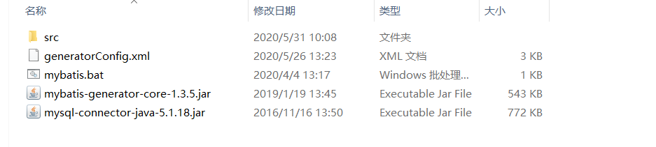

**①在SSM项目中下载逆向工程要导入的包** 
前提是SSM的一个项目该导入的包都导入了再添加一个
**mybatis-generator-core-1.3.2-bundle.zip**

**②generatorConfig.xml配置mapper的信息**

```xml
<?xml version="1.0" encoding="UTF-8"?>
<!DOCTYPE generatorConfiguration
  PUBLIC "-//mybatis.org//DTD MyBatis Generator Configuration 1.0//EN"
  "http://mybatis.org/dtd/mybatis-generator-config_1_0.dtd">

<generatorConfiguration>
	<context id="testTables" targetRuntime="MyBatis3">
		<commentGenerator>
			<!-- 是否去除自动生成的注释 true：是 ： false:否 -->
			<property name="suppressAllComments" value="true" />
		</commentGenerator>
		<!--数据库连接的信息：驱动类、连接地址、用户名、密码 -->
		<jdbcConnection driverClass="com.mysql.jdbc.Driver"
			connectionURL="jdbc:mysql://localhost:3306/mybatis" userId="root"
			password="admin">
		</jdbcConnection>
		<!-- 默认false，把JDBC DECIMAL 和 NUMERIC 类型解析为 Integer，为 true时把JDBC DECIMAL 和 
			NUMERIC 类型解析为java.math.BigDecimal -->
		<javaTypeResolver>
			<property name="forceBigDecimals" value="false" />
		</javaTypeResolver>

		<!-- targetProject:生成PO类的位置 -->
		<javaModelGenerator targetPackage="com.edu.ssm.po"
			targetProject=".\src">
			<!-- enableSubPackages:是否让schema作为包的后缀 -->
			<property name="enableSubPackages" value="false" />
			<!-- 从数据库返回的值被清理前后的空格 -->
			<property name="trimStrings" value="true" />
		</javaModelGenerator>
        <!-- targetProject:mapper映射文件生成的位置 -->
		<sqlMapGenerator targetPackage="com.edu.ssm.mapper" 
			targetProject=".\src">
			<!-- enableSubPackages:是否让schema作为包的后缀 -->
			<property name="enableSubPackages" value="false" />
		</sqlMapGenerator>
		<!-- targetPackage：mapper接口生成的位置 -->
		<javaClientGenerator type="XMLMAPPER"
			targetPackage="com.edu.ssm.mapper" 
			targetProject=".\src">
			<!-- enableSubPackages:是否让schema作为包的后缀 -->
			<property name="enableSubPackages" value="false" />
		</javaClientGenerator>
		<!-- 指定数据库表 -->
		<table tableName="items"></table>
		<table tableName="orders"></table>
		<table tableName="orderdetail"></table>
		<table tableName="user"></table>
		<!-- <table schema="" tableName="sys_user"></table>
		<table schema="" tableName="sys_role"></table>
		<table schema="" tableName="sys_permission"></table>
		<table schema="" tableName="sys_user_role"></table>
		<table schema="" tableName="sys_role_permission"></table> -->
		
		<!-- 有些表的字段需要指定java类型
		 <table schema="" tableName="">
			<columnOverride column="" javaType="" />
		</table> -->
	</context>
</generatorConfiguration>
```

**③使用java类来生成mapper文件**

```java
public void generator() throws Exception{
		List<String> warnings = new ArrayList<String>();
		boolean overwrite = true;
		File configFile = new File("WebContent/generator.xml"); 
		ConfigurationParser cp = new ConfigurationParser(warnings);
		Configuration config = cp.parseConfiguration(configFile);
		DefaultShellCallback callback = new DefaultShellCallback(overwrite);
		MyBatisGenerator myBatisGenerator = new MyBatisGenerator(config,
				callback, warnings);
		myBatisGenerator.generate(null);
	}
	public static void main(String[] args) throws Exception {
		try {
			GeneratorSqlmap generatorSqlmap = new GeneratorSqlmap();
			generatorSqlmap.generator();
		} catch (Exception e) {
			e.printStackTrace();
		}
}
```
**④、将处理的model和dao层复制到当前工作的项目中去：**

将经过处理的model和dao层中的类和配置文件，复制到当前工作开发的项目中去，这样可以快速、高效的开发项目；
Mapper.java的文件拷贝至mapper 目录内

注意：mapper.xml文件和mapper.java文件在一个目录内且文件名相同。
1.**Mapper文件内容不覆盖而是追加，但是不报错**
XXXMapper.xml文件已经存在时，如果进行重新生成则mapper.xml文件内容不被覆盖而是进行内容追加，结果导致mybatis解析失败。
解决方法：删除原来已经生成的mapper xml文件再进行生成。
Mybatis自动生成的po及mapper.java文件不是内容而是直接覆盖没有此问题。
2、**处理下自动生成的model和dao层：需要非常注意一下事项：**

model层中：
1、实体类中只有属性和set、get方法，需要自己创建空参构造方法、全参构造方法、重写toString等方法；

dao层中：

1、接口中的方法最好是全部删掉，根据自己的需要重新写自己的方法；
2、配置文件中的实体类与数据库映射的关系中javaType属性最好删掉，不然有可能会对ssm、ssh框架产生异常；配置文件中的sql最好全部删掉，根据自己的需要重新写sql语句；

做了一个小例子，生成后的目录节构如下

目录如上所示，遇到的问题，对于generator.xml配置文件的路径一定要对，表中的数据库与表名也要一一对应。
疑问：关于工程自动生成的那个Example还有点疑惑，该如何使用，在接下来的学习研究研究，模糊的知道了是关于搜查语句的where的后缀，也就是选择的筛选显示数据库中的数据，那么该如何使用就是慢慢的学习了。


## 第二不在项目里。在本地搭建一个逆向工程 目录结构如下



### generatorConfig.xml

```xml
<?xml version="1.0" encoding="UTF-8"?>
<!DOCTYPE generatorConfiguration
  PUBLIC "-//mybatis.org//DTD MyBatis Generator Configuration 1.0//EN"
  "http://mybatis.org/dtd/mybatis-generator-config_1_0.dtd">
<generatorConfiguration>
    <!--数据库驱动-->
    <classPathEntry    location="mysql-connector-java-5.1.18.jar"/>
    <context id="DB2Tables"    targetRuntime="MyBatis3">
        <commentGenerator>
            <property name="suppressDate" value="true"/>
            <property name="suppressAllComments" value="true"/>
        </commentGenerator>
        <!--数据库链接地址账号密码-->
        <jdbcConnection driverClass="com.mysql.jdbc.Driver" connectionURL="jdbc:mysql://localhost:3306/shipdata" userId="root" password="123456">
        </jdbcConnection>
        <javaTypeResolver>
            <property name="forceBigDecimals" value="false"/>
        </javaTypeResolver>
        <!--生成Model类存放位置-->
       <javaModelGenerator targetPackage="com.edu.model"
            targetProject=".\src">
            <!-- enableSubPackages:是否让schema作为包的后缀 -->
            <property name="enableSubPackages" value="false" />
            <!-- 从数据库返回的值被清理前后的空格 -->
            <property name="trimStrings" value="true" />
        </javaModelGenerator>
        <!-- targetProject:mapper映射文件生成的位置 -->
        <sqlMapGenerator targetPackage="com.edu.mapper" 
            targetProject=".\src">
            <!-- enableSubPackages:是否让schema作为包的后缀 -->
            <property name="enableSubPackages" value="false" />
        </sqlMapGenerator>
        <!-- targetPackage：mapper接口生成的位置 -->
        <javaClientGenerator type="XMLMAPPER"
            targetPackage="com.edu.mapper" 
            targetProject=".\src">
            <!-- enableSubPackages:是否让schema作为包的后缀 -->
            <property name="enableSubPackages" value="false" />
        </javaClientGenerator>
        <!-- 指定数据库表--> 
            <table tableName="ship_f_s"></table>
    </context>
</generatorConfiguration>
```

### src是存放文件的空白文件夹

### 一个数据库jar包 一个逆向工程jar包

### 新建一个文本文件 输入以下命令 然后修改后缀名为bat  

启动逆向工程直接点击  bat 文件

```shell
java -jar mybatis-generator-core-1.3.5.jar -configfile generatorConfig.xml -overwrite
```

