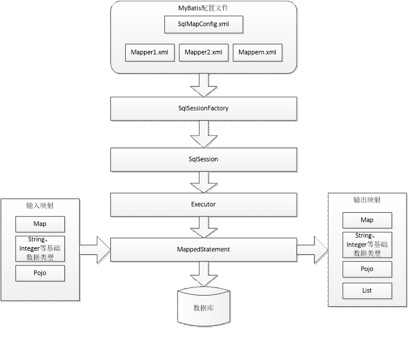
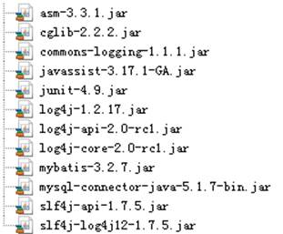

# 1   知识点

1、mybatis的介绍

2、Mybatis的入门

a)    使用jdbc操作数据库存在的问题

b)    Mybatis的架构

c)    Mybatis的入门程序

3、Dao的开发方法

a)    原始dao的开发方法

b)    动态代理方式

4、SqlMapConfig.xml文件说明

 

# 2   MyBatis介绍

MyBatis 本是apache的一个开源项目iBatis, 2010年这个项目由apache software foundation 迁移到了google code，并且改名为MyBatis 。2013年11月迁移到Github。   MyBatis是一个优秀的持久层框架，它对jdbc的操作数据库的过程进行封装，使开发者只需要关注 SQL 本身，而不需要花费精力去处理例如注册驱动、创建connection、创建statement、手动设置参数、结果集检索等jdbc繁杂的过程代码。

Mybatis通过xml或注解的方式将要执行的各种statement（statement、preparedStatement、CallableStatement）配置起来，并通过java对象和statement中的sql进行映射生成最终执行的sql语句，最后由mybatis框架执行sql并将结果映射成java对象并返回。

# 3   使用jdbc编程问题总结

1、创建一个java工程。

2、导入jar包。此时需要mysql 的数据库驱动。

## 3.3  jdbc编程步骤：

1、 加载数据库驱动

2、 创建并获取数据库链接

3、 创建jdbc statement对象

4、 设置sql语句

5、 设置sql语句中的参数(使用preparedStatement)

6、 通过statement执行sql并获取结果

7、 对sql执行结果进行解析处理

8、 释放资源(resultSet、preparedstatement、connection)

 

## 3.4  jdbc程序

```java
public static void main(String[] args) {
			Connection connection = null;
			PreparedStatement preparedStatement = null;
			ResultSet resultSet = null;
			
			try {
				//加载数据库驱动
				Class.forName("com.mysql.jdbc.Driver");
				
				//通过驱动管理类获取数据库链接
				connection =  DriverManager.getConnection("jdbc:mysql://localhost:3306/mybatis?characterEncoding=utf-8", "root", "root");
				//定义sql语句 ?表示占位符
			String sql = "select * from user where username = ?";
				//获取预处理statement
				preparedStatement = connection.prepareStatement(sql);
				//设置参数，第一个参数为sql语句中参数的序号（从1开始），第二个参数为设置的参数值
				preparedStatement.setString(1, "王五");
				//向数据库发出sql执行查询，查询出结果集
				resultSet =  preparedStatement.executeQuery();
				//遍历查询结果集
				while(resultSet.next()){
					System.out.println(resultSet.getString("id")+"  "+resultSet.getString("username"));
				}
			} catch (Exception e) {
				e.printStackTrace();
			}finally{
				//释放资源
				if(resultSet!=null){
					try {
						resultSet.close();
					} catch (SQLException e) {
						// TODO Auto-generated catch block
						e.printStackTrace();
					}
				}
				if(preparedStatement!=null){
					try {
						preparedStatement.close();
					} catch (SQLException e) {
						// TODO Auto-generated catch block
						e.printStackTrace();
					}
				}
				if(connection!=null){
					try {
						connection.close();
					} catch (SQLException e) {
						// TODO Auto-generated catch block
						e.printStackTrace();
					}
				}

			}

		}
```


上边使用jdbc的原始方法（未经封装）实现了查询数据库表记录的操作。

 

## 3.5  jdbc问题总结如下：

1、 数据库链接创建、释放频繁造成系统资源浪费从而影响系统性能，如果使用数据库链接池可解决此问题。

2、 Sql语句在代码中硬编码，造成代码不易维护，实际应用sql变化的可能较大，sql变动需要改变java代码。

3、 使用preparedStatement向占有位符号传参数存在硬编码，因为sql语句的where条件不一定，可能多也可能少，修改sql还要修改代码，系统不易维护。

4、 对结果集解析存在硬编码（查询列名），sql变化导致解析代码变化，系统不易维护，如果能将数据库记录封装成pojo对象解析比较方便。

 

 

 

# 4   Mybatis架构

 



 

> 1、 mybatis配置

SqlMapConfig.xml，此文件作为mybatis的全局配置文件，配置了mybatis的运行环境等信息。

mapper.xml文件即sql映射文件，文件中配置了操作数据库的sql语句。此文件需要在SqlMapConfig.xml中加载。

> 2、 通过mybatis环境等配置信息构造SqlSessionFactory即会话工厂

> 3、 由会话工厂创建sqlSession即会话，操作数据库需要通过sqlSession进行。

> 4、 mybatis底层自定义了Executor执行器接口操作数据库，Executor接口有两个实现，一个是基本执行器、一个是缓存执行器。

> 5、 Mapped Statement也是mybatis一个底层封装对象，它包装了mybatis配置信息及sql映射信息等。mapper.xml文件中一个sql对应一个Mapped Statement对象，sql的id即是Mapped statement的id。

> 6、 Mapped Statement对sql执行输入参数进行定义，包括HashMap、基本类型、pojo，Executor通过Mapped Statement在执行sql前将输入的java对象映射至sql中，输入参数映射就是jdbc编程中对preparedStatement设置参数。

> 7、 Mapped Statement对sql执行输出结果进行定义，包括HashMap、基本类型、pojo，Executor通过Mapped Statement在执行sql后将输出结果映射至java对象中，输出结果映射过程相当于jdbc编程中对结果的解析处理过程。

 

# 5   Mybatis入门程序

## 5.1  mybatis下载

安装Mybatis需要Jar包

## 5.2  需求

实现以下功能：

根据用户id查询一个用户信息

根据用户名称模糊查询用户信息列表

添加用户

更新用户

删除用户

 

## 5.3  工程搭建

### 5.3.1 第一步：创建java工程

使用eclipse创建java工程，jdk使用1.8.0_72。

### 5.3.2 第二步：加入jar包

加入mybatis核心包、依赖包、数据驱动包。



 

### 5.3.3 第三步：log4j.properties

在classpath下创建log4j.properties如下：

 

```properties
\# Global logging configuration

log4j.rootLogger=DEBUG, stdout

\# Console output...

log4j.appender.stdout=org.apache.log4j.ConsoleAppender

log4j.appender.stdout.layout=org.apache.log4j.PatternLayout

log4j.appender.stdout.layout.ConversionPattern=%5p [%t] - %m%n
```

mybatis默认使用log4j作为输出日志信息。


### 5.3.4 第四步：SqlMapConfig.xml

在classpath下创建SqlMapConfig.xml，如下：

```xml
<?xml version="1.0" encoding="UTF-8" ?>
<!DOCTYPE configuration
PUBLIC "-//mybatis.org//DTD Config 3.0//EN"
"http://mybatis.org/dtd/mybatis-3-config.dtd">
<configuration>
	<!-- 和spring整合后 environments配置将废除-->
	<environments default="development">
		<environment id="development">
		<!-- 使用jdbc事务管理-->
			<transactionManager type="JDBC" />
		<!-- 数据库连接池-->
			<dataSource type="POOLED">
				<property name="driver" value="com.mysql.jdbc.Driver" />
				<property name="url" value="jdbc:mysql://localhost:3306/mybatis?characterEncoding=utf-8" />
				<property name="username" value="root" />
				<property name="password" value="root" />
			</dataSource>
		</environment>
	</environments>	
</configuration>

```


SqlMapConfig.xml是mybatis核心配置文件，上边文件的配置内容为数据源、事务管理。

### 5.3.5 第五步：po类

 

Po类作为mybatis进行sql映射使用，po类通常与数据库表对应，User.java如下：

```java
Public class User {
	private int id;
	private String username;// 用户姓名
	private String sex;// 性别
	private Date birthday;// 生日
	private String address;// 地址


get/set……方法

```


### 5.3.6 第六步：sql映射文件

 

在classpath下的sqlmap目录下创建sql映射文件Users.xml：

```xml
<?xml version="1.0" encoding="UTF-8" ?>
<!DOCTYPE mapper
PUBLIC "-//mybatis.org//DTD Mapper 3.0//EN"
"http://mybatis.org/dtd/mybatis-3-mapper.dtd">
<mapper namespace="test">
</mapper>

```

 

namespace ：命名空间，用于隔离sql语句，后面会讲另一层非常重要的作用。

 

### 5.3.7 第七步：加载映射文件

mybatis框架需要加载映射文件，将Users.xml添加在SqlMapConfig.xml，如下：

```xml
<mappers>
		<mapper resource="sqlmap/User.xml"/>
</mappers>

```

 

## 5.4  根据id查询用户信息

### 5.4.1 映射文件：

在user.xml中添加：

```xml
<!-- 根据id获取用户信息 -->
	<select id="findUserById" parameterType="int" resultType="cn.itcast.mybatis.po.User">
		select * from user where id = #{id}
	</select>

```


***parameterType**：定义输入到sql中的映射类型，#{id}表示使用preparedstatement设置占位符号并将输入变量id传到sql。

**resultType**：定义结果映射类型。


### 5.4.2 测试程序：

```java
public class Mybatis_first {
	
	//会话工厂
	private SqlSessionFactory sqlSessionFactory;

	@Before
	public void createSqlSessionFactory() throws IOException {
		// 配置文件
		String resource = "SqlMapConfig.xml";
		InputStream inputStream = Resources.getResourceAsStream(resource);

		// 使用SqlSessionFactoryBuilder从xml配置文件中创建SqlSessionFactory
		sqlSessionFactory = new SqlSessionFactoryBuilder()
				.build(inputStream);

	}

	// 根据 id查询用户信息
	@Test
	public void testFindUserById() {
		// 数据库会话实例
		SqlSession sqlSession = null;
		try {
			// 创建数据库会话实例sqlSession
			sqlSession = sqlSessionFactory.openSession();
			// 查询单个记录，根据用户id查询用户信息
			User user = sqlSession.selectOne("test.findUserById", 10);
			// 输出用户信息
			System.out.println(user);
		} catch (Exception e) {
			e.printStackTrace();
		} finally {
			if (sqlSession != null) {
				sqlSession.close();
			}
		}

	}
}

```


## 5.5  根据用户名查询用户信息

### 5.5.1 映射文件：

在user.xml中添加：

```xml
	<!-- 自定义条件查询用户列表 -->
	<select id="findUserByUsername" parameterType="java.lang.String" 
			resultType="cn.itcast.mybatis.po.User">
	   select * from user where username like '%${value}%' 
	</select>

```


**parameterType**：定义输入到sql中的映射类型，${value}表示使用参数将${value}替换，做字符串的拼接。

注意：如果是取简单数量类型的参数，括号中的值必须为value

**resultType**：定义结果映射类型。


### 5.5.2 测试程序：

  ```java
// 根据用户名称模糊查询用户信息
	@Test
	public void testFindUserByUsername() {
		// 数据库会话实例
		SqlSession sqlSession = null;
		try {
			// 创建数据库会话实例sqlSession
			sqlSession = sqlSessionFactory.openSession();
			// 查询单个记录，根据用户id查询用户信息
			List<User> list = sqlSession.selectList("test.findUserByUsername", "张");
			System.out.println(list.size());
		} catch (Exception e) {
			e.printStackTrace();
		} finally {
			if (sqlSession != null) {
				sqlSession.close();
			}
		}

	}

  ```


## 5.6  小结

### 5.6.1 #{}和${}

\#{}表示一个占位符号，通过#{}可以实现preparedStatement向占位符中设置值，自动进行java类型和jdbc类型转换，#{}可以有效防止sql注入。 #{}可以接收简单类型值或pojo属性值。 如果parameterType传输单个简单类型值，#{}括号中可以是value或其它名称。

 

${}表示拼接sql串，通过${}可以将parameterType 传入的内容拼接在sql中且不进行jdbc类型转换， ${}可以接收简单类型值或pojo属性值，如果parameterType传输单个简单类型值，${}括号中只能是value。

 

 

### 5.6.2 parameterType和resultType

parameterType：指定输入参数类型，mybatis通过ognl从输入对象中获取参数值拼接在sql中。

resultType：指定输出结果类型，mybatis将sql查询结果的一行记录数据映射为resultType指定类型的对象。

 

### 5.6.3 selectOne和selectList

 

selectOne查询一条记录，如果使用selectOne查询多条记录则抛出异常：

org.apache.ibatis.exceptions.TooManyResultsException: Expected one result (or null) to be returned by selectOne(), but found: 3

  at org.apache.ibatis.session.defaults.DefaultSqlSession.selectOne(DefaultSqlSession.java:70)

 

selectList可以查询一条或多条记录。


 

## 5.7  添加用户

### 5.7.1 映射文件：


在SqlMapConfig.xml中添加：

```xml
<!-- 添加用户 -->
	<insert id="insertUser" parameterType="cn.itcast.mybatis.po.User">
	  insert into user(username,birthday,sex,address) 
	  values(#{username},#{birthday},#{sex},#{address})
	</insert>

```


### 5.7.2 测试程序：

```java
// 添加用户信息
	@Test
	public void testInsert() {
		// 数据库会话实例
		SqlSession sqlSession = null;
		try {
			// 创建数据库会话实例sqlSession
			sqlSession = sqlSessionFactory.openSession();
			// 添加用户信息
			User user = new User();
			user.setUsername("张小明");
			user.setAddress("河南郑州");
			user.setSex("1");
			user.setPrice(1999.9f);
			sqlSession.insert("test.insertUser", user);
			//提交事务
			sqlSession.commit();
		} catch (Exception e) {
			e.printStackTrace();
		} finally {
			if (sqlSession != null) {
				sqlSession.close();
			}
		}
	}

```


### 5.7.3 mysql自增主键返回

通过修改sql映射文件，可以将mysql自增主键返回：

```xml
<insert id="insertUser" parameterType="cn.itcast.mybatis.po.User">
		<!-- selectKey将主键返回，需要再返回 -->
		<selectKey keyProperty="id" order="AFTER" resultType="java.lang.Integer">
			select LAST_INSERT_ID()
		</selectKey>
	   insert into user(username,birthday,sex,address)
	    values(#{username},#{birthday},#{sex},#{address});
	</insert>

```


添加selectKey实现将主键返回

keyProperty:返回的主键存储在pojo中的哪个属性

order：selectKey的执行顺序，是相对与insert语句来说，由于mysql的自增原理执行完insert语句之后才将主键生成，所以这里selectKey的执行顺序为after

resultType:返回的主键是什么类型

LAST_INSERT_ID():是mysql的函数，返回auto_increment自增列新记录id值。

 

### 5.7.4 Mysql使用 uuid实现主键

 

需要增加通过select uuid()得到uuid值

 

```xml
<insert  id="insertUser" parameterType="cn.itcast.mybatis.po.User">
<selectKey resultType="java.lang.String" order="BEFORE" 
keyProperty="id">
select uuid()
</selectKey>
insert into user(id,username,birthday,sex,address) 
		 values(#{id},#{username},#{birthday},#{sex},#{address})
</insert>
```

注意这里使用的order是“BEFORE”


## 5.8  删除用户

### 5.8.1 映射文件：

```xml
<!-- 删除用户 -->
	<delete id="deleteUserById" parameterType="int">
		delete from user where id=#{id}
	</delete>

```

### 5.8.2 测试程序：

```java
// 根据id删除用户
	@Test
	public void testDelete() {
		// 数据库会话实例
		SqlSession sqlSession = null;
		try {
			// 创建数据库会话实例sqlSession
			sqlSession = sqlSessionFactory.openSession();
			// 删除用户
			sqlSession.delete("test.deleteUserById",18);
			// 提交事务
			sqlSession.commit();
		} catch (Exception e) {
			e.printStackTrace();
		} finally {
			if (sqlSession != null) {
				sqlSession.close();
			}
		}
	}

```

## 5.9  修改用户

### 5.9.1 映射文件

```xml
<!-- 更新用户 -->
	<update id="updateUser" parameterType="cn.itcast.mybatis.po.User">
		update user set username=#{username},birthday=#{birthday},sex=#{sex},address=#{address}
		where id=#{id}
</update>

```

### 5.9.2 测试程序

```java
// 更新用户信息
	@Test
	public void testUpdate() {
		// 数据库会话实例
		SqlSession sqlSession = null;
		try {
			// 创建数据库会话实例sqlSession
			sqlSession = sqlSessionFactory.openSession();
			// 添加用户信息
			User user = new User();
			user.setId(16);
			user.setUsername("张小明");
			user.setAddress("河南郑州");
			user.setSex("1");
			user.setPrice(1999.9f);
			sqlSession.update("test.updateUser", user);
			// 提交事务
			sqlSession.commit();

		} catch (Exception e) {
			e.printStackTrace();
		} finally {
			if (sqlSession != null) {
				sqlSession.close();
			}
		}
	}

```


## 5.10   Mybatis解决jdbc编程的问题

1、 数据库链接创建、释放频繁造成系统资源浪费从而影响系统性能，如果使用数据库链接池可解决此问题。

解决：在SqlMapConfig.xml中配置数据链接池，使用连接池管理数据库链接。

2、 Sql语句写在代码中造成代码不易维护，实际应用sql变化的可能较大，sql变动需要改变java代码。

解决：将Sql语句配置在XXXXmapper.xml文件中与java代码分离。

3、 向sql语句传参数麻烦，因为sql语句的where条件不一定，可能多也可能少，占位符需要和参数一一对应。

解决：Mybatis自动将java对象映射至sql语句，通过statement中的parameterType定义输入参数的类型。

4、 对结果集解析麻烦，sql变化导致解析代码变化，且解析前需要遍历，如果能将数据库记录封装成pojo对象解析比较方便。

解决：Mybatis自动将sql执行结果映射至java对象，通过statement中的resultType定义输出结果的类型。

 

 

## 5.11   mybatis与hibernate不同

Mybatis和hibernate不同，它不完全是一个ORM框架，因为MyBatis需要程序员自己编写Sql语句，不过mybatis可以通过XML或注解方式灵活配置要运行的sql语句，并将java对象和sql语句映射生成最终执行的sql，最后将sql执行的结果再映射生成java对象。

 

Mybatis学习门槛低，简单易学，程序员直接编写原生态sql，可严格控制sql执行性能，灵活度高，非常适合对关系数据模型要求不高的软件开发，例如互联网软件、企业运营类软件等，因为这类软件需求变化频繁，一但需求变化要求成果输出迅速。但是灵活的前提是mybatis无法做到数据库无关性，如果需要实现支持多种数据库的软件则需要自定义多套sql映射文件，工作量大。

 

Hibernate对象/关系映射能力强，数据库无关性好，对于关系模型要求高的软件（例如需求固定的定制化软件）如果用hibernate开发可以节省很多代码，提高效率。但是Hibernate的学习门槛高，要精通门槛更高，而且怎么设计O/R映射，在性能和对象模型之间如何权衡，以及怎样用好Hibernate需要具有很强的经验和能力才行。

总之，按照用户的需求在有限的资源环境下只要能做出维护性、扩展性良好的软件架构都是好架构，所以框架只有适合才是最好。 

 

 

# 6   Dao开发方法

​     使用Mybatis开发Dao，通常有两个方法，即原始Dao开发方法和Mapper接口开发方法。

 

## 6.1  需求

将下边的功能实现Dao：

根据用户id查询一个用户信息

根据用户名称模糊查询用户信息列表

添加用户信息

 

## 6.2  SqlSession的使用范围

​     SqlSession中封装了对数据库的操作，如：查询、插入、更新、删除等。

通过SqlSessionFactory创建SqlSession，而SqlSessionFactory是通过SqlSessionFactoryBuilder进行创建。

 

### 6.2.1 SqlSessionFactoryBuilder

SqlSessionFactoryBuilder用于创建SqlSessionFacoty，SqlSessionFacoty一旦创建完成就不需要SqlSessionFactoryBuilder了，因为SqlSession是通过SqlSessionFactory生产，所以可以将SqlSessionFactoryBuilder当成一个工具类使用，最佳使用范围是方法范围即方法体内局部变量。

 

### 6.2.2 SqlSessionFactory

​     SqlSessionFactory是一个接口，接口中定义了openSession的不同重载方法，SqlSessionFactory的最佳使用范围是整个应用运行期间，一旦创建后可以重复使用，通常以单例模式管理SqlSessionFactory。

 

### 6.2.3 SqlSession

​     SqlSession是一个面向用户的接口， sqlSession中定义了数据库操作方法。

​     每个线程都应该有它自己的SqlSession实例。SqlSession的实例不能共享使用，它也是线程不安全的。因此最佳的范围是请求或方法范围。绝对不能将SqlSession实例的引用放在一个类的静态字段或实例字段中。

​     打开一个 SqlSession；使用完毕就要关闭它。通常把这个关闭操作放到 finally 块中以确保每次都能执行关闭。如下：

```java
	SqlSession session = sqlSessionFactory.openSession();
	try {
 		 // do work
	} finally {
  		session.close();
	}

```


 

## 6.3  原始Dao开发方式

​     原始Dao开发方法需要程序员编写Dao接口和Dao实现类。

### 6.3.1 映射文件

```xml
<?xml version="1.0" encoding="UTF-8" ?>
<!DOCTYPE mapper
PUBLIC "-//mybatis.org//DTD Mapper 3.0//EN"
"http://mybatis.org/dtd/mybatis-3-mapper.dtd">
<mapper namespace="test">
<!-- 根据id获取用户信息 -->
	<select id="findUserById" parameterType="int" resultType="cn.itcast.mybatis.po.User">
		select * from user where id = #{id}
	</select>
<!-- 添加用户 -->
	<insert id="insertUser" parameterType="cn.itcast.mybatis.po.User">
	<selectKey keyProperty="id" order="AFTER" resultType="java.lang.Integer">
		select LAST_INSERT_ID() 
	</selectKey>
	  insert into user(username,birthday,sex,address) 
	  values(#{username},#{birthday},#{sex},#{address})
	</insert>
</mapper>

```


### 6.3.2 Dao接口

```java
Public interface UserDao {
	public User getUserById(int id) throws Exception;
	public void insertUser(User user) throws Exception;
}
```


```java
Public class UserDaoImpl implements UserDao {
	
	//注入SqlSessionFactory
	public UserDaoImpl(SqlSessionFactory sqlSessionFactory){
		this.setSqlSessionFactory(sqlSessionFactory);
	}
	
	private SqlSessionFactory sqlSessionFactory;
	@Override
	public User getUserById(int id) throws Exception {
		SqlSession session = sqlSessionFactory.openSession();
		User user = null;
		try {
			//通过sqlsession调用selectOne方法获取一条结果集
			//参数1：指定定义的statement的id,参数2：指定向statement中传递的参数
			user = session.selectOne("test.findUserById", 1);
			System.out.println(user);
						
		} finally{
			session.close();
		}
		return user;
	}
	
	@Override
	Public void insertUser(User user) throws Exception {
		SqlSession sqlSession = sqlSessionFactory.openSession();
		try {
			sqlSession.insert("insertUser", user);
			sqlSession.commit();
		} finally{
			session.close();
		}
		
	}
}
```

 

### 6.3.3 Dao测试

创建一个JUnit的测试类，对UserDao进行测试。

```java
private SqlSessionFactory sqlSessionFactory;
	
	@Before
	public void init() throws Exception {
		SqlSessionFactoryBuilder sessionFactoryBuilder = new SqlSessionFactoryBuilder();
		InputStream inputStream = Resources.getResourceAsStream("SqlMapConfig.xml");
		sqlSessionFactory = sessionFactoryBuilder.build(inputStream);
	}

	@Test
	public void testGetUserById() {
		UserDao userDao = new UserDaoImpl(sqlSessionFactory);
		User user = userDao.getUserById(22);
		System.out.println(user);
	}
}

```


 

### 6.3.4 问题

原始Dao开发中存在以下问题：

u Dao方法体存在重复代码：通过SqlSessionFactory创建SqlSession，调用SqlSession的数据库操作方法

u 调用sqlSession的数据库操作方法需要指定statement的id，这里存在硬编码，不利于开发维护。

 

## 6.4  Mapper动态代理方式 

### 6.4.1 开发规范

​     Mapper接口开发方法只需要程序员编写Mapper接口（相当于Dao接口），由Mybatis框架根据接口定义创建接口的动态代理对象，代理对象的方法体同上边Dao接口实现类方法。

Mapper接口开发需要遵循以下规范：

1、 Mapper.xml文件中的namespace与mapper接口的类路径相同。

2、  Mapper接口方法名和Mapper.xml中定义的每个statement的id相同

3、 Mapper接口方法的输入参数类型和mapper.xml中定义的每个sql 的parameterType的类型相同

4、 Mapper接口方法的输出参数类型和mapper.xml中定义的每个sql的resultType的类型相同

### 6.4.2 Mapper.xml(映射文件)

​     定义mapper映射文件UserMapper.xml（内容同Users.xml），需要修改namespace的值为 UserMapper接口路径。将UserMapper.xml放在classpath 下mapper目录 下。

```xml
<?xml version="1.0" encoding="UTF-8" ?>
<!DOCTYPE mapper
PUBLIC "-//mybatis.org//DTD Mapper 3.0//EN"
"http://mybatis.org/dtd/mybatis-3-mapper.dtd">
<mapper namespace="cn.itcast.mybatis.mapper.UserMapper">
<!-- 根据id获取用户信息 -->
	<select id="findUserById" parameterType="int" resultType="cn.itcast.mybatis.po.User">
		select * from user where id = #{id}
	</select>
<!-- 自定义条件查询用户列表 -->
	<select id="findUserByUsername" parameterType="java.lang.String" 
			resultType="cn.itcast.mybatis.po.User">
	   select * from user where username like '%${value}%' 
	</select>
<!-- 添加用户 -->
	<insert id="insertUser" parameterType="cn.itcast.mybatis.po.User">
	<selectKey keyProperty="id" order="AFTER" resultType="java.lang.Integer">
		select LAST_INSERT_ID() 
	</selectKey>
	  insert into user(username,birthday,sex,address) 
	  values(#{username},#{birthday},#{sex},#{address})
	</insert>

</mapper>

```


### 6.4.3 Mapper.java(接口文件)

```java
/**
 * 用户管理mapper
 */
Public interface UserMapper {
	//根据用户id查询用户信息
	public User findUserById(int id) throws Exception;
	//查询用户列表
	public List<User> findUserByUsername(String username) throws Exception;
	//添加用户信息
	public void insertUser(User user)throws Exception; 
}

```

接口定义有如下特点：

1、 Mapper接口方法名和Mapper.xml中定义的statement的id相同

2、 Mapper接口方法的输入参数类型和mapper.xml中定义的statement的parameterType的类型相同

3、 Mapper接口方法的输出参数类型和mapper.xml中定义的statement的resultType的类型相同


 

### 6.4.4 加载UserMapper.xml文件

修改SqlMapConfig.xml文件：

```xml
  <!-- 加载映射文件 -->
  <mappers>
    <mapper resource="mapper/UserMapper.xml"/>
  </mappers>

```


### 6.4.5 测试

 ```java
Public class UserMapperTest extends TestCase {

	private SqlSessionFactory sqlSessionFactory;
	
	protected void setUp() throws Exception {
		//mybatis配置文件
		String resource = "sqlMapConfig.xml";
		InputStream inputStream = Resources.getResourceAsStream(resource);
		//使用SqlSessionFactoryBuilder创建sessionFactory
		sqlSessionFactory = new SqlSessionFactoryBuilder().build(inputStream);
	}

	
	Public void testFindUserById() throws Exception {
		//获取session
		SqlSession session = sqlSessionFactory.openSession();
		//获取mapper接口的代理对象
		UserMapper userMapper = session.getMapper(UserMapper.class);
		//调用代理对象方法
		User user = userMapper.findUserById(1);
		System.out.println(user);
		//关闭session
		session.close();
		
	}
	@Test
	public void testFindUserByUsername() throws Exception {
		SqlSession sqlSession = sqlSessionFactory.openSession();
		UserMapper userMapper = sqlSession.getMapper(UserMapper.class);
		List<User> list = userMapper.findUserByUsername("张");
		System.out.println(list.size());

	}
Public void testInsertUser() throws Exception {
		//获取session
		SqlSession session = sqlSessionFactory.openSession();
		//获取mapper接口的代理对象
		UserMapper userMapper = session.getMapper(UserMapper.class);
		//要添加的数据
		User user = new User();
		user.setUsername("张三");
		user.setBirthday(new Date());
		user.setSex("1");
		user.setAddress("北京市");
		//通过mapper接口添加用户
		userMapper.insertUser(user);
		//提交
		session.commit();
		//关闭session
		session.close();
	}
	
}
 ```


### 6.4.6 小结

u selectOne和selectList

动态代理对象调用sqlSession.selectOne()和sqlSession.selectList()是根据mapper接口方法的返回值决定，如果返回list则调用selectList方法，如果返回单个对象则调用selectOne方法。

 

u namespace

mybatis官方推荐使用mapper代理方法开发mapper接口，程序员不用编写mapper接口实现类，使用mapper代理方法时，输入参数可以使用pojo包装对象或map对象，保证dao的通用性。

# 7   SqlMapConfig.xml配置文件

## 7.1  配置内容

SqlMapConfig.xml中配置的内容和顺序如下：

 

**properties**（属性）

settings（全局配置参数）

**typeAliases**（类型别名）

typeHandlers（类型处理器）

objectFactory（对象工厂）

plugins（插件）

environments（环境集合属性对象）

​	environment（环境子属性对象）

​		transactionManager（事务管理）

​		dataSource（数据源）

**mappers**（映射器）

 

## 7.2  properties（属性）

 

SqlMapConfig.xml可以引用java属性文件中的配置信息如下：

 

在classpath下定义db.properties文件，

```properties
jdbc.driver=com.mysql.jdbc.Driver
jdbc.url=jdbc:mysql://localhost:3306/mybatis?characterEncoding=utf-8
jdbc.username=root
jdbc.password=root
```


 

SqlMapConfig.xml引用如下：

 ```xml
<properties resource="db.properties"/>
	<environments default="development">
		<environment id="development">
			<transactionManager type="JDBC"/>
			<dataSource type="POOLED">
				<property name="driver" value="${jdbc.driver}"/>
				<property name="url" value="${jdbc.url}"/>
				<property name="username" value="${jdbc.username}"/>
				<property name="password" value="${jdbc.password}"/>
			</dataSource>
		</environment>
	</environments>
 ```


注意： MyBatis 将按照下面的顺序来加载属性：

u 在 properties 元素体内定义的属性首先被读取。

u 然后会读取properties 元素中resource或 url 加载的属性，它会覆盖已读取的同名属性。

 

## 7.3  typeAliases（类型别名）

### 7.3.1 mybatis支持别名：

| 别名       | 映射的类型 |
| ---------- | ---------- |
| _byte      | byte       |
| _long      | long       |
| _short     | short      |
| _int       | int        |
| _integer   | int        |
| _double    | double     |
| _float     | float      |
| _boolean   | boolean    |
| string     | String     |
| byte       | Byte       |
| long       | Long       |
| short      | Short      |
| int        | Integer    |
| integer    | Integer    |
| double     | Double     |
| float      | Float      |
| boolean    | Boolean    |
| date       | Date       |
| decimal    | BigDecimal |
| bigdecimal | BigDecimal |
| map        | Map        |

 

 

### 7.3.2 自定义别名：

在SqlMapConfig.xml中配置：

```xml
<typeAliases>
	<!-- 单个别名定义 -->
	<typeAlias alias="user" type="cn.itcast.mybatis.po.User"/>
	<!-- 批量别名定义，扫描整个包下的类，别名为类名（首字母大写或小写都可以） -->
	<package name="cn.itcast.mybatis.po"/>
	<package name="其它包"/>
</typeAliases>
```


 

## 7.4  mappers（映射器）

Mapper配置的几种方法：

### 7.4.1 < mapper resource=" " />

使用相对于类路径的资源

如：< mapper resource="sqlmap/User.xml" />

 

### 7.4.2 < mapper class=" " />

使用mapper接口类路径

如：< mapper class="cn.itcast.mybatis.mapper.UserMapper"/>

 

**注意：此种方法要求mapper接口名称和mapper映射文件名称相同，且放在同一个目录中。**

 

### 7.4.3 < package name=""/>

注册指定包下的所有mapper接口

如：< package name="cn.itcast.mybatis.mapper"/>

**注意：此种方法要求mapper接口名称和mapper映射文件名称相同，且放在同一个目录中。**

 

 

 

 

 