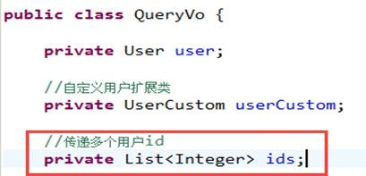
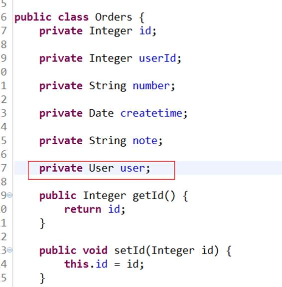
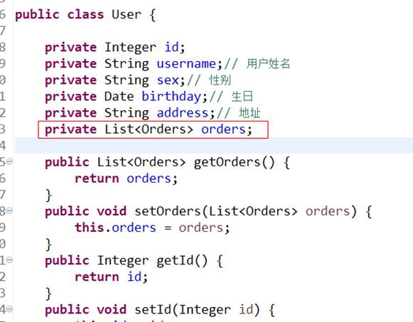
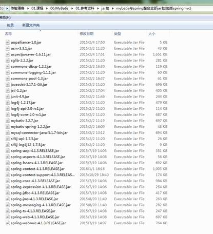
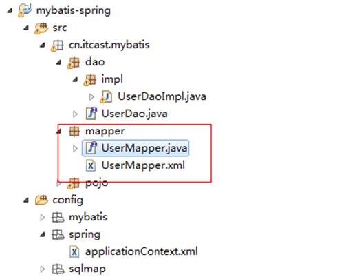

 

# 1  知识点

1、输入映射和输出映射

a)    输入参数映射

b)    返回值映射

2、动态sql

a)    If

b)    Where

c)    Foreach

d)    Sql片段

3、关联查询

a)    一对一关联

b)    一对多关联

4、Mybatis整合spring

# 2  输入映射和输出映射

Mapper.xml映射文件中定义了操作数据库的sql，每个sql是一个statement，映射文件是mybatis的核心。

## 2.1  parameterType(输入类型)

### 2.1.1  传递简单类型

参考第一天内容。

### 2.1.2  传递pojo对象

Mybatis使用ognl表达式解析对象字段的值，#{}或者${}括号中的值为pojo属性名称。

### 2.1.3  传递pojo包装对象

 

​    开发中通过pojo传递查询条件 ，查询条件是综合的查询条件，不仅包括用户查询条件还包括其它的查询条件（比如将用户购买商品信息也作为查询条件），这时可以使用包装对象传递输入参数。

Pojo类中包含pojo。

 

需求：根据用户名查询用户信息，查询条件放到QueryVo的user属性中。

 

#### 2.1.3.1QueryVo

```java
public class QueryVo {

	private User user;

	public User getUser() {
		return user;
	}

	public void setUser(User user) {
		this.user = user;
	}
}

```

#### 2.1.3.2Sql语句

> SELECT * FROM user where username like '%刘%'

#### 2.1.3.3Mapper文件

```xml
<!-- 使用包装类型查询用户 
		使用ognl从对象中取属性值，如果是包装对象可以使用.操作符来取内容部的属性
	-->
	<select id="findUserByQueryVo" parameterType="queryvo" resultType="user">
		SELECT * FROM user where username like '%${user.username}%'
	</select>

```

#### 2.1.3.4接口


#### 2.1.3.5测试方法

```java
@Test
	public void testFindUserByQueryVo() throws Exception {
		SqlSession sqlSession = sessionFactory.openSession();
		//获得mapper的代理对象
		UserMapper userMapper = sqlSession.getMapper(UserMapper.class);
		//创建QueryVo对象
		QueryVo queryVo = new QueryVo();
		//创建user对象
		User user = new User();
		user.setUsername("刘");
		queryVo.setUser(user);
		//根据queryvo查询用户
		List<User> list = userMapper.findUserByQueryVo(queryVo);
		System.out.println(list);
		sqlSession.close();
	}

```


## 2.2  resultType(输出类型)

### 2.2.1  输出简单类型

参考getnow输出日期类型，看下边的例子输出整型：

Mapper.xml文件

```xml
<!-- 获取用户列表总数 -->
	<select id="findUserCount" resultType="int">
	   select count(1) from user
	</select>
```

Mapper接口

```java
public int findUserCount() throws Exception;

```

调用：

```java
Public void testFindUserCount() throws Exception{
		//获取session
		SqlSession session = sqlSessionFactory.openSession();
		//获取mapper接口实例
		UserMapper userMapper = session.getMapper(UserMapper.class);

		//传递Hashmap对象查询用户列表
		int count = userMapper.findUserCount();
		
		//关闭session
		session.close();
	}

```

输出简单类型必须查询出来的结果集有一条记录，最终将第一个字段的值转换为输出类型。

使用session的selectOne可查询单条记录。

 

### 2.2.2  输出pojo对象

参考第一天内容

### 2.2.3  输出pojo列表

参考第一天内容。

## 2.3  resultMap

​    resultType可以指定pojo将查询结果映射为pojo，但需要pojo的属性名和sql查询的列名一致方可映射成功。

​    如果sql查询字段名和pojo的属性名不一致，可以通过resultMap将字段名和属性名作一个对应关系 ，resultMap实质上还需要将查询结果映射到pojo对象中。

​    resultMap可以实现将查询结果映射为复杂类型的pojo，比如在查询结果映射对象中包括pojo和list实现一对一查询和一对多查询。

​    

### 2.3.1  Mapper.xml定义


 

使用resultMap指定上边定义的personmap。

 

### 2.3.2  定义resultMap

由于上边的mapper.xml中sql查询列和Users.java类属性不一致，需要定义resultMap：userListResultMap将sql查询列和Users.java类属性对应起来


**< id />**：此属性表示查询结果集的唯一标识，非常重要。如果是多个字段为复合唯一约束则定义多个< id />。

**property**：表示User类的属性。

**column**：表示sql查询出来的字段名。

column和property放在一块儿表示将sql查询出来的字段映射到指定的pojo类属性上。

< result />：普通结果，即pojo的属性。

### 2.3.3  Mapper接口定义

```java
public List<User> findUserListResultMap() throws Exception;
```

# 3  动态sql

通过mybatis提供的各种标签方法实现动态拼接sql。

## 3.1  If

```xml
<!-- 传递pojo综合查询用户信息 -->
	<select id="findUserList" parameterType="user" resultType="user">
		select * from user 
		where 1=1 
		<if test="id!=null">
		and id=#{id}
		</if>
		<if test="username!=null and username!=''">
		and username like '%${username}%'
		</if>
	</select>

```

**注意要做不等于空字符串校验。**

## 3.2  Where

上边的sql也可以改为：

```xml
<select id="findUserList" parameterType="user" resultType="user">
		select * from user 
		<where>
		<if test="id!=null and id!=''">
		and id=#{id}
		</if>
		<if test="username!=null and username!=''">
		and username like '%${username}%'
		</if>
		</where>
	</select>

```

< where />可以自动处理第一个and。

## 3.3  foreach

 

向sql传递数组或List，mybatis使用foreach解析，如下：

 **需求**

传入多个id查询用户信息，用下边两个sql实现：

 

> SELECT * FROM USERS WHERE username LIKE '%张%' AND (id =10 OR id =89 OR id=16)

> SELECT * FROM USERS WHERE username LIKE '%张%' id IN (10,89,16)

 

 在pojo中定义list属性ids存储多个用户id，并添加getter/setter方法



 

 mapper.xml

```xml
<if test="ids!=null and ids.size>0">
	    	<foreach collection="ids" open=" and id in(" close=")" item="id" separator="," >
	    		#{id}
	    	</foreach>
</if>
```

测试代码：

```java
List<Integer> ids = new ArrayList<Integer>();
		ids.add(1);//查询id为1的用户
		ids.add(10); //查询id为10的用户
		queryVo.setIds(ids);
		List<User> list = userMapper.findUserList(queryVo);
```


## 3.4  Sql片段

Sql中可将重复的sql提取出来，使用时用include引用即可，最终达到sql重用的目的，如下：

```xml
<!-- 传递pojo综合查询用户信息 -->
	<select id="findUserList" parameterType="user" resultType="user">
		select * from user 
		<where>
		<if test="id!=null and id!=''">
		and id=#{id}
		</if>
		<if test="username!=null and username!=''">
		and username like '%${username}%'
		</if>
		</where>
	</select>
```


> 将where条件抽取出来：

```xml
<sql id="query_user_where">
	<if test="id!=null and id!=''">
		and id=#{id}
	</if>
	<if test="username!=null and username!=''">
		and username like '%${username}%'
	</if>
</sql>

```

> 使用include引用：

```xml
<select id="findUserList" parameterType="user" resultType="user">
		select * from user 
		<where>
		<include refid="query_user_where"/>
		</where>
	</select>
```

注意：如果引用其它mapper.xml的sql片段，则在引用时需要加上namespace，如下：

<include refid=*"*namespace.sql片段”/>

 

# 4  关联查询

 

## 4.1  商品订单数据模型


 

## 4.2  一对一查询

案例：查询所有订单信息，关联查询下单用户信息。

 

注意：因为一个订单信息只会是一个人下的订单，所以从查询订单信息出发关联查询用户信息为一对一查询。如果从用户信息出发查询用户下的订单信息则为一对多查询，因为一个用户可以下多个订单。

 

### 4.2.1  方法一：

使用resultType，定义订单信息po类，此po类中包括了订单信息和用户信息：

 

#### 4.2.1.1Sql语句：

```sql

SELECT 
  orders.*,
  user.username,
  userss.address
FROM
  orders,
  user 
WHERE orders.user_id = user.id

```

#### 4.2.1.2定义po类

Po类中应该包括上边sql查询出来的所有字段，如下：

```java
public class OrdersCustom extends Orders {

	private String username;// 用户名称
	private String address;// 用户地址
get/set。。。。


```

 

OrdersCustom类继承Orders类后OrdersCustom类包括了Orders类的所有字段，只需要定义用户的信息字段即可。

#### 4.2.1.3Mapper.xml

```xml
<!-- 查询所有订单信息 -->
	<select id="findOrdersList" resultType="cn.itcast.mybatis.po.OrdersCustom">
	SELECT
	orders.*,
	user.username,
	user.address
	FROM
	orders,	user
	WHERE orders.user_id = user.id 
	</select>

```


#### 4.2.1.4Mapper接口：

```java
public List<*OrdersCustom*> findOrdersList() throws Exception;
```

#### 4.2.1.5测试：

```java
Public void testfindOrdersList()throws Exception{
		//获取session
		SqlSession session = sqlSessionFactory.openSession();
		//获限mapper接口实例
		UserMapper userMapper = session.getMapper(UserMapper.class);
		//查询订单信息
		List<OrdersCustom> list = userMapper.findOrdersList();
		System.out.println(list);
		//关闭session
		session.close();
	}

```

#### 4.2.1.6小结：

​    定义专门的po类作为输出类型，其中定义了sql查询结果集所有的字段。此方法较为简单，企业中使用普遍。

### 4.2.2  方法二：

使用resultMap，定义专门的resultMap用于映射一对一查询结果。

#### 4.2.2.1 Sql语句：

```sql
SELECT 

 orders.*,

 user.username,

 user.address

FROM

 orders,

 user

WHERE orders.user_id = user.id
```


#### 4.2.2.2定义po类

​    在Orders类中加入User属性，user属性中用于存储关联查询的用户信息，因为订单关联查询用户是一对一关系，所以这里使用单个User对象存储关联查询的用户信息。



#### 4.2.2.3Mapper.xml

```xml
<!-- 查询订单关联用户信息使用resultmap -->
	<resultMap type="cn.itheima.po.Orders" id="orderUserResultMap">
		<id column="id" property="id"/>
		<result column="user_id" property="userId"/>
		<result column="number" property="number"/>
		<result column="createtime" property="createtime"/>
		<result column="note" property="note"/>
		<!-- 一对一关联映射 -->
		<!-- 
		property:Orders对象的user属性
		javaType：user属性对应 的类型
		 -->
		<association property="user" javaType="cn.itcast.po.User">
			<!-- column:user表的主键对应的列  property：user对象中id属性-->
			<id column="user_id" property="id"/>
			<result column="username" property="username"/>
			<result column="address" property="address"/>
		</association>
	</resultMap>
	<select id="findOrdersWithUserResultMap" resultMap="orderUserResultMap">
		SELECT
			o.id,
			o.user_id,
			o.number,
			o.createtime,
			o.note,
			u.username,
			u.address
		FROM
			orders o
		JOIN `user` u ON u.id = o.user_id
	</select>
```


这里resultMap指定orderUserResultMap*。*

 

**association**：表示进行关联查询单条记录

**property**：表示关联查询的结果存储在cn.itcast.mybatis.po.Orders的user属性中

**javaType**：表示关联查询的结果类型

**<id property=*"id"* column=*"user_id"*/>**：查询结果的user_id列对应关联对象的id属性，这里是<id />表示user_id是关联查询对象的唯一标识。

**<result property=*"username"* column=*"username"*/>**：查询结果的username列对应关联对象的username属性。

 

#### 4.2.2.4Mapper接口：

```java
public List<Orders> findOrdersListResultMap() throws Exception;
```

#### 4.2.2.5测试：

 ```java
public void testfindOrdersListResultMap()throws Exception{
		//获取session
		SqlSession session = sqlSessionFactory.openSession();
		//获限mapper接口实例
		UserMapper userMapper = session.getMapper(UserMapper.class);
		//查询订单信息
		List<Orders> list = userMapper.findOrdersList2();
		System.out.println(list);
		//关闭session
		session.close();
	}


 
 ```


#### 4.2.2.6小结：

使用association完成关联查询，将关联查询信息映射到pojo对象中。

 

## 4.3  一对多查询

 

案例：查询所有用户信息及用户关联的订单信息。

 

用户信息和订单信息为一对多关系。

 

使用resultMap实现如下：

 

### 4.3.1  Sql语句：

```sql
SELECT
	u.*, o.id oid,
	o.number,
	o.createtime,
	o.note
FROM
	`user` u
LEFT JOIN orders o ON u.id = o.user_id
```


### 4.3.2  定义po类

在User类中加入List<Orders> orders属性



 

### 4.3.3  Mapper.xml

```xml
<resultMap type="cn.itheima.po.user" id="userOrderResultMap">
		<!-- 用户信息映射 -->
		<id property="id" column="id"/>
		<result property="username" column="username"/>
		<result property="birthday" column="birthday"/>
		<result property="sex" column="sex"/>
		<result property="address" column="address"/>
		<!-- 一对多关联映射 -->
		<collection property="orders" ofType="cn.itheima.po.Orders">
			<id property="id" column="oid"/>	
		      <!--用户id已经在user对象中存在，此处可以不设置-->
			<!-- <result property="userId" column="id"/> -->
			<result property="number" column="number"/>
			<result property="createtime" column="createtime"/>
			<result property="note" column="note"/>
		</collection>
	</resultMap>
	<select id="getUserOrderList" resultMap="userOrderResultMap">
		SELECT
		u.*, o.id oid,
		o.number,
		o.createtime,
		o.note
		FROM
		`user` u
		LEFT JOIN orders o ON u.id = o.user_id
	</select>

```


collection部分定义了用户关联的订单信息。表示关联查询结果集

property=*"orders"**：*关联查询的结果集存储在User对象的上哪个属性。

ofType=*"orders"**：*指定关联查询的结果集中的对象类型即List中的对象类型。此处可以使用别名，也可以使用全限定名。

< id />及< result/>的意义同一对一查询。

### 4.3.4  Mapper接口：

```java
List<User> getUserOrderList();
```


### 4.3.5  测试

```java
	@Test
	public void getUserOrderList() {
		SqlSession session = sqlSessionFactory.openSession();
		UserMapper userMapper = session.getMapper(UserMapper.class);
		List<User> result = userMapper.getUserOrderList();
		for (User user : result) {
			System.out.println(user);
		}
		session.close();
	}

```


 

# 5  Mybatis整合spring

## 5.1  整合思路

1、SqlSessionFactory对象应该放到spring容器中作为单例存在。

2、传统dao的开发方式中，应该从spring容器中获得sqlsession对象。

3、Mapper代理形式中，应该从spring容器中直接获得mapper的代理对象。

4、数据库的连接以及数据库连接池事务管理都交给spring容器来完成。

 

## 5.2  整合需要的jar包

1、spring的jar包

2、Mybatis的jar包

3、Spring+mybatis的整合包。

4、Mysql的数据库驱动jar包。

5、数据库连接池的jar包。



 

## 5.3  整合的步骤

第一步：创建一个java工程。

第二步：导入jar包。（上面提到的jar包）

第三步：mybatis的配置文件sqlmapConfig.xml

第四步：编写Spring的配置文件

1、数据库连接及连接池

2、事务管理（暂时可以不配置）

3、sqlsessionFactory对象，配置到spring容器中

4、mapeer代理对象或者是dao实现类配置到spring容器中。

第五步：编写dao或者mapper文件

第六步：测试。

### 5.3.1  SqlMapConfig.xml

```xml
<?xml version="1.0" encoding="UTF-8" ?>
<!DOCTYPE configuration
PUBLIC "-//mybatis.org//DTD Config 3.0//EN"
"http://mybatis.org/dtd/mybatis-3-config.dtd">
<configuration>
	<typeAliases>
		<package name="cn.itcast.mybatis.pojo"/>
	</typeAliases>
	<mappers>
		<mapper resource="sqlmap/User.xml"/>
	</mappers>
</configuration>

```

### 5.3.2  applicationContext.xml

 ```xml
<?xml version="1.0" encoding="UTF-8"?>
<beans xmlns="http://www.springframework.org/schema/beans"
	xmlns:context="http://www.springframework.org/schema/context" xmlns:p="http://www.springframework.org/schema/p"
	xmlns:aop="http://www.springframework.org/schema/aop" xmlns:tx="http://www.springframework.org/schema/tx"
	xmlns:xsi="http://www.w3.org/2001/XMLSchema-instance"
	xsi:schemaLocation="http://www.springframework.org/schema/beans http://www.springframework.org/schema/beans/spring-beans-4.0.xsd
	http://www.springframework.org/schema/context http://www.springframework.org/schema/context/spring-context-4.0.xsd
	http://www.springframework.org/schema/aop http://www.springframework.org/schema/aop/spring-aop-4.0.xsd http://www.springframework.org/schema/tx http://www.springframework.org/schema/tx/spring-tx-4.0.xsd
	http://www.springframework.org/schema/util http://www.springframework.org/schema/util/spring-util-4.0.xsd">

	<!-- 加载配置文件 -->
	<context:property-placeholder location="classpath:db.properties" />
	<!-- 数据库连接池 -->
	<bean id="dataSource" class="org.apache.commons.dbcp.BasicDataSource"
		destroy-method="close">
		<property name="driverClassName" value="${jdbc.driver}" />
		<property name="url" value="${jdbc.url}" />
		<property name="username" value="${jdbc.username}" />
		<property name="password" value="${jdbc.password}" />
		<property name="maxActive" value="10" />
		<property name="maxIdle" value="5" />
	</bean>
	<!-- mapper配置 -->
	<!-- 让spring管理sqlsessionfactory 使用mybatis和spring整合包中的 -->
	<bean id="sqlSessionFactory" class="org.mybatis.spring.SqlSessionFactoryBean">
		<!-- 数据库连接池 -->
		<property name="dataSource" ref="dataSource" />
		<!-- 加载mybatis的全局配置文件 -->
		<property name="configLocation" value="classpath:mybatis/SqlMapConfig.xml" />
	</bean>

</beans>

 ```

### 5.3.3  db.properties

```properties
jdbc.driver=com.mysql.jdbc.Driver
jdbc.url=jdbc:mysql://localhost:3306/mybatis?characterEncoding=utf-8
jdbc.username=root
jdbc.password=root

```

## 5.4  Dao的开发

三种dao的实现方式：

1、传统dao的开发方式

2、使用mapper代理形式开发方式

3、使用扫描包配置mapper代理。

 

### 5.4.1  传统dao的开发方式

接口+实现类来完成。需要dao实现类需要继承SqlsessionDaoSupport类

 

#### 5.4.1.1Dao实现类

```java
public class UserDaoImpl extends SqlSessionDaoSupport implements UserDao {

	@Override
	public User findUserById(int id) throws Exception {
		SqlSession session = getSqlSession();
		User user = session.selectOne("test.findUserById", id);
		//不能关闭SqlSession，让spring容器来完成
		//session.close();
		return user;
	}

	@Override
	public void insertUser(User user) throws Exception {
		SqlSession session = getSqlSession();
		session.insert("test.insertUser", user);
		session.commit();
		//session.close();
	}

}

```


 

#### 5.4.1.2配置dao

把dao实现类配置到spring容器中

 ```xml
<!-- 配置UserDao实现类 -->
	<bean id="userDao" class="cn.itcast.dao.UserDaoImpl">
		<property name="sqlSessionFactory" ref="sqlSessionFactory"/>
	</bean>
 ```

#### 5.4.1.3测试方法

初始化:

```java
private ApplicationContext applicationContext;
@Before
public void setUp() throws Exception{
	String configLocation = "classpath:spring/ApplicationContext.xml";
	//初始化spring运行环境
	applicationContext = new ClassPathXmlApplicationContext(configLocation);
}

```


测试:

```java
@Test
public void testFindUserById() throws Exception {
	UserDao userDao = (UserDao) applicationContext.getBean("userDao");
	User user = userDao.findUserById(1);
	System.out.println(user);
}

```

### 5.4.2  Mapper代理形式开发dao

#### 5.4.2.1开发mapper接口

开发mapper文件

 



#### 5.4.2.2配置mapper代理

```xml
<!-- 配置mapper代理对象 -->
	<bean class="org.mybatis.spring.mapper.MapperFactoryBean">
		<property name="mapperInterface" value="cn.itcast.mybatis.mapper.UserMapper"/>
		<property name="sqlSessionFactory" ref="sqlSessionFactory"></property>
	</bean>

```

  

#### 5.4.2.3测试方法

```java
public class UserMapperTest {

	private ApplicationContext applicationContext;
	@Before
	public void setUp() throws Exception {
		applicationContext = new ClassPathXmlApplicationContext("classpath:spring/applicationContext.xml");
	}

	@Test
	public void testGetUserById() {
		UserMapper userMapper = applicationContext.getBean(UserMapper.class);
		User user = userMapper.getUserById(1);
		System.out.println(user);
	}

}

```


 

### 5.4.3  扫描包形式配置mapper

```xml
<!-- 使用扫描包的形式来创建mapper代理对象 -->
	<bean class="org.mybatis.spring.mapper.MapperScannerConfigurer">
		<property name="basePackage" value="cn.itcast.mybatis.mapper"></property>
	</bean>
```

每个mapper代理对象的id就是类名，首字母小写


 