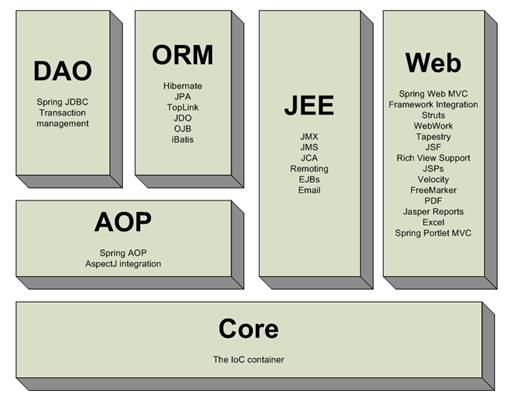
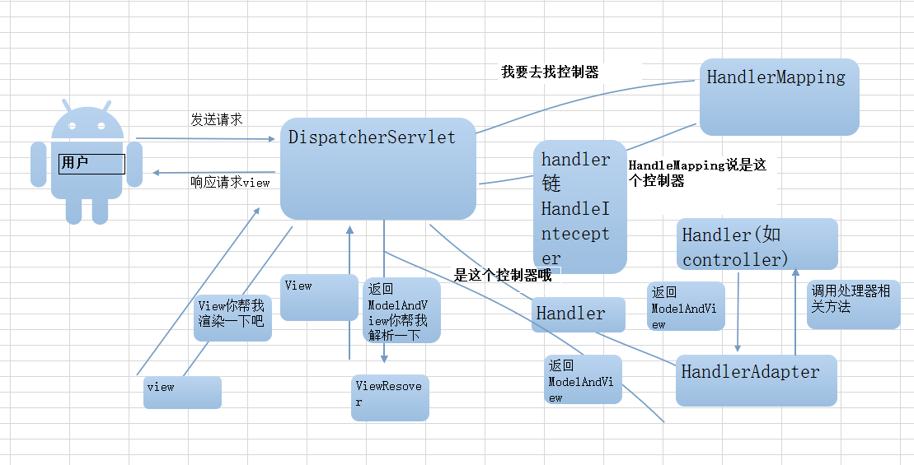
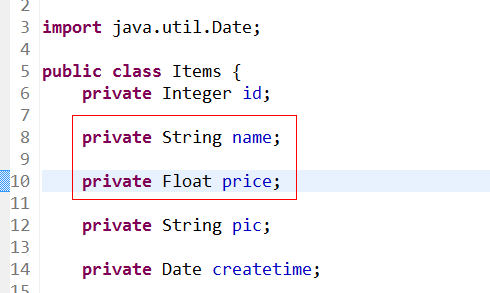

#   Spring web mvc介绍

## 1.1  Springmvc是什么？

Spring web mvc和Struts2都属于表现层的框架,它是Spring框架的一部分,我们可以从Spring的整体结构中看得出来：



 

## 2.  流程图



## 3.1  开发环境

本教程使用环境：

Jdk：jdk1.8及以上   Eclipse   Tomcat   Springmvc 

## 3.1  开发步骤

### 3.4.1 第一步：创建一个javaweb工程

### 3.1.2 第二步：导入jar包

### 3.1.3 第三步：创建itemList.jsp

### 3.4.4 第四步：创建ItemsController

ItemController是一个普通的java类，不需要实现任何接口，只需要在类上添加@Controller注解即可。@RequestMapping注解指定请求的url，其中“.action”可以加也可以不加。在ModelAndView对象中，将视图设置为“/WEB-INF/jsp/itemList.jsp"

```java
@Controller
Public class ItemController {

	@RequestMapping("/itemList")
	public ModelAndView itemList() throws Exception {
		
		List<Items>itemList = new ArrayList<>();
		
		//商品列表
		Items items_1 = new Items();
		items_1.setName("联想笔记本_3");
		items_1.setPrice(6000f);
		items_1.setDetail("ThinkPad T430 联想笔记本电脑！");
		
		Items items_2 = new Items();
		items_2.setName("苹果手机");
		items_2.setPrice(5000f);
		items_2.setDetail("iphone6苹果手机！");
		
		itemList.add(items_1);
		itemList.add(items_2);
		//创建modelandView对象
		ModelAndView modelAndView = new ModelAndView();
		//添加model
		modelAndView.addObject("itemList", itemList);
		//添加视图
		modelAndView.setViewName("/WEB-INF/jsp/itemList.jsp");
//		modelAndView.setViewName("itemsList");	
		return modelAndView;
	}

}

```

商品数据使用Items类描述，可以使用参考资料中提供的pojo类，

### 3.4.5 第五步：创建springmvc.xml

```xml
<?xml version="1.0"encoding="UTF-8"?>
<beans xmlns="http://www.springframework.org/schema/beans"
	xmlns:xsi="http://www.w3.org/2001/XMLSchema-instance"xmlns:p="http://www.springframework.org/schema/p"
	xmlns:context="http://www.springframework.org/schema/context"
	xmlns:dubbo="http://code.alibabatech.com/schema/dubbo"xmlns:mvc="http://www.springframework.org/schema/mvc"
	xsi:schemaLocation="http://www.springframework.org/schema/beans http://www.springframework.org/schema/beans/spring-beans-4.0.xsd
        http://www.springframework.org/schema/mvc http://www.springframework.org/schema/mvc/spring-mvc-4.0.xsd
        http://code.alibabatech.com/schema/dubbo http://code.alibabatech.com/schema/dubbo/dubbo.xsd
        http://www.springframework.org/schema/context http://www.springframework.org/schema/context/spring-context-4.0.xsd">

	<context:component-scan base-package="cn.itcast.springmvc.controller"/>
	
</beans>

```


 

### 3.4.6 第六步：配置前端控制器

在web.xml中添加DispatcherServlet的配置。

```xml
<!-- 前端控制器 -->
<servlet>
	<servlet-name>springmvc</servlet-name>
	<servlet-class>org.springframework.web.servlet.DispatcherServlet</servlet-class>
	<init-param>
		<param-name>contextConfigLocation</param-name>
		<param-value>classpath:springmvc.xml</param-value>
	</init-param>
</servlet>
<servlet-mapping>
```

 

# 4  Springmvc架构

## 4.1 框架流程

1、 用户发送请求至前端控制器DispatcherServlet

2、 DispatcherServlet收到请求调用HandlerMapping处理器映射器。

3、 处理器映射器根据请求url找到具体的处理器，生成处理器对象及处理器拦截器(如果有则生成)一并返回给DispatcherServlet。

4、 DispatcherServlet通过HandlerAdapter处理器适配器调用处理器

5、 执行处理器(Controller，也叫后端控制器)。

6、 Controller执行完成返回ModelAndView

7、 HandlerAdapter将controller执行结果ModelAndView返回给DispatcherServlet

8、 DispatcherServlet将ModelAndView传给ViewReslover视图解析器

9、 ViewReslover解析后返回具体View

10、DispatcherServlet对View进行渲染视图（即将模型数据填充至视图中）。

11、DispatcherServlet响应用户

## 4.3  组件说明

以下组件通常使用框架提供实现：

> DispatcherServlet：前端控制器

用户请求到达前端控制器，它就相当于mvc模式中的c，dispatcherServlet是整个流程控制的中心，由它调用其它组件处理用户的请求，dispatcherServlet的存在降低了组件之间的耦合性。

> HandlerMapping：处理器映射器

HandlerMapping负责根据用户请求找到Handler即处理器，springmvc提供了不同的映射器实现不同的映射方式，例如：配置文件方式，实现接口方式，注解方式等。

> Handler：处理器

Handler 是继DispatcherServlet前端控制器的后端控制器，在DispatcherServlet的控制下Handler对具体的用户请求进行处理。

由于Handler涉及到具体的用户业务请求，所以一般情况需要程序员根据业务需求开发Handler。

> HandlAdapter：处理器适配器

通过HandlerAdapter对处理器进行执行，这是适配器模式的应用，通过扩展适配器可以对更多类型的处理器进行执行。 

> View Resolver：视图解析器

View Resolver负责将处理结果生成View视图，View Resolver首先根据逻辑视图名解析成物理视图名即具体的页面地址，再生成View视图对象，最后对View进行渲染将处理结果通过页面展示给用户。 

> View：视图

springmvc框架提供了很多的View视图类型的支持，包括：jstlView、freemarkerView、pdfView等。我们最常用的视图就是jsp。

一般情况下需要通过页面标签或页面模版技术将模型数据通过页面展示给用户，需要由程序员根据业务需求开发具体的页面。

  说明：在springmvc的各个组件中，处理器映射器、处理器适配器、视图解析器称为springmvc的三大组件。  需要用户开放的组件有handler、view  


## 4.4  注解映射器和适配器

### 4.4.1 组件扫描器

​     使用组件扫描器省去在spring容器配置每个controller类的繁琐。使用<context:component-scan>自动扫描标记@controller的控制器类，配置如下：

```xml
<!-- 扫描controller注解,多个包中间使用半角逗号分隔 -->

  <context:component-scan base-package="cn.itcast.springmvc.controller.first"/>
```

### 4.4.2 RequestMappingHandlerMapping

​     注解式处理器映射器，对类中标记@ResquestMapping的方法进行映射，根据ResquestMapping定义的url匹配ResquestMapping标记的方法，匹配成功返回HandlerMethod对象给前端控制器，HandlerMethod对象中封装url对应的方法Method。 

​	从spring3.1版本开始，废除了DefaultAnnotationHandlerMapping的使用，推荐使用RequestMappingHandlerMapping完成注解式处理器映射。

配置如下：

```xml
<!--注解映射器 -->

 <bean class="org.springframework.web.servlet.mvc.method.annotation.RequestMappingHandlerMapping"/>
```

注解描述：

@RequestMapping：定义请求url到处理器功能方法的映射

### 4.4.3 RequestMappingHandlerAdapter

注解式处理器适配器，对标记@ResquestMapping的方法进行适配。

从spring3.1版本开始，废除了AnnotationMethodHandlerAdapter的使用，推荐使用RequestMappingHandlerAdapter完成注解式处理器适配。

配置如下：

```xml
<!--注解适配器 -->

 <bean class="org.springframework.web.servlet.mvc.method.annotation.RequestMappingHandlerAdapter"/>
```


### 4.4.4 <mvc:annotation-driven>

springmvc使用< mvc:annotation-driven>自动加载RequestMappingHandlerMapping和RequestMappingHandlerAdapter，可用在springmvc.xml配置文件中使用< mvc:annotation-driven>替代注解处理器和适配器的配置。这个就是在根据url处理查找处理器（controller）与调用处理器的时候使用的

## 4.5  视图解析器

在springmvc.xml文件配置如下：

```xml
   	<beanclass="org.springframework.web.servlet.view.InternalResourceViewResolver">
		<propertyname="viewClass"
			value="org.springframework.web.servlet.view.JstlView"/>
		<propertyname="prefix"value="/WEB-INF/jsp/"/>
		<propertyname="suffix"value=".jsp"/>
	</bean>

```

**InternalResourceViewResolver：支持JSP视图解析**

viewClass：JstlView表示JSP模板页面需要使用JSTL标签库，所以classpath中必须包含jstl的相关jar 包。此属性可以不设置，默认为JstlView。

prefix 和suffix：查找视图页面的前缀和后缀，最终视图的址为：

前缀+**逻辑视图名**+后缀，逻辑视图名需要在controller中返回ModelAndView指定，比如逻辑视图名为hello，则最终返回的jsp视图地址 “WEB-INF/jsp/hello.jsp”

# 5  整合mybatis

​     为了更好的学习 springmvc和mybatis整合开发的方法，需要将springmvc和mybatis进行整合。

整合目标：控制层采用springmvc、持久层使用mybatis实现。

## 5.1  需求

实现商品查询列表，从mysql数据库查询商品信息。

## 5.2  jar包

包括：spring（包括springmvc）、mybatis、mybatis-spring整合包、数据库驱动、第三方连接池。

参考：“mybatis与springmvc整合全部jar包”目录

## 5.3  工程搭建

### 5.3.1 整合思路

#### Dao层：

1、SqlMapConfig.xml，空文件即可。需要文件头。

2、applicationContext-dao.xml。

a)    数据库连接池

b)    SqlSessionFactory对象，需要spring和mybatis整合包下的。

c)    配置mapper文件扫描器。

#### Service

1、applicationContext-service.xml包扫描器，扫描@service注解的类。

2、applicationContext-trans.xml 配置事务。

#### 表现层：

Springmvc.xml

1、包扫描器，扫描@Controller注解的类。

2、配置注解驱动。

3、视图解析器

Web.xml

配置前端控制器。

### 5.3.2 sqlMapConfig.xml

在classpath下创建*mybatis/sqlMapConfig.xml*

```xml
<?xml version="1.0"encoding="UTF-8"?>
<!DOCTYPEconfiguration
PUBLIC"-//mybatis.org//DTD Config 3.0//EN"
"http://mybatis.org/dtd/mybatis-3-config.dtd">
<configuration>
    
</configuration>
```

 

### 5.3.3 applicationContext-dao.xml

配置数据源、配置SqlSessionFactory、mapper扫描器。

  ```xml
<?xml version="1.0" encoding="UTF-8"?>
<beans xmlns="http://www.springframework.org/schema/beans"
	xmlns:context="http://www.springframework.org/schema/context"xmlns:p="http://www.springframework.org/schema/p"
	xmlns:aop="http://www.springframework.org/schema/aop"xmlns:tx="http://www.springframework.org/schema/tx"
	xmlns:xsi="http://www.w3.org/2001/XMLSchema-instance"
	xsi:schemaLocation="http://www.springframework.org/schema/beans http://www.springframework.org/schema/beans/spring-beans-4.0.xsd
	http://www.springframework.org/schema/context http://www.springframework.org/schema/context/spring-context-4.0.xsd
	http://www.springframework.org/schema/aop http://www.springframework.org/schema/aop/spring-aop-4.0.xsd http://www.springframework.org/schema/tx http://www.springframework.org/schema/tx/spring-tx-4.0.xsd
	http://www.springframework.org/schema/util http://www.springframework.org/schema/util/spring-util-4.0.xsd">

	<!-- 加载配置文件 -->
	<context:property-placeholder location="classpath:db.properties"/>
	<!-- 数据库连接池 -->
	<bean id="dataSource"class="org.apache.commons.dbcp.BasicDataSource"
		destroy-method="close">
		<property name="driverClassName"value="${jdbc.driver}"/>
		<property name="url"value="${jdbc.url}"/>
		<property name="username"value="${jdbc.username}"/>
		<property name="password"value="${jdbc.password}"/>
		<property name="maxActive"value="10"/>
		<property name="maxIdle"value="5"/>
	</bean>
	<!-- mapper配置 -->
	<!-- 让spring管理sqlsessionfactory 使用mybatis和spring整合包中的 -->
	<bean id="sqlSessionFactory"class="org.mybatis.spring.SqlSessionFactoryBean">
		<!-- 数据库连接池 -->
		<property name="dataSource" ref="dataSource"/>
		<!-- 加载mybatis的全局配置文件 -->
		<property name="configLocation" value="classpath:mybatis/SqlMapConfig.xml"/>
	</bean>
	<!-- 配置Mapper扫描器 -->
	<bean class="org.mybatis.spring.mapper.MapperScannerConfigurer">
		<property name="basePackage"value="cn.itcast.springmvc.mapper"/>
	</bean>

</beans>

  ```

Db.properties

```properties
jdbc.driver=com.mysql.jdbc.Driver
jdbc.url=jdbc:mysql://localhost:3306/springmvc?characterEncoding=utf-8
jdbc.username=root
jdbc.password=root
```


### 5.3.4 applicationContext-service.xml

```xml
<?xmlversion="1.0"encoding="UTF-8"?>
<beans xmlns="http://www.springframework.org/schema/beans"
	xmlns:context="http://www.springframework.org/schema/context"xmlns:p="http://www.springframework.org/schema/p"
	xmlns:aop="http://www.springframework.org/schema/aop"xmlns:tx="http://www.springframework.org/schema/tx"
	xmlns:xsi="http://www.w3.org/2001/XMLSchema-instance"
	xsi:schemaLocation="http://www.springframework.org/schema/beans http://www.springframework.org/schema/beans/spring-beans-4.0.xsd
	http://www.springframework.org/schema/context http://www.springframework.org/schema/context/spring-context-4.0.xsd
	http://www.springframework.org/schema/aop http://www.springframework.org/schema/aop/spring-aop-4.0.xsd http://www.springframework.org/schema/tx http://www.springframework.org/schema/tx/spring-tx-4.0.xsd
	http://www.springframework.org/schema/util http://www.springframework.org/schema/util/spring-util-4.0.xsd">

	<context:component-scan base-package="cn.itcast.springmvc.service"/>

</beans>

```


### 5.3.5 applicationContext-transaction.xml

 ```xml
<?xml version="1.0"encoding="UTF-8"?>
<beans xmlns="http://www.springframework.org/schema/beans"
	xmlns:context="http://www.springframework.org/schema/context"xmlns:p="http://www.springframework.org/schema/p"
	xmlns:aop="http://www.springframework.org/schema/aop"xmlns:tx="http://www.springframework.org/schema/tx"
	xmlns:xsi="http://www.w3.org/2001/XMLSchema-instance"
	xsi:schemaLocation="http://www.springframework.org/schema/beans http://www.springframework.org/schema/beans/spring-beans-4.0.xsd
	http://www.springframework.org/schema/context http://www.springframework.org/schema/context/spring-context-4.0.xsd
	http://www.springframework.org/schema/aop http://www.springframework.org/schema/aop/spring-aop-4.0.xsd http://www.springframework.org/schema/tx http://www.springframework.org/schema/tx/spring-tx-4.0.xsd
	http://www.springframework.org/schema/util http://www.springframework.org/schema/util/spring-util-4.0.xsd">
	<!-- 事务管理器 -->
	<bean id="transactionManager"
		class="org.springframework.jdbc.datasource.DataSourceTransactionManager">
		<!-- 数据源 -->
		<property name="dataSource"ref="dataSource"/>
	</bean>
	<!-- 通知 -->
	<tx:advice id="txAdvice"transaction-manager="transactionManager">
		<tx:attributes>
			<!-- 传播行为 -->
			<tx:method name="save*"propagation="REQUIRED"/>
			<tx:method name="insert*"propagation="REQUIRED"/>
			<tx:method name="delete*"propagation="REQUIRED"/>
			<tx:method name="update*"propagation="REQUIRED"/>
			<tx:method name="find*"propagation="SUPPORTS"read-only="true"/>
			<tx:method name="get*"propagation="SUPPORTS"read-only="true"/>
		</tx:attributes>
	</tx:advice>
	<!-- 切面 -->
	<aop:config>
		<aop:advisor advice-ref="txAdvice"
			pointcut="execution(* cn.itcast.springmvc.service.*.*(..))"/>
	</aop:config>
</beans>

 ```


### 5.3.6 springmvc.xml

```xml
<?xml version="1.0"encoding="UTF-8"?>
<beans xmlns="http://www.springframework.org/schema/beans"
	xmlns:xsi="http://www.w3.org/2001/XMLSchema-instance"xmlns:p="http://www.springframework.org/schema/p"
	xmlns:context="http://www.springframework.org/schema/context"
	xmlns:dubbo="http://code.alibabatech.com/schema/dubbo"xmlns:mvc="http://www.springframework.org/schema/mvc"
	xsi:schemaLocation="http://www.springframework.org/schema/beans http://www.springframework.org/schema/beans/spring-beans-4.0.xsd
        http://www.springframework.org/schema/mvc http://www.springframework.org/schema/mvc/spring-mvc-4.0.xsd
        http://code.alibabatech.com/schema/dubbo http://code.alibabatech.com/schema/dubbo/dubbo.xsd
        http://www.springframework.org/schema/context http://www.springframework.org/schema/context/spring-context-4.0.xsd">

	<!-- 扫描带Controller注解的类 -->
	<context:component-scan base-package="cn.itcast.springmvc.controller"/>
	<!-- 加载注解驱动 -->
	<mvc:annotation-driven/>
	<!-- 视图解析器 -->
	<bean class="org.springframework.web.servlet.view.InternalResourceViewResolver">
		<property name="viewClass"
			value="org.springframework.web.servlet.view.JstlView"/>
		<!-- jsp前缀 -->
		<property name="prefix"value="/WEB-INF/jsp/"/>
		<!-- jsp后缀 -->
		<property name="suffix"value=".jsp"/>
	</bean>
</beans>

```


### 5.3.7 web.xml

```xml
<?xml version="1.0"encoding="UTF-8"?>
<web-app xmlns:xsi="http://www.w3.org/2001/XMLSchema-instance"
	xmlns="http://java.sun.com/xml/ns/javaee"
	xsi:schemaLocation="http://java.sun.com/xml/ns/javaee http://java.sun.com/xml/ns/javaee/web-app_2_5.xsd"
	id="WebApp_ID"version="2.5">
	<display-name>springmvc-web</display-name>
	<welcome-file-list>
		<welcome-file>index.html</welcome-file>
		<welcome-file>index.htm</welcome-file>
		<welcome-file>index.jsp</welcome-file>
		<welcome-file>default.html</welcome-file>
		<welcome-file>default.htm</welcome-file>
		<welcome-file>default.jsp</welcome-file>
	</welcome-file-list>
	<!-- 加载spring容器 -->
	<context-param>
		<param-name>contextConfigLocation</param-name>
		<param-value>classpath:spring/applicationContext-*.xml</param-value>
	</context-param>
	<listener>
		<listener-class>org.springframework.web.context.ContextLoaderListener</listener-class>
	</listener>
	
	<servlet>
		<servlet-name>springmvc</servlet-name>
		<servlet-class>org.springframework.web.servlet.DispatcherServlet</servlet-class>
		<init-param>
			<param-name>contextConfigLocation</param-name>
			<param-value>classpath:spring/springmvc.xml</param-value>
		</init-param>
	</servlet>
	<servlet-mapping>
		<servlet-name>springmvc</servlet-name>
		<url-pattern>*.action</url-pattern>
	</servlet-mapping>
</web-app>

```


## 5.4  Dao

[mybatis逆向工程。](zh-cn/后端/SSM/Mybatis/index.md)

## 5.5  Service

1、Service由spring管理

2、spring对Service进行事务控制。

### 5.5.1 ItemService接口

```java
public interface ItemService {

	List<Items> getItemsList();
}

```

### 5.5.2 ItemServiceImpl实现类

```java
@Service
public class ItemServiceImpl implements ItemService {

	@Autowired
	private ItemMapper itemMapper;
	
	@Override
	public List<Items> getItemsList() {
		List<Items>itemList = itemMapper.getItemList();
		returnitemList;
	}

}

```


## 5.6  Controller

```java
@Controller
publicclass ItemController {

	@Autowired
	private ItemService itemService;
	
	@RequestMapping("/itemList")
	public ModelAndView getItemList() {
		List<Items>list = itemService.getItemsList();
		ModelAndView modelAndView = new ModelAndView();
		modelAndView.addObject("itemList", list);
		modelAndView.setViewName("itemList");
		returnmodelAndView;
	}
}

```


# 6  参数绑定

## 6.1  绑定简单数据类型

### 6.1.1 需求

打开商品编辑页面，展示商品信息。

### 6.1.2 需求分析

编辑商品信息，需要根据商品id查询商品信息，然后展示到页面。

请求的url：/itemEdit.action

参数：id（商品id）

响应结果：商品编辑页面，展示商品详细信息。

 

### 6.1.3 Service

```java
@Override
	public Items getItemById(intid) {
		Items items = itemMapper.getItemById(id);
		returnitems;
	}

```

### 6.1.4 Controller参数绑定

```java
@RequestMapping("/itemEdit")
	publicModelAndView itemEdit(HttpServletRequest request) {
		//从Request中取id
		String strId = request.getParameter("id");
		Integer id = null;
		//如果id有值则转换成int类型
		if (strId != null&& !"".equals(strId)) {
			id = newInteger(strId);
		} else {
			//出错
			returnnull;
		}
		Items items = itemService.getItemById(id);
		//创建ModelAndView
		ModelAndView modelAndView = new ModelAndView();
		//向jsp传递数据
		modelAndView.addObject("item", items);
		//设置跳转的jsp页面
		modelAndView.setViewName("editItem");
		returnmodelAndView;
	}

```


### 6.1.5 默认支持的参数类型

处理器形参中添加如下类型的参数处理适配器会默认识别并进行赋值。

#### 6.1.5.1HttpServletRequest

通过request对象获取请求信息

#### 6.1.5.2HttpServletResponse

通过response处理响应信息

#### 6.1.5.3HttpSession

通过session对象得到session中存放的对象

#### 6.1.5.4Model/ModelMap

ModelMap是Model接口的实现类，通过Model或ModelMap向页面传递数据，如下：

//调用service查询商品信息

```java
Items item = itemService.findItemById(id);
model.addAttribute("item", item);
```


页面通过${item.XXXX}获取item对象的属性值。

使用Model和ModelMap的效果一样，如果直接使用Model，springmvc会实例化ModelMap。

> 如果使用Model则可以不使用ModelAndView对象，Model对象可以向页面传递数据，View对象则可以使用String返回值替代。不管是Model还是ModelAndView，其本质都是使用Request对象向jsp传递数据。  

如果使用Model则方法可以改造成：

```java
@RequestMapping("/itemEdit")
	publicString itemEdit(HttpServletRequest request, Model model) {
		//从Request中取id
		String strId = request.getParameter("id");
		Integer id = null;
		//如果id有值则转换成int类型
		if (strId != null&& !"".equals(strId)) {
			id = newInteger(strId);
		} else {
			//出错
			returnnull;
		}
		Items items = itemService.getItemById(id);
		//创建ModelAndView
		//ModelAndView modelAndView = new ModelAndView();
		//向jsp传递数据
		//modelAndView.addObject("item", items);
		model.addAttribute("item", items);
		//设置跳转的jsp页面
		//modelAndView.setViewName("editItem");
		//return modelAndView;
		return"editItem";
	}

```

### 6.1.6 绑定简单类型

当请求的参数名称和处理器形参**名称一致**时会将请求参数与形参进行绑定。从Request取参数的方法可以进一步简化。

```java
@RequestMapping("/itemEdit")
	public String itemEdit(Integer id, Model model) {
		Items items = itemService.getItemById(id);
		//向jsp传递数据
		model.addAttribute("item", items);
		//设置跳转的jsp页面
		return"editItem";
	}

```

#### 6.1.6.1支持的数据类型

参数类型推荐使用包装数据类型，因为基础数据类型不可以为null

整形：Integer、int

字符串：String

单精度：Float、float

双精度：Double、double

布尔型：Boolean、boolean

说明：对于布尔类型的参数，请求的参数值为true或false。

处理器方法：

```java
public String editItem(Model model,Integer id,Boolean status) throws Exception(){
    
}
```

请求url：

http://localhost:8080/xxx.action?id=2&status=false

#### 6.1.6.2@RequestParam

使用@RequestParam常用于处理简单类型的绑定。

 

value：参数名字，即入参的请求参数名字，如value=“item_id”表示请求的参数区中的名字为item_id的参数的值将传入；

required：是否必须，默认是true，表示请求中一定要有相应的参数，否则将报；

<span style="color:red">TTP Status 400 - Required Integer parameter 'XXXX' is not present</span>

**defaultValue：默认值，表示如果请求中没有同名参数时的默认值**

定义如下：

```java
public String editItem(@RequestParam(value="item_id",required=true) String id) {
	
}

```


形参名称为id，但是这里使用value="item_id"限定请求的参数名为item_id，所以页面传递参数的名必须为item_id。

注意：如果请求参数中没有item_id将跑出异常：

<span style="color:red">HTTP Status 500 - Required Integer parameter 'item_id' is not present</span>

这里通过**required=true**限定item_id参数为必需传递，如果不传递则报400错误，可以使用defaultvalue设置默认值，即使required=true也可以不传item_id参数值

 

## 6.2  绑定pojo类型

 

### 6.2.1 需求

将页面修改后的商品信息保存到数据库中。

### 6.2.2 需求分析

请求的url：/updateitem.action

参数：表单中的数据。

响应内容：更新成功页面

### 6.2.3 使用pojo接收表单数据

如果提交的参数很多，或者提交的表单中的内容很多的时候可以使用pojo接收数据。要求pojo对象中的属性名和表单中input的name属性一致。

页面定义如下;

```html
<input type="text" name="name"/>

<input type="text" name="price"/>
```

Pojo定义：



请求的参数名称和pojo的属性名称一致，会自动将请求参数赋值给pojo的属性。

```java
@RequestMapping("/updateitem")
	public String updateItem(Items items) {
		itemService.updateItem(items);
		return"success";
	}

```

 

> 注意：提交的表单中不要有日期类型的数据，否则会报400错误。如果想提交日期类型的数据需要用到后面的自定义参数绑定的内容。  

 

### 6.2.4 解决post乱码问题

在web.xml中加入：过滤器

```xml
<filter>
		<filter-name>CharacterEncodingFilter</filter-name>
		<filter-class>org.springframework.web.filter.CharacterEncodingFilter</filter-class>
		<init-param>
			<param-name>encoding</param-name>
			<param-value>utf-8</param-value>
		</init-param>
	</filter>
	<filter-mapping>
		<filter-name>CharacterEncodingFilter</filter-name>
		<url-pattern>/*</url-pattern>
	</filter-mapping>

```


以上可以解决post请求乱码问题。

对于get请求中文参数出现乱码解决方法有两个：

修改tomcat配置文件添加编码与工程编码一致，如下：

```xml
<Connector URIEncoding="utf-8" connectionTimeout="20000" port="8080" protocol="HTTP/1.1" redirectPort="8443"/>
```

另外一种方法对参数进行重新编码：

```java
String userName new 

String(request.getParamter("userName").getBytes("ISO8859-1"),"utf-8")
```

ISO8859-1是tomcat默认编码，需要将tomcat编码后的内容按utf-8编码

 

## 6.3  绑定包装pojo

### 6.3.1 需求

使用包装的pojo接收商品信息的查询条件。

 

### 6.3.2 需求分析

包装对象定义如下：

```java
public class QueryVo {
		private Items items;
}

```


页面定义：

```html
<input type="text" name="items.name" />

<input type="text" name="items.price"/>
```

Controller方法定义如下：

 ```java
public String useraddsubmit(Model model,QueryVoqueryVo) throws Exception{
    System.out.println(queryVo.getItems());
}

 ```

### 6.3.3 接收查询条件

```java
@RequestMapping("/queryitem")
	public String queryItem(QueryVo queryVo) {
		System.out.println(queryVo.getItems().getName());
		System.out.println(queryVo.getItems().getPrice());
		return null;
	}

```


 

## 6.4  自定义参数绑定

### 6.4.1 需求

在商品修改页面可以修改商品的生产日期，并且根据业务需求自定义日期格式。

### 6.4.2 需求分析

​     由于日期数据有很多种格式，所以springmvc没办法把字符串转换成日期类型。所以需要自定义参数绑定。前端控制器接收到请求后，找到注解形式的处理器适配器，对RequestMapping标记的方法进行适配，并对方法中的形参进行参数绑定。在springmvc这可以在处理器适配器上自定义Converter进行参数绑定。如果使用 < mvc:annotation-driven/>可以在此标签上进行扩展。

 

### 6.4.3 自定义Converter  

日期格式转换

  ```java
public  class DateConverter implements Converter<String, Date> {

	@Override
	public Date convert(String source) {
		SimpleDateFormat simpleDateFormat = new SimpleDateFormat("yyyy-MM-dd HH:mm:ss");
		try {
			return simpleDateFormat.parse(source);
		} catch (ParseException e) {
			e.printStackTrace();
		}
		return null;
	}
}

  ```


 

### 6.4.4 配置Converter

```xml
	<!-- 加载注解驱动 -->
	<mvc:annotation-drivenconversion-service="conversionService"/>
	<!-- 转换器配置 -->
	<bean id="conversionService"
		class="org.springframework.format.support.FormattingConversionServiceFactoryBean">
		<property name="converters">
			<set>
				<bean class="cn.itcast.springmvc.convert.DateConverter"/>
			</set>
		</property>
	</bean>

```

# 7  springmvc与struts2不同

1、 springmvc的入口是一个servlet即前端控制器，而struts2入口是一个filter过虑器。

**2、** **springmvc**是基于方法开发(一个url对应一个方法)，请求参数传递到方法的形参，可以设计为单例或多例(**建议单例)**，struts2是基于类开发，传递参数是通过类的属性，只能设计为多例。

3、 Struts采用值栈存储请求和响应的数据，通过OGNL存取数据， springmvc通过参数解析器是将request请求内容解析，并给方法形参赋值，将数据和视图封装成ModelAndView对象，最后又将ModelAndView中的模型数据通过reques域传输到页面。Jsp视图解析器默认使用jstl。

 