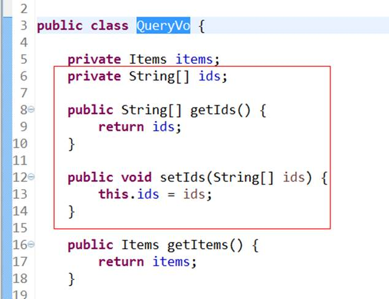
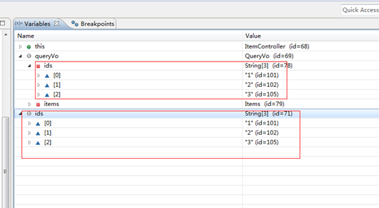
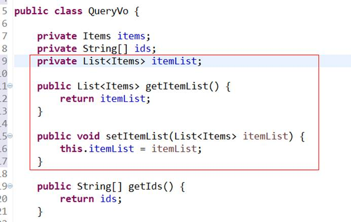
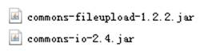
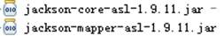
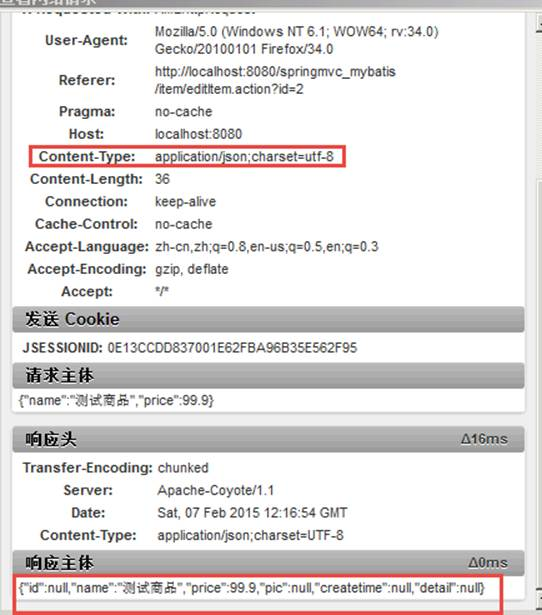
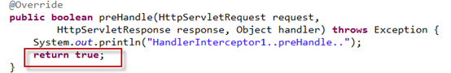

# 1.知识点

1、高级参数绑定

a)    数组类型的参数绑定

b)    List类型的绑定

2、@RequestMapping注解的使用

3、Controller方法返回值

4、Springmvc中异常处理

5、图片上传处理

6、Json数据交互

7、Springmvc实现Restful

8、拦截器

 

# 2  高级参数绑定

## 2.1  绑定数组

### 2.1.1 需求

在商品列表页面选中多个商品，然后删除。

### 2.1.2 需求分析

此功能要求商品列表页面中的每个商品前有一个checkbook，选中多个商品后点击删除按钮把商品id传递给Controller，根据商品id删除商品信息。

### 2.1.3 Jsp中实现：

```jsp
<c:forEach items="${itemList }" var="item">
<tr>
	<td><input name="ids" value="${item.id}" type="checkbox"></td>
	<td>${item.name }</td>
	<td>${item.price }</td>
	<td><fmt:formatDate value="${item.createtime}" pattern="yyyy-MM-dd HH:mm:ss"/></td>
	<td>${item.detail }</td>
	<td><a href="${pageContext.request.contextPath }/itemEdit.action?id=${item.id}">修改</a></td>
</tr>
</c:forEach>
```


生成html代码如下：

页面选中多个checkbox向controller方法传递

```html
<table width="100%" border=1>
<tr>
	<td>商品名称</td>
	<td>商品价格</td>
	<td>生产日期</td>
	<td>商品描述</td>
	<td>操作</td>
</tr>
<tr>
	<td><input name="ids" value="1" type="checkbox"></td>
	<td>台式机</td>
	<td>3000.0</td>
	<td>2016-02-03 13:22:53</td>
	<td></td>
	<td><a href="/springmvc-web/itemEdit.action?id=1">修改</a></td>
</tr>
<tr>
	<td><input name="ids" value="2" type="checkbox"></td>
	<td>笔记本</td>
	<td>6000.0</td>
	<td>2015-02-09 13:22:57</td>
	<td></td>
	<td><a href="/springmvc-web/itemEdit.action?id=2">修改</a></td>
</tr>
<tr>
	<td><input name="ids" value="3" type="checkbox"></td>
	<td>背包</td>
	<td>200.0</td>
	<td>2015-02-06 13:23:02</td>
	<td></td>
	<td><a href="/springmvc-web/itemEdit.action?id=3">修改</a></td>
</tr>
</table>

```

 

### 2.1.4 Controller

Controller方法中可以用String[]接收，或者pojo的String[]属性接收。两种方式任选其一即可。

定义如下：

```java
@RequestMapping("/queryitem")
	public String queryItem(QueryVo queryVo, String[] ids) {
		System.out.println(queryVo.getItems().getName());
		System.out.println(queryVo.getItems().getPrice());
		System.out.println(ids.toString());
		return null;
	}

```

或者：



查看结果：



## 2.2  将表单的数据绑定到List

### 2.2.1 需求

实现商品数据的批量修改。

### 2.2.2 需求分析

要想实现商品数据的批量修改，需要在商品列表中可以对商品信息进行修改，并且可以批量提交修改后的商品数据。

 

### 2.2.3 接收商品列表的pojo

List中存放对象，并将定义的List放在包装类中，使用包装pojo对象接收。



### 2.2.4 Jsp改造

页面定义如下：

```jsp
<tr>
<td>
<input type="text" name=" itemsList[0].id" value="${item.id}"/>
</td>
<td>
<input type="text" name=" itemsList[0].name" value="${item.name }"/>
</td>
<td>
<input type="text" name=" itemsList[0].price" value="${item.price}"/>
</td>
</tr>
<tr>
<td>
<input type="text" name=" itemsList[1].id" value="${item.id}"/>
</td>
<td>
<input type="text" name=" itemsList[1].name" value="${item.name }"/>
</td>
<td>
<input type="text" name=" itemsList[1].price" value="${item.price}"/>
</td>
</tr>


```


 

Name属性必须是包装pojo的list属性+下标+元素属性。Jsp做如下改造：

```jsp
<c:forEach items="${itemList }" var="item">
<tr>
	<td><input name="ids" value="${item.id}" type="checkbox"></td>
	<td>
		<input name="id" value="${item.id}" type="hidden">
		<input name="name" value="${item.name }" type="text">
	</td>
	<td><input name="name" value="${item.price }" type="text"></td>
	<td><input name="name" value="<fmt:formatDate value="${item.createtime}" pattern="yyyy-MM-dd HH:mm:ss"/>" type="text"></td>
	<td><input name="name" value="${item.detail }" type="text"></td>
	<td><a href="${pageContext.request.contextPath }/itemEdit.action?id=${item.id}">修改</a></td>
</tr>
</c:forEach>
```


 

varStatus属性常用参数总结下：

> ${status.index}   输出行号，从0开始。
>
> ${status.count}   输出行号，从1开始。
>
> ${status.current}  当前这次迭代的（集合中的）项
>
> ${status.first}  判断当前项是否为集合中的第一项，返回值为true或false
>
> ${status.last}  判断当前项是否为集合中的最后一项，返回值为true或false
>
> begin、end、step分别表示：起始序号，结束序号，跳跃步伐。


### 2.2.5 Contrller

```java
@RequestMapping("/queryitem")
	public String queryItem(QueryVo queryVo, String[] ids) {
		System.out.println(queryVo.getItems().getName());
		System.out.println(queryVo.getItems().getPrice());
		System.out.println(ids.toString());
		return null;
	}

```

注意：接收List类型的数据必须是pojo的属性，方法的形参为List类型无法正确接收到数据。

# 3  @RequestMapping

 

通过RequestMapping注解可以定义不同的处理器映射规则。

## 3.1  URL路径映射

@RequestMapping(value="/item")或@RequestMapping("/item）

value的值是数组，可以将多个url映射到同一个方法

 

## 3.2  窄化请求映射

在class上添加@RequestMapping(url)指定通用请求前缀， 限制此类下的所有方法请求url必须以请求前缀开头，通过此方法对url进行分类管理。

 

如下：

@RequestMapping放在类名上边，设置请求前缀

```java
@Controller
@RequestMapping("/item")
```

方法名上边设置请求映射url：

@RequestMapping放在方法名上边，如下：

```java
@RequestMapping("/queryItem ")
```

访问地址为：/item/queryItem

## 3.3  请求方法限定 

 **限定GET方法**

> @RequestMapping(method = RequestMethod.*GET*)

如果通过Post访问则报错：

<span style="color:red">HTTP Status 405 - Request method 'POST' not supported</span>

例如：

@RequestMapping(value="/editItem",method=RequestMethod.GET)

**限定POST方法**

> @RequestMapping(method = RequestMethod.*POST*)

如果通过Post访问则报错：

<span style="color:red">HTTP Status 405 - Request method 'GET' not supported</span>

**GET和POST都可以**

```java
@RequestMapping(method={RequestMethod.GET,RequestMethod.POST})
```

 

# 4  controller方法返回值

## 4.1  返回ModelAndView

controller方法中定义ModelAndView对象并返回，对象中可添加model数据、指定view。

## 4.2  返回void

​     在controller方法形参上可以定义request和response，使用request或response指定响应结果：

1、使用request转向页面，如下：

request.getRequestDispatcher("页面路径").forward(request, response);

2、也可以通过response页面重定向：

```java
response.sendRedirect("url")
```

3、也可以通过response指定响应结果，例如响应json数据如下：

```java
response.setCharacterEncoding("utf-8");
response.setContentType("application/json;charset=utf-8");
response.getWriter().write("json串");
```

## 4.3  返回字符串

### 4.3.1 逻辑视图名

controller方法返回字符串可以指定逻辑视图名，通过视图解析器解析为物理视图地址。

```java
//指定逻辑视图名，经过视图解析器解析为jsp物理路径：/WEB-INF/jsp/item/editItem.jsp
return "item/editItem";
```

### 4.3.2 Redirect重定向

Contrller方法返回结果重定向到一个url地址，如下商品修改提交后重定向到商品查询方法，参数无法带到商品查询方法中。

```java
//重定向到queryItem.action地址,request无法带过去
return "redirect:queryItem.action";

```

redirect方式相当于“response.sendRedirect()”，转发后浏览器的地址栏变为转发后的地址，因为转发即执行了一个新的request和response。

由于新发起一个request原来的参数在转发时就不能传递到下一个url，如果要传参数可以/item/queryItem.action后边加参数，如下：

/item/queryItem?...&…..


### 4.3.3 forward转发

controller方法执行后继续执行另一个controller方法，如下商品修改提交后转向到商品修改页面，修改商品的id参数可以带到商品修改方法中。

```java
//结果转发到editItem.action，request可以带过去
return "forward:editItem.action";
```

forward方式相当于“request.getRequestDispatcher().forward(request,response)”，转发后浏览器地址栏还是原来的地址。转发并没有执行新的request和response，而是和转发前的请求共用一个request和response。所以转发前请求的参数在转发后仍然可以读取到。

# 5  异常处理器

 

​     springmvc在处理请求过程中出现异常信息交由异常处理器进行处理，自定义异常处理器可以实现一个系统的异常处理逻辑。

​     

## 5.1  异常处理思路

​     系统中异常包括两类：预期异常和运行时异常RuntimeException，前者通过捕获异常从而获取异常信息，后者主要通过规范代码开发、测试通过手段减少运行时异常的发生。

​     系统的dao、service、controller出现都通过throws Exception向上抛出，最后由springmvc前端控制器交由异常处理器进行异常处理

## 5.2  自定义异常类

​     为了区别不同的异常通常根据异常类型自定义异常类，这里我们创建一个自定义系统异常，如果controller、service、dao抛出此类异常说明是系统预期处理的异常信息。

```java
public class CustomException extends Exception {

	/** serialVersionUID*/
	private static final long serialVersionUID = -5212079010855161498L;
	
	public CustomException(String message){
		super(message);
		this.message = message;
	}

	//异常信息
	private String message;

	public String getMessage() {
		return message;
	}

	public void setMessage(String message) {
		this.message = message;
	}
}

```

 

## 5.3  自定义异常处理器

```java
public class CustomExceptionResolver implements HandlerExceptionResolver {

	@Override
	public ModelAndView resolveException(HttpServletRequest request,
			HttpServletResponse response, Object handler, Exception ex) {

		ex.printStackTrace();

		CustomException customException = null;
		
		//如果抛出的是系统自定义异常则直接转换
		if(ex instanceof CustomException){
			customException = (CustomException)ex;
		}else{
			//如果抛出的不是系统自定义异常则重新构造一个系统错误异常。
			customException = new CustomException("系统错误，请与系统管理 员联系！");
		}
		
		ModelAndView modelAndView = new ModelAndView();
		modelAndView.addObject("message", customException.getMessage());
		modelAndView.setViewName("error");

		return modelAndView;
	}

}

```


## 5.4  错误页面

```jsp
<%@ page language="java" contentType="text/html; charset=UTF-8"
    pageEncoding="UTF-8"%>
<%@ taglib uri="http://java.sun.com/jsp/jstl/core" prefix="c" %>
<%@ taglib uri="http://java.sun.com/jsp/jstl/fmt"  prefix="fmt"%> 
<!DOCTYPE html PUBLIC "-//W3C//DTD HTML 4.01 Transitional//EN" "http://www.w3.org/TR/html4/loose.dtd">
<html>
<head>
<meta http-equiv="Content-Type" content="text/html; charset=UTF-8">
<title>错误页面</title>

</head>
<body>
您的操作出现错误如下：<br/>
${message }
</body>

</html>

```

## 5.5  异常处理器配置

在springmvc.xml中添加：

```xml
<!-- 异常处理器 -->
	<bean id="handlerExceptionResolver" class="cn.itcast.ssm.controller.exceptionResolver.CustomExceptionResolver"/>

```

## 5.6  异常测试

修改商品信息，id输入错误提示商品信息不存在。

 

修改controller方法“editItem”，调用service查询商品信息，如果商品信息为空则抛出异常：

```java
// 调用service查询商品信息
		Items item = itemService.findItemById(id);
		
		if(item == null){
			throw new CustomException("商品信息不存在!");
		}
```

在service中抛出异常方法同上。

 

# 6  上传图片

## 6.1  配置虚拟目录 

在tomcat上配置图片虚拟目录，在tomcat下conf/server.xml中添加：

```xml
<Context docBase="F:\develop\upload\temp" path="/pic" reloadable="false"/>
```

访问http://localhost:8080/pic即可访问F:\develop\upload\temp下的图片。

## 6.2  jar包

*CommonsMultipartResolver*解析器依赖commons-fileupload和commons-io，加入如下jar包：



## 6.3  配置解析器

```xml
<!-- 文件上传 -->
	<bean id="multipartResolver"
		class="org.springframework.web.multipart.commons.CommonsMultipartResolver">
		<!-- 设置上传文件的最大尺寸为5MB -->
		<property name="maxUploadSize">
			<value>5242880</value>
		</property>
	</bean>
```


## 6.4  图片上传

 controller：

```java
//商品修改提交
	@RequestMapping("/editItemSubmit")
	public String editItemSubmit(Items items, MultipartFile pictureFile)throws Exception{
		
		//原始文件名称
		String pictureFile_name =  pictureFile.getOriginalFilename();
		//新文件名称
		String newFileName = UUID.randomUUID().toString()+pictureFile_name.substring(pictureFile_name.lastIndexOf("."));
		
		//上传图片
		File uploadPic = new java.io.File("F:/develop/upload/temp/"+newFileName);
		
		if(!uploadPic.exists()){
			uploadPic.mkdirs();
		}
		//向磁盘写文件
		pictureFile.transferTo(uploadPic);
 .....
```


 页面：

form添加enctype="multipart/form-data"：

```jsp
<form id="itemForm"
action="${pageContext.request.contextPath }/item/editItemSubmit.action"
		method="post" enctype="multipart/form-data">
		<input type="hidden" name="pic" value="${item.pic }" />


```

file的name与controller形参一致：

```jsp
<tr>
	<td>商品图片</td>
	<td><c:if test="${item.pic !=null}">
			
			<br />
		</c:if> <input type="file" name="pictureFile" /></td>
</tr>

```

 

# 7  json数据交互

## 7.1  @RequestBody

作用：

@RequestBody注解用于读取http请求的内容(字符串)，通过springmvc提供的HttpMessageConverter接口将读到的内容转换为json、xml等格式的数据并绑定到controller方法的参数上。

List.action?id=1&name=zhangsan&age=12

 

本例子应用：

@RequestBody注解实现接收http请求的json数据，将json数据转换为java对象

 

## 7.2  @ResponseBody

作用：

该注解用于将Controller的方法返回的对象，通过HttpMessageConverter接口转换为指定格式的数据如：json,xml等，通过Response响应给客户端

 

本例子应用：

@ResponseBody注解实现将controller方法返回对象转换为json响应给客户端

 

## 7.3  请求json，响应json实现：

### 7.3.1 环境准备

Springmvc默认用MappingJacksonHttpMessageConverter对json数据进行转换，需要加入jackson的包，如下：



### 7.3.2 配置json转换器

在注解适配器中加入messageConverters

```xml
<!--注解适配器 -->
	<bean class="org.springframework.web.servlet.mvc.method.annotation.RequestMappingHandlerAdapter">
		<property name="messageConverters">
		<list>
		<bean class="org.springframework.http.converter.json.MappingJacksonHttpMessageConverter"></bean>
		</list>
		</property>
	</bean>

```


**注意：如果使用<mvc:annotation-driven />** **则不用定义上边的内容。**

 

### 7.3.3 controller编写

```java
// 商品修改提交json信息，响应json信息
	@RequestMapping("/editItemSubmit_RequestJson")
	public @ResponseBody Items editItemSubmit_RequestJson(@RequestBody Items items) throws Exception {
		System.out.println(items);
		//itemService.saveItem(items);
		return items;

	}

```


### 7.3.4 页面js方法编写：

引入 js：

```html

<script type="text/javascript"

src="${pageContext.request.contextPath }/js/jquery-1.4.4.min.js"></script>
```

 ```js
//请求json响应json
	function request_json(){
		$.ajax({
			type:"post",
			url:"${pageContext.request.contextPath }/item/editItemSubmit_RequestJson.action",
			contentType:"application/json;charset=utf-8",
			data:'{"name":"测试商品","price":99.9}',
			success:function(data){
				alert(data);
			}
		});
	}

 ```


### 7.3.5 测试结果：

 



从上图可以看出请求的数据是json格式


 

# 8  RESTful支持

## 8.1  什么是restful？

Restful就是一个资源定位及资源操作的风格。不是标准也不是协议，只是一种风格，是对http协议的诠释。

资源定位：互联网所有的事物都是资源，要求url中没有动词，只有名词。没有参数

Url格式：http://blog.csdn.net/beat_the_world/article/details/45621673

资源操作：使用**put**、**delete**、**post**、**get**，使用不同方法对资源进行操作。分别对应添加、删除、修改、查询。一般使用时还是post和get。Put和Delete几乎不使用。

## 8.2  需求

RESTful方式实现商品信息查询，返回json数据

 

## 8.3  添加DispatcherServlet的rest配置

```xml
<servlet>
		<servlet-name>springmvc-servlet-rest</servlet-name>
		<servlet-class>org.springframework.web.servlet.DispatcherServlet</servlet-class>
		<init-param>
			<param-name>contextConfigLocation</param-name>
			<param-value>classpath:spring/springmvc.xml</param-value>
		</init-param>
	</servlet>
	<servlet-mapping>
		<servlet-name>springmvc-servlet-rest</servlet-name>
		<url-pattern>/</url-pattern>
	</servlet-mapping>

```


## 8.4  URL 模板模式映射

@RequestMapping(value="/ viewItems/{id}")：{×××}占位符，请求的URL可以是“/viewItems/1”或“/viewItems/2”，通过在方法中使用@PathVariable获取{×××}中的×××变量。

@PathVariable用于将请求URL中的模板变量映射到功能处理方法的参数上。

```java
@RequestMapping("/viewItems/{id}") 
	public @ResponseBody viewItems(@PathVariable("id") String id,Model model) throws Exception{
		//方法中使用@PathVariable获取useried的值，使用model传回页面
		//调用 service查询商品信息
		ItemsCustom itemsCustom = itemsService.findItemsById(id);
		return itemsCustom;
}
 
```

如果RequestMapping中表示为"/viewItems/{id}"，id和形参名称一致，@PathVariable不用指定名称。

商品查询的controller方法也改为rest实现：

```java
// 查询商品列表
	@RequestMapping("/queryItem")
	public ModelAndView queryItem() throws Exception {
		// 商品列表
		List<Items> itemsList = itemService.findItemsList(null);

		// 创建modelAndView准备填充数据、设置视图
		ModelAndView modelAndView = new ModelAndView();

		// 填充数据
		modelAndView.addObject("itemsList", itemsList);
		// 视图
		modelAndView.setViewName("item/itemsList");

		return modelAndView;
	}

```


## 8.5  静态资源访问<mvc:resources>

如果在DispatcherServlet中设置url-pattern为 /则必须对静态资源进行访问处理。

spring mvc 的<mvc:resources mapping="" location="">实现对静态资源进行映射访问。

如下是对js文件访问配置：

```xml
<mvc:resources location="/js/" mapping="/js/**"/>
```

 

# 9  拦截器

## 9.1  定义

​    Spring Web MVC 的处理器拦截器类似于Servlet 开发中的过滤器Filter，用于对处理器进行预处理和后处理。

 

## 9.2  拦截器定义

实现HandlerInterceptor接口，如下：

```java
Public class HandlerInterceptor1 implements HandlerInterceptor{

	/**
	 * controller执行前调用此方法
	 * 返回true表示继续执行，返回false中止执行
	 * 这里可以加入登录校验、权限拦截等
	 */
	@Override
	Public boolean preHandle(HttpServletRequest request,
			HttpServletResponse response, Object handler) throws Exception {
		// TODO Auto-generated method stub
		Return false;
	}
	/**
	 * controller执行后但未返回视图前调用此方法
	 * 这里可在返回用户前对模型数据进行加工处理，比如这里加入公用信息以便页面显示
	 */
	@Override
	Public void postHandle(HttpServletRequest request,
			HttpServletResponse response, Object handler,
			ModelAndView modelAndView) throws Exception {
		// TODO Auto-generated method stub
		
	}
	/**
	 * controller执行后且视图返回后调用此方法
	 * 这里可得到执行controller时的异常信息
	 * 这里可记录操作日志，资源清理等
	 */
	@Override
	Public void afterCompletion(HttpServletRequest request,
			HttpServletResponse response, Object handler, Exception ex)
			throws Exception {
		// TODO Auto-generated method stub
		
	}

}

```


## 9.3  拦截器配置

### 9.3.1 针对某种mapping配置拦截器

```xml
<bean
	class="org.springframework.web.servlet.handler.BeanNameUrlHandlerMapping">
	<property name="interceptors">
		<list>
			<ref bean="handlerInterceptor1"/>
			<ref bean="handlerInterceptor2"/>
		</list>
	</property>
</bean>
	<bean id="handlerInterceptor1" class="springmvc.intercapter.HandlerInterceptor1"/>
	<bean id="handlerInterceptor2" class="springmvc.intercapter.HandlerInterceptor2"/>

```


### 9.3.2 针对所有mapping配置全局拦截器

 ```xml
<!--拦截器 -->
<mvc:interceptors>
	<!--多个拦截器,顺序执行 -->
	<mvc:interceptor>
		<mvc:mapping path="/**"/>
		<bean class="cn.itcast.springmvc.filter.HandlerInterceptor1"></bean>
	</mvc:interceptor>
	<mvc:interceptor>
		<mvc:mapping path="/**"/>
		<bean class="cn.itcast.springmvc.filter.HandlerInterceptor2"></bean>
	</mvc:interceptor>
</mvc:interceptors>

 ```

 

## 9.4  正常流程测试

 

### 9.4.1 代码：

定义两个拦截器分别为：HandlerInterceptor1和HandlerInteptor2，每个拦截器的preHandler方法都返回true。


 

 

### 9.4.2 运行流程

HandlerInterceptor1..preHandle..

HandlerInterceptor2..preHandle..

 

HandlerInterceptor2..postHandle..

HandlerInterceptor1..postHandle..

 

HandlerInterceptor2..afterCompletion..

HandlerInterceptor1..afterCompletion..

 

 

## 9.5  中断流程测试

### 9.5.1 代码：

定义两个拦截器分别为：HandlerInterceptor1和HandlerInteptor2。

### 9.5.2 运行流程

HandlerInterceptor1的preHandler方法返回false，HandlerInterceptor2返回true，运行流程如下：

HandlerInterceptor1..preHandle..

 

从日志看出第一个拦截器的preHandler方法返回false后第一个拦截器只执行了preHandler方法，其它两个方法没有执行，第二个拦截器的所有方法不执行，且controller也不执行了。

 

HandlerInterceptor1的preHandler方法返回true，HandlerInterceptor2返回false，运行流程如下：

> HandlerInterceptor1..preHandle..
>
> HandlerInterceptor2..preHandle..
>
> HandlerInterceptor1..afterCompletion..


从日志看出第二个拦截器的preHandler方法返回false后第一个拦截器的postHandler没有执行，第二个拦截器的postHandler和afterCompletion没有执行，且controller也不执行了。

 

总结：

> preHandle按拦截器定义顺序调用
>
> postHandler按拦截器定义逆序调用
>
> afterCompletion按拦截器定义逆序调用


>postHandler在拦截器链内所有拦截器返成功调用
>
>afterCompletion只有preHandle返回true才调用

## 9.6  拦截器应用

### 9.6.1 处理流程

1、有一个登录页面，需要写一个controller访问页面

2、登录页面有一提交表单的动作。需要在controller中处理。

a)    判断用户名密码是否正确

b)    如果正确 想session中写入用户信息

c)    返回登录成功，或者跳转到商品列表

3、拦截器。

a)    拦截用户请求，判断用户是否登录

b)    如果用户已经登录。放行

c)    如果用户未登录，跳转到登录页面。

 

### 9.6.2 用户身份认证

```java
public class LoginInterceptor implements HandlerInterceptor{

	@Override
	public boolean preHandle(HttpServletRequest request,
			HttpServletResponse response, Object handler) throws Exception {

		//如果是登录页面则放行
		if(request.getRequestURI().indexOf("login.action")>=0){
			return true;
		}
		HttpSession session = request.getSession();
		//如果用户已登录也放行
		if(session.getAttribute("user")!=null){
			return true;
		}
		//用户没有登录挑战到登录页面
		request.getRequestDispatcher("/WEB-INF/jsp/login.jsp").forward(request, response);
		
		return false;
	}
}

```


### 9.6.3 用户登陆controller

```java
//登陆页面
	@RequestMapping("/login")
	public String login(Model model)throws Exception{
		
		return "login";
	}
	
	//登陆提交
	//userid：用户账号，pwd：密码
	@RequestMapping("/loginsubmit")
	public String loginsubmit(HttpSession session,String userid,String pwd)throws Exception{
		
		//向session记录用户身份信息
		session.setAttribute("activeUser", userid);
		
		return "redirect:item/queryItem.action";
	}
	
	//退出
	@RequestMapping("/logout")
	public String logout(HttpSession session)throws Exception{
		
		//session过期
		session.invalidate();
		
		return "redirect:item/queryItem.action";
	}

```


 

 