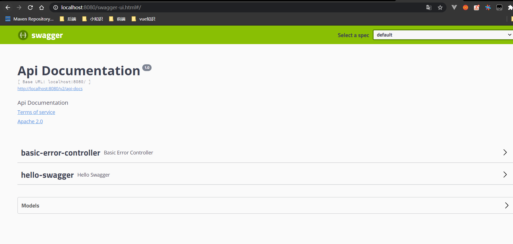
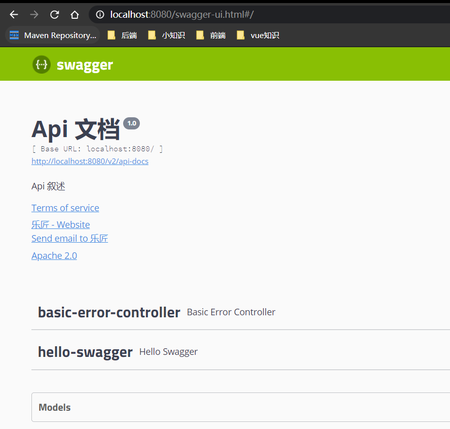
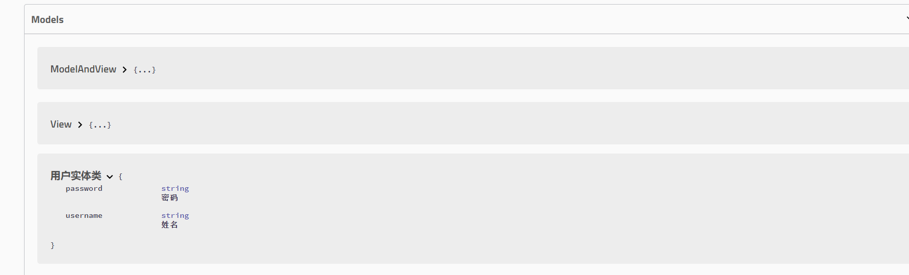
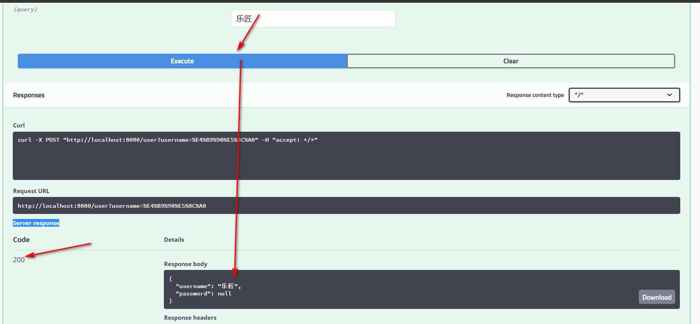

### 使用swagger 

相当于postman,可以在线来监测接口的动态。

下载依赖包,在pom.xml中引入依赖

```xml
<!-- https://mvnrepository.com/artifact/io.springfox/springfox-swagger-ui -->
<dependency>
    <groupId>io.springfox</groupId>
    <artifactId>springfox-swagger-ui</artifactId>
     <version>2.9.2</version>
</dependency>
<!-- https://mvnrepository.com/artifact/io.springfox/springfox-swagger2 -->
<dependency>
    <groupId>io.springfox</groupId>
    <artifactId>springfox-swagger2</artifactId>
    <version>2.9.2</version>
</dependency>

```

2.创建swagger的配置类 ,在容器读取的配置类

```java
@Configuration//托管spring
@EnableSwagger2//开启swagger功能
public class SwaggerConfig {
   		
}

```

定义一个controller

```java
package com.swagger.testswagger.controller;

import org.springframework.web.bind.annotation.GetMapping;
import org.springframework.web.bind.annotation.RestController;

@RestController
public class HelloSwagger {
    @GetMapping("/hello")
    public  String  helloSwagger(){

        return "hello";
    }

}

```

3.然后启动容器访问



配置一个docket,只能通过构造器来使用，因为源码没有set方法

```java
package com.swagger.testswagger.config;

import org.springframework.context.annotation.Bean;
import org.springframework.context.annotation.Configuration;
import springfox.documentation.service.ApiInfo;
import springfox.documentation.service.Contact;
import springfox.documentation.spi.DocumentationType;
import springfox.documentation.spring.web.plugins.Docket;
import springfox.documentation.swagger2.annotations.EnableSwagger2;

import java.util.ArrayList;

@Configuration
@EnableSwagger2
public class SwaggerConfig {

    //配置了Docket实例
    @Bean
    public Docket docket(){
        return new Docket(DocumentationType.SWAGGER_2)
                .apiInfo(apiinfo());
    }
    //配置页面的信息
    private ApiInfo apiinfo(){
        Contact contact=new Contact("乐匠","http:路由","318667376@qq.com");
        return new ApiInfo("Api 文档",
                "Api 叙述",
                "1.0",
                "http://localhost",
                contact,
                "Apache 2.0",
                "http://www.apache.org/licenses/LICENSE-2.0",
                new ArrayList());
    }


}
```

效果图，根据源码修改一写配置




### Swagger的扫描

```java
//扫描controller下的包
//RequestHandlerSelectors.basePackage()扫面指定的包
//.any()扫描全部
//.none()都不扫描
//RequestHandlerSelectors.withClassAnnotation(RestController.class)扫描类的注解
//RequestHandlerSelectors.withMethodAnnotation(GetMapping.class)扫描类的注解
 return new Docket(DocumentationType.SWAGGER_2)                
.select()
.apis(RequestHandlerSelectors.basePackage("com.swagger.testswagger.controller"))
.build();
```


```java
package com.swagger.testswagger.config;

import org.springframework.context.annotation.Bean;
import org.springframework.context.annotation.Configuration;
import org.springframework.web.bind.annotation.GetMapping;
import springfox.documentation.builders.PathSelectors;
import springfox.documentation.builders.RequestHandlerSelectors;
import springfox.documentation.service.ApiInfo;
import springfox.documentation.service.Contact;
import springfox.documentation.spi.DocumentationType;
import springfox.documentation.spring.web.plugins.Docket;
import springfox.documentation.swagger2.annotations.EnableSwagger2;

import java.util.ArrayList;

@Configuration
@EnableSwagger2
public class SwaggerConfig {

    //配置了Docket实例
    @Bean
    public Docket docket(){
        return new Docket(DocumentationType.SWAGGER_2)
                .apiInfo(apiinfo())
                //.enable(false) 默认为true 关闭swagger
                .select()
                //扫描controller下的包
                //RequestHandlerSelectors.basePackage()扫面指定的包
                //.any()扫描全部
                //.none()都不扫描
                //RequestHandlerSelectors.withClassAnnotation(RestController.class)扫描类的注解
               //RequestHandlerSelectors.withMethodAnnotation(GetMapping.class)扫描类的注解
                //com.swagger.testswagger.*
            .apis(RequestHandlerSelectors.basePackage("com.swagger.testswagger.controller"))
                //过滤路径  只扫描hello下的接口
                //PathSelectors.any()全部扫描
                //PathSelectors.none() 全部过滤
                .paths(PathSelectors.ant("/hello/**"))
                .build();
    }
    //配置页面的信息
    private ApiInfo apiinfo(){
        Contact contact=new Contact("乐匠","http:路由","318667376@qq.com");
        return new ApiInfo("Api 文档",
                "Api 叙述",
                "1.0",
                "http://localhost",
                contact,
                "Apache 2.0",
                "http://www.apache.org/licenses/LICENSE-2.0",
                new ArrayList());
    }


}

```

### 关闭 swagger 

```java
 return new Docket(DocumentationType.SWAGGER_2)
.enable(false) 默认为true 关闭swagger
```

### 配置一个分组，前端每个人取的接口的分组

```java
.groupName("API组") 
    
    
	@Bean
    public Docket docketA(){
        return new Docket(DocumentationType.SWAGGER_2).groupName("A")
             .apiInfo(apiinfo())
             .select() 	.apis(RequestHandlerSelectors.basePackage("com.swagger.testswagger.controllerA"))
                .build(); 
    }
    @Bean
    public Docket docketB(){
        return new Docket(DocumentationType.SWAGGER_2).groupName("B")
                 .apiInfo(apiinfo())
             .select() 	.apis(RequestHandlerSelectors.basePackage("com.swagger.testswagger.controllerB"))
                .build();  

    }

```

只要接口中返回实体类就会扫描到models中


### 对实体类的扫描改写

```java
 @PostMapping("/user")
    public user getuser(){
        return new  user();
    }
```

```java
@ApiModel("用户实体类")
public class user {
    @ApiModelProperty("姓名")
    public String username;
    @ApiModelProperty("密码")
    public String password;
}
#这里注意如果设置成private的在浏览器里是显示不出来的
```




### ApiOperation 与 ApiImplicitParams

```java
   @GetMapping("/user/{id}")
    @ApiOperation("查询永不用户")//API中说明的该类的作用
    @ApiImplicitParams({
            @ApiImplicitParam(name = "id",//参数名字
                    value = "查询的用户id",//参数的描述
                    required = true,//是否必须传参数，true是
                    paramType = "path",//参数类型 body
                    dataType = "int")//参数类型 int
    })
    public Map getOne(@PathVariable int id){
        Map<String,Object> map = new HashMap<>();
        map.put("id",id);
        map.put("name","张三");
        map.put("birthday",new Date());
        return map;
    }
```

### @ApiParam 在网页中返回，注意这个地方加上@RequestParam,同时实体类要有get set方法

```java
    @PostMapping("/user")
    public user getuser(@ApiParam("用户名") @RequestParam("username") String username){
       user user=new  user();
       System.out.print(username);
       user.setUsername(username);
        return  user;
    }

```


