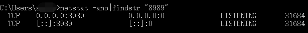
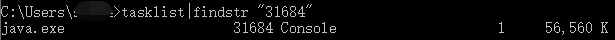
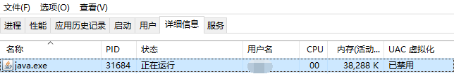
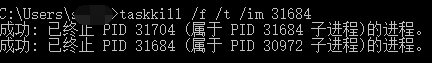

当我们在运行一些软件需要特定软件（如tomcat）时，有可能会碰上端口被占用的情况，这时候我们可能就需要更改端口或把占用端口的进程结束掉，因为更换端口可能会导致当前环境产生一些的问题或是需要重新配置其他内容，所以可以尝试查看一下占用端口到底是什么进程。

 

1.打开CMD命令行，输入 netstat -ano|findstr "端口号" 查看进程，**不要漏掉双引号**：

```
netstat -ano|findstr "端口号"
```

以我查找的 8989 端口为例，通过 Netstat 可以找到是 PID 为 31684 的进程占用了 8989 端口：



 

2.使用Tasklist查看对于 PID 的进程名：

```
tasklist|findstr "PID号"
```

可以看到是 java.exe 进程占用了该端口：



 同时我们可以在任务管理器（详细信息）内找到该进程（可直接右键结束）：

 

 

3.除了通过任务管理器内直接结束进程，也可通过 taskkill 命令方式结束进程：

```
taskkill /f /t /im 端口号
```

