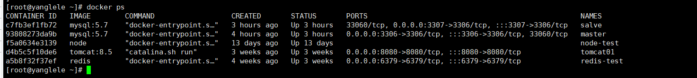
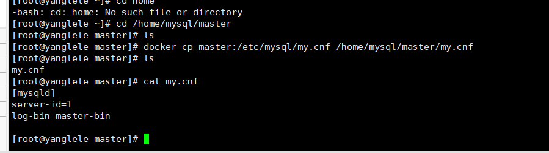
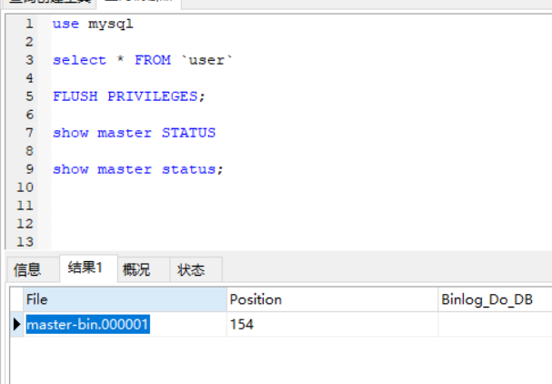
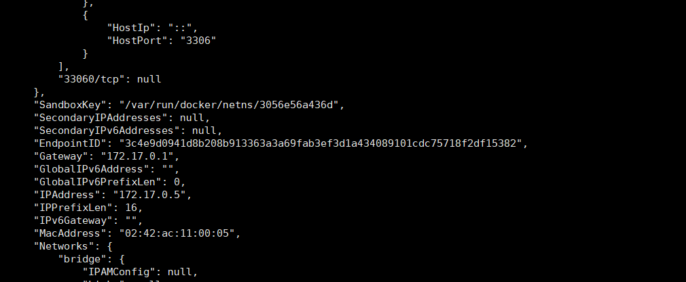
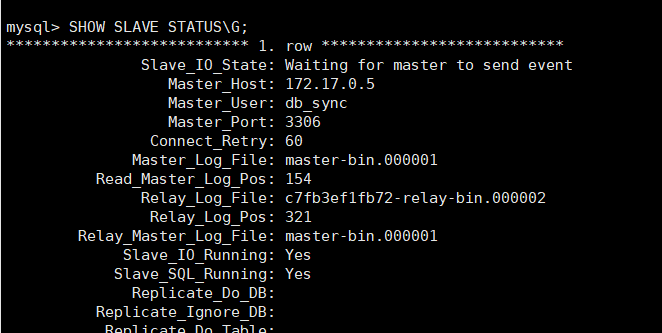
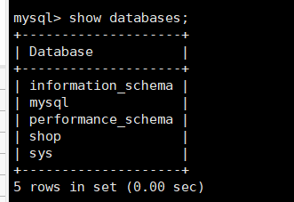

### 主从复制 分散压力 

- 为什么要主从复制

1、在业务复杂的系统中，有这么一个情景，有一句sql语句需要锁表，导致暂时不能使用读的服务，那么就很影响运行中的业务，使用主从复制，让主库负责写，从库负责读，这样，即使主库出现了锁表的情景，通过读从库也可以保证业务的正常运作。

2、做数据的热备

3、架构的扩展。业务量越来越大，I/O访问频率过高，单机无法满足，此时做多库的存储，降低磁盘I/O访问的频率，提高单个机器的I/O性能。

| bin log      | redo log | undo log |
| ------------ | -------- | -------- |
| mysql server | innodb   | innodb   |

- 什么是主从复制

  MySQL 主从复制是指数据可以从一个MySQL数据库服务器主节点复制到一个或多个从节点。MySQL 默认采用异步复制方式，这样从节点不用一直访问主服务器来更新自己的数据，数据的更新可以在远程连接上进行，从节点可以复制主数据库中的所有数据库或者特定的数据库，或者特定的表。

- ### mysql复制原理

1. 原理：

（1）master服务器将数据的改变记录二进制binlog日志，当master上的数据发生改变时，则将其改变写入二进制日志中；

（2）slave服务器会在一定时间间隔内对master二进制日志进行探测其是否发生改变，如果发生改变，则开始一个I/OThread请求master二进制事件

（3）同时主节点为每个I/O线程启动一个dump线程，用于向其发送二进制事件，并保存至从节点本地的中继日志中，从节点将启动SQL线程从中继日志中读取二进制日志，在本地重放，使得其数据和主节点的保持一致，最后I/OThread和SQLThread将进入睡眠状态，等待下一次被唤醒。

2. 也就是说：

- 从库会生成两个线程,一个I/O线程,一个SQL线程;
- I/O线程会去请求主库的binlog,并将得到的binlog写到本地的relay-log(中继日志)文件中;
- 主库会生成一个log dump线程,用来给从库I/O线程传binlog;
- SQL线程,会读取relay log文件中的日志,并解析成sql语句逐一执行;


首先Master服务随SQL语句的操作记录在binlog二进制文件中，记得要开启，Slave服务器也要一样，然后Slave会产生两个线程，一个

I/O线程，一个MYSQL线程，IO线程读取Master的binlog然后写入到relay log，SQL线程从relay log中读取文件，写入SQL，从而来保证数据的一致性。

MYSQL的主从形式

1. 一主一从

主从复制首先要准备多个mysql服务。在linux下我们要配置`/etc/mysql/my.cnf`文件中的内容

在master主机上my.cnf输入，这里只配置最简单的。

```shell
[mysqld]
## 同一局域网内注意要唯一
server-id=1
## 开启二进制日志功能，可以随便取（关键）
log-bin=master-bin
##等等配置
```

slave主机上的my.cnf

```shell
[mysqld]
## 同一局域网内注意要唯一
server-id=2
## 开启二进制日志功能，可以随便取（关键）
log-bin=slave-bin
##等等配置
```

下面以5.7的为例

> docker pull  mysql:5.7  #拉取镜像

### 第一种方法使用挂载方式

```shell
docker run -p 3306:3306 --name master -v /home/mysqlconf/master_sql1/conf:/etc/mysql -e MYSQL_ROOT_PASSWORD=123456  -d mysql:5.7

docker run -p 3307:3306 --name slave -v /home/mysqlconf/master_sql2/conf:/etc/mysql -e MYSQL_ROOT_PASSWORD=123456  -d mysql:5.7
```

将文件挂载在/home/mysqlconf/master_sql1/conf目录，在conf目录下创建my.cnf，这样就保证本地文件与容器内部文件同步

vim my.cnf  分别写入以上内容

### 第二种采用 进入容器内部

```shell
docker run --name master -p 3306:3306   -e  MYSQL_ROOT_PASSWORD=123456 -d mysql:5.7

docker run --name slave -p 3307:3306   -e  MYSQL_ROOT_PASSWORD=123456 -d mysql:5.7
```

docker ps 查看容器的ID



```shell
docker exec -it 容器ID bash
```

进入容器内部

```shell
cd /etc/mysql

vim my.cnf
输入上面文件的内容
```

#### 问题：

1. 在这里会遇到vim不存在情况

   > apt-get update #更新下载库
   > apt-get install vim #安装vim

2. 有的会出现文件只读状态，没有权限修改，这里因为实在容器里，所以使用chown修改权限也有问题

### 第三种方式采用docker cp 

> docker cp  容器名：容器内路径  主机文件路径

例如

> docker  cp master:/etc/mysql/my.cnf  /home/mysql/master/my.cnf
>
> 解释：这里我们将容器名为 master内的`/etc/mysql 文件，拷贝到/home/mysql/master
>
> 然后修改文件/home/mysql/master/my.cnf
>
> 再一次将文件目录拷贝回去
>
> docker  cp  /home/mysql/master/my.cnf   master:/etc/mysql/my.cnf



这三种方式的目的只有一个，修改`/etc/mysql/my.cnf`文件

##### 重点 ，配置文件写完过后一定要重启容器，重启容器有问题可以使用 

``` shell
docker logs -f --tail 10 容器名  查看错误的原因
```

由于配置文件出问题不能在容器内部修改时，可以试试第三种拷贝方式。出错也不要怕，反正是个容器，大不了删除，实在不行强制删除

>  docker container  rm  --force  容器ID

下一步

#### 进入到master的容器

> docker exec -it masterID  bash

进入数据库：

> mysql -u root -p

 输入密码

```sql
# 在默认的mysql数据库想创建
user mysql
# 创建db_sync用户
GRANT REPLICATION SLAVE ON *.* TO 'db_sync'@'%' IDENTIFIED BY 'db_sync';
#或者使用root
alter user 'root'@'%' identified with mysql_native_password by '123456'
# 查看用户
select * from user
# 刷新权限
FLUSH PRIVILEGES;
# 确认位点
SHOW master STATUS
```



#### 进入slave从服务器

```sql
# 关闭同步
STOP SLAVE;

# 配置同步
 CHANGE MASTER TO
    master_host='172.17.0.5',
    master_port=3306,
    master_user='db_sync',
    master_password='db_sync',
    master_log_file='master-bin.000001',
    master_log_pos=154;
#对应修改root
change master to 
    master_host='172.17.0.5', 
    master_port=3306,
    master_user='root',
    master_password='123456',
    master_log_file='master-bin.000001',
    master_log_pos=154;
    
# master_host 主库的地址  获取方式在下面
# master_port 主库的端口  容器的端口
# master_user 主库同步使用的用户名  
# master_password 主库同步使用的密码
master_log_file  	master_log_pos分别对应上面主库master的的File  Position
# master_log_file binlog的名称
# master_log_pos log的位点

# 开启同步
START SLAVE;

#查看同步状态
SHOW SLAVE STATUS\G;
```

master_host 主库的获取

下面查看服务的地址 

> docker  inspect 容器的id     #这是master的地址



测试检验 

> SHOW SLAVE STATUS\G;



下面我在看到IO与SQL都是yes说明成功了，不放心我又在master新建一个数据库 shop，然后在slave从数据库找到一样的数据



以上就是最简单的主从复制。

还有主主复制、一主多从，多主一从配置。