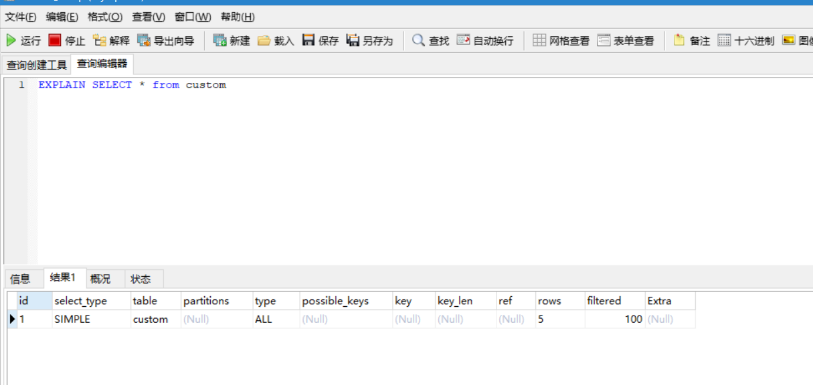

## MySQL索引

数据库优化的方面  

​	数据库设计方面入手  ： 索引    尽量使用数值型  尽量多考虑使用定长而非变长

​    SQL语句入手：  exist 和in的   in和not in    like的使用

索引  没有数据就没有索引

底层索引列和数据放在一起

```sql
-- 索引的基本操作  idx索引名，name可以是一个也可以是多个

CREATE UNIQUE INDEX index_name ON table_name (Att_name);
alter table test add index idx(name)
-- 删除索引
DROP INDEX index_name (Att_name) ON table_name

```


索引是帮助MYSQL高效获取数据的数据结构  索引就是数据结构

优点：提高查询效率。

缺点：对数据增删改的时候效率降低。

1. 主键索引
2. 唯一索引
3. 常规索引
4. 全文索引
5. 组合索引
6. 空间索引

创建索引的情况：

1. 主键自动建立唯一索引
2. 频繁作为查询条件的字段应该创建索引
3. 查询中与其他表关联的字段，外键关系建立索引
4. 频繁更新的字段不适合创建索引，每次更新不单单是更新了记录还会更新索引
5. where条件中用不到的字段不创建索引
6. 单键/组合索引的选择问题，在高并发的情况加创建组合索引
7. 查询中排序的字段，排序字段若通过索引去访问们将大大提高索引排序速度。

不创建索引的情况

1. 表记录太少
2. 经常增删改的表
3. 数据重复且分布平均的字段，因此应该只为最经常排序的数据列建立索引  如果一个列包含多个重复的字段，没有必要建立索引

索引的性能分析

1. Mysql Query Optimizer 查询解释器

2. MySql常见瓶颈

3. Explain (查询执行计划)

   1. 能干什么  

   表的读取顺序

   数据读取操作的操作类型

   哪些索引可以使用

   那些索引被实际使用

   表之间的引用

   每张表有多少行被优化器查询

   > 使用Explain关键字可以模拟优化器器执行SQL语句，从而知道MYSQL如何处理你的SQL，分析你的查询语句或是表结构

   2. 怎么玩

   > explain + sql语句

   

   3. 各字段解释

   select 查询的序列号，包含一组数字，表示查询中执行select字句或操作表的顺序

   ### id

   > 连接查询 id相同的  表示语句按顺序执行

   > 如果是子查询 ，id序号会递增，id的值越大优先级越高，越先被执行

   >  id有同有不同，最大的先执行，相同的按照顺序执行。

   ### select_type

   **SIMPLE：** --------简单的SELECT语句（不包括UNION操作或子查询操作）

    PRIMARY： ----------------查询中最外层的SELECT（如两表做UNION或者存在子查询的外层的表操作为PRIMARY，内层的操作为UNION）

    UNION：---------------UNION操作中，查询中处于内层的SELECT（内层的SELECT语句与外层的SELECT语句没有依赖关系）

    DEPENDENT UNION：------------------UNION操作中，查询中处于内层的SELECT（内层的SELECT语句与外层的SELECT语句有依赖关系）

    UNION RESULT：--------------UNION操作的结果，id值通常为NULL

    SUBQUERY：---------子查询中首个SELECT（如果有多个子查询存在）

    DEPENDENT SUBQUERY：--------------------子查询中首个SELECT，但依赖于外层的表（如果有多个子查询存在

    DERIVED：-------------------------被驱动的SELECT子查询（子查询位于FROM子句）

    UNCACHEABLE SUBQUERY：----------对于外层的主表，子查询不可被物化，每次都需要计算（耗时操作）

    UNCACHEABLE UNION：-----------------UNION操作中，内层的不可被物化的子查询（类似于UNCACHEABLE SUBQUERY）

   ### `type`扫描方式由快到慢

   ```
   system > const > eq_ref > ref > range > index > ALL
   ```

最好能达到ref 至少是 range、

system--------从系统库mysql的系统标proxies_priv里查询数据，这里的数据在Mysql服务启动时候已经加载在内存中，不需要进行磁盘IO

const ----------连接部分是常量1，通过索引一次就能找到，速度非常快

```sql
create table user (
  id int primary key,
  name varchar(20)
)engine=innodb;
 
insert into user values(1,'ar414');
insert into user values(2,'zhangsan');
insert into user values(3,'lisi');
insert into user values(4,'wangwu');
-- 执行
explain select * from user where id=1
```

eq_ref

场景： 1. `联表`(join)查询 2. 命中`主键`(primary key)或者`非空唯一索引`(unique not null) 3. `等值`连接

```sql
create table user (
  id int primary key,
  name varchar(20)
)engine=innodb;
 
insert into user values(1,'ar414');
insert into user values(2,'zhangsan');
insert into user values(3,'lisi');
insert into user values(4,'wangwu');
 
create table user_balance (
  uid int primary key,
  balance int
)engine=innodb;
 
insert into user_balance values(1,100);
insert into user_balance values(2,200);
insert into user_balance values(3,300);
insert into user_balance values(4,400);
insert into user_balance values(5,500);
-- 执行
explain select * from user left join user_balance
on user.id=user_blance.uid where user.id=user_balance.uid;

上例中对于前表`user`表中的每一行（row），对应后`user_balance`表只有一行被扫描，这类扫描的速度也非常的快
```

ref

同eq_ref模拟数据区别：user_balance表中的 `主键索引`改为 `普通索引`  

```sql
create table user (
  id int primary key,
  name varchar(20)
)engine=innodb;
 
insert into user values(1,'ar414');
insert into user values(2,'zhangsan');
insert into user values(3,'lisi');
insert into user values(4,'wangwu');
 
create table user_balance (
  uid int,
  balance int,
  index(uid)
)engine=innodb;
 
insert into user_balance values(1,100);
insert into user_balance values(2,200);
insert into user_balance values(3,300);
insert into user_balance values(4,400);
insert into user_balance values(5,500);

select * from user
left join user_balance
on user.id=user_balance.uid
where  user.id=user_balance.uid
```

当id改为普通非唯一索引后，常量的连接查询，也由const降级为了ref，因为非唯一索引所以有多于一行的数据被可能被扫描

`ref`每一次匹配可能有多行数据返回，虽然它比eq_ref要慢，但它仍然是一个很快的join类型

场景： *联表查询* 普通非唯一索引

range

range比较好理解，它是索引上的范围查询，它会在索引上扫码特定范围内的值

```sql
create table user (
  id int primary key,
  name varchar(20)
)engine=innodb;
 
insert into user values(1,'ar414');
insert into user values(2,'zhangsan');
insert into user values(3,'lisi');
insert into user values(4,'wangwu');
insert into user values(5,'zhaoliu');


1.explain  select * from user where id between 1 and 4
2. explain select * from user where id in (1,2,3)
3. explain select * from user where id>=2
```

index

```sql
explain select count(1) from user;
```

> 当前测试表为InnoDb，MyISAM 内置了一个计数器，count()时它直接从计数器中读

ALL

如果id上不建索引,则全表扫描 这里的id不是主键

```sql
select * from user where id=1
```

possible_keys:可能用到的索引  为null 表示没有索引

key 真正用到的索引 

key_len 显示的值为索引字段的最大可能长度，并非实际使用长度

ref    显示索引的哪一列被使用了，如果可能的话，是一个常数，哪些列或常量被用于查找索引列上的值。

rows 查找出来的列数

### 表的字段有 iD name gender age

ID name 为索引 

#### 回表的概念 

> select  * from  table where name=‘张三’

这里的name是索引，主键ID也是索引，现根据name查询ID,再根据ID查询整行的记录，走了两个B+树，这种现象叫回表；

因为我在这里根据name的字段去查，查询到了name，要根据ID来查询其他的字段。

当根据普通索引查询到聚簇索引的key值之后，再根据key值在聚簇中获取所有的记录。

#### 索引覆盖

> select  id，name  from  table where name=‘张三’

根据name可以直接查询到ID，name两个列的值。直接返回即可，不需要再进行回表，来查询其他的值，这就叫索引覆盖

#### 最左匹配  

前置条件  name age是组合索引

> select * from table  where name=" " and age=" "  用
>
> select * from table  where name=" " 用
>
> select * from table  where age=" "不用
>
> select * from table  where age=" " and name=" " 用
>
> 原因：mysql的优化器会调整对应的顺序 name 肯定要有

#### 索引下推

> select * from table where name=? and age=?

在没有索引下推之前，先根据name冲存储引擎中获取符合规则的数据，然后在Server层对age进行过滤

有了之后，根据 name age两个条件从存储引擎中获取对应的数据。

减少了server层与引擎层的数据交互量

