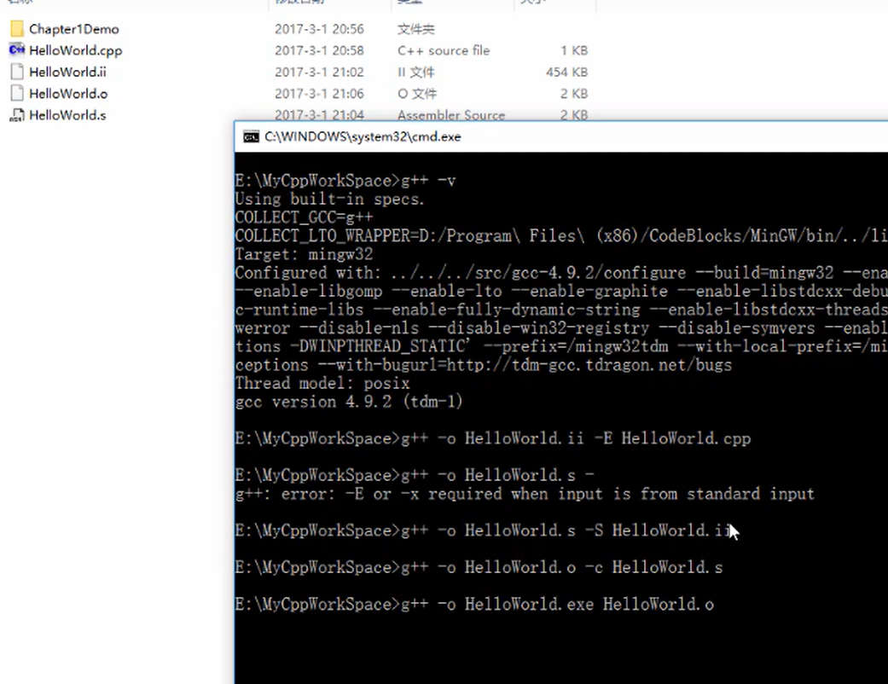
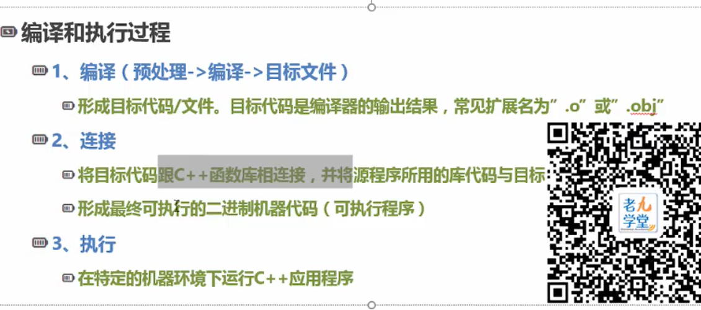
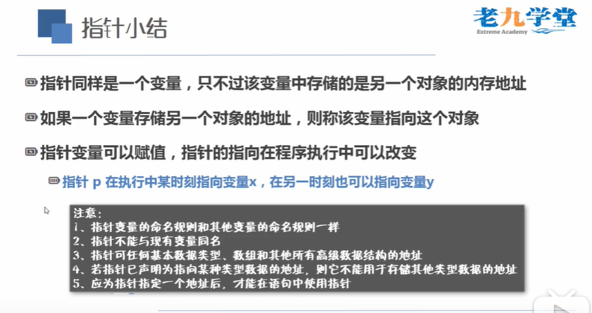
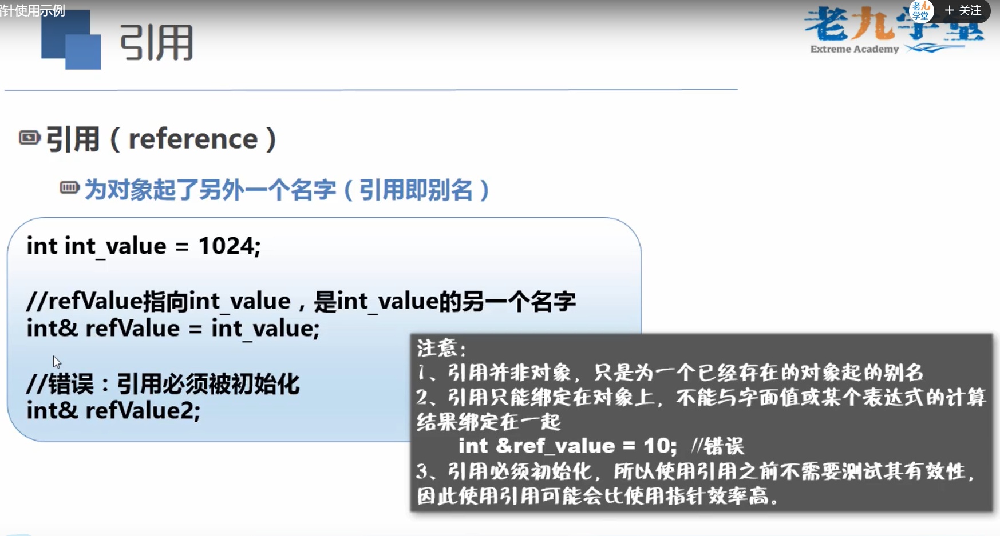
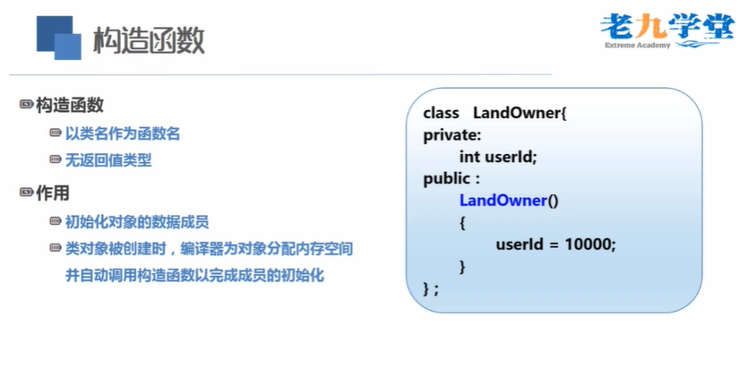

# C++语言

工具使用vscode 插件，安装c++的环境。添加文件 

launch.json

```json
{
    "version": "0.2.0",
    "configurations": [

        {
            "name": "(gdb) Launch",    // 配置名称，将会在启动配置的下拉菜单中显示
            "type": "cppdbg",         // 配置类型，这里只能为cppdbg
            "request": "launch",    // 请求配置类型，可以为launch（启动）或attach（附加）
            "program": "${workspaceRoot}/${fileBasenameNoExtension}.exe",// 将要进行调试的程序的路径
            "args": [],                // 程序调试时传递给程序的命令行参数，一般设为空即可
            "stopAtEntry": false,     // 设为true时程序将暂停在程序入口处，一般设置为false
            "cwd": "${workspaceRoot}",// 调试程序时的工作目录，一般为${workspaceRoot}即代码所在目录
            "environment": [],
            "externalConsole": true,// 调试时是否显示控制台窗口，一般设置为true显示控制台
            "MIMode": "gdb",
            "miDebuggerPath": "D:\\C++\\x86_64-8.1.0-release-posix-seh-rt_v6-rev0\\mingw64\\bin\\gdb.exe",// miDebugger的路径，注意这里要与MinGw的路径对应
            "preLaunchTask": "g++",    // 调试会话开始前执行的任务，一般为编译程序，c++为g++, c为gcc
            "setupCommands": [
                {
                    "description": "Enable pretty-printing for gdb",
                    "text": "-enable-pretty-printing",
                    "ignoreFailures": true
                }
            ]
        }
    ]
}

```

tasks.json

```json
{
    "version": "2.0.0",
    "tasks": [
        {
            "label": "g++",
            "command": "g++",
            "args": [
                "-g",
                "${file}",
                "-o",
                "${fileDirname}/${fileBasenameNoExtension}.exe"
            ],
            "problemMatcher": {
                "owner": "cpp",
                "fileLocation": [
                    "relative",
                    "${workspaceRoot}"
                ],
                "pattern": {
                    "regexp": "^(.*):(\\d+):(\\d+):\\s+(warning|error):\\s+(.*)$",
                    "file": 1,
                    "line": 2,
                    "column": 3,
                    "severity": 4,
                    "message": 5
                }
            },
            "group": {
                "kind": "build",
                "isDefault": true
            }
        },
        {
            "type": "shell",
            "label": "C/C++: g++.exe build active file",
            "command": "D:\\C++\\x86_64-8.1.0-release-posix-seh-rt_v6-rev0\\mingw64\\bin\\g++.exe",
            "args": [
                "-g",
                "${file}",
                "-o",
                "${fileDirname}\\${fileBasenameNoExtension}.exe"
            ],
            "options": {
                "cwd": "${workspaceFolder}"
            },
            "problemMatcher": [
                "$gcc"
            ],
            "group": {
                "kind": "build",
                "isDefault": true
            }
        }
    ]
}
```

### 基本模板

```c++
#include <iostream>  ////将iostream的内容添加到程序中  iostream包含输入输出
using namespace std;//命名空间
 
// main() 是程序开始执行的地方
 
int main()
{
   cout << "Hello World" << endl; 
    // 输出 Hello World cout是iostream的一个打印对象。endl打印空格，确保语句立刻输出。清缓存，打印缓存
   return 0;
}
```

### 执行过程

> g++ 命令





## c++数据类型

C++ 为程序员提供了种类丰富的内置数据类型和用户自定义的数据类型。下表列出了七种基本的 C++ 数据类型：

| 类型     | 关键字  |
| :------- | :------ |
| 布尔型   | bool    |
| 字符型   | char    |
| 整型     | int     |
| 浮点型   | float   |
| 双浮点型 | double  |
| 无类型   | void    |
| 宽字符型 | wchar_t |

其实 wchar_t 是这样来的：

```
typedef short int wchar_t;
```

所以 wchar_t 实际上的空间是和 short int 一样。

一些基本类型可以使用一个或多个类型修饰符进行修饰：

- signed
- unsigned
- short
- long

## 变量作用域

作用域是程序的一个区域，一般来说有三个地方可以定义变量：

- 在函数或一个代码块内部声明的变量，称为局部变量。
- 在函数参数的定义中声明的变量，称为形式参数。
- 在所有函数外部声明的变量，称为全局变量。


## 对象模式


## 指针变量

```php
#include <iostream>
#include <cstdio>
using namespace std;
void swap(int *x,int *y); //声明存在这个函数，可以在main方法的下面调用
void swap1(int x,int y);
void testip();
//指针命名  *ip  指针ip存储地址；$+变量 指针取值 *ip 指针地址ip  其实就是同一个变量（有待考虑）
/*
& 符号的意思是取地址，也就是返回一个对象在内存中的地址。
* 符号的意思是取得一个指针所指向的对象。 也就是如果一个指针保存着一个内存地址，那么它就返回在那个地址的对象。
*/
int main(){
   int x=5,y=6;
   swap(&x,&y);//将 x,y 的值互换;
   cout << x <<"**********************"<< y <<endl;
   swap1(x,y);//没有将 x,y 值互换;
   cout << x <<"**********************"<< y <<endl;
   testip();
   system("pause");
}
//这个例子是形参x y的值进行了互换，方法外面的值没有换
void swap1(int x,int y){
         int t;
         t=x;  //在t的地址赋值x的值，此时的x还有有值，把x的值复制一份给t;
         x=y;
         cout <<"我是swap1里面的x"<< x <<endl;
         y=t;
};

//实例二
 void swap(int *x,int *y){
	 	int t;
	 	t=*x; //将x的值赋给t
	 	*x=*y; //将y的值赋给
      cout <<"我是swap里面的*x"<< *x <<endl;
	 	*y=t; //将t的值赋给y，在y地址加上t的值
	 }

//实例一
 void testip(){
   int  var1=10;
   char var2[10];
   int *ip; // 指针变量的声明

   //取出var1的地址，然后放入指针ip中
   ip = &var1;
   cout << "var1 变量的地址： ";
   cout << &var1 << endl;
 
   cout << "var2 变量的地址： ";
   cout << &var2 << endl;
 
  // 输出在指针变量中存储的地址
   cout << "Address stored in ip variable: ";
   cout << ip << endl;
 
   // 访问指针中地址的值
   cout << "Value of *ip variable: ";
   cout << *ip << endl;
 }
```

### 基础例子

```c++
#include <iostream>
using namespace std;

#include <iomanip>
using std::setw;
int main(){
    double price_phone=35000.0;
    double price_book=11044.5;
    double price_wallet=1535.0;
    double discount=0;
    double real=0;
    int phone,book,wallet;
    //如果总价大于5w就打七折。否则打九折
    cout<< fixed;//不使用科学计数法
    cout<< setprecision(2);//数据精度保留两位小数点
    cout << "钱包"<<setw(13)<< price_wallet
    <<"\n"<<"书本"<<setw(13)<< price_book
    <<"\n"<< "手机"<<setw(13)<<price_phone<< endl;
   cout << "请选择手机的数量\n";
   cin >> phone;
   cout << "请选择书本的数量\n";
   cin >> book;
   cout << "请选择钱包的数量\n";
   cin >> wallet;
   double total=0;
   total=price_book*book+price_phone*phone+price_wallet*wallet;
    cout << "总计" << total<<endl;
    if(total>50000){
        discount=0.7;
    }else{
        discount=0.9;
    }
    real=total*discount;
    cout <<"打折后的价钱为"<< real << endl;
    system("pause");

}
```

### 两种访问变量的方式

| 直接访问             | 间接访问                                                     |
| -------------------- | ------------------------------------------------------------ |
| 直接通过变量名来访问 | 将变量**i**的地址存放在另一个变量中，然后通过该变量来找到**i**变量的地址，从而访问i的变量。 |

一个变量的地址称为该变量的“指针”、例如：地址2000是变量i的指针.如果有一个变量专门用来存放另一个变量的地址，称为指针变量。

指针变量就是地址变量，用来存放地址。指针变量的值是地址。

> 区别指针与指针变量的概念
>
> 例如：可以说变量i的指针是2000.而不能说i的指针变量是2000
>
> 指针是一个地址，指针变量是存放地址的变量。

### 指针变量

#### 定义一个指针变量（占四个字节）

```c++
int *pointer_x; //定义一个int行的指针变量
int x=200;		
pointer_x=&x   //将变量x的地址赋值给pointer_x
cout << *pointer_x <<endl;//打印x的值
```

#### 指针的类型

定义 ： 类型名 *指针变量名

类型

> int *              float *              char *              等

#### 如何引用

给指针变量赋值

```
pointer_a=&a;
```

两个符号的运用

| &              | *                                    |
| -------------- | ------------------------------------ |
| 取地址的运算符 | 指针运算符 *p 代表指针变量指向的对象 |

https://www.60qihu.com/

#### 指针要赋初值（重要）

指针不赋初始值的话会变成野指针，不可控的，通过野指针修改变量可能会影响到系统的变量

```c++
int *ptr_num=nullptr;  //第一种方式
int *ptr_num=0;        //第二种方式
```

#### void * 指针（不能修改值）

可以存放任意对象的地址，一般用来和另一个指针比较

#### 指针小结



### 引用

引用的底层是指针，是对指针的一个简单封装



### 引用参数

```c++
 void swap2(int& x,int& y){
	 	int t;
	 	t=x; //将x的值赋给t
	 	x=y; //将y的值赋给
    cout <<"我是swap2里面的x"<< x <<endl;
	 	y=t; //将t的值赋给y，在y地址加上t的值
	 }
```

### 指针与数组

打印数组名就是首元素的地址

```c
#include <iostream>
using namespace std;
int main(){
    double score[]{12.5,45.6,78.5,12.6};
    double *ptr_score=nullptr;
    ptr_score=score;  //数组名称就是首地址的值 64位机子指针占8字节
    cout << *ptr_score<<"\t"<< *(ptr_score+1)<<sizeof(ptr_score)<<endl;
    //使用指针循环 score就是double[5] 占了40个字节 sizeof(score)=5*8=40;sizeof(score[0])=8
    for(int i;i<sizeof(score) / sizeof(score[0]);i++){
            cout<< *(ptr_score+i)<<"\n"<<endl;
    }
    system("pause");
}
```

### 函数指针

函数名也是函数的地址

```c
    double (*ptrCalc)(double,double);  //定义
	double multiply(double num1,double num2); //函数
	ptrCalc=multiply; //赋地址
	ptrCalc(num1;num2);//使用
```

#### 计算器例子

```c
#include <iostream>
using namespace std;
//自定义函数方法完成加减乘除

//专门用来打印结果
void prt_result(double (*)(double,double),double,double);

//调用函数打印结果
void prt_result(double (*ptrCalc)(double,double),double num1,double num2){
    double result=ptrCalc(num1,num2); //执行的是函数 add divide
    cout << "运算结果为" << result << endl;
}
//依次为加减乘除
double add(double num1,double num2){
        return num1+num2;
}

double subtract (double num1,double num2){
      return num1-num2;
}

double multiply(double num1,double num2){
      return num1*num2;
}

double divide(double num1,double num2){
    if(num2==0){
        cout << "除数不能为0"<< endl;
    }else{
        return num1/num2;
    }
}

int main(){
    //定义函数指针 是指针，指向函数
    double (*ptrCalc)(double,double);
    double num1,num2;
    char opt;
    cout <<"请输入两个操作数";
    cin >>num1>>num2;
    cout<<"请选择如何造作+ - * / ";
    cin>>opt;
    switch (opt)
    {
        case '+':
        ptrCalc=add;
        break;
         case '-':
       ptrCalc=subtract;
        break;
         case '*':
       ptrCalc=multiply;
        break;
         case '/':
       ptrCalc=divide;
        break;
    
    default:
        break;
    }
    prt_result(ptrCalc,num1,num2);
    system("pause");
}

```

### 模板函数

里面的T是泛型，无论传入什么值都能接受，所以叫模板函数

```c
//定义一个模板函数。写一个通用模板 typename T 定义一个泛型T 参数 虚拟类型
template<typename T > void swap(T array[],int len);


int main(){

}
//实现
template<typename T >
 void swap(T array[],int len){
        T temp;//因为不知道数组是什么类型，所以赋值一个泛型
        temp=array[0];
 }
```

### 内联函数

```c++
inline void method()
```

  相当于吧方法内容复制到main函数

## 面向对象编程

- 封装性：数据和代码捆绑在一起，避免外界干扰和不确定性访问。封装可以使得代码模块化。

  优点：

  - 确保用户代码不会无意间破坏封装对象的状态
  - 被封装的类的具体实现细节可以随时改变，而无须调整用户级别的代码

- 继承性：让某种类型对象获得另一个类型对象的属性和方法。继承可以扩展已存在的代码

- 多态性：同一事物表现出不同事物的能力，即向不同对象发送同一消息，不同的对象在接收时会产生不同的行为（重载实现编译时多态，虚函数实现运行时多态）。多态的目的则是为了接口重用

### 对象的定义

| class 类名（）                | struct 类名（）                       |
| ----------------------------- | ------------------------------------- |
| calss默认的是private 私有属性 | 默认的是public 公有属性，一般使用数据 |

 

#### 析构函数

- 析构函是类的一个成员函数，名字由波浪号接类名构成。它没有返回值，也不接受参数：

  

  main.cpp

  ```c
  #include <iostream>
  using namespace std;
  #include "Student.h"//引用 .h的文件
  
  int main(){
      Student student;
      student.say("你好");
      system("pause");
  
  }
  ```

Student.h

```c
#include <iostream>
using namespace std;
class Student
{
private:
    /* data */
    string name;
    string stunumber;
    int age;
public: //也可以在这里直接实现方法
    Student(/* args */);
    ~Student();
    void say(string mesage ); //新的方法的声明
    void setName(string name);
};

```

Student.cpp

```c
#include "Student.h"
#include <iostream>
using namespace std;

//类的方法的实现
Student::Student(/* args */)
{

}
Student::~Student()
{
}
//实现
void say(string message){
    cout << message <<endl;
}
//给属性赋值，相当于java的set get
void setName(string name){
    name=name;
		
}
```




1. 关于构造函数与析构函数的顺序 

   > 先构造的后析构，后构造的析构  

2. 何为析构函数

   > 析构函数是一个特殊的成员函数，析构函数是与构造函数作用相反的函数
   >
   > 析构函数的作用并不是删除对象，而是在撤销对象占用的内存之前完成一些清理工作
   >
   > 析构函数不返回任何值，没有函数类型，也没有函数参数，因为没有函数参数，因此不能被重载，只能有一个构造函数。

# 对象数组

对象数组的每一个元素都是同类的对象

```c
Student stu[3]={
    Student(11,12,23),
    Student(12,45,23),
    Student(13,56,23)
}
```

# 对象指针

对象空间的起始地址就是对象的指针  类名 * 对象指针名

> Time *pt; 
>
> Time t1;
>
> pt=&t1;

访问方式

```c++
*pt                 pt所指的对象 
(*pt).hour          调用方法
pt->hour
```

# 指向对象成员的指针

```c
int *pt;
p1=&t1.hour;
cout<< *pt <<endl;
```

# 指向对象成员函数的指针

```c++
void (*p)(); //p是指向void型函数的指针流量
p=fun;   	//将fun函数的入口地址给指针p p就是指向函数fun  p=t1.get_time()
(*p)(); 	//调用fun函数
```

# this  指针

this是指向本类对象的指针，它的值是被调用的成员函数所在的对象的起始地址

对象的赋值是对一个已经存在的对象赋值，因此必须先定义被赋值的对象，才能进行赋值，而对象的复制则是从无到有建立一个新对象，并使它与一个已有的对象完全相同。


# c++数据结构

## 插入排序

```c
void InsertSort(int a[],int n){
    int i,j,temp;
    for(i=1;i<n;i++){
        temp=a[i];
        j=i-1
       while(j>=0&&temp<a[j]){
           a[j+1]=a[j]
           j--;
    		}
  	  a[j+1]=temp;
}
```


