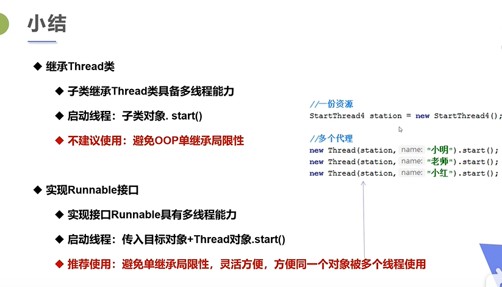
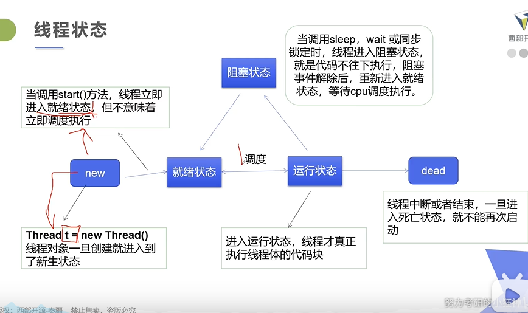
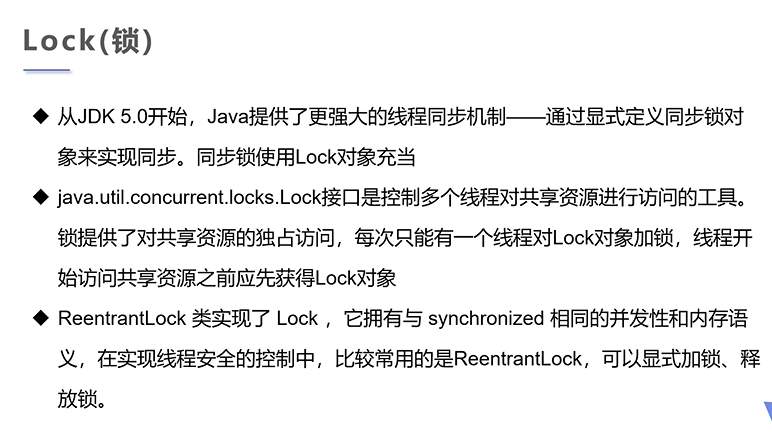

# 线程简介

## java线程

进程 

​	进程是执行程序的一次执行过程，一个进程可以有多个线程。

# 线程实现

三种创建方式

1. thread class   继承thread类（重点）

   线程开启不一定执行，由CPU调度

   1. 自定义线程类继承Thread了=类

   2. 重写run方法，编写线程执行体

   3. 创建线程对象，调用start()方法启动线程

```java
public class TestTread extends Thread{
    public void run(){
        for(int i=0;i<10;i++){
            System.out.println("我在看代码————"+i);
        }
    }
    public static void main(String[] args){
        //main为主线程
        //创建一个线程对象
        TestTread testTread=new TestTread();
        //开启线程
        testTread.run();//我在看代码在先
        //testTread.start();//同时执行

        for(int i=0;i<10;i++){
            System.out.println("我在学习多线程————"+i);
        }
    }

}

```

案例   多线程文件上传（引入一个`commons.io.jar`）

```java
import org.apache.commons.io.FileUtils;

import java.io.File;
import java.io.IOException;
import java.net.URL;

public class TestThread2 extends Thread {
    private String url;
    private String name;

    public TestThread2(String url,String name){
        this.url=url;
        this.name=name;
    }
    public void run(){
        WebDownLoader webDownLoader=new WebDownLoader();
        webDownLoader.downloader(url,name);
        System.out.print("下载的文件名称"+name);
    }
    public static void main(String[] args){
        TestThread2 t1=new TestThread2("https://cn.bing.com/images/search?view=detailV2&ccid=HBsy4%2fic&id=8E0DA8A94CBAD03BC918A10391A649DEE94F7F39&thid=OIP.HBsy4_icdhBQ6TdOyNxc-AHaFO&mediaurl=http%3a%2f%2fpicapi.zhituad.com%2fphoto%2f44%2f45%2f17DFC.jpg&exph=459&expw=650&q=%e5%9b%be%e7%89%87%e3%80%90&simid=608006716346859618&ck=352E154B758D88937F1EF592AB3E2506&selectedIndex=0&FORM=IRPRST","test1");
        TestThread2 t2=new TestThread2("https://upload-images.jianshu.io/upload_images/23488806-8ebae730d29122c4.JPG?imageMogr2/auto-orient/strip|imageView2/1/w/360/h/240","test2");
        t1.start();
        t2.start();
    }
}
//定义一个下载器
class WebDownLoader{
    public void downloader(String url,String name){
        try {
            FileUtils.copyURLToFile(new URL(url),new File(name));
        }catch (IOException e){
            e.printStackTrace();
            System.err.println("IO出现异常");
        }

    }

}

```


2. Runable接口  实现runable接口（重点）

   1. 定义一个MyRunable的类实现Runable接口

   2. 实现run()方法，编写线程执行体

   3. 创建线程对象，调用start()方法启动代理

3. Callable接口   实现Callable接口（了解）



## 龟兔赛跑的案例

```java
public class Race implements  Runnable {
    private static String winner;

    @Override
    public void run() {

        for (int i = 0; i <= 100; i++) {
            //模拟兔子休息
            if(Thread.currentThread().getName().equals("兔子")&&i%10==0){
                try {
                    Thread.sleep(50);
                } catch (InterruptedException e) {
                    e.printStackTrace();
                }
            }
            boolean flag = gameOver(i);
            if (flag) {
                break;
            }
        }
    }

    private boolean gameOver(int steps) {
        if (winner != null) {
            return true;
        }
        {
            if (steps == 100 || steps > 100) {
                winner = Thread.currentThread().getName();
                System.out.println("winner is" + winner);
                return true;
            }
        }
        return false;
    }

    public  static  void main(String[] agrs){
            Race race=new Race();
            new Thread(race,"兔子").start();
            new Thread(race,"乌龟").start();


    }
}


```

# 代理模式

真实对象和代理对象都要实现接口。然后在代理对象中传入真实对象。

```java
public class StaticProxy {
    public static  void main(String args[]){
        WebbingCompany webbingCompany=new WebbingCompany(new You());
        webbingCompany.HappyMarry();
    }
}

interface Marry{
    public void HappyMarry();
};

class You implements Marry{
   public void HappyMarry(){
        System.out.println("你要结婚了");
    }
}
class WebbingCompany implements  Marry{

    private Marry target;

    public  WebbingCompany(Marry target){
        this.target=target;
    }

   public  void HappyMarry() {
         before();
         target.HappyMarry();
         after();
   }
   public void before(){
        System.out.println("结婚前");
   }
   public void after(){
       System.out.println("结婚后");
   }

   }
```

# 线程状态

)

1、 新状态：线程对象已经创建，还没有在其上调用start()方法。

2、 可运行状态：当线程有资格运行，但调度程序还没有把它选定为运行线程时线程所处的状态。当start()方法调用时，线程首先进入可运行状态。在线程运行之后或者从阻塞、等待或睡眠状态回来后，也返回到可运行状态。

3、 运行状态：线程调度程序从可运行池中选择一个线程作为当前线程时线程所处的状态。这也是线程进入运行状态的唯一一种方式。

4、 等待/阻塞/睡眠状态：这是线程有资格运行时它所处的状态。实际上这个三状态组合为一种，其共同点是：线程仍旧是活的，但是当前没有条件运行。换句话说，它是可运行的，但是如果某件事件出现，他可能返回到可运行状态。

5、 死亡态：当线程的run()方法完成时就认为它死去。这个线程对象也许是活的，但是，它已经不是一个单独执行的线程。线程一旦死亡，就不能复生。如果在一个死去的线程上调用start()方法，会抛出java.lang.IllegalThreadStateException异常。

 

# 线程停止

使用flag 和 计步 的方式，不建议使用stop destroy

```java
/**
 * 1.建议线程正常停止   利用次数，不建议死循环
 * 2. 建议使用标志位，设置一个标志位 flag
 * 3. 不建议使用stop destroy 等过时的方法
 */
public class TestStop implements  Runnable {
    private boolean flag=true;

    public void run(){
        int i=0;
        while(flag){
            System.out.println("run...Thread"+i++);

        }
    }
//设置一个
    public void stop(){
        this.flag=false;
    }
    public  static void main(String[] args){
        TestStop testStop=new TestStop();
        new Thread(testStop).start();
        for(int i =0;i<=100;i++){
            System.out.print("stop"+i);
            if(i==80){
                testStop.stop();
                System.out.print("该线程停止了");
            }
        }
    }

}

```

# 线程睡眠

**Thread.sleep(long millis)和Thread.sleep(long millis, int nanos)静态方法强制当前正在执行的线程休眠（暂停执行），以“减慢线程”。当线程睡眠时，它入睡在某个地方，在苏醒之前不会返回到可运行状态。当睡眠时间到期，则返回到可运行状态。**

1. 线程睡眠是帮助所有线程获得运行机会的最好方法

2. 线程睡眠到期自动苏醒，并返回到可运行状态，不是运行状态。sleep()中指定的时间是线程不会运行的最短时间。因此，sleep()方法不能保证该线程睡眠到期后就开始执行。

3. sleep()是静态方法，只能控制当前正在运行的线程。

`sleep 指定当前线程阻塞的毫秒数；`

`sleep 存在异常 InteruptedException`

`sleep 时间到达后线程进入就绪状态`

`sleep 可以模拟网络延迟 倒计时等`

`每一个对象都有一个锁，sleep不会释放锁。`

wait 会释放锁

## 例子

###  模拟网络延迟

```java
/**
 * 模拟延迟，放大问题的发生性
 */
public class TestSleep implements  Runnable{
    private int tricketNums=10;

    @Override
    public void run() {
        while(true){
            if(tricketNums<=0){
                System.err.println("暂时无票");
                break;
            }
            try{
                Thread.sleep(100);
            }catch (InterruptedException e){
                e.printStackTrace();
            }
            System.out.println(Thread.currentThread().getName()+"--->拿到了第"+tricketNums--+"票");
        }
    }
    public static  void main(String[] args){
        TestSleep testSleep=new TestSleep();
        new Thread(testSleep,"黄牛党").start();
        new Thread(testSleep,"小明").start();
        new Thread(testSleep,"老师").start();

    }
}

```

### 显示当前时间

```java
import java.text.SimpleDateFormat;
import java.util.Date;

public class TestSleep2 {
    public static void main(String[] args){
        Date date=new Date(System.currentTimeMillis());
        while (true){
            try {
                Thread.sleep(1000);
                System.out.println(new SimpleDateFormat("YYYY-MM-DD HH:mm:ss").format(date));
                date=new Date(System.currentTimeMillis());//更新当前时间
            }catch (InterruptedException e){
                e.printStackTrace();
            }
        }
    }
}

```

### 模拟倒计时

```java
import java.text.SimpleDateFormat;
import java.util.Date;

public class TestSleep2 {
    public static void main(String[] args){
        while (true){
            try {
                tenDown();
            }catch (InterruptedException e){
                e.printStackTrace();
            }
        }
    }
    public static void tenDown() throws  InterruptedException{
        int num =10;
        while(true){
            Thread.sleep(1000);
            System.out.println(num--);
            if(num<=0){
                break;
            }
        }
    }
}

```

# 线程礼让（yield）

Thread.yield()方法

Thread.yield()方法作用是：暂停当前正在执行的线程对象，并执行其他线程。

yield()应该做的是让当前运行线程回到可运行状态，以允许具有相同优先级的其他线程获得运行机会。因此，使用yield()的目的是让相同优先级的线程之间能适当的轮转执行。但是，实际中无法保证yield()达到让步目的，因为让步的线程还有可能被线程调度程序再次选中。

结论：yield()从未导致线程转到等待/睡眠/阻塞状态。在大多数情况下，yield()将导致线程从运行状态转到可运行状态，但有可能没有效果。

>礼让线程，让当前正在执行的线程暂停，但不阻塞
>
>将线程从运行的状态转为就绪状态
>
>让cpu重新调度，礼让不一定成功，看cpu”心情“

```java
public class TestYield {
    public static  void main(String[] agrs){
        MyYield myYield=new MyYield();
        new Thread(myYield,"a").start();
        new Thread(myYield,"b").start();
    }
}

class MyYield implements  Runnable{
    @Override
    public void run() {
        System.out.println(Thread.currentThread().getName()+"线程开始执行");
        Thread.yield();
        System.out.println(Thread.currentThread().getName()+"线程停止执行");
    }
}
```

结果：

b线程开始执行
a线程开始执行
b线程停止执行
a线程停止执行

# 线程强制执行 join

```java
    Thread t = new MyThread();
    t.start();
    t.join();
```

join()方法还有带超时限制的重载版本。例如t.join(5000);则让线程等待5000毫秒，如果超过这个时间，则停止等待，变为可运行状态。

Join合并线程，待此线程执行完毕后，在执行其他线程，其他线程阻塞，可以想象成插队。

```java
public class Testjoin implements Runnable {

    @Override
    public void run() {
        for(int i=0;i<10;i++){
            System.out.println("线程vip来了"+i);
        }
    }
    public static void main(String[] args){
        Testjoin testjoin=new Testjoin();
       Thread thread= new Thread(testjoin);
       thread.start();
       for(int i=0;i<300;i++){
           if(i==200){
               try {
                   //线程在主线程main中插队
                   thread.join();
               }catch (InterruptedException e){
                   e.printStackTrace();
               }

           }
           System.out.println("普通用户"+i);
       }

    }
}


```

# 观测线程的状态

```java
//观察线程的状态
public class TestState {
    public static void main(String[] args){
        Thread thread=new Thread(()->{
            //执行阻塞
            for(int i=0;i<5;i++) {
                try {
                    Thread.sleep(1000);
                } catch (InterruptedException e) {
                    e.printStackTrace();
                }
            }
            System.out.println("////");
        });
        Thread.State state=thread.getState();
        System.out.println(state);//执行new

        thread.start();
        state=thread.getState();
        System.out.println(state);//runable


        while(state!=Thread.State.TERMINATED){
            try{
                Thread.sleep(1000);
                state=thread.getState();
                System.out.println(state);
            }catch (InterruptedException e){
                e.printStackTrace();
            }
        }

    }
}

```

> NEW
> RUNNABLE
> TIMED_WAITING
> TIMED_WAITING
> TIMED_WAITING
> TIMED_WAITING
> TIMED_WAITING
> ////
> TERMINATED

# 线程优先级

优先级低只是意味着获得调度的概率低，并不是优先级低的就不会被调用，这都得看cpu的调度、

线程的优先级用数字表示，范围是1-10；

>  要先设置优先级然后在启动

```java
Thread thread=new Thread();
thread.setPriority(10);
thread.start();
```

# 守护线程

线程分为用户线程和守护线程

虚拟机必须确保用户线程执行完毕 main()

虚拟机不用等待守护线程的执行完毕 gc() 

守护线程：垃圾回收；监控内存，记录操作日志

```java
public class TestDaemon {

    public static void main(String[] agrs){
        God god=new God();
        Dog dog=new Dog();
        Thread thread=new Thread(god);
        thread.setDaemon(true);//设置线程为线程为守护线程

        thread.start();

        new Thread(dog).start();//用户线程启动，用户线程结束，JVM不管虚拟机
    }


}
class God implements  Runnable{
    @Override
    public void run() {
        while (true){
            System.out.println("上帝保护");
        }
    }
}
class Dog implements  Runnable{
    @Override
    public void run() {
        for(int i=0;i<100;i++){
            System.out.println("狗命");
        }
    }
}
```

# 并发控制

同一个对象被多个线程同时操作

由于同一个进程的多个线程共享同一块存储空间，在带来方便的同时，也带来了访问冲突问题，为了保证数据在方法中被访问时的正确性，在访问是加入<span style="color:red">锁机制（synchronized）</span>，当一个线程获得对象的排它锁，独占资源，其他线程必须等待，然后释放锁即可

问题：

1. 一个线程持有锁会导致其他所有需要此锁的线程挂起
2. 在多线程竞争，加锁，释放锁会导致比较多的上下文切换和调度延时，引起性能问题。
3. 如果一个优先级高的线程等待一个优先级低的线程释放锁会导致优先级倒置，引起性能问题。

锁住线程线程操作的同一个对象

```java
//银行取款例子
public class UnsafeBank {
    public static void  main(String[] args){
        Account account=new Account(200,"结婚基金");
        Drawing you=new Drawing(account,50,"你");
        Drawing girlfriend=new Drawing(account,100,"女朋友");

        you.start();
        girlfriend.start();
    }
}
class  Account{
    int money;
    String name;

    public Account(int money,String name) {
        this.money = money;
        this.name=name;
    }

}

class Drawing  extends Thread{
    Account account;
    int drawingmoney;
    int nowmoney;

    public Drawing(Account account,int drawingmoney,String  name){
       super(name);
        this.account=account;
        this.drawingmoney=drawingmoney;
    }
//默认锁的是this，synchronized要锁共享的的对象才能起作用
    @Override
    public void run() {
        synchronized (account){
            if(account.money-drawingmoney<0){
                System.out.println(Thread.currentThread().getName()+"钱不够了");
                return;
            }
            try {
                Thread.sleep(2000);
            }catch (InterruptedException e){
                e.printStackTrace();
            }
            account.money=account.money-drawingmoney;
            nowmoney=nowmoney+drawingmoney;
            System.out.println(account.name+"余额为"+account.money);
            System.out.println(this.getName()+"手里的钱"+nowmoney);

        }


    }
}
```

```java
//并发买票例子
public class UnsafeBuyTicket {
    public static void main(String [] args){
        BuyTicket buyTicket=new BuyTicket();
        new Thread(buyTicket,"你").start();
        new Thread(buyTicket,"我").start();
        new Thread(buyTicket,"黄牛").start();
    }
}


class BuyTicket implements Runnable{

    private int ticketNUms=10;
    private boolean flag=true;
    @Override
    public void run() {
        while (flag){
            try {
                Thread.sleep(100);
               buy();
            }catch (InterruptedException e){
                e.printStackTrace();
            }

        }

    }
    private synchronized void buy(){
        if(ticketNUms<=0){
            this.flag=false;
            return ;
        }
        System.out.println(Thread.currentThread().getName()+"买到了"+ticketNUms--);
    }

}
```

# 死锁

多个线程各自占有一些共享资源，并且互相等待其他线程占有的资源才能够运行，而导致两个或两个以上线程都在等待对方释放资源

，都停止执行的情形，某一个同步块同时拥有两个以上对象的锁时，就会发生<strong>死锁</strong>问题

### 发送死锁问题案例

```java
public class DeadLock {
   public static  void main(String[] args){
       Makeup girl=new Makeup(0,"灰姑娘");
       Makeup girl1=new Makeup(1,"白雪公主");
       girl1.start();
       girl.start();
   }
}
//口红
class Lipstick{

}
//镜子
class Mirror{

}

class Makeup extends Thread{
    static Lipstick lipstick=new Lipstick();
    static Mirror mirror=new Mirror();
    int choice;

    String girlname;

    Makeup(int choice,String girlname){
        this.choice=choice;
        this.girlname=girlname;
    }

    @Override
    public void run() {
        super.run();
        try {
            makeup();
        }catch (InterruptedException e){
            e.printStackTrace();
        }

    }

    //化妆 互相持有对方的锁 就是需要拿到对方的资源,互相僵持拿到对方的东西
    private void  makeup() throws InterruptedException{
        if(choice==0){
            synchronized (lipstick){
                System.out.println(this.girlname+"获得口红的锁");
                Thread.sleep(1000);
                synchronized (mirror){
                    System.out.println(this.girlname+"获得镜子的锁");

                }
            }
        }else{
            synchronized (mirror){
                System.out.println(this.girlname+"获得镜子的锁");
                Thread.sleep(2000);
                synchronized (lipstick){
                    System.out.println(this.girlname+"获得口红的锁");

                }
            }
        }

    }
}
```

### 修改后

```java
public class DeadLock {
   public static  void main(String[] args){
       Makeup girl=new Makeup(0,"灰姑娘");
       Makeup girl1=new Makeup(1,"白雪公主");
       girl1.start();
       girl.start();
   }
}
//口红
class Lipstick{

}
//镜子
class Mirror{

}

class Makeup extends Thread{
    static Lipstick lipstick=new Lipstick();
    static Mirror mirror=new Mirror();
    int choice;

    String girlname;

    Makeup(int choice,String girlname){
        this.choice=choice;
        this.girlname=girlname;
    }

    @Override
    public void run() {
        super.run();
        try {
            makeup();
        }catch (InterruptedException e){
            e.printStackTrace();
        }

    }

    //化妆 互相持有对方的锁 就是需要拿到对方的资源,互相僵持拿到对方的东西
    private void  makeup() throws InterruptedException{
        if(choice==0){
            synchronized (lipstick){
                System.out.println(this.girlname+"获得口红的锁");
            }
            Thread.sleep(1000);
            synchronized (mirror){
                System.out.println(this.girlname+"获得镜子的锁");
            }
        }else{
            synchronized (mirror){
                System.out.println(this.girlname+"获得镜子的锁");
            }
            Thread.sleep(2000);
            synchronized (lipstick){
                System.out.println(this.girlname+"获得口红的锁");

            }
        }

    }
}
```

死锁避免方法

产生死锁的四个必要条件

1. 互斥条件：一个资源每次只能被一个程序调用
2. 请求与保持条件 ：一个进程因请求资源而阻塞时，对已获得的资源保持不放
3. 不剥夺条件： 进程已获得的资源，在未使用完之前，不能强行剥夺
4. 循环等待条件：多干进程之间形成一种头尾相接的循环等待资源关系

解决

> 上面列出的死锁的必要条件，我们只要想办法破其中的任意一个或多个条件就可以避免死锁。

# lock锁




# 线程处理

## 线程的交互

``` void notify()```
     唤醒在此对象监视器上等待的单个线程。
``` void notifyAll()```
     唤醒在此对象监视器上等待的所有线程。
 ``` void wait()```
     导致当前的线程等待，直到其他线程调用此对象的 notify()方法或 notifyAll()方法。

当然，wait()还有另外两个重载方法：

>  void wait(long timeout)

​     导致当前的线程等待，直到其他线程调用此对象的 notify()方法或 notifyAll()方法，或者超过指定的时间量。

> void wait(long timeout, int nanos) 

​     导致当前的线程等待，直到其他线程调用此对象的 notify()方法或 notifyAll()方法，或者其他某个线程中断当前线程，或者已超过某个实际时间量。

以上这些方法是帮助线程传递线程关心的时间状态。

关于等待/通知，要记住的关键点是：

> 必须从同步环境内调用wait()、notify()、notifyAll()方法。线程不能调用对象上等待或通知的方法，除非它拥有那个对象的锁。wait()、notify()、notifyAll()都是Object的实例方法。与每个对象具有锁一样，每个对象可以有一个线程列表，他们等待来自该信号（通知）。线程通过执行对象上的wait()方法获得这个等待列表。从那时候起，它不再执行任何其他指令，直到调用对象的notify()方法为止。如果多个线程在同一个对象上等待，则将只选择一个线程（不保证以何种顺序）继续执行。如果没有线程等待，则不采取任何特殊操作。


下面看个例子就明白了：

```java
/*计算输出其他线程锁计算的数据*/
publicclass ThreadA {
  publicstaticvoid main(String[] args) {
    ThreadB b = new ThreadB();
    //启动计算线程
    b.start();
    //线程A拥有b对象上的锁。线程为了调用wait()或notify()方法，该线程必须是那个对象锁的拥有者
    synchronized (b) {
      try {
        System.out.println("等待对象b完成计算。。。");
        //当前线程A等待
        b.wait();
      } catch (InterruptedException e) {
        e.printStackTrace();
      }
      System.out.println("b对象计算的总和是：" + b.total);
    }
  }
}
 

/*计算1+2+3 ... +100的和*/
publicclass ThreadBextends Thread {
  int total;

  publicvoid run() {
    synchronized (this) {
      for (int i = 0; i < 101; i++) {
        total += i;
      }
      //（完成计算了）唤醒在此对象监视器上等待的单个线程，在本例中线程A被唤醒
      notify();
    }
  }
}

 
```

等待对象b完成计算。。。
b对象计算的总和是：5050

Process finished with exit code 0

 

千万注意：

当在对象上调用wait()方法时，执行该代码的线程立即放弃它在对象上的锁。然而调用notify()时，并不意味着这时线程会放弃其锁。如果线程荣然在完成同步代码，则线程在移出之前不会放弃锁。因此，只要调用notify()并不意味着这时该锁变得可用。

 

## 信号灯法

```java
public class TestPc2 {
    public static void main(String[] args){
            Tv tv=new Tv();
            new Player(tv).start();
            new Watcher(tv).start();
        }
}
//演员  flag=true  演员工作
class Player extends Thread{
    Tv tv;
    public Player(Tv tv){
        this.tv=tv;
    }

    @Override
    public void run() {
      for(int i=0;i<20;i++){
        if(i%2==0){
            this.tv.play("快乐大本营");
        }else{
            this.tv.play("抖音记录美好生活");
        }
     }

    }
}
//观众 flag=false  观众工作
class Watcher extends Thread{
    Tv tv;
    public Watcher(Tv tv){
        this.tv=tv;
    }

    @Override
    public void run() {
        for(int i=0;i<20;i++){
            tv.watch();
        }
    }

}
//电视
class  Tv{
    String voice;
    boolean flag=true;

    public synchronized  void play(String voice){
        if(!flag){
            try {
                this.wait();
            }catch (InterruptedException e){
                e.printStackTrace();
            }
        }
        System.out.println("演员表演了"+voice);
        //通知观众观看
        this.notifyAll();
        this.voice=voice;
        this.flag=!this.flag;
    }

    public synchronized  void watch(){
        if(flag){
            try {
                this.wait();
            }catch (InterruptedException e){
                e.printStackTrace();
            }
        }
        System.out.println("观众观看了"+voice);
        this.notifyAll();
        this.flag=!this.flag;
    }
}
```