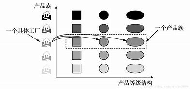
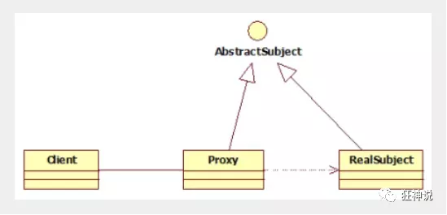

# JAVA设计模式


# spring用到的设计模式

## 设计模式大概

spring就是一个把设计模式用的淋漓尽致的经典框架，其实从类的命令就可以看得出来

| 设计模式名称 | 举例                  |
| ------------ | --------------------- |
| 工厂模式     | BeanFactory           |
| 装饰者模式   | BeanWrapper           |
| 代理模式     | AopProxy              |
| 委派模式     | DispatcherServlet     |
| 策略模式     | HanderMapping         |
| 适配器模式   | HanderAdapter         |
| 模板模式     | JdbcTemplate          |
| 观察者模式   | ContextLoaderListener |
|              |                       |

 多种设计模式混合使用 **3 3 4**组合

|    类型    | 名称       | 英文              |
| :--------: | ---------- | ----------------- |
|            | 工厂模式   | Factory Pattern   |
| 创建者模式 | 单例模式   | Singleton Pattern |
|            | 原型模式   | Prototype Pattern |
|            | 适配器模式 | Adapter Pattern   |
| 结构型模式 | 装饰者模式 | Decorator Pattern |
|            | 代理模式   | Proxy Pattern     |
|            | 策略模式   | Strategy Pattern  |
|  行为模式  | 模板模式   | Template Pattern  |
|            | 委派模式   | Delegate Pattern  |
|            | 观察者模式 | Observer Pattern  |

## 工厂模式

### 简单工厂模式

简单工厂模式，有一个工厂对象决定创建哪一类产品类的实例，不属于GoF的23中的设计模式，简单工厂适用于工厂类负责创建的对象较少的场景，且客户端，只需要传入工厂参数，对于如何创建对象不需要关心。

```java
package Factory;

//定义产品接口
public interface Product {
    public void setproduct1();
    public void setproduct2();
}

```

```java
package Factory;
//生产商品
public class Product1 implements Product {
    @Override
    public void setproduct1() {
        System.out.println(" Product1    setproduct1");
    }

    @Override
    public void setproduct2() {
        System.out.println(" Product1    setproduct1");
    }
}

```

```java
package Factory;

public class Product2 implements Product {
    @Override
    public void setproduct1() {
        System.out.println(" Product2    setproduct1");
    }

    @Override
    public void setproduct2() {
        System.out.println(" Product2    setproduct2");
    }
}

```

```java
package Factory;

public  class SimpleFactory {
//工厂负责生产商品
    public static  Product setProduct(String type){
        if("product1".equals(type)){
            return new Product1();
        }else if("product1".equals(type)){
            return new Product2();
        }else{
            return null;
        }
    }
}

```

测试

```java
package Factory;

//简单工厂模式 违背了开闭原则  设计模式分为 创建型 结构性 行为性
public class FactoryMain {
    public static void main(String[] args) {
       Product p= SimpleFactory.setProduct("product1");
       p.setproduct1();
    }
}

```

对简单工厂继续优化，使用反射技术。

```java
package Factory;

public  class SimpleFactory {

    public static  Product setProduct(String type){
        try {
            if("product1".equals(type)){
                return  (Product) Class.forName("Factory.Product1").newInstance();

            }else if("product1".equals(type)){
                return (Product) Class.forName("Factory.Product2").newInstance();
            }else{
                System.err.println("工厂没有此方法");
                return null;
            }
        }catch (Exception e){
            e.printStackTrace();
        }
        return null;
    }
}

```

方法参数是字符串，可控性有待提升，而且还需要强制转型。

再次优化

```java
    public static  Product setProduct(Class<? extends Product> product){
        try {
            if(null!=product){
                return product.newInstance();
            }
        }catch (Exception e){
            e.printStackTrace();
        }
        return null;
    }
```

测试方法

```java
package Factory;

public class FactoryMain {
    public static void main(String[] args) {
        Product p= SimpleFactory.setProduct(Product1.class);
        p.setproduct1();
    }
}

```

### 工厂模式

工厂模式是指定义一个创建对象的一个接口，但让实现这个接口的类来决定实例化哪个类，工厂方法模式让类的实例化推迟到子类中进行，在工厂方法模式中用户只需要关心所需产品对应的工厂，无须关心创建的细节，而且加入新的商品时符合开闭原则。

**专门人干专门事 ** 

Java课程由Java工厂创建，Python课程由Python工厂创建

```java
//定义一个接口
public interface ICourseFactorty{
    ICourse create();
}
```

课程的接口

```java
package Factory2;

public interface ICourse {
    public void record();
}

```

课程的实现类

```java
package Factory2;

public class JavaCourse implements ICourse {
    @Override
    public void record() {
        System.out.println("java课程");
    }
}


package Factory2;

public class PythonCourse implements ICourse {
    @Override
    public void record() {
        System.out.println("Python课程");
    }
}

```

在创建子工厂，JavaCourseFactory类的代码

```java
public class JavaCourseFactory implements ICourseFactorty{
    public ICourse create(){
        retrurn new JavaCourse();
    };
}
```

创建 PythonCourseFactory

```java
package Factory2;

public class PythonCourseFactory implements ICourseFactory {
    @Override
    public ICourse create() {
        return new PythonCourse();
    }
}

```

测试

```java
package Factory2;


public class MainTest {
    public static void main(String[] args) {
        ICourseFactory iCourseFactory=new PythonCourseFactory();
        ICourse iCourse=iCourseFactory.create();
        iCourse.record();
        //Python课程
    }
}
```

工厂方式模式适用于以下场景

1. 创建对象需要大量重复的代码。

2. 客户端不依赖与产品类实例如何被创建。如何被实现等细节。

3. 一个类通过其子类来创建哪个对象。

缺点

1. 类的个数容易过多，增加复杂度。

2. 增加了系统的抽象性和理解难度。

### 抽象工厂模式



抽象工厂模式提供一个创建一系列相关或者相互依赖对象的接口，无须指定他们的具体类，客户端不依赖与产品类实例如何被创建。如何被实现等细节，强调的是一系列相关的产品类型（属于同一产品族），一起使用创建对象需要大量重复的代码。需要提供一个产品类库，所有的产品以同样的接口出现，从而使客户端不依赖于具体实现。

```java
1
package abastract;

public interface CourseFactory {
    INote createNote();
    IVideo cretaVideo();
}

2
package abastract;

//笔记
public  interface  INote{
    //编写
    void edit();
}


3
package abastract;

//视频
public interface IVideo
{
    //唱片
  void record();
}


4
package abastract;

public class JavaNote implements INote {
    @Override
    public void edit() {
        System.out.println("编写Java笔记");
    }
}
5
package abastract;

public class JavaVideo implements IVideo {
    @Override
    public void record() {
        System.out.println("录制Java视频");
    }
}
6
package abastract;

public class JavaCourseFactory implements CourseFactory {
    @Override
    public INote createNote() {
        return new JavaNote();
    }

    @Override
    public IVideo cretaVideo() {
        return new JavaVideo();
    }
}
7
package abastract;

public class PythonNote  implements INote{
    @Override
    public void edit() {
        System.out.println("编写Python笔记");
    }
}
8
package abastract;

public class PythonVideo implements IVideo {
    @Override
    public void record() {
        System.out.println("录制Python视频");
    }
}

9
package abastract;

public class PythonCourseFactory implements CourseFactory {
    @Override
    public IVideo cretaVideo() {
        return new PythonVideo();
    }

    @Override
    public INote createNote() {
        return new PythonNote();
    }
}


//测试
package abastract;

public class MainTest {
    public static void main(String[] args) {
        JavaCourseFactory jc=new JavaCourseFactory();
        jc.createNote().edit();
        jc.cretaVideo().record();
        System.out.println("/////////////////////");
        PythonCourseFactory pc=new PythonCourseFactory();
        pc.createNote().edit();
        pc.cretaVideo().record();
    }


}


```

## 单例模式

### 饿汉式单例模式

饿汉式单例模式在类加载的时候就立即初始化，并且创建单例模式，他绝对线程安全，在线程还没出现以前就实例化，不可能存在访问安全问题。

优点：没有加任何锁，执行效率高，用户体验比懒汉式单例模式好。

缺点：类加载的时候就初始化，不管用与不用都占用空间，浪费内存

例子；

spring中的IoC容器ApplicationContext本身就是典型的饿汉式单例模式，

**Spring ApplicationContext 容器 **

Application Context 是 BeanFactory 的子接口，也被称为 Spring 上下文。

Application Context 是 spring 中较高级的容器。和 BeanFactory 类似，它可以加载配置文件中定义的 bean，将所有的 bean 集中在一起，当有请求的时候分配 bean。 另外，它增加了企业所需要的功能，比如，从属性文件中解析文本信息和将事件传递给所指定的监听器。这个容器在 org.springframework.context.ApplicationContext interface 接口中定义。

ApplicationContext 包含 BeanFactory 所有的功能，一般情况下，相对于 BeanFactory，ApplicationContext 会更加优秀。当然，BeanFactory 仍可以在轻量级应用中使用，比如移动设备或者基于 applet 的应用程序。

最常被使用的 ApplicationContext 接口实现：

- **FileSystemXmlApplicationContext**：该容器从 XML 文件中加载已被定义的 bean。在这里，你需要提供给构造器 XML 文件的完整路径。
- **ClassPathXmlApplicationContext**：该容器从 XML 文件中加载已被定义的 bean。在这里，你不需要提供 XML 文件的完整路径，只需正确配置 CLASSPATH 环境变量即可，因为，容器会从 CLASSPATH 中搜索 bean 配置文件。
- **WebXmlApplicationContext**：该容器会在一个 web 应用程序的范围内加载在 XML 文件中已被定义的 bean。

例子第一种

```java
package singleton;

//第一种写法
public class HungrySingleton {
    //建立私有构造器，防止类实例化
    private HungrySingleton(){};

    private static  final HungrySingleton hungrySingleton=new HungrySingleton();

    public static  HungrySingleton getInstance(){
        return hungrySingleton;
    }

    public void print(){
        System.out.println("我是HungrySingleton中的方法");
    }
}

```

第二种

 **静态代码块**：执行优先级高于非静态的初始化块，它会在类初始化的时候执行一次，执行完成便销毁，它仅能初始化类变量，即static修饰的数据成员。**随着类的加载而执行，而且只执行一次**

```java
package singleton;

public class HungrySingleton2 {
    private HungrySingleton2(){ };
    private static  final HungrySingleton2 hungrySingleton2;
    //静态代码块形式
    static {
        hungrySingleton2=new HungrySingleton2();
    }

    public static HungrySingleton2  getInstance(){
        return hungrySingleton2;
    }

}
```

测试

```java
package singleton;

public class MainTest {
    public static void main(String[] args) {
      HungrySingleton hungrySingleton=  HungrySingleton.getInstance();
      hungrySingleton.print();
        HungrySingleton hungrySingleton1=HungrySingleton.getInstance();
        if(hungrySingleton.hashCode()==hungrySingleton1.hashCode()){
            System.out.println("true");
        }
    }
}
```

### 懒汉式单例模式

懒汉式单例模式优点：被外部类调用的时候，内部类才会被加载

```java
package singleton;

public class LazySimpleSingleton {
    private LazySimpleSingleton(){};
    private static  LazySimpleSingleton lazy=null;
    public  static LazySimpleSingleton getInstance(){
        if(lazy==null){
            lazy=new LazySimpleSingleton();
        }
        return lazy;
    }
}

```

```java
package singleton;

public class ExectorThread implements  Runnable {
    @Override
    public void run() {
        LazySimpleSingleton singleton=LazySimpleSingleton.getInstance();
        System.out.println(Thread.currentThread().getName()+":"+singleton);
    }
}


```


测试

```java
package singleton;

public class LazySimpleSingletonTest {
    public static void main(String[] args) {
        Thread t1=new Thread(new ExectorThread());
        Thread t2=new Thread(new ExectorThread());
        t1.start();
        t2.start();
        System.out.println("End");
    }
}

```

这种方式有一定概率会出现两种不同的结果，意味着上面的线程存在安全隐患

在这里例子里 LazySimpleSingleton 被实例了两次，有时我们得到的运行结果可能相同的两个对象，实际上是被后面执行的线程覆盖了，我们看到一个假象，线程安全隐患依旧存在。

优化代码 加上一个synchronized

```java
package singleton;

public class LazySimpleSingleton {
    private LazySimpleSingleton(){};
    private static  LazySimpleSingleton lazy=null;
    public synchronized  static LazySimpleSingleton getInstance(){
        if(lazy==null){
            lazy=new LazySimpleSingleton();
        }
        return lazy;
    }
}

```

这样，当其中一个线程执行并调用了getInstance()方法时，另一个线程在调用getInstance() 线程的状态有运行状态转为阻塞状态，直到第一个线程执行完，第二个线程才恢复继续调用getInstance()方法，至此线程的安全问题解决了。

但是在线程比较多的情况下，如果CPU的分配的压力上升，则会导致大批线程阻塞，从而导致程序的性能大大降低，下面再次进行优化，既能见过线程安全又能提高程序性能。

```java
package singleton;

public class LazySimpleSingleton {
    private LazySimpleSingleton(){};
    private static  LazySimpleSingleton lazy=null;
    public    static LazySimpleSingleton getInstance(){
        if(lazy==null){
            synchronized(LazySimpleSingleton.class){
                if(lazy==null){
                    lazy=new LazySimpleSingleton();
                }
            }
        }
        return lazy;
    }
}

```

当第一个线程调用getInstance()方法时，第二个线程也可以调用，当第一个线程执行到synchronized是会上锁，第二个线程就会变成MONITOR 状态，出现阻塞，此时，阻塞并不是基于整个LazySimpleSingleton类的阻塞，而是在getInstance()方法内部的阻塞，只要逻辑不复杂，对于调用者是感觉不到的。

(了解)

反射破坏单例

序列化破坏单例

注册式单例模式

## 原型设计模式

原型实例指定创建对象的种类，并且通过赋值这些原型建立新的对象

原型模式适应的场景

1. 类初始化消耗的资源较多
2. 使用new 生成一个对象需要非常繁琐的过程
3. 构造函数比较复杂
4. 在循环体中产生大量对象

例子：浅克隆

```java
//创建原型接口
public interface Prototype {
    Prototype clone();
}
```

创建需要克隆的类

```java
package prototype;

import java.util.List;

//需要克隆的类
public class ConcreatePrototypeA implements Prototype {

    private  int age;
    private  String name;
    private List hobbies;

    public int getAge() {
        return age;
    }

    public void setAge(int age) {
        this.age = age;
    }

    public String getName() {
        return name;
    }

    public void setName(String name) {
        this.name = name;
    }

    public List getHobbies() {
        return hobbies;
    }

    public void setHobbies(List hobbies) {
        this.hobbies = hobbies;
    }

    @Override
    public String toString() {
        return "ConcreatePrototypeA{" +
                "age=" + age +
                ", name='" + name + '\'' +
                ", hobbies=" + hobbies +
                '}';
    }

    @Override
    public Prototype clone() {
        ConcreatePrototypeA concreatePrototypeA=new ConcreatePrototypeA();
        concreatePrototypeA.setAge(this.age);
        concreatePrototypeA.setHobbies(this.hobbies);
        concreatePrototypeA.setName(this.name);
        return concreatePrototypeA;
    }
}
```

创建克隆的工具类

```java
package prototype;

public class Client {
    private Prototype prototype;
    public Client(Prototype prototype){
        this.prototype=prototype;
    }
    public Prototype startClone(Prototype concretePrototype){
        return concretePrototype.clone();
    }
}
```

测试用的类

```java
package prototype;

import java.util.ArrayList;
import java.util.List;

public class MainTest {
    public static void main(String[] args) {
        ConcreatePrototypeA concreatePrototypeA=new ConcreatePrototypeA();
        concreatePrototypeA.setAge(12);
        concreatePrototypeA.setName("杨某某");
        List<String>  hobbies=new ArrayList<>();
        hobbies.add("足球");
        hobbies.add("音乐");
        hobbies.add("代码");
        concreatePrototypeA.setHobbies(hobbies);
        //准备克隆
        Client client=new Client(concreatePrototypeA);
        //把克隆对象放入克隆的工具类
        ConcreatePrototypeA concreatePrototypeA1=(ConcreatePrototypeA) client.startClone(concreatePrototypeA);
        System.out.println(concreatePrototypeA.toString());
        System.out.println(concreatePrototypeA1.toString());
        System.out.println(concreatePrototypeA.getHobbies()==concreatePrototypeA1.getHobbies());

    }
}

```

result

ConcreatePrototypeA{age=12, name='杨某某', hobbies=[足球, 音乐, 代码]}
ConcreatePrototypeA{age=12, name='杨某某', hobbies=[足球, 音乐, 代码]}

true

补充 **’ ==‘  比较的是地址，而equals()比较的是对象内容**

hobbies引用地址是相同的，意味着复制的不是值，而是引用地址。这样，我们要是修改任意一个对象的属性值，concreatePrototypeA 与concreatePrototypeA1的值都会改变，这就是浅克隆，所有引用的对象仍然指向原来的对象。

下面例子：深克隆

创建原型猴子类

```java
package prototype.deepprotoype;

import java.util.Date;

public class Monkey {
    public int heigth;
    public  int weight;
    public Date birthday;
}
```

创建引用对象金箍棒

```java
package prototype.deepprotoype;

import java.io.Serializable;

public class JinGuBang implements Serializable {
    public float h=100;
    public float d=10;
    public void big(){
        this.d*=2;
        this.h*=2;
    }
    public void small(){
        this.d/=2;
        this.h/=2;
    }
}
```

创建具体的对象，齐天大圣关于为什么实现 Cloneable, Serializable 参考 https://blog.csdn.net/xiaomingdetianxia/article/details/74453033


ObjectOutputStream 将 Java 对象的基本数据类型和图形写入 OutputStream。可以使用 ObjectInputStream 读取（重构）对象。通过在流中使用文件可以实现对象的持久存储。如果流是网络套接字流，则可以在另一台主机上或另一个进程中重构对象。

只能将支持 java.io.Serializable 接口的对象写入流中。每个 serializable 对象的类都被编码，编码内容包括类名和类签名、对象的字段值和数组值，以及从初始对象中引用的其他所有对象的闭包。

| 分类       | 字节输入流           | 字节输出流            | 字符输入流        | 字符输出流         |
| ---------- | -------------------- | --------------------- | ----------------- | ------------------ |
| 抽象基类   | InputStream          | OutputStream          | Reader            | Writer             |
| 访问文件   | FileInputStream      | FileOutputStream      | FileReader        | FileWriter         |
| 访问数组   | ByteArrayInputStream | ByteArrayOutputStream | CharArrayReader   | CharArrayWriter    |
| 访问管道   | PipedInputStream     | PipedOutputStream     | PipedReader       | PipedWriter        |
| 访问字符串 |                      |                       | StringReader      | StringWriter       |
| 缓冲流     | BufferedInputStream  | BufferedOutputStream  | BufferedReader    | BufferedWriter     |
| 转换流     |                      |                       | InputStreamReader | OutputStreamWriter |
| 对象流     | ObjectInputStream    | ObjectOutputStream    |                   |                    |
| 抽象基类   | FilterInputStream    | FilterOutputStream    | FilterReader      | FilterWriter       |
| 打印流     |                      | PrintStream           |                   | PrintWriter        |
| 推回输入流 | PushbackInputStream  |                       | PushbackReader    |                    |
| 特殊流     | DataInputStream      | DataOutputStream      |                   |                    |

```java
package prototype.deepprotoype;

import java.io.*;
import java.util.Date;

public class QiTianDaSheng extends Monkey implements Cloneable, Serializable {

    public JinGuBang jinGuBang;

    public QiTianDaSheng(){
        this.birthday=new Date();
        this.jinGuBang=new JinGuBang();
    }

    @Override
    protected Object clone() throws CloneNotSupportedException {
        return this.deepClone();
    }

    //深拷贝
    public Object deepClone(){
        try{
            //新建一个字节数组输出流
            ByteArrayOutputStream bos=new ByteArrayOutputStream();
            ObjectOutputStream oos=new ObjectOutputStream(bos);
            oos.writeObject(this);

            ByteArrayInputStream bis=new ByteArrayInputStream(bos.toByteArray());
            ObjectInputStream ois=new ObjectInputStream(bis);

            QiTianDaSheng copy=(QiTianDaSheng)ois.readObject();
            copy.birthday=new Date();
            return copy;
        }catch (Exception e){
            e.printStackTrace();
            return null;
        }
    }
    //浅拷贝
    public QiTianDaSheng shallowClone(QiTianDaSheng target){
        QiTianDaSheng qiTianDaSheng=new QiTianDaSheng();
        qiTianDaSheng.birthday=new Date();
        qiTianDaSheng.heigth=target.heigth;
        qiTianDaSheng.jinGuBang=target.jinGuBang;
        qiTianDaSheng.weight=target.weight;
        return qiTianDaSheng;

    }

}
```

测试方法：

```java
package prototype.deepprotoype;

public class MainTest {

    public static void main(String[] args) {
        QiTianDaSheng qiTianDaSheng=new QiTianDaSheng();
        try {
            QiTianDaSheng clone=(QiTianDaSheng)qiTianDaSheng.clone();
            System.out.println("深拷贝："+(qiTianDaSheng.jinGuBang==clone.jinGuBang));
            clone.jinGuBang.big();
            System.out.println("深拷贝前："+ qiTianDaSheng.jinGuBang.h);
            //拷贝之后的对象有自己地址，改变之后，不改变之前克隆的对象
            System.out.println("深拷贝后："+ clone.jinGuBang.h);


        }catch (Exception e){
            e.printStackTrace();
        }
        QiTianDaSheng q=new QiTianDaSheng();
        QiTianDaSheng n=q.shallowClone(q);
        System.out.println("浅拷贝:"+(n.jinGuBang==q.jinGuBang));

    }
}
```

result

深拷贝：false
深拷贝前：100.0
深拷贝后：200.0
浅拷贝:true

Process finished with exit code 0

这里可以体现出，深拷贝不是引用的地址，拷贝后对象的值变了，对象本身也没有改变。

## 代理模式

应用场景，是指为其他对象提供一种代理，以控制对这个对象的访问

代理对象在客户端和目标对象之间起到中介作用，代理模式属于结构行设计，使用代理模式主要有两个目的，一是保护对象，二是增强目标对象。

代理模式

为什么要学习代理模式，因为AOP的底层机制就是动态代理！

代理模式：

- 静态代理
- 动态代理

学习aop之前 , 我们要先了解一下代理模式！




### 静态代理

**静态代理角色分析**

- 抽象角色 : 一般使用接口或者抽象类来实现

- 真实角色 : 被代理的角色

- 代理角色 : 代理真实角色 ; 代理真实角色后 , 一般会做一些附属的操作 .

- 客户  :  使用代理角色来进行一些操作 .

  

**代码实现**

Rent . java 即抽象角色

```java
//抽象角色：租房
public interface Rent {
   public void rent();
}
```

Host . java 即真实角色

```java
//真实角色: 房东，房东要出租房子
public class Host implements Rent{
   public void rent() {
       System.out.println("房屋出租");
  }
}
```

Proxy . java 即代理角色

```java
//代理角色：中介
public class Proxy implements Rent {

   private Host host;
   public Proxy() { }
   public Proxy(Host host) {
       this.host = host;
  }

   //租房
   public void rent(){
       seeHouse();
       host.rent();
       fare();
  }
   //看房
   public void seeHouse(){
       System.out.println("带房客看房");
  }
   //收中介费
   public void fare(){
       System.out.println("收中介费");
  }
}
```

Client . java 即客户

```java
//客户类，一般客户都会去找代理！
public class Client {
   public static void main(String[] args) {
       //房东要租房
       Host host = new Host();
       //中介帮助房东
       Proxy proxy = new Proxy(host);

       //你去找中介！
       proxy.rent();
  }
}
```

分析：在这个过程中，你直接接触的就是中介，就如同现实生活中的样子，你看不到房东，但是你依旧租到了房东的房子通过代理，这就是所谓的代理模式，程序源自于生活，所以学编程的人，一般能够更加抽象的看待生活中发生的事情。

**静态代理的好处:**

- 可以使得我们的真实角色更加纯粹 . 不再去关注一些公共的事情 .
- 公共的业务由代理来完成 . 实现了业务的分工 ,
- 公共业务发生扩展时变得更加集中和方便 .

缺点 :

- 类多了 , 多了代理类 , 工作量变大了 . 开发效率降低 .

我们想要静态代理的好处，又不想要静态代理的缺点，所以 , 就有了动态代理 !


> #### 静态代理再理解

同学们练习完毕后，我们再来举一个例子，巩固大家的学习！

练习步骤：

1、创建一个抽象角色，比如咋们平时做的用户业务，抽象起来就是增删改查！

```java
//抽象角色：增删改查业务
public interface UserService {
   void add();
   void delete();
   void update();
   void query();
}
```

2、我们需要一个真实对象来完成这些增删改查操作

```java
//真实对象，完成增删改查操作的人
public class UserServiceImpl implements UserService {

   public void add() {
       System.out.println("增加了一个用户");
  }

   public void delete() {
       System.out.println("删除了一个用户");
  }

   public void update() {
       System.out.println("更新了一个用户");
  }

   public void query() {
       System.out.println("查询了一个用户");
  }
}
```

3、需求来了，现在我们需要增加一个日志功能，怎么实现！

- 思路1 ：在实现类上增加代码 【麻烦！】
- 思路2：使用代理来做，能够不改变原来的业务情况下，实现此功能就是最好的了！

4、设置一个代理类来处理日志！代理角色

```java
//代理角色，在这里面增加日志的实现
public class UserServiceProxy implements UserService {
   private UserServiceImpl userService;

   public void setUserService(UserServiceImpl userService) {
       this.userService = userService;
  }

   public void add() {
       log("add");
       userService.add();
  }

   public void delete() {
       log("delete");
       userService.delete();
  }

   public void update() {
       log("update");
       userService.update();
  }

   public void query() {
       log("query");
       userService.query();
  }

   public void log(String msg){
       System.out.println("执行了"+msg+"方法");
  }

}
```

5、测试访问类：

```java
public class Client {
   public static void main(String[] args) {
       //真实业务
       UserServiceImpl userService = new UserServiceImpl();
       //代理类
       UserServiceProxy proxy = new UserServiceProxy();
       //使用代理类实现日志功能！
       proxy.setUserService(userService);

       proxy.add();
  }
}
```

OK，到了现在代理模式大家应该都没有什么问题了，重点大家需要理解其中的思想；

我们在不改变原来的代码的情况下，实现了对原有功能的增强，这是AOP中最核心的思想

聊聊AOP：纵向开发，横向开发


### 动态代理

- 动态代理的角色和静态代理的一样 .

- 动态代理的代理类是动态生成的 . 静态代理的代理类是我们提前写好的

- 动态代理分为两类 : 一类是基于接口动态代理 , 一类是基于类的动态代理

- - 基于接口的动态代理----JDK动态代理
  - 基于类的动态代理--cglib
  - 现在用的比较多的是 javasist 来生成动态代理 . 百度一下javasist
  - 我们这里使用JDK的原生代码来实现，其余的道理都是一样的！、

**JDK的动态代理需要了解两个类**

核心 : InvocationHandler   和   Proxy  ， 打开JDK帮助文档看看

【InvocationHandler：调用处理程序】

```
Object invoke(Object proxy, 方法 method, Object[] args)；
//参数
//proxy - 调用该方法的代理实例
//method -所述方法对应于调用代理实例上的接口方法的实例。方法对象的声明类将是该方法声明的接口，它可以是代理类继承该方法的代理接口的超级接口。
//args -包含的方法调用传递代理实例的参数值的对象的阵列，或null如果接口方法没有参数。原始类型的参数包含在适当的原始包装器类的实例中，例如java.lang.Integer或java.lang.Boolean 。
```

【Proxy  : 代理】

```java
//生成代理类
public Object getProxy(){
   return Proxy.newProxyInstance(this.getClass().getClassLoader(),
                                 rent.getClass().getInterfaces(),this);
}
```

**代码实现** 

抽象角色和真实角色和之前的一样！

Rent . java 即抽象角色

```java
//抽象角色：租房
public interface Rent {
   public void rent();
}
```

Host . java 即真实角色

```java
//真实角色: 房东，房东要出租房子
public class Host implements Rent{
   public void rent() {
       System.out.println("房屋出租");
  }
}
```

ProxyInvocationHandler. java 即代理角色

```java
public class ProxyInvocationHandler implements InvocationHandler {
   private Rent rent;

   public void setRent(Rent rent) {
       this.rent = rent;
  }

   //生成代理类，重点是第二个参数，获取要代理的抽象角色！之前都是一个角色，现在可以代理一类角色
   public Object getProxy(){
       return Proxy.newProxyInstance(this.getClass().getClassLoader(),
               rent.getClass().getInterfaces(),this);
  }

   // proxy : 代理类 method : 代理类的调用处理程序的方法对象.
   // 处理代理实例上的方法调用并返回结果
   @Override
   public Object invoke(Object proxy, Method method, Object[] args) throwsThrowable {
       seeHouse();
       //核心：本质利用反射实现！
       Object result = method.invoke(rent, args);
       fare();
       return result;
  }

   //看房
   public void seeHouse(){
       System.out.println("带房客看房");
  }
   //收中介费
   public void fare(){
       System.out.println("收中介费");
  }

}
```

Client . java

```java
//租客
public class Client {

   public static void main(String[] args) {
       //真实角色
       Host host = new Host();
       //代理实例的调用处理程序
       ProxyInvocationHandler pih = new ProxyInvocationHandler();
       pih.setRent(host); //将真实角色放置进去！
       Rent proxy = (Rent)pih.getProxy(); //动态生成对应的代理类！
       proxy.rent();
  }

}
```

核心：**一个动态代理 , 一般代理某一类业务 , 一个动态代理可以代理多个类，代理的是接口！、**


> #### 深化理解

我们来使用动态代理实现代理我们后面写的UserService！

我们也可以编写一个通用的动态代理实现的类！所有的代理对象设置为Object即可！

JDK代理

```java
public class ProxyInvocationHandler implements InvocationHandler {
   private Object target;

   public void setTarget(Object target) {
       this.target = target;
  }

   //生成代理类
   public Object getProxy(){
       return Proxy.newProxyInstance(this.getClass().getClassLoader(),
               target.getClass().getInterfaces(),this);
  }

   // proxy : 代理类
   // method : 代理类的调用处理程序的方法对象.
   public Object invoke(Object proxy, Method method, Object[] args) throwsThrowable {
       log(method.getName());
       Object result = method.invoke(target, args);
       return result;
  }

   public void log(String methodName){
       System.out.println("执行了"+methodName+"方法");
  }

}
```

测试！

```java
public class Test {
   public static void main(String[] args) {
       //真实对象
       UserServiceImpl userService = new UserServiceImpl();
       //代理对象的调用处理程序
       ProxyInvocationHandler pih = new ProxyInvocationHandler();
       pih.setTarget(userService); //设置要代理的对象
       UserService proxy = (UserService)pih.getProxy(); //动态生成代理类！
       proxy.delete();
  }
}
```

测试，增删改查，查看结果！

JDK 动态代理使用起来非常简单，但是它也有一定的局限性，这是因为 JDK 动态代理必须要实现一个或多个接口，如果不希望实现接口，则可以使用 CGLIB 代理。

sub：cglib生成的代理对象，method：被代理对象方法，objects：方法入参，methodProxy:代理方法

解压 Spring 的核心包 spring-core-3.2.2.RELEASE.jar

```java
package DynamicSynProxy;

public class GoodsDao {
    public void add() {
        System.out.println("添加商品...");
    }
    public void update() {
        System.out.println("修改商品...");
    }
    public void delete() {
        System.out.println("删除商品...");
    }
    public void find() {
        System.out.println("修改商品...");
    }
}

```

```java
package DynamicSynProxy;

import org.springframework.cglib.proxy.Enhancer;
import org.springframework.cglib.proxy.MethodInterceptor;
import org.springframework.cglib.proxy.MethodProxy;

import java.lang.reflect.Method;

public class MyBeanFactory {

    public static GoodsDao getBean() {
        // 准备目标类
        final GoodsDao goodsDao = new GoodsDao();
        //生成代理类，CGLIB在运行时，生成指定对象的子类，增强
        Enhancer enhancer=new Enhancer();
        enhancer.setSuperclass(goodsDao.getClass());
        // 添加回调函数
        enhancer.setCallback(new MethodInterceptor() {
            // intercept 相当于 jdk invoke，前三个参数与 jdk invoke—致
            @Override
            public Object intercept(Object proxy, Method method, Object[] args,
                                    MethodProxy methodProxy) throws Throwable {
                // 前增强
                System.out.println( proxy.getClass().getName());
                System.out.println("前置增强");
                Object obj = method.invoke(goodsDao, args); // 目标方法执行
               // 后增强
                System.out.println("后置增强");
                return obj;
            }
        });
        // 创建代理类
        GoodsDao goodsDaoProxy = (GoodsDao) enhancer.create();
        return goodsDaoProxy;
    }
}
```

测试

```java
package DynamicSynProxy;

public class CGLIBProxyTest {
    public static void main(String[] args) {
        GoodsDao goodsDao = MyBeanFactory.getBean();
        // 执行方法
        goodsDao.add();
        goodsDao.update();
        goodsDao.delete();
        goodsDao.find();
    }
}
```

result
DynamicSynProxy.GoodsDao$$EnhancerByCGLIB$$5e9d916e
前置增强
添加商品...
后置增强
DynamicSynProxy.GoodsDao$$EnhancerByCGLIB$$5e9d916e
前置增强
修改商品...
后置增强
DynamicSynProxy.GoodsDao$$EnhancerByCGLIB$$5e9d916e
前置增强
删除商品...
后置增强
DynamicSynProxy.GoodsDao$$EnhancerByCGLIB$$5e9d916e
前置增强
修改商品...
后置增强

Process finished with exit code 0

> 深入理解改成通用

```java
package DynamicSynProxy;

import org.springframework.cglib.proxy.Enhancer;
import org.springframework.cglib.proxy.MethodInterceptor;
import org.springframework.cglib.proxy.MethodProxy;

import java.lang.reflect.Method;

public class MyBeanFactory {

    public final static Object getBean(Object target) {
  
        //生成代理类，CGLIB在运行时，生成指定对象的子类，增强
        //定义一个切面类
        // final MyAspect myAspect = new MyAspect();
        Enhancer enhancer=new Enhancer();
        enhancer.setSuperclass(target.getClass());
        // 添加回调函数
        enhancer.setCallback(new MethodInterceptor() {
            // intercept 相当于 jdk invoke，前三个参数与 jdk invoke—致
            @Override
            public Object intercept(Object proxy, Method method, Object[] args,
                                    MethodProxy methodProxy) throws Throwable {
                //myAspect.myBefore(); // 前增强
                System.out.println( proxy.getClass().getName());
                System.out.println("前置增强");
                Object obj = method.invoke(target, args); // 目标方法执行
               // myAspect.myAfter(); // 后增强
                System.out.println("后置增强");
                return obj;
            }
        });
        // 创建代理类
        Object targetresult =enhancer.create();
        return targetresult;
    }
}
```

测试

```java
package DynamicSynProxy;

public class CGLIBProxyTest {
    public static void main(String[] args) {
        GoodsDao goodsDao = (GoodsDao) MyBeanFactory.getBean(new GoodsDao());
        // 执行方法
        goodsDao.add();
        goodsDao.update();
        goodsDao.delete();
        goodsDao.find();
    }
}
```

结果与第一次一致

> ##### 动态代理的好处

静态代理有的它都有，静态代理没有的，它也有！

- 可以使得我们的真实角色更加纯粹 . 不再去关注一些公共的事情 .
- 公共的业务由代理来完成 . 实现了业务的分工 ,
- 公共业务发生扩展时变得更加集中和方便 .
- 一个动态代理 , 一般代理某一类业务
- 一个动态代理可以代理多个类，代理的是接口！

### 静态代理与动态代理的区别

1. 静态代理只能通过手工完成代理操作，如果被代理类增加了方法，代理类需要同步增加，违背了开闭原则
2. 动态代理采用运行在运行中生成代码的方式，取消了对呗打理类的扩展限制，遵循开闭原则
3. 若动态代理要对目标类的逻辑增强或扩展，结合策略模式，只需要新增策略类便可完成，无需修改代理类的代码。

## 委派模式

委派模式属于23中设计，委派模式的基本作用就是负责调用和分配，跟代理模式很像，代理模式注重过程，委派模式注重结果。

【例子】

老板给项目经理下达任务，项目经理会根据实际情况给每个员工分配任务，待员工完成后，再由项目经理向老板汇报情况。

例子

定义一个做事接口

```java
package delegate;

public interface IEmployee {
    void doing(String command);
}
```

定义A员工做的事情

```java
package delegate;

public class EmployeeA implements IEmployee {
    @Override
    public void doing(String command) {
        System.out.println("我是员工A"+command);
    }
}
```

定义B员工做的事情

```java
package delegate;

public class EmployeeB implements IEmployee {
    @Override
    public void doing(String command) {
        System.out.println("我是员工B"+command);
    }
}
```

定义经理分配任务

```java
package delegate;

import java.util.HashMap;
import java.util.Map;

public class Leader implements IEmployee {
    private Map<String,IEmployee> target=new HashMap<String, IEmployee>();

    public Leader(){
        target.put("修电脑",new EmployeeA());
        target.put("修手机",new EmployeeB());
    }

    @Override
    public void doing(String command) {
        target.get(command).doing(command);
    }
}
```

定义老板命令指令

```java
package delegate;

public class Boss  {
    public void command(String command,Leader leader){
        leader.doing(command);
    }
}
```

测试

```java
package delegate;

public class MainTest {
    public static void main(String[] args) {
        new Boss().command("修电脑",new Leader());
    }
}
```

首先老板下达修电脑的命令给leader经理。然后经理根据自己的员工职务，分配任务。

在整个 Spring MVC 框架中，DispatcherServlet 处于核心位置，它负责协调和组织不同组件完成请求处理并返回响应工作。DispatcherServlet 是 SpringMVC统一的入口，所有的请求都通过它。DispatcherServlet 是前端控制器，配置在web.xml文件中，Servlet依自已定义的具体规则拦截匹配的请求，分发到目标Controller来处理。 初始化 DispatcherServlet时，该框架在web应用程序WEB-INF目录中寻找一个名为[servlet-名称]-servlet.xml的文件，并在那里定义相关的Beans，重写在全局中定义的任何Beans。

这里就用到委派模式，以delegate结尾的地方都实现了委派模式

## 策略模式 

策略模式是指在定义了算法家族并分别封装起来，让他们之间可以互相替换，此模式使得算法的变化不会影响使用算法的用户

策略模式的应用场景

1. 系统中还有很多类，而他们的区别仅仅在于行为不同
2. 一个系统需要动态的在几种算法中选择一种

打折接口

```java
package strategy;

public interface PromotionStrategy {
    void doPromotion();
}
```

```java
package strategy;

public class CashbackStrategy implements PromotionStrategy {
    @Override
    public void doPromotion() {
        System.out.println("返现促销，返回的钱打到支付宝账号上");
    }
}
```

两种优惠策略的实现类

```java
package strategy;

//优惠券方式
public class CouponStrategy implements PromotionStrategy {
    @Override
    public void doPromotion() {
        System.out.println("领取优惠劵，课程的价格通过优惠劵来打折");
    }
}
```

没有优惠策略的实现类

```java
package strategy;

public class EmptyStrategy implements PromotionStrategy {
    @Override
    public void doPromotion() {
        System.out.println("没有打折活动");
    }
}
```

促销活动，促销活动要选择优惠的策略

```java
package strategy;

public class PromotionActivity {
        private PromotionStrategy promotionStrategy;
        public PromotionActivity(PromotionStrategy promotionStrategy){
            this.promotionStrategy=promotionStrategy;
        }
        public void execute(){
            promotionStrategy.doPromotion();
        }
}
```

```java
package strategy;

import java.util.HashMap;
import java.util.Map;

//促销活动的方案类 结合单例模式与工厂模式
public class PromotionStrategyFactory {
    private static Map<String,PromotionStrategy> target=new HashMap<>();
    public static final PromotionStrategy NO_PROMOTION=new EmptyStrategy();
    //防止工厂类初始化
    private PromotionStrategyFactory(){}
    private interface PromotionKey{
        String COUPON="COUPON";
        String CASHBACK="CASHBACK";
    }
    //饿汉式单例模式
    static {
        target.put(PromotionKey.COUPON,new  CouponStrategy());
        target.put(PromotionKey.CASHBACK,new CashbackStrategy());
    }
    public static PromotionStrategy getPromotionStrategy(String promotionKey){
        PromotionStrategy promotionStrategy=target.get(promotionKey);
        return promotionStrategy==null?NO_PROMOTION:promotionStrategy;
    }
}
```

测试类

```java
package strategy;

public class MainTest {
    public static void main(String[] args) {
        String promotionKey="COUPON";
        PromotionActivity promotionActivity=
                new PromotionActivity(PromotionStrategyFactory.getPromotionStrategy(promotionKey));
          promotionActivity.execute();

    }
}
```

在spring中应用的策略模式 有一个InstantiationStrategy接口

策略模式的优点：

符合开闭原则

避免使用过多的重复的语句 如 if else switch语句

使用策略模式可以提高算法的保密性和安全性

缺点：

客户端必须知道所有的策略。并且自行决定使用哪个策略类

代码中产生非常多的策略类，增加了代码的维护难度

# 告一段落

