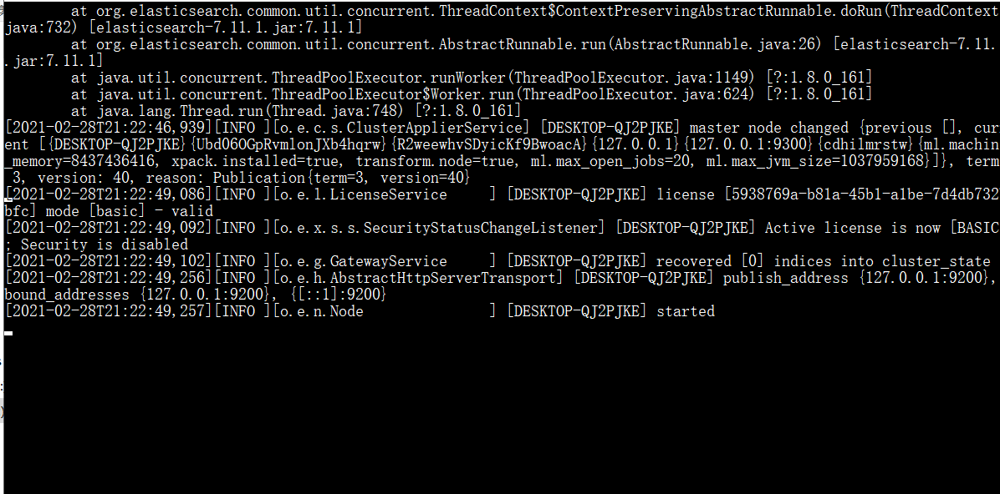
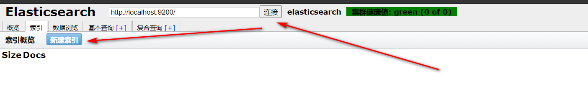

# ElasticSearch 

**全文搜索 结构化搜索 分析**

是一个搜索的中间件，可以集成在项目中，增加查询的速度与数据量，文件存储系统。

在学习ElasticSearch之前，先简单了解一下**Lucene**：

- **Doug Cutting开发**
- 是**apache软件基金会**4 jakarta项目组的一个子项目
- 是一个**开放源代码**的**全文检索引擎工具包**
- **不是一个完整的全文检索引擎，而是一个全文检索引擎的架构**，提供了完整的查询引擎和索引引擎，部分[文本分析](https://baike.baidu.com/item/文本分析/11046544)引擎（英文与德文两种西方语言）
- 当前以及最近几年最受欢迎的**免费Java信息检索程序库**。

**Lucene和ElasticSearch的关系：**

- ElasticSearch是基于Lucene 做了一下封装和增强

单个 Elastic 实例称为一个节点（node）。一组节点构成一个集群（cluster）。

环境准备

nodejs

java环境（注意版本不能太低）

## 步骤（尽量放在一起）

下载elasticsearch的压缩包然后解压 默认端口号 9200   http://localhost:9200/

> https://www.elastic.co/cn/downloads/elasticsearch

1. `bin 启动文件目录`
2. `config 配置文件目录`
3. `    1og4j2 日志配置文件`
4. `    jvm.options java 虚拟机相关的配置(默认启动占1g内存，内容不够需要自己调整)`
5. `    elasticsearch.ym1 elasticsearch 的配置文件! 默认9200端口!跨域!`
6. `1ib `
7. `    相关jar包`
8. `modules 功能模块目录`
9. `plugins 插件目录`
10. ik分词器

下载elasticsearch的前端平台

> http://mobz.github.io/elasticsearch-head/

进入文件，安装依赖，然后启动前端页面的服务

```shell
cd elasticsearch-head
 `# 安装依赖`
npm install
 `# 启动`
npm run start
 `# 访问`
http://localhost:9100/
```

1. 解决跨域问题

   elasticsearch.yml

   ```yml
   # 开启跨域
   http.cors.enabled: true
   # 所有人访问
   http.cors.allow-origin: "*"
   ```

   重启服务

   




- 如果你是初学者

  - 索引 可以看做 “数据库”
  - 类型 可以看做 “表”
  - 文档 可以看做 “库中的数据（表中的行）”

- 这个head，我们只是把它

  当做可视化数据展示工具

  ，之后

  所有的查询都在kibana中进行

  - 因为不支持json格式化，不方便


> ### 安装kibana

Kibana是一个针对ElasticSearch的开源分析及可视化平台,用来搜索、查看交互存储在Elasticsearch索引中的数据。使用Kibana ,可以通过各种图表进行高级数据分析及展示。Kibana让海量数据更容易理解。它操作简单,基于浏览器的用户界面可以快速创建仪表板( dashboard )实时显示Elasticsearch查询动态。设置Kibana非常简单。无需编码或者额外的基础架构,几分钟内就可以完成Kibana安装并启动Elasticsearch索引监测。

#### 1、下载地址:

> 下载的版本需要与ElasticSearch版本对应

https://www.elastic.co/cn/downloads/

历史版本下载：https://www.elastic.co/cn/downloads/past-releases/

#### 2、安装

解压即可（尽量将ElasticSearch相关工具放在统一目录下）

然后启动访问  http://localhost:5601/

不习惯英文可以改为中文


E:\elasticsearch\kibana-7.11.1-windows-x86_64\config   在config中配置的kibana.yml配置

```yml
#修改为中文编码
i18n.locale: "zh-CN"
```

#### 3、IK 分词器

### 2、安装

> ik文件夹是自己创建的

加压即可（但是我们需要解压到ElasticSearch的plugins目录ik文件夹下）


### 3、重启ElasticSearch

> 加载了IK分词器


### 4、使用 `ElasticSearch安装补录/bin/elasticsearch-plugin` 可以查看插件

```
E:\ElasticSearch\elasticsearch-7.6.1\bin>elasticsearch-plugin list
```


### 5、使用kibana测试

`ik_smart`：最少切分


`ik_max_word`：最细粒度划分（穷尽词库的可能）


> 从上面看，感觉分词都比较正常，但是大多数，分词都满足不了我们的想法，如下例


> 那么，我们需要手动将该词添加到分词器的词典当中

### 6、添加自定义的词添加到扩展字典中

```
elasticsearch目录/plugins/ik/config/IKAnalyzer.cfg.xml
```


打开 `IKAnalyzer.cfg.xml` 文件，扩展字典


创建字典文件，添加字典内容


重启ElasticSearch，再次使用kibana测试


## 使用kibana操作elasticsearch 

使用resful风格

**一种软件架构风格**,而不是标准,只是提供了一组设计原则和约束条件。它主要用于客户端和服务器交互类的软件。基于这个风格设计的软件可以**更简洁**，**更有层次**，**更易于实现缓存**等机制。

### **基本Rest命令说明：**

|      method      |                     url地址                     |          描述          |
| :--------------: | :---------------------------------------------: | :--------------------: |
| PUT（创建,修改） |     localhost:9200/索引名称/类型名称/文档id     | 创建文档（指定文档id） |
|   POST（创建）   |        localhost:9200/索引名称/类型名称         | 创建文档（随机文档id） |
|   POST（修改）   | localhost:9200/索引名称/类型名称/文档id/_update |        修改文档        |
|  DELETE（删除）  |     localhost:9200/索引名称/类型名称/文档id     |        删除文档        |
|   GET（查询）    |     localhost:9200/索引名称/类型名称/文档id     |   查询文档通过文档ID   |
|   POST（查询）   | localhost:9200/索引名称/类型名称/文档id/_search |      查询所有数据      |

#### 1、创建一个索引，添加

```json
PUT /test1/type1/1
{
  "name" : "流柚",
  "age" : 18
}
```


 

#### 2、字段数据类型

- 字符串类型

  - text、

    keyword

    - text：支持分词，全文检索,支持模糊、精确查询,不支持聚合,排序操作;text类型的最大支持的字符长度无限制,适合大字段存储；
    - keyword：不进行分词，直接索引、支持模糊、支持精确匹配，支持聚合、排序操作。keyword类型的最大支持的长度为——32766个UTF-8类型的字符,可以通过设置ignore_above指定自持字符长度，超过给定长度后的数据将不被索引，无法通过term精确匹配检索返回结果。

- 数值型

  - long、Integer、short、byte、double、float、**half float**、**scaled float**

- 日期类型

  - date

- te布尔类型

  - boolean

- 二进制类型

  - binary

- 等等…

#### 3、指定字段的类型（使用PUT）

> 类似于建库（建立索引和字段对应类型），也可看做规则的建立

```json
PUT /test2
{
  "mappings": {
    "properties": {
      "name": {
        "type": "text"
      },
      "age":{
        "type": "long"
      },
      "birthday":{
        "type": "date"
      }
    }
  }
}
```

 

#### 4、获取3建立的规则

```
GET test2
```

 

#### 5、获取默认信息

> `_doc` 默认类型（default type），type 在未来的版本中会逐渐弃用，因此产生一个默认类型进行代替

```json
PUT /test3/_doc/1
{
  "name": "流柚",
  "age": 18,
  "birth": "1999-10-10"
}
GET test3
```

 

> 如果自己的文档字段没有被指定，那么ElasticSearch就会给我们默认配置字段类型

扩展：通过`get _cat/` 可以获取ElasticSearch的当前的很多信息！

```
GET _cat/indicesGET _cat/aliasesGET _cat/allocationGET _cat/countGET _cat/fielddataGET _cat/healthGET _cat/indicesGET _cat/masterGET _cat/nodeattrsGET _cat/nodesGET _cat/pending_tasksGET _cat/pluginsGET _cat/recoveryGET _cat/repositoriesGET _cat/segmentsGET _cat/shardsGET _cat/snapshotsGET _cat/tasksGET _cat/templatesGET _cat/thread_pool
```

#### 6、修改

> 两种方案

①旧的（使用put覆盖原来的值）

- 版本+1（_version）
- 但是如果漏掉某个字段没有写，那么更新是没有写的字段 ，会消失

```json
PUT /test3/_doc/1
{
  "name" : "流柚是我的大哥",
  "age" : 18,
  "birth" : "1999-10-10"
}
GET /test3/_doc/1
// 修改会有字段丢失
PUT /test3/_doc/1
{
  "name" : "流柚"
}
GET /test3/_doc/1
```

 

 

②新的（使用post的update）

- version不会改变
- 需要注意doc
- 不会丢失字段


7.11.1版本以后的修改按照7.11.1

```json
POST test1/_update/1
{
  "doc":{
      "name":"李四",
      "age":20
  }
}
```

7.6.x

```json
POST /test3/_doc/1/_update
{
  "doc":{
    "name" : "post修改，version不会加一",
    "age" : 2
  }
}
GET /test3/_doc/1
```

 

#### 7、删除

```
GET /test1DELETE /test1
```

 

 

#### 8、查询（简单条件）

```
GET /test3/_doc/_search?q=name:流柚
```

 

#### 9、复杂查询

> test3索引中的内容

 

##### ①查询匹配

- `match`：匹配（会使用分词器解析（先分析文档，然后进行查询））
- `_source`：过滤字段
- `sort`：排序
- `form`、`size` 分页

```json
 // 查询匹配
  GET /blog/user/_search
  {
    "query":{
      "match":{
        "name":"流"
      }
    }
    ,
    "_source": ["name","desc"]
    ,
    "sort": [
      {
        "age": {
          "order": "asc"
        }
      }
    ]
    ,
    "from": 0
    ,
    "size": 1
  }
```

 

##### ②多条件查询（bool）

- `must` 相当于 `and`
- `should` 相当于 `or`
- `must_not` 相当于 `not (... and ...)`
- `filter` 过滤

```json
/// bool 多条件查询
//// must <==> and
//// should <==> or
//// must_not <==> not (... and ...)
//// filter数据过滤
//// boost
//// minimum_should_match
GET /blog/user/_search
{
  "query":{
    "bool": {
      "must": [
        {
          "match":{
            "age":3
          }
        },
        {
          "match": {
            "name": "流"
          }
        }
      ],
      "filter": {
        "range": {
          "age": {
            "gte": 1,
            "lte": 3
          }
        }
      }
    }
  }
}
```

 

##### ③匹配数组

- 貌似不能与其它字段一起使用
- 可以多关键字查（空格隔开）— 匹配字段也是符合的
- `match` 会使用分词器解析（先分析文档，然后进行查询）
- 搜词

```json
// 匹配数组 貌似不能与其它字段一起使用
// 可以多关键字查（空格隔开）
// match 会使用分词器解析（先分析文档，然后进行查询）
GET /blog/user/_search
{
  "query":{
    "match":{
      "desc":"年龄 牛 大"
    }
  }
}
```

 

##### ④精确查询

- `term` 直接通过 倒排索引 指定**词条**查询
- 适合查询 number、date、keyword ，不适合text

```json
// 精确查询（必须全部都有，而且不可分，即按一个完整的词查询）
// term 直接通过 倒排索引 指定的词条 进行精确查找的
GET /blog/user/_search
{
  "query":{
    "term":{
      "desc":"年 "
    }
  }
}
```

 

##### ⑤text和keyword

- text：
  - **支持分词**，**全文检索**、支持模糊、精确查询,不支持聚合,排序操作;
  - text类型的最大支持的字符长度无限制,适合大字段存储；
- keyword：
  - **不进行分词**，**直接索引**、支持模糊、支持精确匹配，支持聚合、排序操作。
  - keyword类型的最大支持的长度为——32766个UTF-8类型的字符,可以通过设置ignore_above指定自持字符长度，超过给定长度后的数据将不被索引，**无法通过term精确匹配检索返回结果**。

```json
// 测试keyword和text是否支持分词
// 设置索引类型
PUT /test
{
  "mappings": {
    "properties": {
      "text":{
        "type":"text"
      },
      "keyword":{
        "type":"keyword"
      }
    }
  }
}
// 设置字段数据
PUT /test/_doc/1
{
  "text":"测试keyword和text是否支持分词",
  "keyword":"测试keyword和text是否支持分词"
}
// text 支持分词
// keyword 不支持分词
GET /test/_doc/_search
{
  "query":{
   "match":{
      "text":"测试"
   }
  }
}// 查的到
GET /test/_doc/_search
{
  "query":{
   "match":{
      "keyword":"测试"
   }
  }
}// 查不到，必须是 "测试keyword和text是否支持分词" 才能查到
GET _analyze
{
  "analyzer": "keyword",
  "text": ["测试liu"]
}// 不会分词，即 测试liu
GET _analyze
{
  "analyzer": "standard",
  "text": ["测试liu"]
}// 分为 测 试 liu
GET _analyze
{
  "analyzer":"ik_max_word",
  "text": ["测试liu"]
}// 分为 测试 liu
```

##### ⑥高亮查询

```json
/// 高亮查询
GET blog/user/_search
{
  "query": {
    "match": {
      "name":"流"
    }
  }
  ,
  "highlight": {
    "fields": {
      "name": {}
    }
  }
}
// 自定义前缀和后缀
GET blog/user/_search
{
  "query": {
    "match": {
      "name":"流"
    }
  }
  ,
  "highlight": {
    "pre_tags": "<p class='key' style='color:red'>",
    "post_tags": "</p>", 
    "fields": {
      "name": {}
    }
  }
}
```

 

# 六、SpringBoot整合

### 1、创建工程

略

**目录结构**


### 2、导入依赖

> 注意依赖版本和安装的版本一致

```xml
<properties>
    <java.version>1.8</java.version>
    <!-- 统一版本 -->
    <elasticsearch.version>7.11.1</elasticsearch.version>
</properties>
```

**导入elasticsearch**

```xml
<dependency>
    <groupId>org.springframework.boot</groupId>
    <artifactId>spring-boot-starter-data-elasticsearch</artifactId>
</dependency>
```

**提前导入fastjson、lombok**

```xml
<dependency>
    <groupId>com.alibaba</groupId>
    <artifactId>fastjson</artifactId>
    <version>1.2.70</version>
</dependency>
<!-- lombok需要安装插件 -->
<dependency>
    <groupId>org.projectlombok</groupId>
    <artifactId>lombok</artifactId>
    <optional>true</optional>
</dependency>
```

### 3、创建并编写配置类

```java
@Configuration
public class ElasticSearchConfig {
    // 注册 rest高级客户端 
    @Bean
    public RestHighLevelClient restHighLevelClient(){
        RestHighLevelClient client = new RestHighLevelClient(
                RestClient.builder(
                        new HttpHost("127.0.0.1",9200,"http")
                )
        );
        return client;
    }
}
```

### 4、创建并编写实体类

```java
@Data
@NoArgsConstructor
@AllArgsConstructor
public class User implements Serializable {
    private static final long serialVersionUID = -3843548915035470817L;
    private String name;
    private Integer age;
}
```

### 5、测试

> 所有测试均在 `SpringbootElasticsearchApplicationTests`中编写

#### 注入 `RestHighLevelClient`

```java
@Autowired
public RestHighLevelClient restHighLevelClient;
```

#### 索引的操作

##### 1、索引的创建

```java
// 测试索引的创建， Request PUT liuyou_index
@Test
public void testCreateIndex() throws IOException {
    CreateIndexRequest request = new CreateIndexRequest("liuyou_index");
    CreateIndexResponse response = restHighLevelClient.indices().create(request, RequestOptions.DEFAULT);
    System.out.println(response.isAcknowledged());// 查看是否创建成功
    System.out.println(response);// 查看返回对象
    restHighLevelClient.close();
}
```

##### 2、索引的获取，并判断其是否存在

```java
// 测试获取索引，并判断其是否存在
@Test
public void testIndexIsExists() throws IOException {
    GetIndexRequest request = new GetIndexRequest("index");
    boolean exists = restHighLevelClient.indices().exists(request, RequestOptions.DEFAULT);
    System.out.println(exists);// 索引是否存在
    restHighLevelClient.close();
}
```

##### 3、索引的删除

```java
// 测试索引删除
@Test
public void testDeleteIndex() throws IOException {
    DeleteIndexRequest request = new DeleteIndexRequest("liuyou_index");
    AcknowledgedResponse response = restHighLevelClient.indices().delete(request, RequestOptions.DEFAULT);
    System.out.println(response.isAcknowledged());// 是否删除成功
    restHighLevelClient.close();
}
```

#### 文档的操作

##### 1、文档的添加

```java
// 测试添加文档(先创建一个User实体类，添加fastjson依赖)
@Test
public void testAddDocument() throws IOException {
    // 创建一个User对象
    User liuyou = new User("liuyou", 18);
    // 创建请求
    IndexRequest request = new IndexRequest("liuyou_index");
    // 制定规则 PUT /liuyou_index/_doc/1
    request.id("1");// 设置文档ID
    request.timeout(TimeValue.timeValueMillis(1000));// request.timeout("1s")
    // 将我们的数据放入请求中
    request.source(JSON.toJSONString(liuyou), XContentType.JSON);
    // 客户端发送请求，获取响应的结果
    IndexResponse response = restHighLevelClient.index(request, RequestOptions.DEFAULT);
    System.out.println(response.status());// 获取建立索引的状态信息 CREATED
    System.out.println(response);// 查看返回内容 IndexResponse[index=liuyou_index,type=_doc,id=1,version=1,result=created,seqNo=0,primaryTerm=1,shards={"total":2,"successful":1,"failed":0}]
}
```

##### 2、文档信息的获取

```java
// 测试获得文档信息
@Test
public void testGetDocument() throws IOException {
    GetRequest request = new GetRequest("liuyou_index","1");
    GetResponse response = restHighLevelClient.get(request, RequestOptions.DEFAULT);
    System.out.println(response.getSourceAsString());// 打印文档内容
    System.out.println(request);// 返回的全部内容和命令是一样的
    restHighLevelClient.close();
}
```

##### 3、文档的获取，并判断其是否存在

```java
// 获取文档，判断是否存在 get /liuyou_index/_doc/1
@Test
public void testDocumentIsExists() throws IOException {
    GetRequest request = new GetRequest("liuyou_index", "1");
    // 不获取返回的 _source的上下文了
    request.fetchSourceContext(new FetchSourceContext(false));
    request.storedFields("_none_");
    boolean exists = restHighLevelClient.exists(request, RequestOptions.DEFAULT);
    System.out.println(exists);
}
```

##### 4、文档的更新

```java
// 测试更新文档内容
@Test
public void testUpdateDocument() throws IOException {
    UpdateRequest request = new UpdateRequest("liuyou_index", "1");
    User user = new User("lmk",11);
    request.doc(JSON.toJSONString(user),XContentType.JSON);
    UpdateResponse response = restHighLevelClient.update(request, RequestOptions.DEFAULT);
    System.out.println(response.status()); // OK
    restHighLevelClient.close();
}
```

##### 5、文档的删除

```java
// 测试删除文档
@Test
public void testDeleteDocument() throws IOException {
    DeleteRequest request = new DeleteRequest("liuyou_index", "1");
    request.timeout("1s");
    DeleteResponse response = restHighLevelClient.delete(request, RequestOptions.DEFAULT);
    System.out.println(response.status());// OK
}
```

##### 6、文档的查询

```java
// 查询
// SearchRequest 搜索请求
// SearchSourceBuilder 条件构造
// HighlightBuilder 高亮
// TermQueryBuilder 精确查询
// MatchAllQueryBuilder
// xxxQueryBuilder ...
@Test
public void testSearch() throws IOException {
    // 1.创建查询请求对象
    SearchRequest searchRequest = new SearchRequest();
    // 2.构建搜索条件
    SearchSourceBuilder searchSourceBuilder = new SearchSourceBuilder();
    // (1)查询条件 使用QueryBuilders工具类创建
    // 精确查询
    TermQueryBuilder termQueryBuilder = QueryBuilders.termQuery("name", "liuyou");
    //        // 匹配查询
    //        MatchAllQueryBuilder matchAllQueryBuilder = QueryBuilders.matchAllQuery();
    // (2)其他<可有可无>：（可以参考 SearchSourceBuilder 的字段部分）
    // 设置高亮
    searchSourceBuilder.highlighter(new HighlightBuilder());
    //        // 分页
    //        searchSourceBuilder.from();
    //        searchSourceBuilder.size();
    searchSourceBuilder.timeout(new TimeValue(60, TimeUnit.SECONDS));
    // (3)条件投入
    searchSourceBuilder.query(termQueryBuilder);
    // 3.添加条件到请求
    searchRequest.source(searchSourceBuilder);
    // 4.客户端查询请求
    SearchResponse search = restHighLevelClient.search(searchRequest, RequestOptions.DEFAULT);
    // 5.查看返回结果
    SearchHits hits = search.getHits();
    System.out.println(JSON.toJSONString(hits));
    System.out.println("=======================");
    for (SearchHit documentFields : hits.getHits()) {
        System.out.println(documentFields.getSourceAsMap());
    }
}
```

##### 前面的操作都无法批量添加数据

```java
// 上面的这些api无法批量增加数据（只会保留最后一个source）
@Test
public void test() throws IOException {
    IndexRequest request = new IndexRequest("bulk");// 没有id会自动生成一个随机ID
    request.source(JSON.toJSONString(new User("liu",1)),XContentType.JSON);
    request.source(JSON.toJSONString(new User("min",2)),XContentType.JSON);
    request.source(JSON.toJSONString(new User("kai",3)),XContentType.JSON);
    IndexResponse index = restHighLevelClient.index(request, RequestOptions.DEFAULT);
    System.out.println(index.status());// created
}
```

##### 7、批量添加数据

```java
// 特殊的，真的项目一般会 批量插入数据
@Test
public void testBulk() throws IOException {
    BulkRequest bulkRequest = new BulkRequest();
    bulkRequest.timeout("10s");
    ArrayList<User> users = new ArrayList<>();
    users.add(new User("liuyou-1",1));
    users.add(new User("liuyou-2",2));
    users.add(new User("liuyou-3",3));
    users.add(new User("liuyou-4",4));
    users.add(new User("liuyou-5",5));
    users.add(new User("liuyou-6",6));
    // 批量请求处理
    for (int i = 0; i < users.size(); i++) {
        bulkRequest.add(
                // 这里是数据信息
                new IndexRequest("bulk")
                        .id(""+(i + 1)) // 没有设置id 会自定生成一个随机id
                        .source(JSON.toJSONString(users.get(i)),XContentType.JSON)
        );
    }
    BulkResponse bulk = restHighLevelClient.bulk(bulkRequest, RequestOptions.DEFAULT);
    System.out.println(bulk.status());// ok
}
```

# ElasticSearch实战

## 防京东商城搜索（高亮）

### 1、工程创建（springboot）

创建过程略

**目录结构**

 

### 2、基本编码

#### ①导入依赖

```xml
<properties>
    <java.version>1.8</java.version>
    <elasticsearch.version>7.6.1</elasticsearch.version>
</properties>
<dependencies>
    <!-- jsoup解析页面 -->
    <!-- 解析网页 爬视频可 研究tiko -->
    <dependency>
        <groupId>org.jsoup</groupId>
        <artifactId>jsoup</artifactId>
        <version>1.10.2</version>
    </dependency>
    <!-- fastjson -->
    <dependency>
        <groupId>com.alibaba</groupId>
        <artifactId>fastjson</artifactId>
        <version>1.2.70</version>
    </dependency>
    <!-- ElasticSearch -->
    <dependency>
        <groupId>org.springframework.boot</groupId>
        <artifactId>spring-boot-starter-data-elasticsearch</artifactId>
    </dependency>
    <!-- thymeleaf -->
    <dependency>
        <groupId>org.springframework.boot</groupId>
        <artifactId>spring-boot-starter-thymeleaf</artifactId>
    </dependency>
    <!-- web -->
    <dependency>
        <groupId>org.springframework.boot</groupId>
        <artifactId>spring-boot-starter-web</artifactId>
    </dependency>
    <!-- devtools热部署 -->
    <dependency>
        <groupId>org.springframework.boot</groupId>
        <artifactId>spring-boot-devtools</artifactId>
        <scope>runtime</scope>
        <optional>true</optional>
    </dependency>
    <!--  -->
    <dependency>
        <groupId>org.springframework.boot</groupId>
        <artifactId>spring-boot-configuration-processor</artifactId>
        <optional>true</optional>
    </dependency>
    <!-- lombok 需要安装插件 -->
    <dependency>
        <groupId>org.projectlombok</groupId>
        <artifactId>lombok</artifactId>
        <optional>true</optional>
    </dependency>
    <!-- test -->
    <dependency>
        <groupId>org.springframework.boot</groupId>
        <artifactId>spring-boot-starter-test</artifactId>
        <scope>test</scope>
    </dependency>
</dependencies>
```

#### ②导入前端素材

略

#### ③编写 `application.preperties`配置文件

```yml
# 更改端口，防止冲突
server.port=9999
# 关闭thymeleaf缓存
spring.thymeleaf.cache=false
```

#### ④测试controller和view

```java
@Controller
public class IndexController {
    @GetMapping({"/","index"})
    public String index(){
        return "index";
    }
}
```

访问 localhost:9999


> 到这里可以先去编写爬虫，编写之后，回到这里

#### ⑤编写Config

```java
@Configurationpublic class ElasticSearchConfig {  
    @Bean  
    public RestHighLevelClient restHighLevelClient(){     
        RestHighLevelClient client = new RestHighLevelClient(RestClient.builder(
            new HttpHost("127.0.0.1",9200,"http")  )        
        );     
        return client;    
    }
}
```

#### ⑥编写service

> 因为是爬取的数据，那么就不走Dao，以下编写都不会编写接口，开发中必须严格要求编写

**ContentService**

```java
@Service
public class ContentService {
    @Autowired
    private RestHighLevelClient restHighLevelClient;
    // 1、解析数据放入 es 索引中
    public Boolean parseContent(String keyword) throws IOException {
        // 获取内容
        List<Content> contents = HtmlParseUtil.parseJD(keyword);
        // 内容放入 es 中
        BulkRequest bulkRequest = new BulkRequest();
        bulkRequest.timeout("2m"); // 可更具实际业务是指
        for (int i = 0; i < contents.size(); i++) {
            bulkRequest.add(
                    new IndexRequest("jd_goods")
                            .id(""+(i+1))
                            .source(JSON.toJSONString(contents.get(i)), XContentType.JSON)
            );
        }
        BulkResponse bulk = restHighLevelClient.bulk(bulkRequest, RequestOptions.DEFAULT);
        restHighLevelClient.close();
        return !bulk.hasFailures();
    }
        // 2、根据keyword分页查询结果
    public List<Map<String, Object>> search(String keyword, Integer pageIndex, Integer pageSize) throws IOException {
        if (pageIndex < 0){
            pageIndex = 0;
        }
        SearchRequest jd_goods = new SearchRequest("jd_goods");
        // 创建搜索源建造者对象
        SearchSourceBuilder searchSourceBuilder = new SearchSourceBuilder();
        // 条件采用：精确查询 通过keyword查字段name
        TermQueryBuilder termQueryBuilder = QueryBuilders.termQuery("name", keyword);
        searchSourceBuilder.query(termQueryBuilder);
        searchSourceBuilder.timeout(new TimeValue(60, TimeUnit.SECONDS));// 60s
        // 分页
        searchSourceBuilder.from(pageIndex);
        searchSourceBuilder.size(pageSize);
        // 高亮
        // ....
        // 搜索源放入搜索请求中
        jd_goods.source(searchSourceBuilder);
        // 执行查询，返回结果
        SearchResponse searchResponse = restHighLevelClient.search(jd_goods, RequestOptions.DEFAULT);
        restHighLevelClient.close();
        // 解析结果
        SearchHits hits = searchResponse.getHits();
        List<Map<String,Object>> results = new ArrayList<>();
        for (SearchHit documentFields : hits.getHits()) {
            Map<String, Object> sourceAsMap = documentFields.getSourceAsMap();
            results.add(sourceAsMap);
        }
        // 返回查询的结果
        return results;
    }
}
```

#### ⑦编写controller

```java
@Controller
public class ContentController {
    @Autowired
    private ContentService contentService;
    @ResponseBody
    @GetMapping("/parse/{keyword}")
    public Boolean parse(@PathVariable("keyword") String keyword) throws IOException {
        return contentService.parseContent(keyword);
    }
    @ResponseBody
    @GetMapping("/search/{keyword}/{pageIndex}/{pageSize}")
    public List<Map<String, Object>> parse(@PathVariable("keyword") String keyword,
                                           @PathVariable("pageIndex") Integer pageIndex,
                                           @PathVariable("pageSize") Integer pageSize) throws IOException {
        return contentService.search(keyword,pageIndex,pageSize);
    }
}
```

#### ⑧测试结果

##### 1、解析数据放入 es 索引中


 

##### 2、根据keyword分页查询结果


### 3、爬虫（jsoup）

> 数据获取：数据库、消息队列、爬虫、…

#### ①搜索京东搜索页面，并分析页面

```
http://search.jd.com/search?keyword=java
```

##### 页面如下

 

##### 审查页面元素

**页面列表id：J_goodsList**

 

**目标元素：img、price、name**

 

#### ②爬取数据（获取请求返回的页面信息，筛选出可用的）

##### 创建HtmlParseUtil，并简单编写

```java
public class HtmlParseUtil {
    public static void main(String[] args) throws IOException {
        /// 使用前需要联网
        // 请求url
        String url = "http://search.jd.com/search?keyword=java";
        // 1.解析网页(jsoup 解析返回的对象是浏览器Document对象)
        Document document = Jsoup.parse(new URL(url), 30000);
        // 使用document可以使用在js对document的所有操作
        // 2.获取元素（通过id）
        Element j_goodsList = document.getElementById("J_goodsList");
        // 3.获取J_goodsList ul 每一个 li
        Elements lis = j_goodsList.getElementsByTag("li");
        // 4.获取li下的 img、price、name
        for (Element li : lis) {
            String img = li.getElementsByTag("img").eq(0).attr("src");// 获取li下 第一张图片
            String name = li.getElementsByClass("p-name").eq(0).text();
            String price = li.getElementsByClass("p-price").eq(0).text();
            System.out.println("=======================");
            System.out.println("img : " + img);
            System.out.println("name : " + name);
            System.out.println("price : " + price);
        }
    }
}
```

**运行结果**


**原因是啥？**

> 一般图片特别多的网站，所有的图片都是通过延迟加载的

```js
Elements lis = j_goodsList.getElementsByTag("li");
System.out.println(lis);
```

打印所有li标签，发现img标签中并没有属性src的设置，只是data-lazy-ing设置图片加载的地址


##### 创建HtmlParseUtil、改写

- 更改图片获取属性为 `data-lazy-img`

- 与实体类结合，实体类如下

  ```java
  @Data
  @AllArgsConstructor
  @NoArgsConstructor
  public class Content implements Serializable {
      private static final long serialVersionUID = -8049497962627482693L;
      private String name;
      private String img;
      private String price;
  }
  ```

- 封装为方法

```java
public class HtmlParseUtil {    public static void main(String[] args) throws IOException {        System.out.println(parseJD("java"));    }    public static List<Content> parseJD(String keyword) throws IOException {        /// 使用前需要联网        // 请求url        String url = "http://search.jd.com/search?keyword=" + keyword;        // 1.解析网页(jsoup 解析返回的对象是浏览器Document对象)        Document document = Jsoup.parse(new URL(url), 30000);        // 使用document可以使用在js对document的所有操作        // 2.获取元素（通过id）        Element j_goodsList = document.getElementById("J_goodsList");        // 3.获取J_goodsList ul 每一个 li        Elements lis = j_goodsList.getElementsByTag("li");//        System.out.println(lis);        // 4.获取li下的 img、price、name        // list存储所有li下的内容        List<Content> contents = new ArrayList<Content>();        for (Element li : lis) {            // 由于网站图片使用懒加载，将src属性替换为data-lazy-img            String img = li.getElementsByTag("img").eq(0).attr("data-lazy-img");// 获取li下 第一张图片            String name = li.getElementsByClass("p-name").eq(0).text();            String price = li.getElementsByClass("p-price").eq(0).text();            // 封装为对象            Content content = new Content(name,img,price);            // 添加到list中            contents.add(content);        }//        System.out.println(contents);        // 5.返回 list        return contents;    }}public class HtmlParseUtil {
    public static void main(String[] args) throws IOException {
        System.out.println(parseJD("java"));
    }
    public static List<Content> parseJD(String keyword) throws IOException {
        /// 使用前需要联网
        // 请求url
        String url = "http://search.jd.com/search?keyword=" + keyword;
        // 1.解析网页(jsoup 解析返回的对象是浏览器Document对象)
        Document document = Jsoup.parse(new URL(url), 30000);
        // 使用document可以使用在js对document的所有操作
        // 2.获取元素（通过id）
        Element j_goodsList = document.getElementById("J_goodsList");
        // 3.获取J_goodsList ul 每一个 li
        Elements lis = j_goodsList.getElementsByTag("li");
//        System.out.println(lis);
        // 4.获取li下的 img、price、name
        // list存储所有li下的内容
        List<Content> contents = new ArrayList<Content>();
        for (Element li : lis) {
            // 由于网站图片使用懒加载，将src属性替换为data-lazy-img
            String img = li.getElementsByTag("img").eq(0).attr("data-lazy-img");// 获取li下 第一张图片
            String name = li.getElementsByClass("p-name").eq(0).text();
            String price = li.getElementsByClass("p-price").eq(0).text();
            // 封装为对象
            Content content = new Content(name,img,price);
            // 添加到list中
            contents.add(content);
        }
//        System.out.println(contents);
        // 5.返回 list
        return contents;
    }
}
```

**结果展示**


### 4、搜索高亮

> 在3、的基础上添加内容

#### ①ContentService

```java
// 3、 在2的基础上进行高亮查询
public List<Map<String, Object>> highlightSearch(String keyword, Integer pageIndex, Integer pageSize) throws IOException {
    SearchRequest searchRequest = new SearchRequest("jd_goods");
    SearchSourceBuilder searchSourceBuilder = new SearchSourceBuilder();
    // 精确查询，添加查询条件
    TermQueryBuilder termQueryBuilder = QueryBuilders.termQuery("name", keyword);
    searchSourceBuilder.timeout(new TimeValue(60, TimeUnit.SECONDS));
    searchSourceBuilder.query(termQueryBuilder);
    // 分页
    searchSourceBuilder.from(pageIndex);
    searchSourceBuilder.size(pageSize);
    // 高亮 =========
    HighlightBuilder highlightBuilder = new HighlightBuilder();
    highlightBuilder.field("name");
    highlightBuilder.preTags("<span style='color:red'>");
    highlightBuilder.postTags("</span>");
    searchSourceBuilder.highlighter(highlightBuilder);
    // 执行查询
    searchRequest.source(searchSourceBuilder);
    SearchResponse searchResponse = restHighLevelClient.search(searchRequest, RequestOptions.DEFAULT);
    // 解析结果 ==========
    SearchHits hits = searchResponse.getHits();
    List<Map<String, Object>> results = new ArrayList<>();
    for (SearchHit documentFields : hits.getHits()) {
        // 使用新的字段值（高亮），覆盖旧的字段值
        Map<String, Object> sourceAsMap = documentFields.getSourceAsMap();
        // 高亮字段
        Map<String, HighlightField> highlightFields = documentFields.getHighlightFields();
        HighlightField name = highlightFields.get("name");
        // 替换
        if (name != null){
            Text[] fragments = name.fragments();
            StringBuilder new_name = new StringBuilder();
            for (Text text : fragments) {
                new_name.append(text);
            }
            sourceAsMap.put("name",new_name.toString());
        }
        results.add(sourceAsMap);
    }
    return results;
}
```

#### ②ContentController

```java
@ResponseBody
@GetMapping("/h_search/{keyword}/{pageIndex}/{pageSize}")
public List<Map<String, Object>> highlightParse(@PathVariable("keyword") String keyword,
                                       @PathVariable("pageIndex") Integer pageIndex,
                                       @PathVariable("pageSize") Integer pageSize) throws IOException {
    return contentService.highlightSearch(keyword,pageIndex,pageSize);
}
```

#### ③结果展示


### 5、前后端分离（简单使用Vue）

> 删除Controller 方法上的 [@ResponseBody](https://github.com/ResponseBody)注解

 

#### ①下载并引入Vue.min.js和axios.js

> 如果安装了nodejs，可以按如下步骤，没有可以到后面素材处下载

```shell
npm install vue
npm install axios
```


 

 

#### ②修改静态页面

##### 引入js

```js
<script th:src="@{/js/vue.min.js}"></script>
<script th:src="@{/js/axios.min.js}"></script>
```

##### 修改后的index.html

```html
<!DOCTYPE html>
<html xmlns:th="http://www.thymeleaf.org">
<head>
    <meta charset="utf-8"/>
    <title>狂神说Java-ES仿京东实战</title>
    <link rel="stylesheet" th:href="@{/css/style.css}"/>
    <script th:src="@{/js/jquery.min.js}"></script>
</head>
<body class="pg">
<div class="page">
    <div id="app" class=" mallist tmall- page-not-market ">
        <!-- 头部搜索 -->
        <div id="header" class=" header-list-app">
            <div class="headerLayout">
                <div class="headerCon ">
                    <!-- Logo-->
                    <h1 id="mallLogo">
                        
                    </h1>
                    <div class="header-extra">
                        <!--搜索-->
                        <div id="mallSearch" class="mall-search">
                            <form name="searchTop" class="mallSearch-form clearfix">
                                <fieldset>
                                    <legend>天猫搜索</legend>
                                    <div class="mallSearch-input clearfix">
                                        <div class="s-combobox" id="s-combobox-685">
                                            <div class="s-combobox-input-wrap">
                                                <input v-model="keyword"  type="text" autocomplete="off" id="mq"
                                                       class="s-combobox-input"  aria-haspopup="true">
                                            </div>
                                        </div>
                                        <button type="submit" @click.prevent="searchKey" id="searchbtn">搜索</button>
                                    </div>
                                </fieldset>
                            </form>
                            <ul class="relKeyTop">
                                <li><a>狂神说Java</a></li>
                                <li><a>狂神说前端</a></li>
                                <li><a>狂神说Linux</a></li>
                                <li><a>狂神说大数据</a></li>
                                <li><a>狂神聊理财</a></li>
                            </ul>
                        </div>
                    </div>
                </div>
            </div>
        </div>
        <!-- 商品详情页面 -->
        <div id="content">
            <div class="main">
                <!-- 品牌分类 -->
                <form class="navAttrsForm">
                    <div class="attrs j_NavAttrs" style="display:block">
                        <div class="brandAttr j_nav_brand">
                            <div class="j_Brand attr">
                                <div class="attrKey">
                                    品牌
                                </div>
                                <div class="attrValues">
                                    <ul class="av-collapse row-2">
                                        <li><a href="#"> 狂神说 </a></li>
                                        <li><a href="#"> Java </a></li>
                                    </ul>
                                </div>
                            </div>
                        </div>
                    </div>
                </form>
                <!-- 排序规则 -->
                <div class="filter clearfix">
                    <a class="fSort fSort-cur">综合<i class="f-ico-arrow-d"></i></a>
                    <a class="fSort">人气<i class="f-ico-arrow-d"></i></a>
                    <a class="fSort">新品<i class="f-ico-arrow-d"></i></a>
                    <a class="fSort">销量<i class="f-ico-arrow-d"></i></a>
                    <a class="fSort">价格<i class="f-ico-triangle-mt"></i><i class="f-ico-triangle-mb"></i></a>
                </div>
                <!-- 商品详情 -->
                <div class="view grid-nosku" >
                    <div class="product" v-for="result in results">
                        <div class="product-iWrap">
                            <!--商品封面-->
                            <div class="productImg-wrap">
                                <a class="productImg">
                                    
                                </a>
                            </div>
                            <!--价格-->
                            <p class="productPrice">
                                <em v-text="result.price"></em>
                            </p>
                            <!--标题-->
                            <p class="productTitle">
                                <a v-html="result.name"></a>
                            </p>
                            <!-- 店铺名 -->
                            <div class="productShop">
                                <span>店铺： 狂神说Java </span>
                            </div>
                            <!-- 成交信息 -->
                            <p class="productStatus">
                                <span>月成交<em>999笔</em></span>
                                <span>评价 <a>3</a></span>
                            </p>
                        </div>
                    </div>
                </div>
            </div>
        </div>
    </div>
</div>
<script th:src="@{/js/vue.min.js}"></script>
<script th:src="@{/js/axios.min.js}"></script>
<script>
    new Vue({
        el:"#app",
        data:{
            "keyword": '', // 搜索的关键字
            "results":[] // 后端返回的结果
        },
        methods:{
            searchKey(){
                var keyword = this.keyword;
                console.log(keyword);
                axios.get('h_search/'+keyword+'/0/20').then(response=>{
                    console.log(response.data);
                    this.results=response.data;
                })
            }
        }
    });
</script>
</body>
</html>
```

##### 测试

 

# 安装包及前端素材

链接：https://pan.baidu.com/s/1M5uWdYsCZyzIAOcgcRkA_A
提取码：qk8p
复制这段内容后打开百度网盘手机App，操作更方便哦

# 疑惑：

## 1、使用term（精确查询）时，我发现三个问题，问题如下：

- 字段值必须是一个词（索引中存在的词），才能匹配

  - 问题：中文字符串，term查询时无法查询到数据（比如，“编程”两字在文档中存在，但是搜索不到）

  - 原因：索引为配置中文分词器（默认使用standard，即所有中文字符串都会被切分为单个中文汉字作为单词），所以没有超过1个汉字的词，也就无法匹配，进而查不到数据

  - 解决：创建索引时配置中文分词器，如

    ```json
    PUT example{ 
    	"mappings": {   
            "properties": {    
                    "name":{       
                    "type": "text",    
                    "analyzer": "ik_max_word"  // ik分词器   
                        }  
                      }  
                  }
    }
    ```

- 查询的英文字符只能是小写，大写都无效

- 查询时英文单词必须是完整的


## **快速入门**

## **一、基础概念-快速入门**

## **节点 Node、集群 Cluster 和分片 Shards**

ElasticSearch 是分布式数据库，允许多台服务器协同工作，每台服务器可以运行多个实例。单个实例称为一个节点（node），一组节点构成一个集群（cluster）。分片是底层的工作单元，文档保存在分片内，分片又被分配到集群内的各个节点里，每个分片仅保存全部数据的一部分。

## **索引 Index、类型 Type 和文档 Document**

对比我们比较熟悉的 MySQL 数据库：

> index → db
> type → table
> document → row

如果我们要访问一个文档元数据应该包括囊括 `index/type/id` 这三种类型，很好理解。

## **二、使用 RESTful API 与 Elasticsearch 进行交互**

所有其他语言可以使用 RESTful API 通过端口 *9200* 和 Elasticsearch 进行通信，你可以用你最喜爱的 web 客户端访问 Elasticsearch 。一个 Elasticsearch 请求和任何 HTTP 请求一样由若干相同的部件组成：

> ```
> curl -X<VERB> '<PROTOCOL>://<HOST>:<PORT>/<PATH>?<QUERY_STRING>' -d '<BODY>'
> ```

被 `< >` 标记的部件：

**部件名作用**`VERB`适当的 HTTP 方法 或 谓词 : `GET`、 `POST`、 `PUT`、 `HEAD` 或者 `DELETE`。`PROTOCOLhttp` 或者 `https`（如果你在 Elasticsearch 前面有一个 `https` 代理）`HOST`Elasticsearch 集群中任意节点的主机名，或者用 `localhost` 代表本地机器上的节点。`PORT`运行 Elasticsearch HTTP 服务的端口号，默认是 `9200` 。`PATH`API 的终端路径（例如 `_count` 将返回集群中文档数量）。Path 可能包含多个组件，例如：`_cluster/stats` 和 `_nodes/stats/jvm` 。`QUERY_STRING`任意可选的查询字符串参数 (例如 `?pretty` 将格式化地输出 JSON 返回值，使其更容易阅读)`BODY`一个 JSON 格式的请求体 (如果请求需要的话)

就比如计算集群中文档的数量，我们可以用这个:

```json
curl -XGET 'http://localhost:9200/_count?pretty' -d '
{
    "query": {
        "match_all": {}
    }
}
'
```

不过对于安装了 Kibana 的我们，可以直接在 Kibana 的控制台输出以下语句，也是同样的效果：

```json
GET /_count?pretty
{
    "query": {
        "match_all": {}
    }
}
```

## **文档管理（CRUD）**

如果对于 RESTful 不太熟悉的童鞋请右转：[【传送门】](https://link.zhihu.com/?target=https%3A//www.jianshu.com/p/91600da4df95)

**增加：**

```json
POST /db/user/1
{
  "username": "wmyskxz1",
  "password": "123456",
  "age": "22"
}
POST /db/user/2
{
  "username": "wmyskxz2",
  "password": "123456",
  "age": "22"
}
```

这一段代码稍微解释一下，这其实就往索引为 `db` 类型为 `user` 的数据库中插入一条 `id` 为 1 的一条数据，这条数据其实就相当于一个拥有 `username/password/age` 三个属性的一个实体，就是 JSON 数据

执行命令后，Elasticsearch 返回如下数据：

```json
# POST /db/user/1
{
  "_index": "db",
  "_type": "user",
  "_id": "1",
  "_version": 1,
  "result": "created",
  "_shards": {
    "total": 2,
    "successful": 1,
    "failed": 0
  },
  "_seq_no": 2,
  "_primary_term": 1
}

# POST /db/user/2
{
  "_index": "db",
  "_type": "user",
  "_id": "2",
  "_version": 1,
  "result": "created",
  "_shards": {
    "total": 2,
    "successful": 1,
    "failed": 0
  },
  "_seq_no": 1,
  "_primary_term": 1
}
```

`version` 是版本号的意思，当我们执行操作会自动加 1

**删除：**

```json
DELETE /db/user/1
```

Elasticsearch 返回数据如下：

```json
{
  "_index": "db",
  "_type": "user",
  "_id": "1",
  "_version": 2,
  "result": "deleted",
  "_shards": {
    "total": 2,
    "successful": 1,
    "failed": 0
  },
  "_seq_no": 1,
  "_primary_term": 1
}
```

这里就可以看到 `version` 变成了 2

**修改：**

```json
PUT /db/user/2
{
  "username": "wmyskxz3",
  "password": "123456",
  "age": "22"
}
```

Elasticsearch 返回数据如下：

```json
{
  "_index": "db",
  "_type": "user",
  "_id": "2",
  "_version": 2,
  "result": "updated",
  "_shards": {
    "total": 2,
    "successful": 1,
    "failed": 0
  },
  "_seq_no": 2,
  "_primary_term": 1
}
```

**查询：**

```json
GET /db/user/2
```

返回数据如下：

```json
{
  "_index": "db",
  "_type": "user",
  "_id": "2",
  "_version": 2,
  "found": true,
  "_source": {
    "username": "wmyskxz3",
    "password": "123456",
    "age": "22"
  }
}
```

## **搜索**

上面我们已经演示了基本的文档 CRUD 功能，然而 Elasticsearch 的核心功能是搜索，所以在学习之前，为更好的演示这个功能，我们先往 Elasticsearch 中插入一些数据：

```json
PUT /movies/movie/1
{
  "title": "The Godfather",
  "director": "Francis Ford Coppola",
  "year": 1972,
  "genres": [
    "Crime",
    "Drama"
  ]
}

PUT /movies/movie/2
{
  "title": "Lawrence of Arabia",
  "director": "David Lean",
  "year": 1962,
  "genres": [
    "Adventure",
    "Biography",
    "Drama"
  ]
}

PUT /movies/movie/3
{
  "title": "To Kill a Mockingbird",
  "director": "Robert Mulligan",
  "year": 1962,
  "genres": [
    "Crime",
    "Drama",
    "Mystery"
  ]
}

PUT /movies/movie/4
{
  "title": "Apocalypse Now",
  "director": "Francis Ford Coppola",
  "year": 1979,
  "genres": [
    "Drama",
    "War"
  ]
}

PUT /movies/movie/5
{
  "title": "Kill Bill: Vol. 1",
  "director": "Quentin Tarantino",
  "year": 2003,
  "genres": [
    "Action",
    "Crime",
    "Thriller"
  ]
}

PUT /movies/movie/6
{
  "title": "The Assassination of Jesse James by the Coward Robert Ford",
  "director": "Andrew Dominik",
  "year": 2007,
  "genres": [
    "Biography",
    "Crime",
    "Drama"
  ]
}
```

**_search端点**

现在已经把一些电影信息放入了索引，可以通过搜索看看是否可找到它们。 为了使用 ElasticSearch 进行搜索，我们使用 `_search` 端点，可选择使用索引和类型。也就是说，按照以下模式向URL发出请求：`<index>/<type>/_search`。其中，`index` 和 `type` 都是可选的。

换句话说，为了搜索电影，可以对以下任一URL进行POST请求：

- [http://localhost:9200/_search](https://link.zhihu.com/?target=http%3A//localhost%3A9200/_search) - 搜索所有索引和所有类型。
- [http://localhost:9200/movies/_search](https://link.zhihu.com/?target=http%3A//localhost%3A9200/movies/_search) - 在电影索引中搜索所有类型
- [http://localhost:9200/movies/movie/_search](https://link.zhihu.com/?target=http%3A//localhost%3A9200/movies/movie/_search) - 在电影索引中显式搜索电影类型的文档。

**搜索请求正文和ElasticSearch查询DSL**

如果只是发送一个请求到上面的URL，我们会得到所有的电影信息。为了创建更有用的搜索请求，还需要向请求正文中提供查询。 请求正文是一个JSON对象，除了其它属性以外，它还要包含一个名称为 `“query”` 的属性，这就可使用ElasticSearch的查询DSL。

```json
{
    "query": {
        //Query DSL here
    }
}
```

你可能想知道查询DSL是什么。它是ElasticSearch自己基于JSON的域特定语言，可以在其中表达查询和过滤器。你可以把它简单同SQL对应起来，就相当于是条件语句吧。

**基本自由文本搜索：**

查询DSL具有一长列不同类型的查询可以使用。 对于“普通”自由文本搜索，最有可能想使用一个名称为“查询字符串查询”。

[查询字符串查询](https://link.zhihu.com/?target=http%3A//www.elasticsearch.org/guide/reference/query-dsl/query-string-query/)是一个高级查询，有很多不同的选项，ElasticSearch将解析和转换为更简单的查询树。如果忽略了所有的可选参数，并且只需要给它一个字符串用于搜索，它可以很容易使用。

现在尝试在两部电影的标题中搜索有“kill”这个词的电影信息：

```json
GET /_search
{
  "query": {
    "query_string": {
      "query": "kill"
    }
  }
}
```