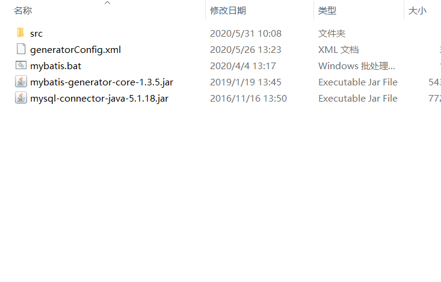

## 引入依赖pom.xml

```xml
 <properties>
        <java.version>1.8</java.version>
    </properties>
    <dependencies>
        <dependency>
            <groupId>org.springframework.boot</groupId>
            <artifactId>spring-boot-starter-security</artifactId>
        </dependency>
        <dependency>
            <groupId>org.springframework.boot</groupId>
            <artifactId>spring-boot-starter-web</artifactId>
        </dependency>

        <dependency>
            <groupId>org.mybatis.spring.boot</groupId>
            <artifactId>mybatis-spring-boot-starter</artifactId>
            <version>1.3.2</version>
        </dependency>

        <dependency>
            <groupId>org.springframework.boot</groupId>
            <artifactId>spring-boot-devtools</artifactId>
            <scope>runtime</scope>
        </dependency>
        <dependency>
            <groupId>mysql</groupId>
            <artifactId>mysql-connector-java</artifactId>
        </dependency>
        <dependency>
            <groupId>org.projectlombok</groupId>
            <artifactId>lombok</artifactId>
            <optional>true</optional>
        </dependency>
        <dependency>
            <groupId>org.springframework.boot</groupId>
            <artifactId>spring-boot-starter-test</artifactId>
            <scope>test</scope>
        </dependency>
        <dependency>
            <groupId>org.springframework.security</groupId>
            <artifactId>spring-security-test</artifactId>
            <scope>test</scope>
        </dependency>
        <dependency>
            <groupId>com.alibaba</groupId>
            <artifactId>fastjson</artifactId>
            <version>1.2.47</version>
        </dependency>

        <dependency>
            <groupId>com.github.pagehelper</groupId>
            <artifactId>pagehelper</artifactId>
            <version>4.1.3</version>
        </dependency>


    </dependencies>

    <build>
        <plugins>
            <plugin>
                <groupId>org.springframework.boot</groupId>
                <artifactId>spring-boot-maven-plugin</artifactId>
                <!--热部署第二部 热部署第三部 "AlT+Shirt+Ctrl+/" 选中自动编译-->
                <dependencies>
                    <!-- spring热部署 -->
                    <dependency>
                        <groupId>org.springframework</groupId>
                        <artifactId>springloaded</artifactId>
                        <version>1.2.6.RELEASE</version>
                    </dependency>
                </dependencies>
            </plugin>
        </plugins>
    </build>

```


## 配置全局配置文件

```yml
spring:
#配置数据源
  datasource:
    username: root
    password: 123456
    url: jdbc:mysql://localhost:3306/farmdata?haracterEncoding=utf8&useSSL=true&serverTimezone=Asia/Shanghai
    driver-class-name: com.mysql.cj.jdbc.Driver
  #serverTimezone=Asia/Shanghai  为了方式数据库的时间错乱
  #配置文件上传的大小方法
  servlet:
    multipart:
      enabled: true
      max-file-size: 10MB
      max-request-size: 30MB
#配置mybaits扫描类 扫描mapper文件下的后面为**Mapper.xml的配置文件
mybatis:
  mapper-locations: classpath:mapper/*Mapper.xml
  type-aliases-package: com.edu.madel


```


## 配置启动类的扫描

```java
@MapperScan("com.edu.mapper") //主要扫描src的mapper文件
@SpringBootApplication
public class SecurityApplication {

    public static void main(String[] args) {
        SpringApplication.run(SecurityApplication.class, args);
    }

    // 新增配置分页插件 这种配置类,还有一种在yml中配置
    @Bean
    public PageHelper pageHelper() {
        PageHelper pageHelper = new PageHelper();
        Properties properties = new Properties();
        properties.setProperty("offsetAsPageNum", "true");
        properties.setProperty("rowBoundsWithCount", "true");
        properties.setProperty("reasonable", "true");
        properties.setProperty("dialect", "mysql");    //配置mysql数据库的方言
        pageHelper.setProperties(properties);
        return pageHelper;
    }
}

```


## 后面就是写service与mapper层

根据需求来决定返回的类型，关于实体类的映射

## 关于mapper.xml的配置规则

```xml
<?xml version="1.0" encoding="UTF-8" ?>
<!DOCTYPE mapper PUBLIC "-//mybatis.org//DTD Mapper 3.0//EN" "http://mybatis.org/dtd/mybatis-3-mapper.dtd" >
<!--命名空间就是相对的mapper类-->
<mapper namespace="com.edu.mapper.MenuMapper">
    <!--resultMap就是返回的实体集的映射-->
    <resultMap id="BaseResultMap" type="com.edu.model.Menu">
        <id column="id" property="id" jdbcType="INTEGER"/>
        <result column="url" property="url" jdbcType="VARCHAR"/>
        <result column="path" property="path" jdbcType="VARCHAR"/>
        <result column="component" property="component" jdbcType="VARCHAR"/>
        <result column="name" property="name" jdbcType="VARCHAR"/>
        <result column="iconCls" property="iconCls" jdbcType="VARCHAR"/>
        <result column="parentId" property="parentId" jdbcType="INTEGER"/>
        <result column="enabled" property="enabled" jdbcType="BIT"/>
        <association property="meta" javaType="com.edu.model.Meta">
            <result column="keepAlive" property="keepAlive" jdbcType="BIT"/>
            <result column="requireAuth" property="requireAuth" jdbcType="BIT"/>
        </association>
    </resultMap>
    <resultMap id="Menus2" type="com.edu.model.Menu" extends="BaseResultMap">
        <collection property="children" ofType="com.edu.model.Menu">
            <id column="id2" property="id" jdbcType="INTEGER"/>
            <result column="url2" property="url" jdbcType="VARCHAR"/>
            <result column="path2" property="path" jdbcType="VARCHAR"/>
            <result column="component2" property="component" jdbcType="VARCHAR"/>
            <result column="name2" property="name" jdbcType="VARCHAR"/>
            <result column="iconCls2" property="iconCls" jdbcType="VARCHAR"/>
            <result column="parentId2" property="parentId" jdbcType="INTEGER"/>
            <result column="enabled2" property="enabled" jdbcType="BIT"/>
            <!--一对一的映射-->
            <association property="meta" javaType="com.edu.model.Meta">
                <result column="keepAlive2" property="keepAlive" jdbcType="BIT"/>
                <result column="requireAuth2" property="requireAuth" jdbcType="BIT"/>
            </association>
        </collection>
    </resultMap>

    <resultMap id="MenuWithChildren" type="com.edu.model.Menu" extends="BaseResultMap">
        <id column="id1" property="id"/>
        <result column="name1" property="name"/>
              <!--一对多的映射-->
        <collection property="children" ofType="com.edu.model.Menu">
            <id column="id2" property="id"/>
            <result column="name2" property="name"/>
            <collection property="children" ofType="com.edu.model.Menu">
                <id column="id3" property="id"/>
                <result column="name3" property="name"/>
            </collection>
        </collection>
    </resultMap>

    <resultMap id="MenuWithRole" type="com.edu.model.Menu" extends="BaseResultMap">
        <collection property="roles" ofType="com.edu.model.Role">
            <id column="rid" property="id"/>
            <result column="rname" property="name"/>
            <result column="rnameZh" property="nameZh"/>
        </collection>
    </resultMap>
    <!--测试的接口-->
    <select id="getAllMenusWithRole" resultMap="MenuWithRole">
        select m.*,r.`id` as rid,r.`name` as rname,r.`nameZh` as rnameZh from menu m,menu_role mr,role r where
        m.`id`=mr.`mid` and mr.`rid`=r.`id` order by m.`id`
    </select>

    <select id="getMenusByHrId" resultMap="Menus2">
        select distinct m1.*,m2.`id` as id2,m2.`component` as component2,m2.`enabled` as enabled2,m2.`iconCls` as
        iconCls2,m2.`keepAlive` as keepAlive2,m2.`name` as name2,m2.`parentId` as parentId2,m2.`requireAuth` as
        requireAuth2,m2.`path` as path2 from menu m1,menu m2,user_role hrr,menu_role mr where m1.`id`=m2.`parentId` and
        hrr.`uid`=#{uid} and hrr.`rid`=mr.`rid` and mr.`mid`=m2.`id` and m2.`enabled`=true order by m1.`id`,m2.`id`
    </select>

</mapper>
```


## 关于mybatis逆向工程的本地配置

[mybatis逆向工程详情](zh-cn/后端/MyBatis/Mybatis逆向工程.md)

目录节构



首先要有两个jar 一个连接数据库，一个逆向工程的配置文件

### 最主要的是配置文件引入这两个包

```xml
<?xml version="1.0" encoding="UTF-8"?>
<!DOCTYPE generatorConfiguration
  PUBLIC "-//mybatis.org//DTD MyBatis Generator Configuration 1.0//EN"
  "http://mybatis.org/dtd/mybatis-generator-config_1_0.dtd">
<generatorConfiguration>
    <!--数据库驱动-->
    <classPathEntry    location="mysql-connector-java-5.1.18.jar"/>
    <context id="DB2Tables"    targetRuntime="MyBatis3">
        <commentGenerator>
            <property name="suppressDate" value="true"/>
            <property name="suppressAllComments" value="true"/>
        </commentGenerator>
        <!--数据库链接地址账号密码-->
        <jdbcConnection driverClass="com.mysql.jdbc.Driver" connectionURL="jdbc:mysql://localhost:3306/shipdata" userId="root" password="123456">
        </jdbcConnection>
        <javaTypeResolver>
            <property name="forceBigDecimals" value="false"/>
        </javaTypeResolver>
        <!--生成Model类存放位置-->
       <javaModelGenerator targetPackage="com.edu.model"
            targetProject=".\src">
            <!-- enableSubPackages:是否让schema作为包的后缀 -->
            <property name="enableSubPackages" value="false" />
            <!-- 从数据库返回的值被清理前后的空格 -->
            <property name="trimStrings" value="true" />
        </javaModelGenerator>
        <!-- targetProject:mapper映射文件生成的位置 -->
        <sqlMapGenerator targetPackage="com.edu.mapper" 
            targetProject=".\src">
            <!-- enableSubPackages:是否让schema作为包的后缀 -->
            <property name="enableSubPackages" value="false" />
        </sqlMapGenerator>
        <!-- targetPackage：mapper接口生成的位置 -->
        <javaClientGenerator type="XMLMAPPER"
            targetPackage="com.edu.mapper" 
            targetProject=".\src">
            <!-- enableSubPackages:是否让schema作为包的后缀 -->
            <property name="enableSubPackages" value="false" />
        </javaClientGenerator>
        <!-- 指定数据库表--> 
            <table tableName="ship_f_s"></table>
    </context>
</generatorConfiguration>
```


下面编辑一个启动的bat，先用txt写入、

```txt
java -jar mybatis-generator-core-1.3.5.jar -configfile generatorConfig.xml -overwrite
```

然后将后缀改成bat 想用就配置


## 前端关于跨域请求的问题

```js
proxyTable: {
  '/': {
    target: 'http://localhost:8080',
    changeOrigin: true,
    pathRewrite: {
      '^/': ''   //以/开头的都会被替换        '^/api': ''   //以api开头的都会被''替换  
    },
   '/api': {
    target: 'http://localhost:8080',
    changeOrigin: true,
    pathRewrite: {
      '^/api': '/api'   //以/开头的都会被替换        '^/api': ''   //以api开头的都会被''替换  
    }
  },
```

